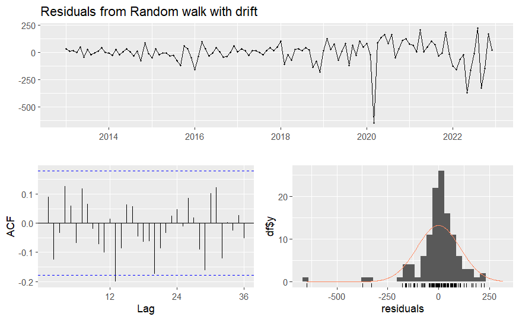
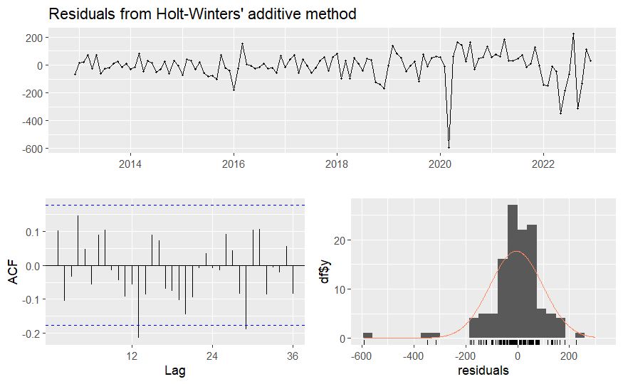
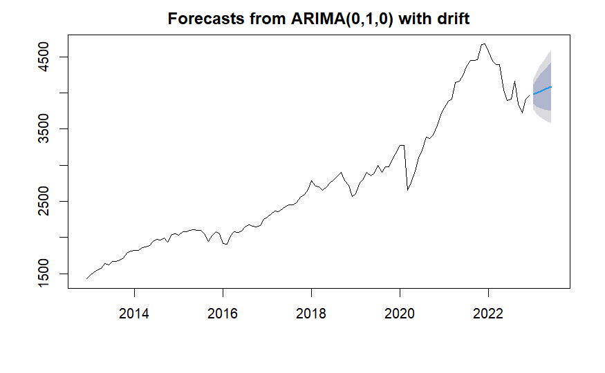

# Time Series Analysis of S&P500 Index between the Years 2012 & 2022
Here is the [link](./s-p500_analysis.md) to the complete code snippet with results.

## Table of Contents
1. [Goal](#goal)
2. [Dataset](#dataset)
3. [Data Pre-processing](#data-pre-processing)
4. [Time-Series Plot](#time-series-plot)
5. [Analysis](#analysis)
	+ [Understanding the Time-Series Components](#understanding-the-time-series-components)
5. [Forecasting Model Selection](#forecasting-model-selection)
	+ [Simple Forecasting Methods](#simple-forecasting-methods)
	+ [Simple Exponential Functions](#simple-exponential-functions)
	+ [ARIMA](#arima)
6. [Forecast Method Evaluation Using Residual Diagnostics](#forecast-method-evaluation-using-residual-diagnostics)
7. [Model Implementation](#model-implementation)
	+ [First Iteration](#iteration-1-)
	+ [Second Iteration](#iteration-2-)
	+ [Final Iteration](#iteration-3-)
8. [Forecasting](#forecasting)

## Goal
The project performs a preliminary analysis of the underlying time series,
estimates forecasting models, and chooses the best one based on empirical 
evaluations. Finally, it forecasts for 6 consecutive periods in the 
future using the best model generated.

## Dataset
The dataset contains daily closing values for the S&P500 index	
between the period, Dec 2012 to Dec 2022. Below is the snapshot of the 
same.
	
\
***Fig. 1** - Snapshot of the Dataset*
	
## Data Pre-processing
Since, the dataset contains daily records with different number of days 
for each month, it becomes difficult to create an uniform TimeSeries. 
To address this problem, the average index value was calculated for 
each month prior to instantiating the time series object. The snapshot for the updated dataset is provided below.

\
***Fig. 2** - Pre-processed Dataset*

## Time-Series Plot
With the new dataset a TS object was instantiated.  This object is a 
vector that represents a sample of periodic data that has been 
uniformly spaced and sorted according to time. Fig 3. displays the 
time-series plot being investigated and which has been generated from
the TS object.
	
\
***Fig. 3** - Monthly Acerage Time-Series Plot for S&P500*

## Analysis

### Understanding the Time-Series Components
Plotting the time-series together with its seasonal plots is a crucial 
first step in understanding and subsequently forecasting a time series. 
The charts generated are shown in the Fig 4, 5 & 6. These charts provide 
a better understanding of the time series' components.
	
\
***Fig. 4** - Monthly Plot of S&P500 Time-Series*

\
***Fig. 5** - Seasonal Plot of S$P500 Time-Series*

Following observations were made from the initial plots of the time 
series displayed above:
	
 + There is a clear trend in the time-series
 + The seasonal plots does not indicate any presence of seasonality.
 + The time-series do not exhibit cyclical pattern.
	
The foregoing observations are confirmed by decomposing the time series by classical method into its 
	constituent components. The decomposed plot is given 
	below. Because the series shows no seasonal variation as time 
	progresses, the seasonal component can be classified as 
	additive, and the decomposition was performed 
	accordingly using the ***additive*** model.
	
\
***Fig. 6** - Additive Decomposition of S$P500 Time-Series*

Consistent with the other plots, the auto-correlation figure below 
	(Fig. 7) too does not demonstrate any seasonality in the time series, 
	but it does highlight a clear upward trend.

\
***Fig. 7** - Auto-Correlation Function (ACF) plot of S$P500 Time-Series*

From the above plots, the time series can be reasonably concluded 
	to thus have only trend, and randomcomponents within it.
	

## Forecasting Model Selection

In time-series forecasting toolkit, there are various forecasting methods 
	available ranging from very simple to most complicated. The methods used 
	for the purpose of time-series analysis of the data in this project are 
	discussed below:
	
### Simple Forecasting Methods:

1. **Average Method** : This approach produces forecasts 
that are equal to the mean of all historical data.

2. **Naive Method** : The forecast is equivalent to the 
most recent observation in this method.

3. **Seasonal Naive Method** : The forecast is equivalent to 
the last value seen from the same season in this 
method.

4. **Drift Method** : This approach adjusts the forecast 
based on the change in historical data over time.

### Simple Exponential Functions:
These are more 
advanced forecasting techniques that use weighted moving 
averages to improve accuracy.These are as follows:

1.	**Single Exponential Smoothing (ses)** : This method 
allows forecasting of time-series without any clear
trend or seasonality.

2.	**Double Exponential Smoothing** : Also known as 
Holt’s linear trend method allows forecasting of 
time-series with a trend

3.	**Triple Exponential Smoothing** : Commonly known 
as Holt’s Winter’s seasonal method, is used in 
forecasting time-series with seasonality.

### ARIMA
It is an acronym for ***Auto Regressive Integrated Moving Average*** . This is the most complicated 
and advanced model of them all. It takes three parameters 
along with ts object to build the model. These three parametrs 
are:

+ ***P***: represents the effects of the previous observed 
values
+ ***D***: represents the trend in data and its value is the 
number of differencing operations required to make 
a time-series stationary
+ ***Q***: represents the effects of the residuals
 
	
## Forecast Method Evaluation Using Residual Diagnostics:
Although **RMSE** and **AIC** are effective statistics for 
evaluating model performance, *Residual Diagnostics* is 
another tool for evaluating goodness of fit. It can be 
considered one of the most effective methods for examining 
time-series models. This diagnostic has been used 
extensively to evaluate models in this project. The successful 
forecasting model will exhibit some of the following 
significant qualities.

+ The residuals should have no autocorrelation.
+ The residuals should have a mean zero
+ The residuals should have constant variance
+ The residuals should be normally distributed

The **Ljung-Box** test is a comparable and more precise test 
for determining autocorrelation and was used to present the 
same in the model summary (Table 1).

## Model Implementation
The iterations in search of the optimal time-series 
forecasting model are listed below.

### Iteration 1 :
Simple forecasting approaches were utilized to construct 
benchmark models in the first iteration. All the four
techniques were chosen in this iteration. The results of the 
forecast are displayed in a composite chart in the Fig 2.
**Drift** was found to be the most effective of the four 
strategies based on the RMSE value presented in the model 
summary (**Table 1**) below. As a result, this model was used 
for more advanced evaluation using residual diagnostics. \
Below are the plots **(Fig 8)** associated with this evaluation.

***Fig. 8** - Residual Diagnostic Plots for Drift model from Iteration 1*

| Methods | RMSE | Box Ljung (P Value) | AIC  |
| :------- | :----: | :-------------------: | :----: |
| Average | 875.47 | 2.2e-16 | -- |
| Naive | 107.76 | 0.3526 | -- |
| Seasonal Naive | 475.83 | 2.2e-16 | -- |
| Drift | 105.67 | 0.3004 | -- |
| SES | 107.318 | 0.2469 | 1717.834 |
| ETS (AAN)| 105.554 | 0.1758 | 1717.822 |
| ETS (ZZZ)| 105.313 | 0.3653 | 1665.839 |
| Holt's | 105.554 | 0.1758 | 1717.822 | 
| Holt's Winters | 101.274 | 0.0005 | 1731.805 |
| ARIMA (0,1,1) | 106.315 | 0.4851 | 1465.5 |
| ARIMA (auto) | 105.231 | 0.3429 | 1463.02 |

***Table. 1** - Model Summary*

### Iteration 2 :
Because the previous iteration failed to produce 
satisfactory forecasting models, this iteration employed more 
complex algorithms. These algorithms are known as ***simple exponential smoothing*** functions. They are based on 
weighted moving averages. Some of the algorithms in this set 
are unsuitable for application because of the lack of seasonality and 
the existence of trend in the time-series, but they were
nevertheless used here for learning and exploratory reasons.
The forecasting results are shown in the composite chart in 
the Fig 9. Based on the RMSE values as displayed in the 
model summary (**Table 1**), Holt's Winters model was
selected for further analysis to establish the goodness of the 
fit.\
**(Fig 10)** Similar to the last best model, the auto-correlation spikes for the lags in the ACF chart of the 
residuals for this model was statistically significant as well,
indicating room for further improvement.

***Fig. 10** - Residual Diagnostic Plots for Holts Winter's model from Iteration 2*

### Iteration 3 :
The RMSE value of the last best model from the 
previous iteration improved significantly, although residual 
diagnostics presented unsatisfactory results. As a result, more 
sophisticated algorithms were applied in the final iteration. 
This approach, known as ARIMA, is used to fit stationary 
time series. Stationary time-series are defined as those with 
constant variation and mean 0. The following steps were 
taken to correctly apply ARIMA on the given time-series:

1)	To evaluate whether the time-series under 
investigation is stationary, appropriate pre-built R function
(ndiffs) were used. The examination revealed that the series 
was not stationary, thus first order differencing (diff) was 
advised to transform it into the same. Hence D is 1.

2)	To identify values for P and Q, Auto-Correlated 
Function (ACF) and Partial Auto-Correlated Function 
(PACF) charts were generated.

3)	Following an examination of the ACF and PACF 
plots, P was judged to be 0 and Q to be 1.

4)	Using the chosen values of P, D, and Q, an ARIMA 
model was created and evaluated. Because the results were 
unsatisfactory, several more similar models were created by 
tweaking the P, D, and Q parameters slightly.

5)	Finally, due to the disappointing results of the previous 
ARIMA models, a new model was constructed using the 
***auto.arima*** function to round out the report. Based on AIC, 
this function returns the optimal model. This model 
performed the best during the evaluation and can be used for 
forecasting. The residual diagnostics for this final model is 
displayed in ***Fig 11.*** below

***Fig. 11** - Residual Diagnostic Plots of final ARIMA model*

**(Fig 11)** Apart from a few spikes, the residuals in 
the ACF plot appear to have no autocorrelation. The spikes 
can be attributed to chance occurrence. Furthermore, the 
residuals appear to have a mean of 0 and a distribution that is 
close to normal. As a result, this model can be considered the 
best thus far.

As seen in the table **(Table 1)**, the worst model was 
the ***Average model***, and the best model was the ***ARIMA*** model
developed using auto.arima

## Forecasting
The last best model was used to forecast future values for 
6 consecutive periods as directed. The results presented in 
**Table 2** and displayed as a plot in Fig 2.4

| Period | Values | 80% CI | 95% CI |
| :---- | :----: | :----: | :----: |
| Jan 2023 | 3982.025 | +- 135.988| +- 207.976|
| Feb 2023 | 4003.167 | +- 192.316| +- 294.122|
| Mar 2023 | 4024.309 | +- 235.539| +- 360.225|
| Apr 2023 | 4045.450 | +- 271.976| +- 415.952|
| May 2023 | 4066.592 | +- 304.079| +- 465.048|
| Jun 2023 | 4087.734 | +- 333.101| +- 509.434|

***Table 2** - Point Forecasts along with 80% and 95% CI from final ARIMA model*

***Fig. 12** - Forecast Plot for final ARIMA model*