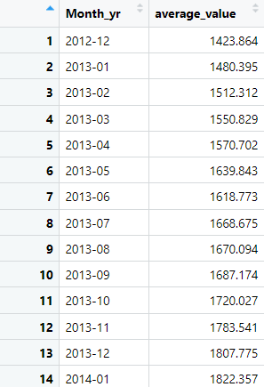

# Time-Series-Analysis
Time Series Analysis of **S&P500** Index between **Year** *2012* and *2022*

## Objective
	The project performs a preliminary analysis of the underlying time series,
	estimates forecasting models, and chooses the best one based on empirical 
	evaluations. Finally, it forecasts for 6 consecutive periods in the 
	future using the best model generated.

## Dataset
	The dataset contains daily closing values for the S&P500 index	
	between the period, Dec 2012 to Dec 2022. Below is the snapshot of the 
	same.
	
\
***Fig. 1** - Snapshot of the Dataset*
	
## Data Pre-processing
	Since, the dataset contains daily records with different number of days 
	for each month, it becomes difficult to create an uniform TimeSeries. 
	To address this problem, the average index value was calculated for 
	each month prior to instantiating the time series object. The snapshot 
	for the updated dataset is provided below.

\
***Fig. 2** - Pre-processed Dataset*

## Time-Series Plot
	With the new dataset a TS object was instantiated.  This object is a 
	vector that represents a sample of periodic data that has been 
	uniformly spaced and sorted according to time. Fig 3. displays the 
	time-series plot being investigated and which has been generated from
	the TS object.
	
\
***Fig. 3** - Monthly Acerage Time-Series Plot for S&P500*

## Analysis

### Understanding the Time-Series Components
	Plotting the time-series together with its seasonal plots is a crucial 
	first step in understanding and subsequently forecasting a time series. 
	The charts generated are shown in the Fig 4, 5 & 6. These charts provide 
	a better understanding of the time series' components.
	
\
***Fig. 4** - Monthly Plot of S&P500 Time-Series*

\
***Fig. 5** - Seasonal Plot of S$P500 Time-Series*

	Following observations were made from the initial plots of the time 
	series displayed above:
	
 + There is a clear trend in the time-series
 + The seasonal plots does not indicate any presence of seasonality.
 + The time-series do not exhibit cyclical pattern.
	
	The foregoing observations are confirmed by decomposing the time series by classical method into its 
	constituent components. The decomposed plot is given 
	below. Because the series shows no seasonal variation as time 
	progresses, the seasonal component can be classified as 
	additive, and the decomposition was performed 
	accordingly using the ***additive*** model.
	
\
***Fig. 6** - Additive Decomposition of S$P500 Time-Series*

	Consistent with the other plots, the auto-correlation figure below 
	(Fig. 7) too does not demonstrate any seasonality in the time series, 
	but it does highlight a clear upward trend.

\
***Fig. 7** - Auto-Correlation Function (ACF) plot of S$P500 Time-Series*

	From the above plots, the time series can be reasonably concluded 
	to thus have only trend, and randomcomponents within it.
	

## Forecasting Models

	In time-series forecasting toolkit, there are various forecasting methods 
	available ranging from very simple to most complicated. The methods used 
	for the purpose of time-series analysis of the data in this project are 
	discussed below:
	
### Simple Forecasting Methods:

1. **Average Method** : This approach produces forecasts 
that are equal to the mean of all historical data.

2. **Naive Method** : The forecast is equivalent to the 
most recent observation in this method.

3. **Seasonal Naive Method** : The forecast is equivalent to 
the last value seen from the same season in this 
method.

4. **Drift Method** : This approach adjusts the forecast 
based on the change in historical data over time.

### Simple Exponential Functions:
These are more 
advanced forecasting techniques that use weighted moving 
averages to improve accuracy.These are as follows:

1.	**Single Exponential Smoothing (ses)** : This method 
allows forecasting of time-series without any clear
trend or seasonality.

2.	**Double Exponential Smoothing** : Also known as 
Holt’s linear trend method allows forecasting of 
time-series with a trend

3.	**Triple Exponential Smoothing** : Commonly known 
as Holt’s Winter’s seasonal method, is used in 
forecasting time-series with seasonality.

### ARIMA
It is an acronym for ***Auto Regressive Integrated Moving Average*** . This is the most complicated 
and advanced model of them all. It takes three parameters 
along with ts object to build the model. These three parametrs 
are:

+ ***P***: represents the effects of the previous observed 
values
+ ***D***: represents the trend in data and its value is the 
number of differencing operations required to make 
a time-series stationary
+ ***Q***: represents the effects of the residuals
 
	
## Forecast Method Evaluation Using Residual Diagnostics:
Although **RMSE** and **AIC** are effective statistics for 
evaluating model performance, *Residual Diagnostics* is 
another tool for evaluating goodness of fit. It can be 
considered one of the most effective methods for examining 
time-series models. This diagnostic has been used 
extensively to evaluate models in this project. The successful 
forecasting model will exhibit some of the following 
significant qualities.

+ The residuals should have no autocorrelation.
+ The residuals should have a mean zero
+ The residuals should have constant variance
+ The residuals should be normally distributed

The **Ljung-Box** test is a comparable and more precise test 
for determining autocorrelation and was used to present the 
same in the model summary (Table 1).

## Model Implementation
The iterations in search of the optimal time-series 
forecasting model are listed below.

***Iteration 1*** : 
Simple forecasting approaches were utilized to construct 
benchmark models in the first iteration. All the four
techniques were chosen in this iteration. The results of the 
forecast are displayed in a composite chart in the Fig 2.
Seasonal Naive was found to be the most effective of the four 
strategies based on the RMSE value presented in the model 
summary (Table 1) below. As a result, this model was used 
for more advanced evaluation using residual diagnostics. 
Below are the plots (Fig 2.1) associated with this evaluation.
Below are the plots (Fig 2.1) associated with this evaluation.

| Methods | RMSE | Box Ljung (P Value) | AIC  | AICe |
| :------- | :----: | :-------------------: | :----: | :----: |
| Average | 875.47 |
| Naive | 107.76 |
| Seasonal Naive | 475.83 |
| Drift | 105.67 |