Dow Jones Index Time Series Analysis
================

Installing Important Packages

``` r
install.packages("dplyr")
```

    ## Installing package into 'C:/Users/palag/AppData/Local/R/win-library/4.2'
    ## (as 'lib' is unspecified)

    ## package 'dplyr' successfully unpacked and MD5 sums checked
    ## 
    ## The downloaded binary packages are in
    ##  C:\Users\palag\AppData\Local\Temp\RtmpOUkNI6\downloaded_packages

``` r
install.packages("ggplot2")
```

    ## Installing package into 'C:/Users/palag/AppData/Local/R/win-library/4.2'
    ## (as 'lib' is unspecified)

    ## Warning in download.file(url, destfile, method, mode = "wb", ...): downloaded
    ## length 4111966 != reported length 4225550

    ## Warning in download.file(url, destfile, method, mode = "wb", ...): URL
    ## 'https://cran.hafro.is/bin/windows/contrib/4.2/ggplot2_3.4.1.zip': Timeout of 60
    ## seconds was reached

    ## Error in download.file(url, destfile, method, mode = "wb", ...) : 
    ##   download from 'https://cran.hafro.is/bin/windows/contrib/4.2/ggplot2_3.4.1.zip' failed

    ## Warning in download.packages(pkgs, destdir = tmpd, available = available, :
    ## download of package 'ggplot2' failed

``` r
install.packages("ggfortify")
```

    ## Installing package into 'C:/Users/palag/AppData/Local/R/win-library/4.2'
    ## (as 'lib' is unspecified)

    ## package 'ggfortify' successfully unpacked and MD5 sums checked
    ## 
    ## The downloaded binary packages are in
    ##  C:\Users\palag\AppData\Local\Temp\RtmpOUkNI6\downloaded_packages

``` r
install.packages("zoo")
```

    ## Installing package into 'C:/Users/palag/AppData/Local/R/win-library/4.2'
    ## (as 'lib' is unspecified)

    ## package 'zoo' successfully unpacked and MD5 sums checked
    ## 
    ## The downloaded binary packages are in
    ##  C:\Users\palag\AppData\Local\Temp\RtmpOUkNI6\downloaded_packages

``` r
install.packages("TSstudio")
```

    ## Installing package into 'C:/Users/palag/AppData/Local/R/win-library/4.2'
    ## (as 'lib' is unspecified)

    ## package 'TSstudio' successfully unpacked and MD5 sums checked
    ## 
    ## The downloaded binary packages are in
    ##  C:\Users\palag\AppData\Local\Temp\RtmpOUkNI6\downloaded_packages

``` r
install.packages("forecast")
```

    ## Installing package into 'C:/Users/palag/AppData/Local/R/win-library/4.2'
    ## (as 'lib' is unspecified)

    ## package 'forecast' successfully unpacked and MD5 sums checked
    ## 
    ## The downloaded binary packages are in
    ##  C:\Users\palag\AppData\Local\Temp\RtmpOUkNI6\downloaded_packages

``` r
install.packages("tseries")
```

    ## Installing package into 'C:/Users/palag/AppData/Local/R/win-library/4.2'
    ## (as 'lib' is unspecified)

    ## package 'tseries' successfully unpacked and MD5 sums checked
    ## 
    ## The downloaded binary packages are in
    ##  C:\Users\palag\AppData\Local\Temp\RtmpOUkNI6\downloaded_packages

Importing the packages

``` r
library(dplyr)
```

    ## 
    ## Attaching package: 'dplyr'

    ## The following objects are masked from 'package:stats':
    ## 
    ##     filter, lag

    ## The following objects are masked from 'package:base':
    ## 
    ##     intersect, setdiff, setequal, union

``` r
library(ggplot2)
library(ggfortify)
library(TSstudio)
library(forecast)
```

    ## Registered S3 method overwritten by 'quantmod':
    ##   method            from
    ##   as.zoo.data.frame zoo

    ## Registered S3 methods overwritten by 'forecast':
    ##   method                 from     
    ##   autoplot.Arima         ggfortify
    ##   autoplot.acf           ggfortify
    ##   autoplot.ar            ggfortify
    ##   autoplot.bats          ggfortify
    ##   autoplot.decomposed.ts ggfortify
    ##   autoplot.ets           ggfortify
    ##   autoplot.forecast      ggfortify
    ##   autoplot.stl           ggfortify
    ##   autoplot.ts            ggfortify
    ##   fitted.ar              ggfortify
    ##   fortify.ts             ggfortify
    ##   residuals.ar           ggfortify

``` r
library(tseries)
```

Importing Dow Jones Dataset

``` r
index <- read.csv("./data/sp500_index.csv")
index
```

    ##            Date  S.P500
    ## 1    2012-12-20 1443.69
    ## 2    2012-12-21 1430.15
    ## 3    2012-12-24 1426.66
    ## 4    2012-12-26 1419.83
    ## 5    2012-12-27 1418.10
    ## 6    2012-12-28 1402.43
    ## 7    2012-12-31 1426.19
    ## 8    2013-01-02 1462.42
    ## 9    2013-01-03 1459.37
    ## 10   2013-01-04 1466.47
    ## 11   2013-01-07 1461.89
    ## 12   2013-01-08 1457.15
    ## 13   2013-01-09 1461.02
    ## 14   2013-01-10 1472.12
    ## 15   2013-01-11 1472.05
    ## 16   2013-01-14 1470.68
    ## 17   2013-01-15 1472.34
    ## 18   2013-01-16 1472.63
    ## 19   2013-01-17 1480.94
    ## 20   2013-01-18 1485.98
    ## 21   2013-01-22 1492.56
    ## 22   2013-01-23 1494.81
    ## 23   2013-01-24 1494.82
    ## 24   2013-01-25 1502.96
    ## 25   2013-01-28 1500.18
    ## 26   2013-01-29 1507.84
    ## 27   2013-01-30 1501.96
    ## 28   2013-01-31 1498.11
    ## 29   2013-02-01 1513.17
    ## 30   2013-02-04 1495.71
    ## 31   2013-02-05 1511.29
    ## 32   2013-02-06 1512.12
    ## 33   2013-02-07 1509.39
    ## 34   2013-02-08 1517.93
    ## 35   2013-02-11 1517.01
    ## 36   2013-02-12 1519.43
    ## 37   2013-02-13 1520.33
    ## 38   2013-02-14 1521.38
    ## 39   2013-02-15 1519.79
    ## 40   2013-02-19 1530.94
    ## 41   2013-02-20 1511.95
    ## 42   2013-02-21 1502.42
    ## 43   2013-02-22 1515.60
    ## 44   2013-02-25 1487.85
    ## 45   2013-02-26 1496.94
    ## 46   2013-02-27 1515.99
    ## 47   2013-02-28 1514.68
    ## 48   2013-03-01 1518.20
    ## 49   2013-03-04 1525.20
    ## 50   2013-03-05 1539.79
    ## 51   2013-03-06 1541.46
    ## 52   2013-03-07 1544.26
    ## 53   2013-03-08 1551.18
    ## 54   2013-03-11 1556.22
    ## 55   2013-03-12 1552.48
    ## 56   2013-03-13 1554.52
    ## 57   2013-03-14 1563.23
    ## 58   2013-03-15 1560.70
    ## 59   2013-03-18 1552.10
    ## 60   2013-03-19 1548.34
    ## 61   2013-03-20 1558.71
    ## 62   2013-03-21 1545.80
    ## 63   2013-03-22 1556.89
    ## 64   2013-03-25 1551.69
    ## 65   2013-03-26 1563.77
    ## 66   2013-03-27 1562.85
    ## 67   2013-03-28 1569.19
    ## 68   2013-04-01 1562.17
    ## 69   2013-04-02 1570.25
    ## 70   2013-04-03 1553.69
    ## 71   2013-04-04 1559.98
    ## 72   2013-04-05 1553.28
    ## 73   2013-04-08 1563.07
    ## 74   2013-04-09 1568.61
    ## 75   2013-04-10 1587.73
    ## 76   2013-04-11 1593.37
    ## 77   2013-04-12 1588.85
    ## 78   2013-04-15 1552.36
    ## 79   2013-04-16 1574.57
    ## 80   2013-04-17 1552.01
    ## 81   2013-04-18 1541.61
    ## 82   2013-04-19 1555.25
    ## 83   2013-04-22 1562.50
    ## 84   2013-04-23 1578.78
    ## 85   2013-04-24 1578.79
    ## 86   2013-04-25 1585.16
    ## 87   2013-04-26 1582.24
    ## 88   2013-04-29 1593.61
    ## 89   2013-04-30 1597.57
    ## 90   2013-05-01 1582.70
    ## 91   2013-05-02 1597.59
    ## 92   2013-05-03 1614.42
    ## 93   2013-05-06 1617.50
    ## 94   2013-05-07 1625.96
    ## 95   2013-05-08 1632.69
    ## 96   2013-05-09 1626.67
    ## 97   2013-05-10 1633.70
    ## 98   2013-05-13 1633.77
    ## 99   2013-05-14 1650.34
    ## 100  2013-05-15 1658.78
    ## 101  2013-05-16 1650.47
    ## 102  2013-05-17 1667.47
    ## 103  2013-05-20 1666.29
    ## 104  2013-05-21 1669.16
    ## 105  2013-05-22 1655.35
    ## 106  2013-05-23 1650.51
    ## 107  2013-05-24 1649.60
    ## 108  2013-05-28 1660.06
    ## 109  2013-05-29 1648.36
    ## 110  2013-05-30 1654.41
    ## 111  2013-05-31 1630.74
    ## 112  2013-06-03 1640.42
    ## 113  2013-06-04 1631.38
    ## 114  2013-06-05 1608.90
    ## 115  2013-06-06 1622.56
    ## 116  2013-06-07 1643.38
    ## 117  2013-06-10 1642.81
    ## 118  2013-06-11 1626.13
    ## 119  2013-06-12 1612.52
    ## 120  2013-06-13 1636.36
    ## 121  2013-06-14 1626.73
    ## 122  2013-06-17 1639.04
    ## 123  2013-06-18 1651.81
    ## 124  2013-06-19 1628.93
    ## 125  2013-06-20 1588.19
    ## 126  2013-06-21 1592.43
    ## 127  2013-06-24 1573.09
    ## 128  2013-06-25 1588.03
    ## 129  2013-06-26 1603.26
    ## 130  2013-06-27 1613.20
    ## 131  2013-06-28 1606.28
    ## 132  2013-07-01 1614.96
    ## 133  2013-07-02 1614.08
    ## 134  2013-07-03 1615.41
    ## 135  2013-07-05 1631.89
    ## 136  2013-07-08 1640.46
    ## 137  2013-07-09 1652.32
    ## 138  2013-07-10 1652.62
    ## 139  2013-07-11 1675.02
    ## 140  2013-07-12 1680.19
    ## 141  2013-07-15 1682.50
    ## 142  2013-07-16 1676.26
    ## 143  2013-07-17 1680.91
    ## 144  2013-07-18 1689.37
    ## 145  2013-07-19 1692.09
    ## 146  2013-07-22 1695.53
    ## 147  2013-07-23 1692.39
    ## 148  2013-07-24 1685.94
    ## 149  2013-07-25 1690.25
    ## 150  2013-07-26 1691.65
    ## 151  2013-07-29 1685.33
    ## 152  2013-07-30 1685.96
    ## 153  2013-07-31 1685.73
    ## 154  2013-08-01 1706.87
    ## 155  2013-08-02 1709.67
    ## 156  2013-08-05 1707.14
    ## 157  2013-08-06 1697.37
    ## 158  2013-08-07 1690.91
    ## 159  2013-08-08 1697.48
    ## 160  2013-08-09 1691.42
    ## 161  2013-08-12 1689.47
    ## 162  2013-08-13 1694.16
    ## 163  2013-08-14 1685.39
    ## 164  2013-08-15 1661.32
    ## 165  2013-08-16 1655.83
    ## 166  2013-08-19 1646.06
    ## 167  2013-08-20 1652.35
    ## 168  2013-08-21 1642.80
    ## 169  2013-08-22 1656.96
    ## 170  2013-08-23 1663.50
    ## 171  2013-08-26 1656.78
    ## 172  2013-08-27 1630.48
    ## 173  2013-08-28 1634.96
    ## 174  2013-08-29 1638.17
    ## 175  2013-08-30 1632.97
    ## 176  2013-09-03 1639.77
    ## 177  2013-09-04 1653.08
    ## 178  2013-09-05 1655.08
    ## 179  2013-09-06 1655.17
    ## 180  2013-09-09 1671.71
    ## 181  2013-09-10 1683.99
    ## 182  2013-09-11 1689.13
    ## 183  2013-09-12 1683.42
    ## 184  2013-09-13 1687.99
    ## 185  2013-09-16 1697.60
    ## 186  2013-09-17 1704.76
    ## 187  2013-09-18 1725.52
    ## 188  2013-09-19 1722.34
    ## 189  2013-09-20 1709.91
    ## 190  2013-09-23 1701.84
    ## 191  2013-09-24 1697.42
    ## 192  2013-09-25 1692.77
    ## 193  2013-09-26 1698.67
    ## 194  2013-09-27 1691.75
    ## 195  2013-09-30 1681.55
    ## 196  2013-10-01 1695.00
    ## 197  2013-10-02 1693.87
    ## 198  2013-10-03 1678.66
    ## 199  2013-10-04 1690.50
    ## 200  2013-10-07 1676.12
    ## 201  2013-10-08 1655.45
    ## 202  2013-10-09 1656.40
    ## 203  2013-10-10 1692.56
    ## 204  2013-10-11 1703.20
    ## 205  2013-10-14 1710.14
    ## 206  2013-10-15 1698.06
    ## 207  2013-10-16 1721.54
    ## 208  2013-10-17 1733.15
    ## 209  2013-10-18 1744.50
    ## 210  2013-10-21 1744.66
    ## 211  2013-10-22 1754.67
    ## 212  2013-10-23 1746.38
    ## 213  2013-10-24 1752.07
    ## 214  2013-10-25 1759.77
    ## 215  2013-10-28 1762.11
    ## 216  2013-10-29 1771.95
    ## 217  2013-10-30 1763.31
    ## 218  2013-10-31 1756.54
    ## 219  2013-11-01 1761.64
    ## 220  2013-11-04 1767.93
    ## 221  2013-11-05 1762.97
    ## 222  2013-11-06 1770.49
    ## 223  2013-11-07 1747.15
    ## 224  2013-11-08 1770.61
    ## 225  2013-11-11 1771.89
    ## 226  2013-11-12 1767.69
    ## 227  2013-11-13 1782.00
    ## 228  2013-11-14 1790.62
    ## 229  2013-11-15 1798.18
    ## 230  2013-11-18 1791.53
    ## 231  2013-11-19 1787.87
    ## 232  2013-11-20 1781.37
    ## 233  2013-11-21 1795.85
    ## 234  2013-11-22 1804.76
    ## 235  2013-11-25 1802.48
    ## 236  2013-11-26 1802.75
    ## 237  2013-11-27 1807.23
    ## 238  2013-11-29 1805.81
    ## 239  2013-12-02 1800.90
    ## 240  2013-12-03 1795.15
    ## 241  2013-12-04 1792.81
    ## 242  2013-12-05 1785.03
    ## 243  2013-12-06 1805.09
    ## 244  2013-12-09 1808.37
    ## 245  2013-12-10 1802.62
    ## 246  2013-12-11 1782.22
    ## 247  2013-12-12 1775.50
    ## 248  2013-12-13 1775.32
    ## 249  2013-12-16 1786.54
    ## 250  2013-12-17 1781.00
    ## 251  2013-12-18 1810.65
    ## 252  2013-12-19 1809.60
    ## 253  2013-12-20 1818.32
    ## 254  2013-12-23 1827.99
    ## 255  2013-12-24 1833.32
    ## 256  2013-12-26 1842.02
    ## 257  2013-12-27 1841.40
    ## 258  2013-12-30 1841.07
    ## 259  2013-12-31 1848.36
    ## 260  2014-01-02 1831.98
    ## 261  2014-01-03 1831.37
    ## 262  2014-01-06 1826.77
    ## 263  2014-01-07 1837.88
    ## 264  2014-01-08 1837.49
    ## 265  2014-01-09 1838.13
    ## 266  2014-01-10 1842.37
    ## 267  2014-01-13 1819.20
    ## 268  2014-01-14 1838.88
    ## 269  2014-01-15 1848.38
    ## 270  2014-01-16 1845.89
    ## 271  2014-01-17 1838.70
    ## 272  2014-01-21 1843.80
    ## 273  2014-01-22 1844.86
    ## 274  2014-01-23 1828.46
    ## 275  2014-01-24 1790.29
    ## 276  2014-01-27 1781.56
    ## 277  2014-01-28 1792.50
    ## 278  2014-01-29 1774.20
    ## 279  2014-01-30 1794.19
    ## 280  2014-01-31 1782.59
    ## 281  2014-02-03 1741.89
    ## 282  2014-02-04 1755.20
    ## 283  2014-02-05 1751.64
    ## 284  2014-02-06 1773.43
    ## 285  2014-02-07 1797.02
    ## 286  2014-02-10 1799.84
    ## 287  2014-02-11 1819.75
    ## 288  2014-02-12 1819.26
    ## 289  2014-02-13 1829.83
    ## 290  2014-02-14 1838.63
    ## 291  2014-02-18 1840.76
    ## 292  2014-02-19 1828.75
    ## 293  2014-02-20 1839.78
    ## 294  2014-02-21 1836.25
    ## 295  2014-02-24 1847.61
    ## 296  2014-02-25 1845.12
    ## 297  2014-02-26 1845.16
    ## 298  2014-02-27 1854.29
    ## 299  2014-02-28 1859.45
    ## 300  2014-03-03 1845.73
    ## 301  2014-03-04 1873.91
    ## 302  2014-03-05 1873.81
    ## 303  2014-03-06 1877.03
    ## 304  2014-03-07 1878.04
    ## 305  2014-03-10 1877.17
    ## 306  2014-03-11 1867.63
    ## 307  2014-03-12 1868.20
    ## 308  2014-03-13 1846.34
    ## 309  2014-03-14 1841.13
    ## 310  2014-03-17 1858.83
    ## 311  2014-03-18 1872.25
    ## 312  2014-03-19 1860.77
    ## 313  2014-03-20 1872.01
    ## 314  2014-03-21 1866.52
    ## 315  2014-03-24 1857.44
    ## 316  2014-03-25 1865.62
    ## 317  2014-03-26 1852.56
    ## 318  2014-03-27 1849.04
    ## 319  2014-03-28 1857.62
    ## 320  2014-03-31 1872.34
    ## 321  2014-04-01 1885.52
    ## 322  2014-04-02 1890.90
    ## 323  2014-04-03 1888.77
    ## 324  2014-04-04 1865.09
    ## 325  2014-04-07 1845.04
    ## 326  2014-04-08 1851.96
    ## 327  2014-04-09 1872.18
    ## 328  2014-04-10 1833.08
    ## 329  2014-04-11 1815.69
    ## 330  2014-04-14 1830.61
    ## 331  2014-04-15 1842.98
    ## 332  2014-04-16 1862.31
    ## 333  2014-04-17 1864.85
    ## 334  2014-04-21 1871.89
    ## 335  2014-04-22 1879.55
    ## 336  2014-04-23 1875.39
    ## 337  2014-04-24 1878.61
    ## 338  2014-04-25 1863.40
    ## 339  2014-04-28 1869.43
    ## 340  2014-04-29 1878.33
    ## 341  2014-04-30 1883.95
    ## 342  2014-05-01 1883.68
    ## 343  2014-05-02 1881.14
    ## 344  2014-05-05 1884.66
    ## 345  2014-05-06 1867.72
    ## 346  2014-05-07 1878.21
    ## 347  2014-05-08 1875.63
    ## 348  2014-05-09 1878.48
    ## 349  2014-05-12 1896.65
    ## 350  2014-05-13 1897.45
    ## 351  2014-05-14 1888.53
    ## 352  2014-05-15 1870.85
    ## 353  2014-05-16 1877.86
    ## 354  2014-05-19 1885.08
    ## 355  2014-05-20 1872.83
    ## 356  2014-05-21 1888.03
    ## 357  2014-05-22 1892.49
    ## 358  2014-05-23 1900.53
    ## 359  2014-05-27 1911.91
    ## 360  2014-05-28 1909.78
    ## 361  2014-05-29 1920.03
    ## 362  2014-05-30 1923.57
    ## 363  2014-06-02 1924.97
    ## 364  2014-06-03 1924.24
    ## 365  2014-06-04 1927.88
    ## 366  2014-06-05 1940.46
    ## 367  2014-06-06 1949.44
    ## 368  2014-06-09 1951.27
    ## 369  2014-06-10 1950.79
    ## 370  2014-06-11 1943.89
    ## 371  2014-06-12 1930.11
    ## 372  2014-06-13 1936.16
    ## 373  2014-06-16 1937.78
    ## 374  2014-06-17 1941.99
    ## 375  2014-06-18 1956.98
    ## 376  2014-06-19 1959.48
    ## 377  2014-06-20 1962.87
    ## 378  2014-06-23 1962.61
    ## 379  2014-06-24 1949.98
    ## 380  2014-06-25 1959.53
    ## 381  2014-06-26 1957.22
    ## 382  2014-06-27 1960.96
    ## 383  2014-06-30 1960.23
    ## 384  2014-07-01 1973.32
    ## 385  2014-07-02 1974.62
    ## 386  2014-07-03 1985.44
    ## 387  2014-07-07 1977.65
    ## 388  2014-07-08 1963.71
    ## 389  2014-07-09 1972.83
    ## 390  2014-07-10 1964.68
    ## 391  2014-07-11 1967.57
    ## 392  2014-07-14 1977.10
    ## 393  2014-07-15 1973.28
    ## 394  2014-07-16 1981.57
    ## 395  2014-07-17 1958.12
    ## 396  2014-07-18 1978.22
    ## 397  2014-07-21 1973.63
    ## 398  2014-07-22 1983.53
    ## 399  2014-07-23 1987.01
    ## 400  2014-07-24 1987.98
    ## 401  2014-07-25 1978.34
    ## 402  2014-07-28 1978.91
    ## 403  2014-07-29 1969.95
    ## 404  2014-07-30 1970.07
    ## 405  2014-07-31 1930.67
    ## 406  2014-08-01 1925.15
    ## 407  2014-08-04 1938.99
    ## 408  2014-08-05 1920.21
    ## 409  2014-08-06 1920.24
    ## 410  2014-08-07 1909.57
    ## 411  2014-08-08 1931.59
    ## 412  2014-08-11 1936.92
    ## 413  2014-08-12 1933.75
    ## 414  2014-08-13 1946.72
    ## 415  2014-08-14 1955.18
    ## 416  2014-08-15 1955.06
    ## 417  2014-08-18 1971.74
    ## 418  2014-08-19 1981.60
    ## 419  2014-08-20 1986.51
    ## 420  2014-08-21 1992.37
    ## 421  2014-08-22 1988.40
    ## 422  2014-08-25 1997.92
    ## 423  2014-08-26 2000.02
    ## 424  2014-08-27 2000.12
    ## 425  2014-08-28 1996.74
    ## 426  2014-08-29 2003.37
    ## 427  2014-09-02 2002.28
    ## 428  2014-09-03 2000.72
    ## 429  2014-09-04 1997.65
    ## 430  2014-09-05 2007.71
    ## 431  2014-09-08 2001.54
    ## 432  2014-09-09 1988.44
    ## 433  2014-09-10 1995.69
    ## 434  2014-09-11 1997.45
    ## 435  2014-09-12 1985.54
    ## 436  2014-09-15 1984.13
    ## 437  2014-09-16 1998.98
    ## 438  2014-09-17 2001.57
    ## 439  2014-09-18 2011.36
    ## 440  2014-09-19 2010.40
    ## 441  2014-09-22 1994.29
    ## 442  2014-09-23 1982.77
    ## 443  2014-09-24 1998.30
    ## 444  2014-09-25 1965.99
    ## 445  2014-09-26 1982.85
    ## 446  2014-09-29 1977.80
    ## 447  2014-09-30 1972.29
    ## 448  2014-10-01 1946.16
    ## 449  2014-10-02 1946.17
    ## 450  2014-10-03 1967.90
    ## 451  2014-10-06 1964.82
    ## 452  2014-10-07 1935.10
    ## 453  2014-10-08 1968.89
    ## 454  2014-10-09 1928.21
    ## 455  2014-10-10 1906.13
    ## 456  2014-10-13 1874.74
    ## 457  2014-10-14 1877.70
    ## 458  2014-10-15 1862.49
    ## 459  2014-10-16 1862.76
    ## 460  2014-10-17 1886.76
    ## 461  2014-10-20 1904.01
    ## 462  2014-10-21 1941.28
    ## 463  2014-10-22 1927.11
    ## 464  2014-10-23 1950.82
    ## 465  2014-10-24 1964.58
    ## 466  2014-10-27 1961.63
    ## 467  2014-10-28 1985.05
    ## 468  2014-10-29 1982.30
    ## 469  2014-10-30 1994.65
    ## 470  2014-10-31 2018.05
    ## 471  2014-11-03 2017.81
    ## 472  2014-11-04 2012.10
    ## 473  2014-11-05 2023.57
    ## 474  2014-11-06 2031.21
    ## 475  2014-11-07 2031.92
    ## 476  2014-11-10 2038.26
    ## 477  2014-11-11 2039.68
    ## 478  2014-11-12 2038.25
    ## 479  2014-11-13 2039.33
    ## 480  2014-11-14 2039.82
    ## 481  2014-11-17 2041.32
    ## 482  2014-11-18 2051.80
    ## 483  2014-11-19 2048.72
    ## 484  2014-11-20 2052.75
    ## 485  2014-11-21 2063.50
    ## 486  2014-11-24 2069.41
    ## 487  2014-11-25 2067.03
    ## 488  2014-11-26 2072.83
    ## 489  2014-11-28 2067.56
    ## 490  2014-12-01 2053.44
    ## 491  2014-12-02 2066.55
    ## 492  2014-12-03 2074.33
    ## 493  2014-12-04 2071.92
    ## 494  2014-12-05 2075.37
    ## 495  2014-12-08 2060.31
    ## 496  2014-12-09 2059.82
    ## 497  2014-12-10 2026.14
    ## 498  2014-12-11 2035.33
    ## 499  2014-12-12 2002.33
    ## 500  2014-12-15 1989.63
    ## 501  2014-12-16 1972.74
    ## 502  2014-12-17 2012.89
    ## 503  2014-12-18 2061.23
    ## 504  2014-12-19 2070.65
    ## 505  2014-12-22 2078.54
    ## 506  2014-12-23 2082.17
    ## 507  2014-12-24 2081.88
    ## 508  2014-12-26 2088.77
    ## 509  2014-12-29 2090.57
    ## 510  2014-12-30 2080.35
    ## 511  2014-12-31 2058.90
    ## 512  2015-01-02 2058.20
    ## 513  2015-01-05 2020.58
    ## 514  2015-01-06 2002.61
    ## 515  2015-01-07 2025.90
    ## 516  2015-01-08 2062.14
    ## 517  2015-01-09 2044.81
    ## 518  2015-01-12 2028.26
    ## 519  2015-01-13 2023.03
    ## 520  2015-01-14 2011.27
    ## 521  2015-01-15 1992.67
    ## 522  2015-01-16 2019.42
    ## 523  2015-01-20 2022.55
    ## 524  2015-01-21 2032.12
    ## 525  2015-01-22 2063.15
    ## 526  2015-01-23 2051.82
    ## 527  2015-01-26 2057.09
    ## 528  2015-01-27 2029.55
    ## 529  2015-01-28 2002.16
    ## 530  2015-01-29 2021.25
    ## 531  2015-01-30 1994.99
    ## 532  2015-02-02 2020.85
    ## 533  2015-02-03 2050.03
    ## 534  2015-02-04 2041.51
    ## 535  2015-02-05 2062.52
    ## 536  2015-02-06 2055.47
    ## 537  2015-02-09 2046.74
    ## 538  2015-02-10 2068.59
    ## 539  2015-02-11 2068.53
    ## 540  2015-02-12 2088.48
    ## 541  2015-02-13 2096.99
    ## 542  2015-02-17 2100.34
    ## 543  2015-02-18 2099.68
    ## 544  2015-02-19 2097.45
    ## 545  2015-02-20 2110.30
    ## 546  2015-02-23 2109.66
    ## 547  2015-02-24 2115.48
    ## 548  2015-02-25 2113.86
    ## 549  2015-02-26 2110.74
    ## 550  2015-02-27 2104.50
    ## 551  2015-03-02 2117.39
    ## 552  2015-03-03 2107.78
    ## 553  2015-03-04 2098.53
    ## 554  2015-03-05 2101.04
    ## 555  2015-03-06 2071.26
    ## 556  2015-03-09 2079.43
    ## 557  2015-03-10 2044.16
    ## 558  2015-03-11 2040.24
    ## 559  2015-03-12 2065.95
    ## 560  2015-03-13 2053.40
    ## 561  2015-03-16 2081.19
    ## 562  2015-03-17 2074.28
    ## 563  2015-03-18 2099.50
    ## 564  2015-03-19 2089.27
    ## 565  2015-03-20 2108.10
    ## 566  2015-03-23 2104.42
    ## 567  2015-03-24 2091.50
    ## 568  2015-03-25 2061.05
    ## 569  2015-03-26 2056.15
    ## 570  2015-03-27 2061.02
    ## 571  2015-03-30 2086.24
    ## 572  2015-03-31 2067.89
    ## 573  2015-04-01 2059.69
    ## 574  2015-04-02 2066.96
    ## 575  2015-04-06 2080.62
    ## 576  2015-04-07 2076.33
    ## 577  2015-04-08 2081.90
    ## 578  2015-04-09 2091.18
    ## 579  2015-04-10 2102.06
    ## 580  2015-04-13 2092.43
    ## 581  2015-04-14 2095.84
    ## 582  2015-04-15 2106.63
    ## 583  2015-04-16 2104.99
    ## 584  2015-04-17 2081.18
    ## 585  2015-04-20 2100.40
    ## 586  2015-04-21 2097.29
    ## 587  2015-04-22 2107.96
    ## 588  2015-04-23 2112.93
    ## 589  2015-04-24 2117.69
    ## 590  2015-04-27 2108.92
    ## 591  2015-04-28 2114.76
    ## 592  2015-04-29 2106.85
    ## 593  2015-04-30 2085.51
    ## 594  2015-05-01 2108.29
    ## 595  2015-05-04 2114.49
    ## 596  2015-05-05 2089.46
    ## 597  2015-05-06 2080.15
    ## 598  2015-05-07 2088.00
    ## 599  2015-05-08 2116.10
    ## 600  2015-05-11 2105.33
    ## 601  2015-05-12 2099.12
    ## 602  2015-05-13 2098.48
    ## 603  2015-05-14 2121.10
    ## 604  2015-05-15 2122.73
    ## 605  2015-05-18 2129.20
    ## 606  2015-05-19 2127.83
    ## 607  2015-05-20 2125.85
    ## 608  2015-05-21 2130.82
    ## 609  2015-05-22 2126.06
    ## 610  2015-05-26 2104.20
    ## 611  2015-05-27 2123.48
    ## 612  2015-05-28 2120.79
    ## 613  2015-05-29 2107.39
    ## 614  2015-06-01 2111.73
    ## 615  2015-06-02 2109.60
    ## 616  2015-06-03 2114.07
    ## 617  2015-06-04 2095.84
    ## 618  2015-06-05 2092.83
    ## 619  2015-06-08 2079.28
    ## 620  2015-06-09 2080.15
    ## 621  2015-06-10 2105.20
    ## 622  2015-06-11 2108.86
    ## 623  2015-06-12 2094.11
    ## 624  2015-06-15 2084.43
    ## 625  2015-06-16 2096.29
    ## 626  2015-06-17 2100.44
    ## 627  2015-06-18 2121.24
    ## 628  2015-06-19 2109.99
    ## 629  2015-06-22 2122.85
    ## 630  2015-06-23 2124.20
    ## 631  2015-06-24 2108.58
    ## 632  2015-06-25 2102.31
    ## 633  2015-06-26 2101.49
    ## 634  2015-06-29 2057.64
    ## 635  2015-06-30 2063.11
    ## 636  2015-07-01 2077.42
    ## 637  2015-07-02 2076.78
    ## 638  2015-07-06 2068.76
    ## 639  2015-07-07 2081.34
    ## 640  2015-07-08 2046.68
    ## 641  2015-07-09 2051.31
    ## 642  2015-07-10 2076.62
    ## 643  2015-07-13 2099.60
    ## 644  2015-07-14 2108.95
    ## 645  2015-07-15 2107.40
    ## 646  2015-07-16 2124.29
    ## 647  2015-07-17 2126.64
    ## 648  2015-07-20 2128.28
    ## 649  2015-07-21 2119.21
    ## 650  2015-07-22 2114.15
    ## 651  2015-07-23 2102.15
    ## 652  2015-07-24 2079.65
    ## 653  2015-07-27 2067.64
    ## 654  2015-07-28 2093.25
    ## 655  2015-07-29 2108.57
    ## 656  2015-07-30 2108.63
    ## 657  2015-07-31 2103.84
    ## 658  2015-08-03 2098.04
    ## 659  2015-08-04 2093.32
    ## 660  2015-08-05 2099.84
    ## 661  2015-08-06 2083.56
    ## 662  2015-08-07 2077.57
    ## 663  2015-08-10 2104.18
    ## 664  2015-08-11 2084.07
    ## 665  2015-08-12 2086.05
    ## 666  2015-08-13 2083.39
    ## 667  2015-08-14 2091.54
    ## 668  2015-08-17 2102.44
    ## 669  2015-08-18 2096.92
    ## 670  2015-08-19 2079.61
    ## 671  2015-08-20 2035.73
    ## 672  2015-08-21 1970.89
    ## 673  2015-08-24 1893.21
    ## 674  2015-08-25 1867.61
    ## 675  2015-08-26 1940.51
    ## 676  2015-08-27 1987.66
    ## 677  2015-08-28 1988.87
    ## 678  2015-08-31 1972.18
    ## 679  2015-09-01 1913.85
    ## 680  2015-09-02 1948.86
    ## 681  2015-09-03 1951.13
    ## 682  2015-09-04 1921.22
    ## 683  2015-09-08 1969.41
    ## 684  2015-09-09 1942.04
    ## 685  2015-09-10 1952.29
    ## 686  2015-09-11 1961.05
    ## 687  2015-09-14 1953.03
    ## 688  2015-09-15 1978.09
    ## 689  2015-09-16 1995.31
    ## 690  2015-09-17 1990.20
    ## 691  2015-09-18 1958.03
    ## 692  2015-09-21 1966.97
    ## 693  2015-09-22 1942.74
    ## 694  2015-09-23 1938.76
    ## 695  2015-09-24 1932.24
    ## 696  2015-09-25 1931.34
    ## 697  2015-09-28 1881.77
    ## 698  2015-09-29 1884.09
    ## 699  2015-09-30 1920.03
    ## 700  2015-10-01 1923.82
    ## 701  2015-10-02 1951.36
    ## 702  2015-10-05 1987.05
    ## 703  2015-10-06 1979.92
    ## 704  2015-10-07 1995.83
    ## 705  2015-10-08 2013.43
    ## 706  2015-10-09 2014.89
    ## 707  2015-10-12 2017.46
    ## 708  2015-10-13 2003.69
    ## 709  2015-10-14 1994.24
    ## 710  2015-10-15 2023.86
    ## 711  2015-10-16 2033.11
    ## 712  2015-10-19 2033.66
    ## 713  2015-10-20 2030.77
    ## 714  2015-10-21 2018.94
    ## 715  2015-10-22 2052.51
    ## 716  2015-10-23 2075.15
    ## 717  2015-10-26 2071.18
    ## 718  2015-10-27 2065.89
    ## 719  2015-10-28 2090.35
    ## 720  2015-10-29 2089.41
    ## 721  2015-10-30 2079.36
    ## 722  2015-11-02 2104.05
    ## 723  2015-11-03 2109.79
    ## 724  2015-11-04 2102.31
    ## 725  2015-11-05 2099.93
    ## 726  2015-11-06 2099.20
    ## 727  2015-11-09 2078.58
    ## 728  2015-11-10 2081.72
    ## 729  2015-11-11 2075.00
    ## 730  2015-11-12 2045.97
    ## 731  2015-11-13 2023.04
    ## 732  2015-11-16 2053.19
    ## 733  2015-11-17 2050.44
    ## 734  2015-11-18 2083.58
    ## 735  2015-11-19 2081.24
    ## 736  2015-11-20 2089.17
    ## 737  2015-11-23 2086.59
    ## 738  2015-11-24 2089.14
    ## 739  2015-11-25 2088.87
    ## 740  2015-11-27 2090.11
    ## 741  2015-11-30 2080.41
    ## 742  2015-12-01 2102.63
    ## 743  2015-12-02 2079.51
    ## 744  2015-12-03 2049.62
    ## 745  2015-12-04 2091.69
    ## 746  2015-12-07 2077.07
    ## 747  2015-12-08 2063.59
    ## 748  2015-12-09 2047.62
    ## 749  2015-12-10 2052.23
    ## 750  2015-12-11 2012.37
    ## 751  2015-12-14 2021.94
    ## 752  2015-12-15 2043.41
    ## 753  2015-12-16 2073.07
    ## 754  2015-12-17 2041.89
    ## 755  2015-12-18 2005.55
    ## 756  2015-12-21 2021.15
    ## 757  2015-12-22 2038.97
    ## 758  2015-12-23 2064.29
    ## 759  2015-12-24 2060.99
    ## 760  2015-12-28 2056.50
    ## 761  2015-12-29 2078.36
    ## 762  2015-12-30 2063.36
    ## 763  2015-12-31 2043.94
    ## 764  2016-01-04 2012.66
    ## 765  2016-01-05 2016.71
    ## 766  2016-01-06 1990.26
    ## 767  2016-01-07 1943.09
    ## 768  2016-01-08 1922.03
    ## 769  2016-01-11 1923.67
    ## 770  2016-01-12 1938.68
    ## 771  2016-01-13 1890.28
    ## 772  2016-01-14 1921.84
    ## 773  2016-01-15 1880.33
    ## 774  2016-01-19 1881.33
    ## 775  2016-01-20 1859.33
    ## 776  2016-01-21 1868.99
    ## 777  2016-01-22 1906.90
    ## 778  2016-01-25 1877.08
    ## 779  2016-01-26 1903.63
    ## 780  2016-01-27 1882.95
    ## 781  2016-01-28 1893.36
    ## 782  2016-01-29 1940.24
    ## 783  2016-02-01 1939.38
    ## 784  2016-02-02 1903.03
    ## 785  2016-02-03 1912.53
    ## 786  2016-02-04 1915.45
    ## 787  2016-02-05 1880.05
    ## 788  2016-02-08 1853.44
    ## 789  2016-02-09 1852.21
    ## 790  2016-02-10 1851.86
    ## 791  2016-02-11 1829.08
    ## 792  2016-02-12 1864.78
    ## 793  2016-02-16 1895.58
    ## 794  2016-02-17 1926.82
    ## 795  2016-02-18 1917.83
    ## 796  2016-02-19 1917.78
    ## 797  2016-02-22 1945.50
    ## 798  2016-02-23 1921.27
    ## 799  2016-02-24 1929.80
    ## 800  2016-02-25 1951.70
    ## 801  2016-02-26 1948.05
    ## 802  2016-02-29 1932.23
    ## 803  2016-03-01 1978.35
    ## 804  2016-03-02 1986.45
    ## 805  2016-03-03 1993.40
    ## 806  2016-03-04 1999.99
    ## 807  2016-03-07 2001.76
    ## 808  2016-03-08 1979.26
    ## 809  2016-03-09 1989.26
    ## 810  2016-03-10 1989.57
    ## 811  2016-03-11 2022.19
    ## 812  2016-03-14 2019.64
    ## 813  2016-03-15 2015.93
    ## 814  2016-03-16 2027.22
    ## 815  2016-03-17 2040.59
    ## 816  2016-03-18 2049.58
    ## 817  2016-03-21 2051.60
    ## 818  2016-03-22 2049.80
    ## 819  2016-03-23 2036.71
    ## 820  2016-03-24 2035.94
    ## 821  2016-03-28 2037.05
    ## 822  2016-03-29 2055.01
    ## 823  2016-03-30 2063.95
    ## 824  2016-03-31 2059.74
    ## 825  2016-04-01 2072.78
    ## 826  2016-04-04 2066.13
    ## 827  2016-04-05 2045.17
    ## 828  2016-04-06 2066.66
    ## 829  2016-04-07 2041.91
    ## 830  2016-04-08 2047.60
    ## 831  2016-04-11 2041.99
    ## 832  2016-04-12 2061.72
    ## 833  2016-04-13 2082.42
    ## 834  2016-04-14 2082.78
    ## 835  2016-04-15 2080.73
    ## 836  2016-04-18 2094.34
    ## 837  2016-04-19 2100.80
    ## 838  2016-04-20 2102.40
    ## 839  2016-04-21 2091.48
    ## 840  2016-04-22 2091.58
    ## 841  2016-04-25 2087.79
    ## 842  2016-04-26 2091.70
    ## 843  2016-04-27 2095.15
    ## 844  2016-04-28 2075.81
    ## 845  2016-04-29 2065.30
    ## 846  2016-05-02 2081.43
    ## 847  2016-05-03 2063.37
    ## 848  2016-05-04 2051.12
    ## 849  2016-05-05 2050.63
    ## 850  2016-05-06 2057.14
    ## 851  2016-05-09 2058.69
    ## 852  2016-05-10 2084.39
    ## 853  2016-05-11 2064.46
    ## 854  2016-05-12 2064.11
    ## 855  2016-05-13 2046.61
    ## 856  2016-05-16 2066.66
    ## 857  2016-05-17 2047.21
    ## 858  2016-05-18 2047.63
    ## 859  2016-05-19 2040.04
    ## 860  2016-05-20 2052.32
    ## 861  2016-05-23 2048.04
    ## 862  2016-05-24 2076.06
    ## 863  2016-05-25 2090.54
    ## 864  2016-05-26 2090.10
    ## 865  2016-05-27 2099.06
    ## 866  2016-05-31 2096.96
    ## 867  2016-06-01 2099.33
    ## 868  2016-06-02 2105.26
    ## 869  2016-06-03 2099.13
    ## 870  2016-06-06 2109.41
    ## 871  2016-06-07 2112.13
    ## 872  2016-06-08 2119.12
    ## 873  2016-06-09 2115.48
    ## 874  2016-06-10 2096.07
    ## 875  2016-06-13 2079.06
    ## 876  2016-06-14 2075.32
    ## 877  2016-06-15 2071.50
    ## 878  2016-06-16 2077.99
    ## 879  2016-06-17 2071.22
    ## 880  2016-06-20 2083.25
    ## 881  2016-06-21 2088.90
    ## 882  2016-06-22 2085.45
    ## 883  2016-06-23 2113.32
    ## 884  2016-06-24 2037.41
    ## 885  2016-06-27 2000.54
    ## 886  2016-06-28 2036.09
    ## 887  2016-06-29 2070.77
    ## 888  2016-06-30 2098.86
    ## 889  2016-07-01 2102.95
    ## 890  2016-07-05 2088.55
    ## 891  2016-07-06 2099.73
    ## 892  2016-07-07 2097.90
    ## 893  2016-07-08 2129.90
    ## 894  2016-07-11 2137.16
    ## 895  2016-07-12 2152.14
    ## 896  2016-07-13 2152.43
    ## 897  2016-07-14 2163.75
    ## 898  2016-07-15 2161.74
    ## 899  2016-07-18 2166.89
    ## 900  2016-07-19 2163.78
    ## 901  2016-07-20 2173.02
    ## 902  2016-07-21 2165.17
    ## 903  2016-07-22 2175.03
    ## 904  2016-07-25 2168.48
    ## 905  2016-07-26 2169.18
    ## 906  2016-07-27 2166.58
    ## 907  2016-07-28 2170.06
    ## 908  2016-07-29 2173.60
    ## 909  2016-08-01 2170.84
    ## 910  2016-08-02 2157.03
    ## 911  2016-08-03 2163.79
    ## 912  2016-08-04 2164.25
    ## 913  2016-08-05 2182.87
    ## 914  2016-08-08 2180.89
    ## 915  2016-08-09 2181.74
    ## 916  2016-08-10 2175.49
    ## 917  2016-08-11 2185.79
    ## 918  2016-08-12 2184.05
    ## 919  2016-08-15 2190.15
    ## 920  2016-08-16 2178.15
    ## 921  2016-08-17 2182.22
    ## 922  2016-08-18 2187.02
    ## 923  2016-08-19 2183.87
    ## 924  2016-08-22 2182.64
    ## 925  2016-08-23 2186.90
    ## 926  2016-08-24 2175.44
    ## 927  2016-08-25 2172.47
    ## 928  2016-08-26 2169.04
    ## 929  2016-08-29 2180.38
    ## 930  2016-08-30 2176.12
    ## 931  2016-08-31 2170.95
    ## 932  2016-09-01 2170.86
    ## 933  2016-09-02 2179.98
    ## 934  2016-09-06 2186.48
    ## 935  2016-09-07 2186.16
    ## 936  2016-09-08 2181.30
    ## 937  2016-09-09 2127.81
    ## 938  2016-09-12 2159.04
    ## 939  2016-09-13 2127.02
    ## 940  2016-09-14 2125.77
    ## 941  2016-09-15 2147.26
    ## 942  2016-09-16 2139.16
    ## 943  2016-09-19 2139.12
    ## 944  2016-09-20 2139.76
    ## 945  2016-09-21 2163.12
    ## 946  2016-09-22 2177.18
    ## 947  2016-09-23 2164.69
    ## 948  2016-09-26 2146.10
    ## 949  2016-09-27 2159.93
    ## 950  2016-09-28 2171.37
    ## 951  2016-09-29 2151.13
    ## 952  2016-09-30 2168.27
    ## 953  2016-10-03 2161.20
    ## 954  2016-10-04 2150.49
    ## 955  2016-10-05 2159.73
    ## 956  2016-10-06 2160.77
    ## 957  2016-10-07 2153.74
    ## 958  2016-10-10 2163.66
    ## 959  2016-10-11 2136.73
    ## 960  2016-10-12 2139.18
    ## 961  2016-10-13 2132.55
    ## 962  2016-10-14 2132.98
    ## 963  2016-10-17 2126.50
    ## 964  2016-10-18 2139.60
    ## 965  2016-10-19 2144.29
    ## 966  2016-10-20 2141.34
    ## 967  2016-10-21 2141.16
    ## 968  2016-10-24 2151.33
    ## 969  2016-10-25 2143.16
    ## 970  2016-10-26 2139.43
    ## 971  2016-10-27 2133.04
    ## 972  2016-10-28 2126.41
    ## 973  2016-10-31 2126.15
    ## 974  2016-11-01 2111.72
    ## 975  2016-11-02 2097.94
    ## 976  2016-11-03 2088.66
    ## 977  2016-11-04 2085.18
    ## 978  2016-11-07 2131.52
    ## 979  2016-11-08 2139.56
    ## 980  2016-11-09 2163.26
    ## 981  2016-11-10 2167.48
    ## 982  2016-11-11 2164.45
    ## 983  2016-11-14 2164.20
    ## 984  2016-11-15 2180.39
    ## 985  2016-11-16 2176.94
    ## 986  2016-11-17 2187.12
    ## 987  2016-11-18 2181.90
    ## 988  2016-11-21 2198.18
    ## 989  2016-11-22 2202.94
    ## 990  2016-11-23 2204.72
    ## 991  2016-11-25 2213.35
    ## 992  2016-11-28 2201.72
    ## 993  2016-11-29 2204.66
    ## 994  2016-11-30 2198.81
    ## 995  2016-12-01 2191.08
    ## 996  2016-12-02 2191.95
    ## 997  2016-12-05 2204.71
    ## 998  2016-12-06 2212.23
    ## 999  2016-12-07 2241.35
    ## 1000 2016-12-08 2246.19
    ## 1001 2016-12-09 2259.53
    ## 1002 2016-12-12 2256.96
    ## 1003 2016-12-13 2271.72
    ## 1004 2016-12-14 2253.28
    ## 1005 2016-12-15 2262.03
    ## 1006 2016-12-16 2258.07
    ## 1007 2016-12-19 2262.53
    ## 1008 2016-12-20 2270.76
    ## 1009 2016-12-21 2265.18
    ## 1010 2016-12-22 2260.96
    ## 1011 2016-12-23 2263.79
    ## 1012 2016-12-27 2268.88
    ## 1013 2016-12-28 2249.92
    ## 1014 2016-12-29 2249.26
    ## 1015 2016-12-30 2238.83
    ## 1016 2017-01-03 2257.83
    ## 1017 2017-01-04 2270.75
    ## 1018 2017-01-05 2269.00
    ## 1019 2017-01-06 2276.98
    ## 1020 2017-01-09 2268.90
    ## 1021 2017-01-10 2268.90
    ## 1022 2017-01-11 2275.32
    ## 1023 2017-01-12 2270.44
    ## 1024 2017-01-13 2274.64
    ## 1025 2017-01-17 2267.89
    ## 1026 2017-01-18 2271.89
    ## 1027 2017-01-19 2263.69
    ## 1028 2017-01-20 2271.31
    ## 1029 2017-01-23 2265.20
    ## 1030 2017-01-24 2280.07
    ## 1031 2017-01-25 2298.37
    ## 1032 2017-01-26 2296.68
    ## 1033 2017-01-27 2294.69
    ## 1034 2017-01-30 2280.90
    ## 1035 2017-01-31 2278.87
    ## 1036 2017-02-01 2279.55
    ## 1037 2017-02-02 2280.85
    ## 1038 2017-02-03 2297.42
    ## 1039 2017-02-06 2292.56
    ## 1040 2017-02-07 2293.08
    ## 1041 2017-02-08 2294.67
    ## 1042 2017-02-09 2307.87
    ## 1043 2017-02-10 2316.10
    ## 1044 2017-02-13 2328.25
    ## 1045 2017-02-14 2337.58
    ## 1046 2017-02-15 2349.25
    ## 1047 2017-02-16 2347.22
    ## 1048 2017-02-17 2351.16
    ## 1049 2017-02-21 2365.38
    ## 1050 2017-02-22 2362.82
    ## 1051 2017-02-23 2363.81
    ## 1052 2017-02-24 2367.34
    ## 1053 2017-02-27 2369.75
    ## 1054 2017-02-28 2363.64
    ## 1055 2017-03-01 2395.96
    ## 1056 2017-03-02 2381.92
    ## 1057 2017-03-03 2383.12
    ## 1058 2017-03-06 2375.31
    ## 1059 2017-03-07 2368.39
    ## 1060 2017-03-08 2362.98
    ## 1061 2017-03-09 2364.87
    ## 1062 2017-03-10 2372.60
    ## 1063 2017-03-13 2373.47
    ## 1064 2017-03-14 2365.45
    ## 1065 2017-03-15 2385.26
    ## 1066 2017-03-16 2381.38
    ## 1067 2017-03-17 2378.25
    ## 1068 2017-03-20 2373.47
    ## 1069 2017-03-21 2344.02
    ## 1070 2017-03-22 2348.45
    ## 1071 2017-03-23 2345.96
    ## 1072 2017-03-24 2343.98
    ## 1073 2017-03-27 2341.59
    ## 1074 2017-03-28 2358.57
    ## 1075 2017-03-29 2361.13
    ## 1076 2017-03-30 2368.06
    ## 1077 2017-03-31 2362.72
    ## 1078 2017-04-03 2358.84
    ## 1079 2017-04-04 2360.16
    ## 1080 2017-04-05 2352.95
    ## 1081 2017-04-06 2357.49
    ## 1082 2017-04-07 2355.54
    ## 1083 2017-04-10 2357.16
    ## 1084 2017-04-11 2353.78
    ## 1085 2017-04-12 2344.93
    ## 1086 2017-04-13 2328.95
    ## 1087 2017-04-17 2349.01
    ## 1088 2017-04-18 2342.19
    ## 1089 2017-04-19 2338.17
    ## 1090 2017-04-20 2355.84
    ## 1091 2017-04-21 2348.69
    ## 1092 2017-04-24 2374.15
    ## 1093 2017-04-25 2388.61
    ## 1094 2017-04-26 2387.45
    ## 1095 2017-04-27 2388.77
    ## 1096 2017-04-28 2384.20
    ## 1097 2017-05-01 2388.33
    ## 1098 2017-05-02 2391.17
    ## 1099 2017-05-03 2388.13
    ## 1100 2017-05-04 2389.52
    ## 1101 2017-05-05 2399.29
    ## 1102 2017-05-08 2399.38
    ## 1103 2017-05-09 2396.92
    ## 1104 2017-05-10 2399.63
    ## 1105 2017-05-11 2394.44
    ## 1106 2017-05-12 2390.90
    ## 1107 2017-05-15 2402.32
    ## 1108 2017-05-16 2400.67
    ## 1109 2017-05-17 2357.03
    ## 1110 2017-05-18 2365.72
    ## 1111 2017-05-19 2381.73
    ## 1112 2017-05-22 2394.02
    ## 1113 2017-05-23 2398.42
    ## 1114 2017-05-24 2404.39
    ## 1115 2017-05-25 2415.07
    ## 1116 2017-05-26 2415.82
    ## 1117 2017-05-30 2412.91
    ## 1118 2017-05-31 2411.80
    ## 1119 2017-06-01 2430.06
    ## 1120 2017-06-02 2439.07
    ## 1121 2017-06-05 2436.10
    ## 1122 2017-06-06 2429.33
    ## 1123 2017-06-07 2433.14
    ## 1124 2017-06-08 2433.79
    ## 1125 2017-06-09 2431.77
    ## 1126 2017-06-12 2429.39
    ## 1127 2017-06-13 2440.35
    ## 1128 2017-06-14 2437.92
    ## 1129 2017-06-15 2432.46
    ## 1130 2017-06-16 2433.15
    ## 1131 2017-06-19 2453.46
    ## 1132 2017-06-20 2437.03
    ## 1133 2017-06-21 2435.61
    ## 1134 2017-06-22 2434.50
    ## 1135 2017-06-23 2438.30
    ## 1136 2017-06-26 2439.07
    ## 1137 2017-06-27 2419.38
    ## 1138 2017-06-28 2440.69
    ## 1139 2017-06-29 2419.70
    ## 1140 2017-06-30 2423.41
    ## 1141 2017-07-03 2429.01
    ## 1142 2017-07-05 2432.54
    ## 1143 2017-07-06 2409.75
    ## 1144 2017-07-07 2425.18
    ## 1145 2017-07-10 2427.43
    ## 1146 2017-07-11 2425.53
    ## 1147 2017-07-12 2443.25
    ## 1148 2017-07-13 2447.83
    ## 1149 2017-07-14 2459.27
    ## 1150 2017-07-17 2459.14
    ## 1151 2017-07-18 2460.61
    ## 1152 2017-07-19 2473.83
    ## 1153 2017-07-20 2473.45
    ## 1154 2017-07-21 2472.54
    ## 1155 2017-07-24 2469.91
    ## 1156 2017-07-25 2477.13
    ## 1157 2017-07-26 2477.83
    ## 1158 2017-07-27 2475.42
    ## 1159 2017-07-28 2472.10
    ## 1160 2017-07-31 2470.30
    ## 1161 2017-08-01 2476.35
    ## 1162 2017-08-02 2477.57
    ## 1163 2017-08-03 2472.16
    ## 1164 2017-08-04 2476.83
    ## 1165 2017-08-07 2480.91
    ## 1166 2017-08-08 2474.92
    ## 1167 2017-08-09 2474.02
    ## 1168 2017-08-10 2438.21
    ## 1169 2017-08-11 2441.32
    ## 1170 2017-08-14 2465.84
    ## 1171 2017-08-15 2464.61
    ## 1172 2017-08-16 2468.11
    ## 1173 2017-08-17 2430.01
    ## 1174 2017-08-18 2425.55
    ## 1175 2017-08-21 2428.37
    ## 1176 2017-08-22 2452.51
    ## 1177 2017-08-23 2444.04
    ## 1178 2017-08-24 2438.97
    ## 1179 2017-08-25 2443.05
    ## 1180 2017-08-28 2444.24
    ## 1181 2017-08-29 2446.30
    ## 1182 2017-08-30 2457.59
    ## 1183 2017-08-31 2471.65
    ## 1184 2017-09-01 2476.55
    ## 1185 2017-09-05 2457.85
    ## 1186 2017-09-06 2465.54
    ## 1187 2017-09-07 2465.10
    ## 1188 2017-09-08 2461.43
    ## 1189 2017-09-11 2488.11
    ## 1190 2017-09-12 2496.48
    ## 1191 2017-09-13 2498.37
    ## 1192 2017-09-14 2495.62
    ## 1193 2017-09-15 2500.23
    ## 1194 2017-09-18 2503.87
    ## 1195 2017-09-19 2506.65
    ## 1196 2017-09-20 2508.24
    ## 1197 2017-09-21 2500.60
    ## 1198 2017-09-22 2502.22
    ## 1199 2017-09-25 2496.66
    ## 1200 2017-09-26 2496.84
    ## 1201 2017-09-27 2507.04
    ## 1202 2017-09-28 2510.06
    ## 1203 2017-09-29 2519.36
    ## 1204 2017-10-02 2529.12
    ## 1205 2017-10-03 2534.58
    ## 1206 2017-10-04 2537.74
    ## 1207 2017-10-05 2552.07
    ## 1208 2017-10-06 2549.33
    ## 1209 2017-10-09 2544.73
    ## 1210 2017-10-10 2550.64
    ## 1211 2017-10-11 2555.24
    ## 1212 2017-10-12 2550.93
    ## 1213 2017-10-13 2553.17
    ## 1214 2017-10-16 2557.64
    ## 1215 2017-10-17 2559.36
    ## 1216 2017-10-18 2561.26
    ## 1217 2017-10-19 2562.10
    ## 1218 2017-10-20 2575.21
    ## 1219 2017-10-23 2564.98
    ## 1220 2017-10-24 2569.13
    ## 1221 2017-10-25 2557.15
    ## 1222 2017-10-26 2560.40
    ## 1223 2017-10-27 2581.07
    ## 1224 2017-10-30 2572.83
    ## 1225 2017-10-31 2575.26
    ## 1226 2017-11-01 2579.36
    ## 1227 2017-11-02 2579.85
    ## 1228 2017-11-03 2587.84
    ## 1229 2017-11-06 2591.13
    ## 1230 2017-11-07 2590.64
    ## 1231 2017-11-08 2594.38
    ## 1232 2017-11-09 2584.62
    ## 1233 2017-11-10 2582.30
    ## 1234 2017-11-13 2584.84
    ## 1235 2017-11-14 2578.87
    ## 1236 2017-11-15 2564.62
    ## 1237 2017-11-16 2585.64
    ## 1238 2017-11-17 2578.85
    ## 1239 2017-11-20 2582.14
    ## 1240 2017-11-21 2599.03
    ## 1241 2017-11-22 2597.08
    ## 1242 2017-11-24 2602.42
    ## 1243 2017-11-27 2601.42
    ## 1244 2017-11-28 2627.04
    ## 1245 2017-11-29 2626.07
    ## 1246 2017-11-30 2647.58
    ## 1247 2017-12-01 2642.22
    ## 1248 2017-12-04 2639.44
    ## 1249 2017-12-05 2629.57
    ## 1250 2017-12-06 2629.27
    ## 1251 2017-12-07 2636.98
    ## 1252 2017-12-08 2651.50
    ## 1253 2017-12-11 2659.99
    ## 1254 2017-12-12 2664.11
    ## 1255 2017-12-13 2662.85
    ## 1256 2017-12-14 2652.01
    ## 1257 2017-12-15 2675.81
    ## 1258 2017-12-18 2690.16
    ## 1259 2017-12-19 2681.47
    ## 1260 2017-12-20 2679.25
    ## 1261 2017-12-21 2684.57
    ## 1262 2017-12-22 2683.34
    ## 1263 2017-12-26 2680.50
    ## 1264 2017-12-27 2682.62
    ## 1265 2017-12-28 2687.54
    ## 1266 2017-12-29 2673.61
    ## 1267 2018-01-02 2695.81
    ## 1268 2018-01-03 2713.06
    ## 1269 2018-01-04 2723.99
    ## 1270 2018-01-05 2743.15
    ## 1271 2018-01-08 2747.71
    ## 1272 2018-01-09 2751.29
    ## 1273 2018-01-10 2748.23
    ## 1274 2018-01-11 2767.56
    ## 1275 2018-01-12 2786.24
    ## 1276 2018-01-16 2776.42
    ## 1277 2018-01-17 2802.56
    ## 1278 2018-01-18 2798.03
    ## 1279 2018-01-19 2810.30
    ## 1280 2018-01-22 2832.97
    ## 1281 2018-01-23 2839.13
    ## 1282 2018-01-24 2837.54
    ## 1283 2018-01-25 2839.25
    ## 1284 2018-01-26 2872.87
    ## 1285 2018-01-29 2853.53
    ## 1286 2018-01-30 2822.43
    ## 1287 2018-01-31 2823.81
    ## 1288 2018-02-01 2821.98
    ## 1289 2018-02-02 2762.13
    ## 1290 2018-02-05 2648.94
    ## 1291 2018-02-06 2695.14
    ## 1292 2018-02-07 2681.66
    ## 1293 2018-02-08 2581.00
    ## 1294 2018-02-09 2619.55
    ## 1295 2018-02-12 2656.00
    ## 1296 2018-02-13 2662.94
    ## 1297 2018-02-14 2698.63
    ## 1298 2018-02-15 2731.20
    ## 1299 2018-02-16 2732.22
    ## 1300 2018-02-20 2716.26
    ## 1301 2018-02-21 2701.33
    ## 1302 2018-02-22 2703.96
    ## 1303 2018-02-23 2747.30
    ## 1304 2018-02-26 2779.60
    ## 1305 2018-02-27 2744.28
    ## 1306 2018-02-28 2713.83
    ## 1307 2018-03-01 2677.67
    ## 1308 2018-03-02 2691.25
    ## 1309 2018-03-05 2720.94
    ## 1310 2018-03-06 2728.12
    ## 1311 2018-03-07 2726.80
    ## 1312 2018-03-08 2738.97
    ## 1313 2018-03-09 2786.57
    ## 1314 2018-03-12 2783.02
    ## 1315 2018-03-13 2765.31
    ## 1316 2018-03-14 2749.48
    ## 1317 2018-03-15 2747.33
    ## 1318 2018-03-16 2752.01
    ## 1319 2018-03-19 2712.92
    ## 1320 2018-03-20 2716.94
    ## 1321 2018-03-21 2711.93
    ## 1322 2018-03-22 2643.69
    ## 1323 2018-03-23 2588.26
    ## 1324 2018-03-26 2658.55
    ## 1325 2018-03-27 2612.62
    ## 1326 2018-03-28 2605.00
    ## 1327 2018-03-29 2640.87
    ## 1328 2018-04-02 2581.88
    ## 1329 2018-04-03 2614.45
    ## 1330 2018-04-04 2644.69
    ## 1331 2018-04-05 2662.84
    ## 1332 2018-04-06 2604.47
    ## 1333 2018-04-09 2613.16
    ## 1334 2018-04-10 2656.87
    ## 1335 2018-04-11 2642.19
    ## 1336 2018-04-12 2663.99
    ## 1337 2018-04-13 2656.30
    ## 1338 2018-04-16 2677.84
    ## 1339 2018-04-17 2706.39
    ## 1340 2018-04-18 2708.64
    ## 1341 2018-04-19 2693.13
    ## 1342 2018-04-20 2670.14
    ## 1343 2018-04-23 2670.29
    ## 1344 2018-04-24 2634.56
    ## 1345 2018-04-25 2639.40
    ## 1346 2018-04-26 2666.94
    ## 1347 2018-04-27 2669.91
    ## 1348 2018-04-30 2648.05
    ## 1349 2018-05-01 2654.80
    ## 1350 2018-05-02 2635.67
    ## 1351 2018-05-03 2629.73
    ## 1352 2018-05-04 2663.42
    ## 1353 2018-05-07 2672.63
    ## 1354 2018-05-08 2671.92
    ## 1355 2018-05-09 2697.79
    ## 1356 2018-05-10 2723.07
    ## 1357 2018-05-11 2727.72
    ## 1358 2018-05-14 2730.13
    ## 1359 2018-05-15 2711.45
    ## 1360 2018-05-16 2722.46
    ## 1361 2018-05-17 2720.13
    ## 1362 2018-05-18 2712.97
    ## 1363 2018-05-21 2733.01
    ## 1364 2018-05-22 2724.44
    ## 1365 2018-05-23 2733.29
    ## 1366 2018-05-24 2727.76
    ## 1367 2018-05-25 2721.33
    ## 1368 2018-05-29 2689.86
    ## 1369 2018-05-30 2724.01
    ## 1370 2018-05-31 2705.27
    ## 1371 2018-06-01 2734.62
    ## 1372 2018-06-04 2746.87
    ## 1373 2018-06-05 2748.80
    ## 1374 2018-06-06 2772.35
    ## 1375 2018-06-07 2770.37
    ## 1376 2018-06-08 2779.03
    ## 1377 2018-06-11 2782.00
    ## 1378 2018-06-12 2786.85
    ## 1379 2018-06-13 2775.63
    ## 1380 2018-06-14 2782.49
    ## 1381 2018-06-15 2779.66
    ## 1382 2018-06-18 2773.75
    ## 1383 2018-06-19 2762.59
    ## 1384 2018-06-20 2767.32
    ## 1385 2018-06-21 2749.76
    ## 1386 2018-06-22 2754.88
    ## 1387 2018-06-25 2717.07
    ## 1388 2018-06-26 2723.06
    ## 1389 2018-06-27 2699.63
    ## 1390 2018-06-28 2716.31
    ## 1391 2018-06-29 2718.37
    ## 1392 2018-07-02 2726.71
    ## 1393 2018-07-03 2713.22
    ## 1394 2018-07-05 2736.61
    ## 1395 2018-07-06 2759.82
    ## 1396 2018-07-09 2784.17
    ## 1397 2018-07-10 2793.84
    ## 1398 2018-07-11 2774.02
    ## 1399 2018-07-12 2798.29
    ## 1400 2018-07-13 2801.31
    ## 1401 2018-07-16 2798.43
    ## 1402 2018-07-17 2809.55
    ## 1403 2018-07-18 2815.62
    ## 1404 2018-07-19 2804.49
    ## 1405 2018-07-20 2801.83
    ## 1406 2018-07-23 2806.98
    ## 1407 2018-07-24 2820.40
    ## 1408 2018-07-25 2846.07
    ## 1409 2018-07-26 2837.44
    ## 1410 2018-07-27 2818.82
    ## 1411 2018-07-30 2802.60
    ## 1412 2018-07-31 2816.29
    ## 1413 2018-08-01 2813.36
    ## 1414 2018-08-02 2827.22
    ## 1415 2018-08-03 2840.35
    ## 1416 2018-08-06 2850.40
    ## 1417 2018-08-07 2858.45
    ## 1418 2018-08-08 2857.70
    ## 1419 2018-08-09 2853.58
    ## 1420 2018-08-10 2833.28
    ## 1421 2018-08-13 2821.93
    ## 1422 2018-08-14 2839.96
    ## 1423 2018-08-15 2818.37
    ## 1424 2018-08-16 2840.69
    ## 1425 2018-08-17 2850.13
    ## 1426 2018-08-20 2857.05
    ## 1427 2018-08-21 2862.96
    ## 1428 2018-08-22 2861.82
    ## 1429 2018-08-23 2856.98
    ## 1430 2018-08-24 2874.69
    ## 1431 2018-08-27 2896.74
    ## 1432 2018-08-28 2897.52
    ## 1433 2018-08-29 2914.04
    ## 1434 2018-08-30 2901.13
    ## 1435 2018-08-31 2901.52
    ## 1436 2018-09-04 2896.72
    ## 1437 2018-09-05 2888.60
    ## 1438 2018-09-06 2878.05
    ## 1439 2018-09-07 2871.68
    ## 1440 2018-09-10 2877.13
    ## 1441 2018-09-11 2887.89
    ## 1442 2018-09-12 2888.92
    ## 1443 2018-09-13 2904.18
    ## 1444 2018-09-14 2904.98
    ## 1445 2018-09-17 2888.80
    ## 1446 2018-09-18 2904.31
    ## 1447 2018-09-19 2907.95
    ## 1448 2018-09-20 2930.75
    ## 1449 2018-09-21 2929.67
    ## 1450 2018-09-24 2919.37
    ## 1451 2018-09-25 2915.56
    ## 1452 2018-09-26 2905.97
    ## 1453 2018-09-27 2914.00
    ## 1454 2018-09-28 2913.98
    ## 1455 2018-10-01 2924.59
    ## 1456 2018-10-02 2923.43
    ## 1457 2018-10-03 2925.51
    ## 1458 2018-10-04 2901.61
    ## 1459 2018-10-05 2885.57
    ## 1460 2018-10-08 2884.43
    ## 1461 2018-10-09 2880.34
    ## 1462 2018-10-10 2785.68
    ## 1463 2018-10-11 2728.37
    ## 1464 2018-10-12 2767.13
    ## 1465 2018-10-15 2750.79
    ## 1466 2018-10-16 2809.92
    ## 1467 2018-10-17 2809.21
    ## 1468 2018-10-18 2768.78
    ## 1469 2018-10-19 2767.78
    ## 1470 2018-10-22 2755.88
    ## 1471 2018-10-23 2740.69
    ## 1472 2018-10-24 2656.10
    ## 1473 2018-10-25 2705.57
    ## 1474 2018-10-26 2658.69
    ## 1475 2018-10-29 2641.25
    ## 1476 2018-10-30 2682.63
    ## 1477 2018-10-31 2711.74
    ## 1478 2018-11-01 2740.37
    ## 1479 2018-11-02 2723.06
    ## 1480 2018-11-05 2738.31
    ## 1481 2018-11-06 2755.45
    ## 1482 2018-11-07 2813.89
    ## 1483 2018-11-08 2806.83
    ## 1484 2018-11-09 2781.01
    ## 1485 2018-11-12 2726.22
    ## 1486 2018-11-13 2722.18
    ## 1487 2018-11-14 2701.58
    ## 1488 2018-11-15 2730.20
    ## 1489 2018-11-16 2736.27
    ## 1490 2018-11-19 2690.73
    ## 1491 2018-11-20 2641.89
    ## 1492 2018-11-21 2649.93
    ## 1493 2018-11-23 2632.56
    ## 1494 2018-11-26 2673.45
    ## 1495 2018-11-27 2682.17
    ## 1496 2018-11-28 2743.79
    ## 1497 2018-11-29 2737.76
    ## 1498 2018-11-30 2760.17
    ## 1499 2018-12-03 2790.37
    ## 1500 2018-12-04 2700.06
    ## 1501 2018-12-06 2695.95
    ## 1502 2018-12-07 2633.08
    ## 1503 2018-12-10 2637.72
    ## 1504 2018-12-11 2636.78
    ## 1505 2018-12-12 2651.07
    ## 1506 2018-12-13 2650.54
    ## 1507 2018-12-14 2599.95
    ## 1508 2018-12-17 2545.94
    ## 1509 2018-12-18 2546.16
    ## 1510 2018-12-19 2506.96
    ## 1511 2018-12-20 2467.42
    ## 1512 2018-12-21 2416.62
    ## 1513 2018-12-24 2351.10
    ## 1514 2018-12-26 2467.70
    ## 1515 2018-12-27 2488.83
    ## 1516 2018-12-28 2485.74
    ## 1517 2018-12-31 2506.85
    ## 1518 2019-01-02 2510.03
    ## 1519 2019-01-03 2447.89
    ## 1520 2019-01-04 2531.94
    ## 1521 2019-01-07 2549.69
    ## 1522 2019-01-08 2574.41
    ## 1523 2019-01-09 2584.96
    ## 1524 2019-01-10 2596.64
    ## 1525 2019-01-11 2596.26
    ## 1526 2019-01-14 2582.61
    ## 1527 2019-01-15 2610.30
    ## 1528 2019-01-16 2616.10
    ## 1529 2019-01-17 2635.96
    ## 1530 2019-01-18 2670.71
    ## 1531 2019-01-22 2632.90
    ## 1532 2019-01-23 2638.70
    ## 1533 2019-01-24 2642.33
    ## 1534 2019-01-25 2664.76
    ## 1535 2019-01-28 2643.85
    ## 1536 2019-01-29 2640.00
    ## 1537 2019-01-30 2681.05
    ## 1538 2019-01-31 2704.10
    ## 1539 2019-02-01 2706.53
    ## 1540 2019-02-04 2724.87
    ## 1541 2019-02-05 2737.70
    ## 1542 2019-02-06 2731.61
    ## 1543 2019-02-07 2706.05
    ## 1544 2019-02-08 2707.88
    ## 1545 2019-02-11 2709.80
    ## 1546 2019-02-12 2744.73
    ## 1547 2019-02-13 2753.03
    ## 1548 2019-02-14 2745.73
    ## 1549 2019-02-15 2775.60
    ## 1550 2019-02-19 2779.76
    ## 1551 2019-02-20 2784.70
    ## 1552 2019-02-21 2774.88
    ## 1553 2019-02-22 2792.67
    ## 1554 2019-02-25 2796.11
    ## 1555 2019-02-26 2793.90
    ## 1556 2019-02-27 2792.38
    ## 1557 2019-02-28 2784.49
    ## 1558 2019-03-01 2803.69
    ## 1559 2019-03-04 2792.81
    ## 1560 2019-03-05 2789.65
    ## 1561 2019-03-06 2771.45
    ## 1562 2019-03-07 2748.93
    ## 1563 2019-03-08 2743.07
    ## 1564 2019-03-11 2783.30
    ## 1565 2019-03-12 2791.52
    ## 1566 2019-03-13 2810.92
    ## 1567 2019-03-14 2808.48
    ## 1568 2019-03-15 2822.48
    ## 1569 2019-03-18 2832.94
    ## 1570 2019-03-19 2832.57
    ## 1571 2019-03-20 2824.23
    ## 1572 2019-03-21 2854.88
    ## 1573 2019-03-22 2800.71
    ## 1574 2019-03-25 2798.36
    ## 1575 2019-03-26 2818.46
    ## 1576 2019-03-27 2805.37
    ## 1577 2019-03-28 2815.44
    ## 1578 2019-03-29 2834.40
    ## 1579 2019-04-01 2867.19
    ## 1580 2019-04-02 2867.24
    ## 1581 2019-04-03 2873.40
    ## 1582 2019-04-04 2879.39
    ## 1583 2019-04-05 2892.74
    ## 1584 2019-04-08 2895.77
    ## 1585 2019-04-09 2878.20
    ## 1586 2019-04-10 2888.21
    ## 1587 2019-04-11 2888.32
    ## 1588 2019-04-12 2907.41
    ## 1589 2019-04-15 2905.58
    ## 1590 2019-04-16 2907.06
    ## 1591 2019-04-17 2900.45
    ## 1592 2019-04-18 2905.03
    ## 1593 2019-04-22 2907.97
    ## 1594 2019-04-23 2933.68
    ## 1595 2019-04-24 2927.25
    ## 1596 2019-04-25 2926.17
    ## 1597 2019-04-26 2939.88
    ## 1598 2019-04-29 2943.03
    ## 1599 2019-04-30 2945.83
    ## 1600 2019-05-01 2923.73
    ## 1601 2019-05-02 2917.52
    ## 1602 2019-05-03 2945.64
    ## 1603 2019-05-06 2932.47
    ## 1604 2019-05-07 2884.05
    ## 1605 2019-05-08 2879.42
    ## 1606 2019-05-09 2870.72
    ## 1607 2019-05-10 2881.40
    ## 1608 2019-05-13 2811.87
    ## 1609 2019-05-14 2834.41
    ## 1610 2019-05-15 2850.96
    ## 1611 2019-05-16 2876.32
    ## 1612 2019-05-17 2859.53
    ## 1613 2019-05-20 2840.23
    ## 1614 2019-05-21 2864.36
    ## 1615 2019-05-22 2856.27
    ## 1616 2019-05-23 2822.24
    ## 1617 2019-05-24 2826.06
    ## 1618 2019-05-28 2802.39
    ## 1619 2019-05-29 2783.02
    ## 1620 2019-05-30 2788.86
    ## 1621 2019-05-31 2752.06
    ## 1622 2019-06-03 2744.45
    ## 1623 2019-06-04 2803.27
    ## 1624 2019-06-05 2826.15
    ## 1625 2019-06-06 2843.49
    ## 1626 2019-06-07 2873.34
    ## 1627 2019-06-10 2886.73
    ## 1628 2019-06-11 2885.72
    ## 1629 2019-06-12 2879.84
    ## 1630 2019-06-13 2891.64
    ## 1631 2019-06-14 2886.98
    ## 1632 2019-06-17 2889.67
    ## 1633 2019-06-18 2917.75
    ## 1634 2019-06-19 2926.46
    ## 1635 2019-06-20 2954.18
    ## 1636 2019-06-21 2950.46
    ## 1637 2019-06-24 2945.35
    ## 1638 2019-06-25 2917.38
    ## 1639 2019-06-26 2913.78
    ## 1640 2019-06-27 2924.92
    ## 1641 2019-06-28 2941.76
    ## 1642 2019-07-01 2964.33
    ## 1643 2019-07-02 2973.01
    ## 1644 2019-07-03 2995.82
    ## 1645 2019-07-05 2990.41
    ## 1646 2019-07-08 2975.95
    ## 1647 2019-07-09 2979.63
    ## 1648 2019-07-10 2993.07
    ## 1649 2019-07-11 2999.91
    ## 1650 2019-07-12 3013.77
    ## 1651 2019-07-15 3014.30
    ## 1652 2019-07-16 3004.04
    ## 1653 2019-07-17 2984.42
    ## 1654 2019-07-18 2995.11
    ## 1655 2019-07-19 2976.61
    ## 1656 2019-07-22 2985.03
    ## 1657 2019-07-23 3005.47
    ## 1658 2019-07-24 3019.56
    ## 1659 2019-07-25 3003.67
    ## 1660 2019-07-26 3025.86
    ## 1661 2019-07-29 3020.97
    ## 1662 2019-07-30 3013.18
    ## 1663 2019-07-31 2980.38
    ## 1664 2019-08-01 2953.56
    ## 1665 2019-08-02 2932.05
    ## 1666 2019-08-05 2844.74
    ## 1667 2019-08-06 2881.77
    ## 1668 2019-08-07 2883.98
    ## 1669 2019-08-08 2938.09
    ## 1670 2019-08-09 2918.65
    ## 1671 2019-08-12 2883.75
    ## 1672 2019-08-13 2926.32
    ## 1673 2019-08-14 2840.60
    ## 1674 2019-08-15 2847.60
    ## 1675 2019-08-16 2888.68
    ## 1676 2019-08-19 2923.65
    ## 1677 2019-08-20 2900.51
    ## 1678 2019-08-21 2924.43
    ## 1679 2019-08-22 2922.95
    ## 1680 2019-08-23 2847.11
    ## 1681 2019-08-26 2878.38
    ## 1682 2019-08-27 2869.16
    ## 1683 2019-08-28 2887.94
    ## 1684 2019-08-29 2924.58
    ## 1685 2019-08-30 2926.46
    ## 1686 2019-09-03 2906.27
    ## 1687 2019-09-04 2937.78
    ## 1688 2019-09-05 2976.00
    ## 1689 2019-09-06 2978.71
    ## 1690 2019-09-09 2978.43
    ## 1691 2019-09-10 2979.39
    ## 1692 2019-09-11 3000.93
    ## 1693 2019-09-12 3009.57
    ## 1694 2019-09-13 3007.39
    ## 1695 2019-09-16 2997.96
    ## 1696 2019-09-17 3005.70
    ## 1697 2019-09-18 3006.73
    ## 1698 2019-09-19 3006.79
    ## 1699 2019-09-20 2992.07
    ## 1700 2019-09-23 2991.78
    ## 1701 2019-09-24 2966.60
    ## 1702 2019-09-25 2984.87
    ## 1703 2019-09-26 2977.62
    ## 1704 2019-09-27 2961.79
    ## 1705 2019-09-30 2976.74
    ## 1706 2019-10-01 2940.25
    ## 1707 2019-10-02 2887.61
    ## 1708 2019-10-03 2910.63
    ## 1709 2019-10-04 2952.01
    ## 1710 2019-10-07 2938.79
    ## 1711 2019-10-08 2893.06
    ## 1712 2019-10-09 2919.40
    ## 1713 2019-10-10 2938.13
    ## 1714 2019-10-11 2970.27
    ## 1715 2019-10-14 2966.15
    ## 1716 2019-10-15 2995.68
    ## 1717 2019-10-16 2989.69
    ## 1718 2019-10-17 2997.95
    ## 1719 2019-10-18 2986.20
    ## 1720 2019-10-21 3006.72
    ## 1721 2019-10-22 2995.99
    ## 1722 2019-10-23 3004.52
    ## 1723 2019-10-24 3010.29
    ## 1724 2019-10-25 3022.55
    ## 1725 2019-10-28 3039.42
    ## 1726 2019-10-29 3036.89
    ## 1727 2019-10-30 3046.77
    ## 1728 2019-10-31 3037.56
    ## 1729 2019-11-01 3066.91
    ## 1730 2019-11-04 3078.27
    ## 1731 2019-11-05 3074.62
    ## 1732 2019-11-06 3076.78
    ## 1733 2019-11-07 3085.18
    ## 1734 2019-11-08 3093.08
    ## 1735 2019-11-11 3087.01
    ## 1736 2019-11-12 3091.84
    ## 1737 2019-11-13 3094.04
    ## 1738 2019-11-14 3096.63
    ## 1739 2019-11-15 3120.46
    ## 1740 2019-11-18 3122.03
    ## 1741 2019-11-19 3120.18
    ## 1742 2019-11-20 3108.46
    ## 1743 2019-11-21 3103.54
    ## 1744 2019-11-22 3110.29
    ## 1745 2019-11-25 3133.64
    ## 1746 2019-11-26 3140.52
    ## 1747 2019-11-27 3153.63
    ## 1748 2019-11-29 3140.98
    ## 1749 2019-12-02 3113.87
    ## 1750 2019-12-03 3093.20
    ## 1751 2019-12-04 3112.76
    ## 1752 2019-12-05 3117.43
    ## 1753 2019-12-06 3145.91
    ## 1754 2019-12-09 3135.96
    ## 1755 2019-12-10 3132.52
    ## 1756 2019-12-11 3141.63
    ## 1757 2019-12-12 3168.57
    ## 1758 2019-12-13 3168.80
    ## 1759 2019-12-16 3191.45
    ## 1760 2019-12-17 3192.52
    ## 1761 2019-12-18 3191.14
    ## 1762 2019-12-19 3205.37
    ## 1763 2019-12-20 3221.22
    ## 1764 2019-12-23 3224.01
    ## 1765 2019-12-24 3223.38
    ## 1766 2019-12-26 3239.91
    ## 1767 2019-12-27 3240.02
    ## 1768 2019-12-30 3221.29
    ## 1769 2019-12-31 3230.78
    ## 1770 2020-01-02 3257.85
    ## 1771 2020-01-03 3234.85
    ## 1772 2020-01-06 3246.28
    ## 1773 2020-01-07 3237.18
    ## 1774 2020-01-08 3253.05
    ## 1775 2020-01-09 3274.70
    ## 1776 2020-01-10 3265.35
    ## 1777 2020-01-13 3288.13
    ## 1778 2020-01-14 3283.15
    ## 1779 2020-01-15 3289.29
    ## 1780 2020-01-16 3316.81
    ## 1781 2020-01-17 3329.62
    ## 1782 2020-01-21 3320.79
    ## 1783 2020-01-22 3321.75
    ## 1784 2020-01-23 3325.54
    ## 1785 2020-01-24 3295.47
    ## 1786 2020-01-27 3243.63
    ## 1787 2020-01-28 3276.24
    ## 1788 2020-01-29 3273.40
    ## 1789 2020-01-30 3283.66
    ## 1790 2020-01-31 3225.52
    ## 1791 2020-02-03 3248.92
    ## 1792 2020-02-04 3297.59
    ## 1793 2020-02-05 3334.69
    ## 1794 2020-02-06 3345.78
    ## 1795 2020-02-07 3327.71
    ## 1796 2020-02-10 3352.09
    ## 1797 2020-02-11 3357.75
    ## 1798 2020-02-12 3379.45
    ## 1799 2020-02-13 3373.94
    ## 1800 2020-02-14 3380.16
    ## 1801 2020-02-18 3370.29
    ## 1802 2020-02-19 3386.15
    ## 1803 2020-02-20 3373.23
    ## 1804 2020-02-21 3337.75
    ## 1805 2020-02-24 3225.89
    ## 1806 2020-02-25 3128.21
    ## 1807 2020-02-26 3116.39
    ## 1808 2020-02-27 2978.76
    ## 1809 2020-02-28 2954.22
    ## 1810 2020-03-02 3090.23
    ## 1811 2020-03-03 3003.37
    ## 1812 2020-03-04 3130.12
    ## 1813 2020-03-05 3023.94
    ## 1814 2020-03-06 2972.37
    ## 1815 2020-03-09 2746.56
    ## 1816 2020-03-10 2882.23
    ## 1817 2020-03-11 2741.38
    ## 1818 2020-03-12 2480.64
    ## 1819 2020-03-13 2711.02
    ## 1820 2020-03-16 2386.13
    ## 1821 2020-03-17 2529.19
    ## 1822 2020-03-18 2398.10
    ## 1823 2020-03-19 2409.39
    ## 1824 2020-03-20 2304.92
    ## 1825 2020-03-23 2237.40
    ## 1826 2020-03-24 2447.33
    ## 1827 2020-03-25 2475.56
    ## 1828 2020-03-26 2630.07
    ## 1829 2020-03-27 2541.47
    ## 1830 2020-03-30 2626.65
    ## 1831 2020-03-31 2584.59
    ## 1832 2020-04-01 2470.50
    ## 1833 2020-04-02 2526.90
    ## 1834 2020-04-03 2488.65
    ## 1835 2020-04-06 2663.68
    ## 1836 2020-04-07 2659.41
    ## 1837 2020-04-08 2749.98
    ## 1838 2020-04-09 2789.82
    ## 1839 2020-04-13 2761.63
    ## 1840 2020-04-14 2846.06
    ## 1841 2020-04-15 2783.36
    ## 1842 2020-04-16 2799.55
    ## 1843 2020-04-17 2874.56
    ## 1844 2020-04-20 2823.16
    ## 1845 2020-04-21 2736.56
    ## 1846 2020-04-22 2799.31
    ## 1847 2020-04-23 2797.80
    ## 1848 2020-04-24 2836.74
    ## 1849 2020-04-27 2878.48
    ## 1850 2020-04-28 2863.39
    ## 1851 2020-04-29 2939.51
    ## 1852 2020-04-30 2912.43
    ## 1853 2020-05-01 2830.71
    ## 1854 2020-05-04 2842.74
    ## 1855 2020-05-05 2868.44
    ## 1856 2020-05-06 2848.42
    ## 1857 2020-05-07 2881.19
    ## 1858 2020-05-08 2929.80
    ## 1859 2020-05-11 2930.32
    ## 1860 2020-05-12 2870.12
    ## 1861 2020-05-13 2820.00
    ## 1862 2020-05-14 2852.50
    ## 1863 2020-05-15 2863.70
    ## 1864 2020-05-18 2953.91
    ## 1865 2020-05-19 2922.94
    ## 1866 2020-05-20 2971.61
    ## 1867 2020-05-21 2948.51
    ## 1868 2020-05-22 2955.45
    ## 1869 2020-05-26 2991.77
    ## 1870 2020-05-27 3036.13
    ## 1871 2020-05-28 3029.73
    ## 1872 2020-05-29 3044.31
    ## 1873 2020-06-01 3055.73
    ## 1874 2020-06-02 3080.82
    ## 1875 2020-06-03 3122.87
    ## 1876 2020-06-04 3112.35
    ## 1877 2020-06-05 3193.93
    ## 1878 2020-06-08 3232.39
    ## 1879 2020-06-09 3207.18
    ## 1880 2020-06-10 3190.14
    ## 1881 2020-06-11 3002.10
    ## 1882 2020-06-12 3041.31
    ## 1883 2020-06-15 3066.59
    ## 1884 2020-06-16 3124.74
    ## 1885 2020-06-17 3113.49
    ## 1886 2020-06-18 3115.34
    ## 1887 2020-06-19 3097.74
    ## 1888 2020-06-22 3117.86
    ## 1889 2020-06-23 3131.29
    ## 1890 2020-06-24 3050.33
    ## 1891 2020-06-25 3083.76
    ## 1892 2020-06-26 3009.05
    ## 1893 2020-06-29 3053.24
    ## 1894 2020-06-30 3100.29
    ## 1895 2020-07-01 3115.86
    ## 1896 2020-07-02 3130.01
    ## 1897 2020-07-06 3179.72
    ## 1898 2020-07-07 3145.32
    ## 1899 2020-07-08 3169.94
    ## 1900 2020-07-09 3152.05
    ## 1901 2020-07-10 3185.04
    ## 1902 2020-07-13 3155.22
    ## 1903 2020-07-14 3197.52
    ## 1904 2020-07-15 3226.56
    ## 1905 2020-07-16 3215.57
    ## 1906 2020-07-17 3224.73
    ## 1907 2020-07-20 3251.84
    ## 1908 2020-07-21 3257.30
    ## 1909 2020-07-22 3276.02
    ## 1910 2020-07-23 3235.66
    ## 1911 2020-07-24 3215.63
    ## 1912 2020-07-27 3239.41
    ## 1913 2020-07-28 3218.44
    ## 1914 2020-07-29 3258.44
    ## 1915 2020-07-30 3246.22
    ## 1916 2020-07-31 3271.12
    ## 1917 2020-08-03 3294.61
    ## 1918 2020-08-04 3306.51
    ## 1919 2020-08-05 3327.77
    ## 1920 2020-08-06 3349.16
    ## 1921 2020-08-07 3351.28
    ## 1922 2020-08-10 3360.47
    ## 1923 2020-08-11 3333.69
    ## 1924 2020-08-12 3380.35
    ## 1925 2020-08-13 3373.43
    ## 1926 2020-08-14 3372.85
    ## 1927 2020-08-17 3381.99
    ## 1928 2020-08-18 3389.78
    ## 1929 2020-08-19 3374.85
    ## 1930 2020-08-20 3385.51
    ## 1931 2020-08-21 3397.16
    ## 1932 2020-08-24 3431.28
    ## 1933 2020-08-25 3443.62
    ## 1934 2020-08-26 3478.73
    ## 1935 2020-08-27 3484.55
    ## 1936 2020-08-28 3508.01
    ## 1937 2020-08-31 3500.31
    ## 1938 2020-09-01 3526.65
    ## 1939 2020-09-02 3580.84
    ## 1940 2020-09-03 3455.06
    ## 1941 2020-09-04 3426.96
    ## 1942 2020-09-08 3331.84
    ## 1943 2020-09-09 3398.96
    ## 1944 2020-09-10 3339.19
    ## 1945 2020-09-11 3340.97
    ## 1946 2020-09-14 3383.54
    ## 1947 2020-09-15 3401.20
    ## 1948 2020-09-16 3385.49
    ## 1949 2020-09-17 3357.01
    ## 1950 2020-09-18 3319.47
    ## 1951 2020-09-21 3281.06
    ## 1952 2020-09-22 3315.57
    ## 1953 2020-09-23 3236.92
    ## 1954 2020-09-24 3246.59
    ## 1955 2020-09-25 3298.46
    ## 1956 2020-09-28 3351.60
    ## 1957 2020-09-29 3335.47
    ## 1958 2020-09-30 3363.00
    ## 1959 2020-10-01 3380.80
    ## 1960 2020-10-02 3348.44
    ## 1961 2020-10-05 3408.63
    ## 1962 2020-10-06 3360.95
    ## 1963 2020-10-07 3419.45
    ## 1964 2020-10-08 3446.83
    ## 1965 2020-10-09 3477.13
    ## 1966 2020-10-12 3534.22
    ## 1967 2020-10-13 3511.93
    ## 1968 2020-10-14 3488.67
    ## 1969 2020-10-15 3483.34
    ## 1970 2020-10-16 3483.81
    ## 1971 2020-10-19 3426.92
    ## 1972 2020-10-20 3443.12
    ## 1973 2020-10-21 3435.56
    ## 1974 2020-10-22 3453.49
    ## 1975 2020-10-23 3465.39
    ## 1976 2020-10-26 3400.97
    ## 1977 2020-10-27 3390.68
    ## 1978 2020-10-28 3271.03
    ## 1979 2020-10-29 3310.11
    ## 1980 2020-10-30 3269.96
    ## 1981 2020-11-02 3310.24
    ## 1982 2020-11-03 3369.16
    ## 1983 2020-11-04 3443.44
    ## 1984 2020-11-05 3510.45
    ## 1985 2020-11-06 3509.44
    ## 1986 2020-11-09 3550.50
    ## 1987 2020-11-10 3545.53
    ## 1988 2020-11-11 3572.66
    ## 1989 2020-11-12 3537.01
    ## 1990 2020-11-13 3585.15
    ## 1991 2020-11-16 3626.91
    ## 1992 2020-11-17 3609.53
    ## 1993 2020-11-18 3567.79
    ## 1994 2020-11-19 3581.87
    ## 1995 2020-11-20 3557.54
    ## 1996 2020-11-23 3577.59
    ## 1997 2020-11-24 3635.41
    ## 1998 2020-11-25 3629.65
    ## 1999 2020-11-27 3638.35
    ## 2000 2020-11-30 3621.63
    ## 2001 2020-12-01 3662.45
    ## 2002 2020-12-02 3669.01
    ## 2003 2020-12-03 3666.72
    ## 2004 2020-12-04 3699.12
    ## 2005 2020-12-07 3691.96
    ## 2006 2020-12-08 3702.25
    ## 2007 2020-12-09 3672.82
    ## 2008 2020-12-10 3668.10
    ## 2009 2020-12-11 3663.46
    ## 2010 2020-12-14 3647.49
    ## 2011 2020-12-15 3694.62
    ## 2012 2020-12-16 3701.17
    ## 2013 2020-12-17 3722.48
    ## 2014 2020-12-18 3709.41
    ## 2015 2020-12-21 3694.92
    ## 2016 2020-12-22 3687.26
    ## 2017 2020-12-23 3690.01
    ## 2018 2020-12-24 3703.06
    ## 2019 2020-12-28 3735.36
    ## 2020 2020-12-29 3727.04
    ## 2021 2020-12-30 3732.04
    ## 2022 2020-12-31 3756.07
    ## 2023 2021-01-04 3700.65
    ## 2024 2021-01-05 3726.86
    ## 2025 2021-01-06 3748.14
    ## 2026 2021-01-07 3803.79
    ## 2027 2021-01-08 3824.68
    ## 2028 2021-01-11 3799.61
    ## 2029 2021-01-12 3801.19
    ## 2030 2021-01-13 3809.84
    ## 2031 2021-01-14 3795.54
    ## 2032 2021-01-15 3768.25
    ## 2033 2021-01-19 3798.91
    ## 2034 2021-01-20 3851.85
    ## 2035 2021-01-21 3853.07
    ## 2036 2021-01-22 3841.47
    ## 2037 2021-01-25 3855.36
    ## 2038 2021-01-26 3849.62
    ## 2039 2021-01-27 3750.77
    ## 2040 2021-01-28 3787.38
    ## 2041 2021-01-29 3714.24
    ## 2042 2021-02-01 3773.86
    ## 2043 2021-02-02 3826.31
    ## 2044 2021-02-03 3830.17
    ## 2045 2021-02-04 3871.74
    ## 2046 2021-02-05 3886.83
    ## 2047 2021-02-08 3915.59
    ## 2048 2021-02-09 3911.23
    ## 2049 2021-02-10 3909.88
    ## 2050 2021-02-11 3916.38
    ## 2051 2021-02-12 3934.83
    ## 2052 2021-02-16 3932.59
    ## 2053 2021-02-17 3931.33
    ## 2054 2021-02-18 3913.97
    ## 2055 2021-02-19 3906.71
    ## 2056 2021-02-22 3876.50
    ## 2057 2021-02-23 3881.37
    ## 2058 2021-02-24 3925.43
    ## 2059 2021-02-25 3829.34
    ## 2060 2021-02-26 3811.15
    ## 2061 2021-03-01 3901.82
    ## 2062 2021-03-02 3870.29
    ## 2063 2021-03-03 3819.72
    ## 2064 2021-03-04 3768.47
    ## 2065 2021-03-05 3841.94
    ## 2066 2021-03-08 3821.35
    ## 2067 2021-03-09 3875.44
    ## 2068 2021-03-10 3898.81
    ## 2069 2021-03-11 3939.34
    ## 2070 2021-03-12 3943.34
    ## 2071 2021-03-15 3968.94
    ## 2072 2021-03-16 3962.71
    ## 2073 2021-03-17 3974.12
    ## 2074 2021-03-18 3915.46
    ## 2075 2021-03-19 3913.10
    ## 2076 2021-03-22 3940.59
    ## 2077 2021-03-23 3910.52
    ## 2078 2021-03-24 3889.14
    ## 2079 2021-03-25 3909.52
    ## 2080 2021-03-26 3974.54
    ## 2081 2021-03-29 3971.09
    ## 2082 2021-03-30 3958.55
    ## 2083 2021-03-31 3972.89
    ## 2084 2021-04-01 4019.87
    ## 2085 2021-04-05 4077.91
    ## 2086 2021-04-06 4073.94
    ## 2087 2021-04-07 4079.95
    ## 2088 2021-04-08 4097.17
    ## 2089 2021-04-09 4128.80
    ## 2090 2021-04-12 4127.99
    ## 2091 2021-04-13 4141.59
    ## 2092 2021-04-14 4124.66
    ## 2093 2021-04-15 4170.42
    ## 2094 2021-04-16 4185.47
    ## 2095 2021-04-19 4163.26
    ## 2096 2021-04-20 4134.94
    ## 2097 2021-04-21 4173.42
    ## 2098 2021-04-22 4134.98
    ## 2099 2021-04-23 4180.17
    ## 2100 2021-04-26 4187.62
    ## 2101 2021-04-27 4186.72
    ## 2102 2021-04-28 4183.18
    ## 2103 2021-04-29 4211.47
    ## 2104 2021-04-30 4181.17
    ## 2105 2021-05-03 4192.66
    ## 2106 2021-05-04 4164.66
    ## 2107 2021-05-05 4167.59
    ## 2108 2021-05-06 4201.62
    ## 2109 2021-05-07 4232.60
    ## 2110 2021-05-10 4188.43
    ## 2111 2021-05-11 4152.10
    ## 2112 2021-05-12 4063.04
    ## 2113 2021-05-13 4112.50
    ## 2114 2021-05-14 4173.85
    ## 2115 2021-05-17 4163.29
    ## 2116 2021-05-18 4127.83
    ## 2117 2021-05-19 4115.68
    ## 2118 2021-05-20 4159.12
    ## 2119 2021-05-21 4155.86
    ## 2120 2021-05-24 4197.05
    ## 2121 2021-05-25 4188.13
    ## 2122 2021-05-26 4195.99
    ## 2123 2021-05-27 4200.88
    ## 2124 2021-05-28 4204.11
    ## 2125 2021-06-01 4202.04
    ## 2126 2021-06-02 4208.12
    ## 2127 2021-06-03 4192.85
    ## 2128 2021-06-04 4229.89
    ## 2129 2021-06-07 4226.52
    ## 2130 2021-06-08 4227.26
    ## 2131 2021-06-09 4219.55
    ## 2132 2021-06-10 4239.18
    ## 2133 2021-06-11 4247.44
    ## 2134 2021-06-14 4255.15
    ## 2135 2021-06-15 4246.59
    ## 2136 2021-06-16 4223.70
    ## 2137 2021-06-17 4221.86
    ## 2138 2021-06-18 4166.45
    ## 2139 2021-06-21 4224.79
    ## 2140 2021-06-22 4246.44
    ## 2141 2021-06-23 4241.84
    ## 2142 2021-06-24 4266.49
    ## 2143 2021-06-25 4280.70
    ## 2144 2021-06-28 4290.61
    ## 2145 2021-06-29 4291.80
    ## 2146 2021-06-30 4297.50
    ## 2147 2021-07-01 4319.94
    ## 2148 2021-07-02 4352.34
    ## 2149 2021-07-06 4343.54
    ## 2150 2021-07-07 4358.13
    ## 2151 2021-07-08 4320.82
    ## 2152 2021-07-09 4369.55
    ## 2153 2021-07-12 4384.63
    ## 2154 2021-07-13 4369.21
    ## 2155 2021-07-14 4374.30
    ## 2156 2021-07-15 4360.03
    ## 2157 2021-07-16 4327.16
    ## 2158 2021-07-19 4258.49
    ## 2159 2021-07-20 4323.06
    ## 2160 2021-07-21 4358.69
    ## 2161 2021-07-22 4367.48
    ## 2162 2021-07-23 4411.79
    ## 2163 2021-07-26 4422.30
    ## 2164 2021-07-27 4401.46
    ## 2165 2021-07-28 4400.64
    ## 2166 2021-07-29 4419.15
    ## 2167 2021-07-30 4395.26
    ## 2168 2021-08-02 4387.16
    ## 2169 2021-08-03 4423.15
    ## 2170 2021-08-04 4402.66
    ## 2171 2021-08-05 4429.10
    ## 2172 2021-08-06 4436.52
    ## 2173 2021-08-09 4432.35
    ## 2174 2021-08-10 4436.75
    ## 2175 2021-08-11 4447.70
    ## 2176 2021-08-12 4460.83
    ## 2177 2021-08-13 4468.00
    ## 2178 2021-08-16 4479.71
    ## 2179 2021-08-17 4448.08
    ## 2180 2021-08-18 4400.27
    ## 2181 2021-08-19 4405.80
    ## 2182 2021-08-20 4441.67
    ## 2183 2021-08-23 4479.53
    ## 2184 2021-08-24 4486.23
    ## 2185 2021-08-25 4496.19
    ## 2186 2021-08-26 4470.00
    ## 2187 2021-08-27 4509.37
    ## 2188 2021-08-30 4528.79
    ## 2189 2021-08-31 4522.68
    ## 2190 2021-09-01 4524.09
    ## 2191 2021-09-02 4536.95
    ## 2192 2021-09-03 4535.43
    ## 2193 2021-09-07 4520.03
    ## 2194 2021-09-08 4514.07
    ## 2195 2021-09-09 4493.28
    ## 2196 2021-09-10 4458.58
    ## 2197 2021-09-13 4468.73
    ## 2198 2021-09-14 4443.05
    ## 2199 2021-09-15 4480.70
    ## 2200 2021-09-16 4473.75
    ## 2201 2021-09-17 4432.99
    ## 2202 2021-09-20 4357.73
    ## 2203 2021-09-21 4354.19
    ## 2204 2021-09-22 4395.64
    ## 2205 2021-09-23 4448.98
    ## 2206 2021-09-24 4455.48
    ## 2207 2021-09-27 4443.11
    ## 2208 2021-09-28 4352.63
    ## 2209 2021-09-29 4359.46
    ## 2210 2021-09-30 4307.54
    ## 2211 2021-10-01 4357.04
    ## 2212 2021-10-04 4300.46
    ## 2213 2021-10-05 4345.72
    ## 2214 2021-10-06 4363.55
    ## 2215 2021-10-07 4399.76
    ## 2216 2021-10-08 4391.34
    ## 2217 2021-10-11 4361.19
    ## 2218 2021-10-12 4350.65
    ## 2219 2021-10-13 4363.80
    ## 2220 2021-10-14 4438.26
    ## 2221 2021-10-15 4471.37
    ## 2222 2021-10-18 4486.46
    ## 2223 2021-10-19 4519.63
    ## 2224 2021-10-20 4536.19
    ## 2225 2021-10-21 4549.78
    ## 2226 2021-10-22 4544.90
    ## 2227 2021-10-25 4566.48
    ## 2228 2021-10-26 4574.79
    ## 2229 2021-10-27 4551.68
    ## 2230 2021-10-28 4596.42
    ## 2231 2021-10-29 4605.38
    ## 2232 2021-11-01 4613.67
    ## 2233 2021-11-02 4630.65
    ## 2234 2021-11-03 4660.57
    ## 2235 2021-11-04 4680.06
    ## 2236 2021-11-05 4697.53
    ## 2237 2021-11-08 4701.70
    ## 2238 2021-11-09 4685.25
    ## 2239 2021-11-10 4646.71
    ## 2240 2021-11-11 4649.27
    ## 2241 2021-11-12 4682.85
    ## 2242 2021-11-15 4682.80
    ## 2243 2021-11-16 4700.90
    ## 2244 2021-11-17 4688.67
    ## 2245 2021-11-18 4704.54
    ## 2246 2021-11-19 4697.96
    ## 2247 2021-11-22 4682.94
    ## 2248 2021-11-23 4690.70
    ## 2249 2021-11-24 4701.46
    ## 2250 2021-11-26 4594.62
    ## 2251 2021-11-29 4655.27
    ## 2252 2021-11-30 4567.00
    ## 2253 2021-12-01 4513.04
    ## 2254 2021-12-02 4577.10
    ## 2255 2021-12-03 4538.43
    ## 2256 2021-12-06 4591.67
    ## 2257 2021-12-07 4686.75
    ## 2258 2021-12-08 4701.21
    ## 2259 2021-12-09 4667.45
    ## 2260 2021-12-10 4712.02
    ## 2261 2021-12-13 4668.97
    ## 2262 2021-12-14 4634.09
    ## 2263 2021-12-15 4709.85
    ## 2264 2021-12-16 4668.67
    ## 2265 2021-12-17 4620.64
    ## 2266 2021-12-20 4568.02
    ## 2267 2021-12-21 4649.23
    ## 2268 2021-12-22 4696.56
    ## 2269 2021-12-23 4725.79
    ## 2270 2021-12-27 4791.19
    ## 2271 2021-12-28 4786.35
    ## 2272 2021-12-29 4793.06
    ## 2273 2021-12-30 4778.73
    ## 2274 2021-12-31 4766.18
    ## 2275 2022-01-03 4796.56
    ## 2276 2022-01-04 4793.54
    ## 2277 2022-01-05 4700.58
    ## 2278 2022-01-06 4696.05
    ## 2279 2022-01-07 4677.03
    ## 2280 2022-01-10 4670.29
    ## 2281 2022-01-11 4713.07
    ## 2282 2022-01-12 4726.35
    ## 2283 2022-01-13 4659.03
    ## 2284 2022-01-14 4662.85
    ## 2285 2022-01-18 4577.11
    ## 2286 2022-01-19 4532.76
    ## 2287 2022-01-20 4482.73
    ## 2288 2022-01-21 4397.94
    ## 2289 2022-01-24 4410.13
    ## 2290 2022-01-25 4356.45
    ## 2291 2022-01-26 4349.93
    ## 2292 2022-01-27 4326.51
    ## 2293 2022-01-28 4431.85
    ## 2294 2022-01-31 4515.55
    ## 2295 2022-02-01 4546.54
    ## 2296 2022-02-02 4589.38
    ## 2297 2022-02-03 4477.44
    ## 2298 2022-02-04 4500.53
    ## 2299 2022-02-07 4483.87
    ## 2300 2022-02-08 4521.54
    ## 2301 2022-02-09 4587.18
    ## 2302 2022-02-10 4504.08
    ## 2303 2022-02-11 4418.64
    ## 2304 2022-02-14 4401.67
    ## 2305 2022-02-15 4471.07
    ## 2306 2022-02-16 4475.01
    ## 2307 2022-02-17 4380.26
    ## 2308 2022-02-18 4348.87
    ## 2309 2022-02-22 4304.76
    ## 2310 2022-02-23 4225.50
    ## 2311 2022-02-24 4288.70
    ## 2312 2022-02-25 4384.65
    ## 2313 2022-02-28 4373.94
    ## 2314 2022-03-01 4306.26
    ## 2315 2022-03-02 4386.54
    ## 2316 2022-03-03 4363.49
    ## 2317 2022-03-04 4328.87
    ## 2318 2022-03-07 4201.09
    ## 2319 2022-03-08 4170.70
    ## 2320 2022-03-09 4277.88
    ## 2321 2022-03-10 4259.52
    ## 2322 2022-03-11 4204.31
    ## 2323 2022-03-14 4173.11
    ## 2324 2022-03-15 4262.45
    ## 2325 2022-03-16 4357.86
    ## 2326 2022-03-17 4411.67
    ## 2327 2022-03-18 4463.12
    ## 2328 2022-03-21 4461.18
    ## 2329 2022-03-22 4511.61
    ## 2330 2022-03-23 4456.24
    ## 2331 2022-03-24 4520.16
    ## 2332 2022-03-25 4543.06
    ## 2333 2022-03-28 4575.52
    ## 2334 2022-03-29 4631.60
    ## 2335 2022-03-30 4602.45
    ## 2336 2022-03-31 4530.41
    ## 2337 2022-04-01 4545.86
    ## 2338 2022-04-04 4582.64
    ## 2339 2022-04-05 4525.12
    ## 2340 2022-04-06 4481.15
    ## 2341 2022-04-07 4500.21
    ## 2342 2022-04-08 4488.28
    ## 2343 2022-04-11 4412.53
    ## 2344 2022-04-12 4397.45
    ## 2345 2022-04-13 4446.59
    ## 2346 2022-04-14 4392.59
    ## 2347 2022-04-18 4391.69
    ## 2348 2022-04-19 4462.21
    ## 2349 2022-04-20 4459.45
    ## 2350 2022-04-21 4393.66
    ## 2351 2022-04-22 4271.78
    ## 2352 2022-04-25 4296.12
    ## 2353 2022-04-26 4175.20
    ## 2354 2022-04-27 4183.96
    ## 2355 2022-04-28 4287.50
    ## 2356 2022-04-29 4131.93
    ## 2357 2022-05-02 4155.38
    ## 2358 2022-05-03 4175.48
    ## 2359 2022-05-04 4300.17
    ## 2360 2022-05-05 4146.87
    ## 2361 2022-05-06 4123.34
    ## 2362 2022-05-09 3991.24
    ## 2363 2022-05-10 4001.05
    ## 2364 2022-05-11 3935.18
    ## 2365 2022-05-12 3930.08
    ## 2366 2022-05-13 4023.89
    ## 2367 2022-05-16 4008.01
    ## 2368 2022-05-17 4088.85
    ## 2369 2022-05-18 3923.68
    ## 2370 2022-05-19 3900.79
    ## 2371 2022-05-20 3901.36
    ## 2372 2022-05-23 3973.75
    ## 2373 2022-05-24 3941.48
    ## 2374 2022-05-25 3978.73
    ## 2375 2022-05-26 4057.84
    ## 2376 2022-05-27 4158.24
    ## 2377 2022-05-31 4132.15
    ## 2378 2022-06-01 4101.23
    ## 2379 2022-06-02 4176.82
    ## 2380 2022-06-03 4108.54
    ## 2381 2022-06-06 4121.43
    ## 2382 2022-06-07 4160.68
    ## 2383 2022-06-08 4115.77
    ## 2384 2022-06-09 4017.82
    ## 2385 2022-06-10 3900.86
    ## 2386 2022-06-13 3749.63
    ## 2387 2022-06-14 3735.48
    ## 2388 2022-06-15 3789.99
    ## 2389 2022-06-16 3666.77
    ## 2390 2022-06-17 3674.84
    ## 2391 2022-06-21 3764.79
    ## 2392 2022-06-22 3759.89
    ## 2393 2022-06-23 3795.73
    ## 2394 2022-06-24 3911.74
    ## 2395 2022-06-27 3900.11
    ## 2396 2022-06-28 3821.55
    ## 2397 2022-06-29 3818.83
    ## 2398 2022-06-30 3785.38
    ## 2399 2022-07-01 3825.33
    ## 2400 2022-07-05 3831.39
    ## 2401 2022-07-06 3845.08
    ## 2402 2022-07-07 3902.62
    ## 2403 2022-07-08 3899.38
    ## 2404 2022-07-11 3854.43
    ## 2405 2022-07-12 3818.80
    ## 2406 2022-07-13 3801.78
    ## 2407 2022-07-14 3790.38
    ## 2408 2022-07-15 3863.16
    ## 2409 2022-07-18 3830.85
    ## 2410 2022-07-19 3936.69
    ## 2411 2022-07-20 3959.90
    ## 2412 2022-07-21 3998.95
    ## 2413 2022-07-22 3961.63
    ## 2414 2022-07-25 3966.84
    ## 2415 2022-07-26 3921.05
    ## 2416 2022-07-27 4023.61
    ## 2417 2022-07-28 4072.43
    ## 2418 2022-07-29 4130.29
    ## 2419 2022-08-01 4118.63
    ## 2420 2022-08-02 4091.19
    ## 2421 2022-08-03 4155.17
    ## 2422 2022-08-04 4151.94
    ## 2423 2022-08-05 4145.19
    ## 2424 2022-08-08 4140.06
    ## 2425 2022-08-09 4122.47
    ## 2426 2022-08-10 4210.24
    ## 2427 2022-08-11 4207.27
    ## 2428 2022-08-12 4280.15
    ## 2429 2022-08-15 4297.14
    ## 2430 2022-08-16 4305.20
    ## 2431 2022-08-17 4274.04
    ## 2432 2022-08-18 4283.74
    ## 2433 2022-08-19 4228.48
    ## 2434 2022-08-22 4137.99
    ## 2435 2022-08-23 4128.73
    ## 2436 2022-08-24 4140.77
    ## 2437 2022-08-25 4199.12
    ## 2438 2022-08-26 4057.66
    ## 2439 2022-08-29 4030.61
    ## 2440 2022-08-30 3986.16
    ## 2441 2022-08-31 3955.00
    ## 2442 2022-09-01 3966.85
    ## 2443 2022-09-02 3924.26
    ## 2444 2022-09-06 3908.19
    ## 2445 2022-09-07 3979.87
    ## 2446 2022-09-08 4006.18
    ## 2447 2022-09-09 4067.36
    ## 2448 2022-09-12 4110.41
    ## 2449 2022-09-13 3932.69
    ## 2450 2022-09-14 3946.01
    ## 2451 2022-09-15 3901.35
    ## 2452 2022-09-16 3873.33
    ## 2453 2022-09-19 3899.89
    ## 2454 2022-09-20 3855.93
    ## 2455 2022-09-21 3789.93
    ## 2456 2022-09-22 3757.99
    ## 2457 2022-09-23 3693.23
    ## 2458 2022-09-26 3655.04
    ## 2459 2022-09-27 3647.29
    ## 2460 2022-09-28 3719.04
    ## 2461 2022-09-29 3640.47
    ## 2462 2022-09-30 3585.62
    ## 2463 2022-10-03 3678.43
    ## 2464 2022-10-04 3790.93
    ## 2465 2022-10-05 3783.28
    ## 2466 2022-10-06 3744.52
    ## 2467 2022-10-07 3639.66
    ## 2468 2022-10-10 3612.39
    ## 2469 2022-10-11 3588.84
    ## 2470 2022-10-12 3577.03
    ## 2471 2022-10-13 3669.91
    ## 2472 2022-10-14 3583.07
    ## 2473 2022-10-17 3677.95
    ## 2474 2022-10-18 3719.98
    ## 2475 2022-10-19 3695.16
    ## 2476 2022-10-20 3665.78
    ## 2477 2022-10-21 3752.75
    ## 2478 2022-10-24 3797.34
    ## 2479 2022-10-25 3859.11
    ## 2480 2022-10-26 3830.60
    ## 2481 2022-10-27 3807.30
    ## 2482 2022-10-28 3901.06
    ## 2483 2022-10-31 3871.98
    ## 2484 2022-11-01 3856.10
    ## 2485 2022-11-02 3759.69
    ## 2486 2022-11-03 3719.89
    ## 2487 2022-11-04 3770.55
    ## 2488 2022-11-07 3806.80
    ## 2489 2022-11-08 3828.11
    ## 2490 2022-11-09 3748.57
    ## 2491 2022-11-10 3956.37
    ## 2492 2022-11-11 3992.93
    ## 2493 2022-11-14 3957.25
    ## 2494 2022-11-15 3991.73
    ## 2495 2022-11-16 3958.79
    ## 2496 2022-11-17 3946.56
    ## 2497 2022-11-18 3965.34
    ## 2498 2022-11-21 3949.94
    ## 2499 2022-11-22 4003.58
    ## 2500 2022-11-23 4027.26
    ## 2501 2022-11-25 4026.12
    ## 2502 2022-11-28 3963.94
    ## 2503 2022-11-29 3957.63
    ## 2504 2022-11-30 4080.11
    ## 2505 2022-12-01 4076.57
    ## 2506 2022-12-02 4071.70
    ## 2507 2022-12-05 3998.84
    ## 2508 2022-12-06 3941.26
    ## 2509 2022-12-07 3933.92
    ## 2510 2022-12-08 3963.51
    ## 2511 2022-12-09 3934.38
    ## 2512 2022-12-12 3990.56
    ## 2513 2022-12-13 4019.65
    ## 2514 2022-12-14 3995.32
    ## 2515 2022-12-15 3895.75
    ## 2516 2022-12-16 3852.36
    ## 2517 2022-12-19 3817.66

Checking the datatypes of all columns

``` r
print(sapply(index, class))
```

    ##        Date      S.P500 
    ## "character"   "numeric"

Transforming the “Date” column from charater to Date

``` r
transformed_index <- transform(index, Date = as.Date(Date))
```

Checking the Datatypes after transformation

``` r
print(sapply(transformed_index, class))
```

    ##      Date    S.P500 
    ##    "Date" "numeric"

Formatting the “Date” column to Year-month format inorder to group the
index values

``` r
transformed_index$Month_yr <- format(as.Date(transformed_index$Date), "%Y-%m")
```

``` r
print(sapply(transformed_index, class))
```

    ##        Date      S.P500    Month_yr 
    ##      "Date"   "numeric" "character"

``` r
transformed_index
```

    ##            Date  S.P500 Month_yr
    ## 1    2012-12-20 1443.69  2012-12
    ## 2    2012-12-21 1430.15  2012-12
    ## 3    2012-12-24 1426.66  2012-12
    ## 4    2012-12-26 1419.83  2012-12
    ## 5    2012-12-27 1418.10  2012-12
    ## 6    2012-12-28 1402.43  2012-12
    ## 7    2012-12-31 1426.19  2012-12
    ## 8    2013-01-02 1462.42  2013-01
    ## 9    2013-01-03 1459.37  2013-01
    ## 10   2013-01-04 1466.47  2013-01
    ## 11   2013-01-07 1461.89  2013-01
    ## 12   2013-01-08 1457.15  2013-01
    ## 13   2013-01-09 1461.02  2013-01
    ## 14   2013-01-10 1472.12  2013-01
    ## 15   2013-01-11 1472.05  2013-01
    ## 16   2013-01-14 1470.68  2013-01
    ## 17   2013-01-15 1472.34  2013-01
    ## 18   2013-01-16 1472.63  2013-01
    ## 19   2013-01-17 1480.94  2013-01
    ## 20   2013-01-18 1485.98  2013-01
    ## 21   2013-01-22 1492.56  2013-01
    ## 22   2013-01-23 1494.81  2013-01
    ## 23   2013-01-24 1494.82  2013-01
    ## 24   2013-01-25 1502.96  2013-01
    ## 25   2013-01-28 1500.18  2013-01
    ## 26   2013-01-29 1507.84  2013-01
    ## 27   2013-01-30 1501.96  2013-01
    ## 28   2013-01-31 1498.11  2013-01
    ## 29   2013-02-01 1513.17  2013-02
    ## 30   2013-02-04 1495.71  2013-02
    ## 31   2013-02-05 1511.29  2013-02
    ## 32   2013-02-06 1512.12  2013-02
    ## 33   2013-02-07 1509.39  2013-02
    ## 34   2013-02-08 1517.93  2013-02
    ## 35   2013-02-11 1517.01  2013-02
    ## 36   2013-02-12 1519.43  2013-02
    ## 37   2013-02-13 1520.33  2013-02
    ## 38   2013-02-14 1521.38  2013-02
    ## 39   2013-02-15 1519.79  2013-02
    ## 40   2013-02-19 1530.94  2013-02
    ## 41   2013-02-20 1511.95  2013-02
    ## 42   2013-02-21 1502.42  2013-02
    ## 43   2013-02-22 1515.60  2013-02
    ## 44   2013-02-25 1487.85  2013-02
    ## 45   2013-02-26 1496.94  2013-02
    ## 46   2013-02-27 1515.99  2013-02
    ## 47   2013-02-28 1514.68  2013-02
    ## 48   2013-03-01 1518.20  2013-03
    ## 49   2013-03-04 1525.20  2013-03
    ## 50   2013-03-05 1539.79  2013-03
    ## 51   2013-03-06 1541.46  2013-03
    ## 52   2013-03-07 1544.26  2013-03
    ## 53   2013-03-08 1551.18  2013-03
    ## 54   2013-03-11 1556.22  2013-03
    ## 55   2013-03-12 1552.48  2013-03
    ## 56   2013-03-13 1554.52  2013-03
    ## 57   2013-03-14 1563.23  2013-03
    ## 58   2013-03-15 1560.70  2013-03
    ## 59   2013-03-18 1552.10  2013-03
    ## 60   2013-03-19 1548.34  2013-03
    ## 61   2013-03-20 1558.71  2013-03
    ## 62   2013-03-21 1545.80  2013-03
    ## 63   2013-03-22 1556.89  2013-03
    ## 64   2013-03-25 1551.69  2013-03
    ## 65   2013-03-26 1563.77  2013-03
    ## 66   2013-03-27 1562.85  2013-03
    ## 67   2013-03-28 1569.19  2013-03
    ## 68   2013-04-01 1562.17  2013-04
    ## 69   2013-04-02 1570.25  2013-04
    ## 70   2013-04-03 1553.69  2013-04
    ## 71   2013-04-04 1559.98  2013-04
    ## 72   2013-04-05 1553.28  2013-04
    ## 73   2013-04-08 1563.07  2013-04
    ## 74   2013-04-09 1568.61  2013-04
    ## 75   2013-04-10 1587.73  2013-04
    ## 76   2013-04-11 1593.37  2013-04
    ## 77   2013-04-12 1588.85  2013-04
    ## 78   2013-04-15 1552.36  2013-04
    ## 79   2013-04-16 1574.57  2013-04
    ## 80   2013-04-17 1552.01  2013-04
    ## 81   2013-04-18 1541.61  2013-04
    ## 82   2013-04-19 1555.25  2013-04
    ## 83   2013-04-22 1562.50  2013-04
    ## 84   2013-04-23 1578.78  2013-04
    ## 85   2013-04-24 1578.79  2013-04
    ## 86   2013-04-25 1585.16  2013-04
    ## 87   2013-04-26 1582.24  2013-04
    ## 88   2013-04-29 1593.61  2013-04
    ## 89   2013-04-30 1597.57  2013-04
    ## 90   2013-05-01 1582.70  2013-05
    ## 91   2013-05-02 1597.59  2013-05
    ## 92   2013-05-03 1614.42  2013-05
    ## 93   2013-05-06 1617.50  2013-05
    ## 94   2013-05-07 1625.96  2013-05
    ## 95   2013-05-08 1632.69  2013-05
    ## 96   2013-05-09 1626.67  2013-05
    ## 97   2013-05-10 1633.70  2013-05
    ## 98   2013-05-13 1633.77  2013-05
    ## 99   2013-05-14 1650.34  2013-05
    ## 100  2013-05-15 1658.78  2013-05
    ## 101  2013-05-16 1650.47  2013-05
    ## 102  2013-05-17 1667.47  2013-05
    ## 103  2013-05-20 1666.29  2013-05
    ## 104  2013-05-21 1669.16  2013-05
    ## 105  2013-05-22 1655.35  2013-05
    ## 106  2013-05-23 1650.51  2013-05
    ## 107  2013-05-24 1649.60  2013-05
    ## 108  2013-05-28 1660.06  2013-05
    ## 109  2013-05-29 1648.36  2013-05
    ## 110  2013-05-30 1654.41  2013-05
    ## 111  2013-05-31 1630.74  2013-05
    ## 112  2013-06-03 1640.42  2013-06
    ## 113  2013-06-04 1631.38  2013-06
    ## 114  2013-06-05 1608.90  2013-06
    ## 115  2013-06-06 1622.56  2013-06
    ## 116  2013-06-07 1643.38  2013-06
    ## 117  2013-06-10 1642.81  2013-06
    ## 118  2013-06-11 1626.13  2013-06
    ## 119  2013-06-12 1612.52  2013-06
    ## 120  2013-06-13 1636.36  2013-06
    ## 121  2013-06-14 1626.73  2013-06
    ## 122  2013-06-17 1639.04  2013-06
    ## 123  2013-06-18 1651.81  2013-06
    ## 124  2013-06-19 1628.93  2013-06
    ## 125  2013-06-20 1588.19  2013-06
    ## 126  2013-06-21 1592.43  2013-06
    ## 127  2013-06-24 1573.09  2013-06
    ## 128  2013-06-25 1588.03  2013-06
    ## 129  2013-06-26 1603.26  2013-06
    ## 130  2013-06-27 1613.20  2013-06
    ## 131  2013-06-28 1606.28  2013-06
    ## 132  2013-07-01 1614.96  2013-07
    ## 133  2013-07-02 1614.08  2013-07
    ## 134  2013-07-03 1615.41  2013-07
    ## 135  2013-07-05 1631.89  2013-07
    ## 136  2013-07-08 1640.46  2013-07
    ## 137  2013-07-09 1652.32  2013-07
    ## 138  2013-07-10 1652.62  2013-07
    ## 139  2013-07-11 1675.02  2013-07
    ## 140  2013-07-12 1680.19  2013-07
    ## 141  2013-07-15 1682.50  2013-07
    ## 142  2013-07-16 1676.26  2013-07
    ## 143  2013-07-17 1680.91  2013-07
    ## 144  2013-07-18 1689.37  2013-07
    ## 145  2013-07-19 1692.09  2013-07
    ## 146  2013-07-22 1695.53  2013-07
    ## 147  2013-07-23 1692.39  2013-07
    ## 148  2013-07-24 1685.94  2013-07
    ## 149  2013-07-25 1690.25  2013-07
    ## 150  2013-07-26 1691.65  2013-07
    ## 151  2013-07-29 1685.33  2013-07
    ## 152  2013-07-30 1685.96  2013-07
    ## 153  2013-07-31 1685.73  2013-07
    ## 154  2013-08-01 1706.87  2013-08
    ## 155  2013-08-02 1709.67  2013-08
    ## 156  2013-08-05 1707.14  2013-08
    ## 157  2013-08-06 1697.37  2013-08
    ## 158  2013-08-07 1690.91  2013-08
    ## 159  2013-08-08 1697.48  2013-08
    ## 160  2013-08-09 1691.42  2013-08
    ## 161  2013-08-12 1689.47  2013-08
    ## 162  2013-08-13 1694.16  2013-08
    ## 163  2013-08-14 1685.39  2013-08
    ## 164  2013-08-15 1661.32  2013-08
    ## 165  2013-08-16 1655.83  2013-08
    ## 166  2013-08-19 1646.06  2013-08
    ## 167  2013-08-20 1652.35  2013-08
    ## 168  2013-08-21 1642.80  2013-08
    ## 169  2013-08-22 1656.96  2013-08
    ## 170  2013-08-23 1663.50  2013-08
    ## 171  2013-08-26 1656.78  2013-08
    ## 172  2013-08-27 1630.48  2013-08
    ## 173  2013-08-28 1634.96  2013-08
    ## 174  2013-08-29 1638.17  2013-08
    ## 175  2013-08-30 1632.97  2013-08
    ## 176  2013-09-03 1639.77  2013-09
    ## 177  2013-09-04 1653.08  2013-09
    ## 178  2013-09-05 1655.08  2013-09
    ## 179  2013-09-06 1655.17  2013-09
    ## 180  2013-09-09 1671.71  2013-09
    ## 181  2013-09-10 1683.99  2013-09
    ## 182  2013-09-11 1689.13  2013-09
    ## 183  2013-09-12 1683.42  2013-09
    ## 184  2013-09-13 1687.99  2013-09
    ## 185  2013-09-16 1697.60  2013-09
    ## 186  2013-09-17 1704.76  2013-09
    ## 187  2013-09-18 1725.52  2013-09
    ## 188  2013-09-19 1722.34  2013-09
    ## 189  2013-09-20 1709.91  2013-09
    ## 190  2013-09-23 1701.84  2013-09
    ## 191  2013-09-24 1697.42  2013-09
    ## 192  2013-09-25 1692.77  2013-09
    ## 193  2013-09-26 1698.67  2013-09
    ## 194  2013-09-27 1691.75  2013-09
    ## 195  2013-09-30 1681.55  2013-09
    ## 196  2013-10-01 1695.00  2013-10
    ## 197  2013-10-02 1693.87  2013-10
    ## 198  2013-10-03 1678.66  2013-10
    ## 199  2013-10-04 1690.50  2013-10
    ## 200  2013-10-07 1676.12  2013-10
    ## 201  2013-10-08 1655.45  2013-10
    ## 202  2013-10-09 1656.40  2013-10
    ## 203  2013-10-10 1692.56  2013-10
    ## 204  2013-10-11 1703.20  2013-10
    ## 205  2013-10-14 1710.14  2013-10
    ## 206  2013-10-15 1698.06  2013-10
    ## 207  2013-10-16 1721.54  2013-10
    ## 208  2013-10-17 1733.15  2013-10
    ## 209  2013-10-18 1744.50  2013-10
    ## 210  2013-10-21 1744.66  2013-10
    ## 211  2013-10-22 1754.67  2013-10
    ## 212  2013-10-23 1746.38  2013-10
    ## 213  2013-10-24 1752.07  2013-10
    ## 214  2013-10-25 1759.77  2013-10
    ## 215  2013-10-28 1762.11  2013-10
    ## 216  2013-10-29 1771.95  2013-10
    ## 217  2013-10-30 1763.31  2013-10
    ## 218  2013-10-31 1756.54  2013-10
    ## 219  2013-11-01 1761.64  2013-11
    ## 220  2013-11-04 1767.93  2013-11
    ## 221  2013-11-05 1762.97  2013-11
    ## 222  2013-11-06 1770.49  2013-11
    ## 223  2013-11-07 1747.15  2013-11
    ## 224  2013-11-08 1770.61  2013-11
    ## 225  2013-11-11 1771.89  2013-11
    ## 226  2013-11-12 1767.69  2013-11
    ## 227  2013-11-13 1782.00  2013-11
    ## 228  2013-11-14 1790.62  2013-11
    ## 229  2013-11-15 1798.18  2013-11
    ## 230  2013-11-18 1791.53  2013-11
    ## 231  2013-11-19 1787.87  2013-11
    ## 232  2013-11-20 1781.37  2013-11
    ## 233  2013-11-21 1795.85  2013-11
    ## 234  2013-11-22 1804.76  2013-11
    ## 235  2013-11-25 1802.48  2013-11
    ## 236  2013-11-26 1802.75  2013-11
    ## 237  2013-11-27 1807.23  2013-11
    ## 238  2013-11-29 1805.81  2013-11
    ## 239  2013-12-02 1800.90  2013-12
    ## 240  2013-12-03 1795.15  2013-12
    ## 241  2013-12-04 1792.81  2013-12
    ## 242  2013-12-05 1785.03  2013-12
    ## 243  2013-12-06 1805.09  2013-12
    ## 244  2013-12-09 1808.37  2013-12
    ## 245  2013-12-10 1802.62  2013-12
    ## 246  2013-12-11 1782.22  2013-12
    ## 247  2013-12-12 1775.50  2013-12
    ## 248  2013-12-13 1775.32  2013-12
    ## 249  2013-12-16 1786.54  2013-12
    ## 250  2013-12-17 1781.00  2013-12
    ## 251  2013-12-18 1810.65  2013-12
    ## 252  2013-12-19 1809.60  2013-12
    ## 253  2013-12-20 1818.32  2013-12
    ## 254  2013-12-23 1827.99  2013-12
    ## 255  2013-12-24 1833.32  2013-12
    ## 256  2013-12-26 1842.02  2013-12
    ## 257  2013-12-27 1841.40  2013-12
    ## 258  2013-12-30 1841.07  2013-12
    ## 259  2013-12-31 1848.36  2013-12
    ## 260  2014-01-02 1831.98  2014-01
    ## 261  2014-01-03 1831.37  2014-01
    ## 262  2014-01-06 1826.77  2014-01
    ## 263  2014-01-07 1837.88  2014-01
    ## 264  2014-01-08 1837.49  2014-01
    ## 265  2014-01-09 1838.13  2014-01
    ## 266  2014-01-10 1842.37  2014-01
    ## 267  2014-01-13 1819.20  2014-01
    ## 268  2014-01-14 1838.88  2014-01
    ## 269  2014-01-15 1848.38  2014-01
    ## 270  2014-01-16 1845.89  2014-01
    ## 271  2014-01-17 1838.70  2014-01
    ## 272  2014-01-21 1843.80  2014-01
    ## 273  2014-01-22 1844.86  2014-01
    ## 274  2014-01-23 1828.46  2014-01
    ## 275  2014-01-24 1790.29  2014-01
    ## 276  2014-01-27 1781.56  2014-01
    ## 277  2014-01-28 1792.50  2014-01
    ## 278  2014-01-29 1774.20  2014-01
    ## 279  2014-01-30 1794.19  2014-01
    ## 280  2014-01-31 1782.59  2014-01
    ## 281  2014-02-03 1741.89  2014-02
    ## 282  2014-02-04 1755.20  2014-02
    ## 283  2014-02-05 1751.64  2014-02
    ## 284  2014-02-06 1773.43  2014-02
    ## 285  2014-02-07 1797.02  2014-02
    ## 286  2014-02-10 1799.84  2014-02
    ## 287  2014-02-11 1819.75  2014-02
    ## 288  2014-02-12 1819.26  2014-02
    ## 289  2014-02-13 1829.83  2014-02
    ## 290  2014-02-14 1838.63  2014-02
    ## 291  2014-02-18 1840.76  2014-02
    ## 292  2014-02-19 1828.75  2014-02
    ## 293  2014-02-20 1839.78  2014-02
    ## 294  2014-02-21 1836.25  2014-02
    ## 295  2014-02-24 1847.61  2014-02
    ## 296  2014-02-25 1845.12  2014-02
    ## 297  2014-02-26 1845.16  2014-02
    ## 298  2014-02-27 1854.29  2014-02
    ## 299  2014-02-28 1859.45  2014-02
    ## 300  2014-03-03 1845.73  2014-03
    ## 301  2014-03-04 1873.91  2014-03
    ## 302  2014-03-05 1873.81  2014-03
    ## 303  2014-03-06 1877.03  2014-03
    ## 304  2014-03-07 1878.04  2014-03
    ## 305  2014-03-10 1877.17  2014-03
    ## 306  2014-03-11 1867.63  2014-03
    ## 307  2014-03-12 1868.20  2014-03
    ## 308  2014-03-13 1846.34  2014-03
    ## 309  2014-03-14 1841.13  2014-03
    ## 310  2014-03-17 1858.83  2014-03
    ## 311  2014-03-18 1872.25  2014-03
    ## 312  2014-03-19 1860.77  2014-03
    ## 313  2014-03-20 1872.01  2014-03
    ## 314  2014-03-21 1866.52  2014-03
    ## 315  2014-03-24 1857.44  2014-03
    ## 316  2014-03-25 1865.62  2014-03
    ## 317  2014-03-26 1852.56  2014-03
    ## 318  2014-03-27 1849.04  2014-03
    ## 319  2014-03-28 1857.62  2014-03
    ## 320  2014-03-31 1872.34  2014-03
    ## 321  2014-04-01 1885.52  2014-04
    ## 322  2014-04-02 1890.90  2014-04
    ## 323  2014-04-03 1888.77  2014-04
    ## 324  2014-04-04 1865.09  2014-04
    ## 325  2014-04-07 1845.04  2014-04
    ## 326  2014-04-08 1851.96  2014-04
    ## 327  2014-04-09 1872.18  2014-04
    ## 328  2014-04-10 1833.08  2014-04
    ## 329  2014-04-11 1815.69  2014-04
    ## 330  2014-04-14 1830.61  2014-04
    ## 331  2014-04-15 1842.98  2014-04
    ## 332  2014-04-16 1862.31  2014-04
    ## 333  2014-04-17 1864.85  2014-04
    ## 334  2014-04-21 1871.89  2014-04
    ## 335  2014-04-22 1879.55  2014-04
    ## 336  2014-04-23 1875.39  2014-04
    ## 337  2014-04-24 1878.61  2014-04
    ## 338  2014-04-25 1863.40  2014-04
    ## 339  2014-04-28 1869.43  2014-04
    ## 340  2014-04-29 1878.33  2014-04
    ## 341  2014-04-30 1883.95  2014-04
    ## 342  2014-05-01 1883.68  2014-05
    ## 343  2014-05-02 1881.14  2014-05
    ## 344  2014-05-05 1884.66  2014-05
    ## 345  2014-05-06 1867.72  2014-05
    ## 346  2014-05-07 1878.21  2014-05
    ## 347  2014-05-08 1875.63  2014-05
    ## 348  2014-05-09 1878.48  2014-05
    ## 349  2014-05-12 1896.65  2014-05
    ## 350  2014-05-13 1897.45  2014-05
    ## 351  2014-05-14 1888.53  2014-05
    ## 352  2014-05-15 1870.85  2014-05
    ## 353  2014-05-16 1877.86  2014-05
    ## 354  2014-05-19 1885.08  2014-05
    ## 355  2014-05-20 1872.83  2014-05
    ## 356  2014-05-21 1888.03  2014-05
    ## 357  2014-05-22 1892.49  2014-05
    ## 358  2014-05-23 1900.53  2014-05
    ## 359  2014-05-27 1911.91  2014-05
    ## 360  2014-05-28 1909.78  2014-05
    ## 361  2014-05-29 1920.03  2014-05
    ## 362  2014-05-30 1923.57  2014-05
    ## 363  2014-06-02 1924.97  2014-06
    ## 364  2014-06-03 1924.24  2014-06
    ## 365  2014-06-04 1927.88  2014-06
    ## 366  2014-06-05 1940.46  2014-06
    ## 367  2014-06-06 1949.44  2014-06
    ## 368  2014-06-09 1951.27  2014-06
    ## 369  2014-06-10 1950.79  2014-06
    ## 370  2014-06-11 1943.89  2014-06
    ## 371  2014-06-12 1930.11  2014-06
    ## 372  2014-06-13 1936.16  2014-06
    ## 373  2014-06-16 1937.78  2014-06
    ## 374  2014-06-17 1941.99  2014-06
    ## 375  2014-06-18 1956.98  2014-06
    ## 376  2014-06-19 1959.48  2014-06
    ## 377  2014-06-20 1962.87  2014-06
    ## 378  2014-06-23 1962.61  2014-06
    ## 379  2014-06-24 1949.98  2014-06
    ## 380  2014-06-25 1959.53  2014-06
    ## 381  2014-06-26 1957.22  2014-06
    ## 382  2014-06-27 1960.96  2014-06
    ## 383  2014-06-30 1960.23  2014-06
    ## 384  2014-07-01 1973.32  2014-07
    ## 385  2014-07-02 1974.62  2014-07
    ## 386  2014-07-03 1985.44  2014-07
    ## 387  2014-07-07 1977.65  2014-07
    ## 388  2014-07-08 1963.71  2014-07
    ## 389  2014-07-09 1972.83  2014-07
    ## 390  2014-07-10 1964.68  2014-07
    ## 391  2014-07-11 1967.57  2014-07
    ## 392  2014-07-14 1977.10  2014-07
    ## 393  2014-07-15 1973.28  2014-07
    ## 394  2014-07-16 1981.57  2014-07
    ## 395  2014-07-17 1958.12  2014-07
    ## 396  2014-07-18 1978.22  2014-07
    ## 397  2014-07-21 1973.63  2014-07
    ## 398  2014-07-22 1983.53  2014-07
    ## 399  2014-07-23 1987.01  2014-07
    ## 400  2014-07-24 1987.98  2014-07
    ## 401  2014-07-25 1978.34  2014-07
    ## 402  2014-07-28 1978.91  2014-07
    ## 403  2014-07-29 1969.95  2014-07
    ## 404  2014-07-30 1970.07  2014-07
    ## 405  2014-07-31 1930.67  2014-07
    ## 406  2014-08-01 1925.15  2014-08
    ## 407  2014-08-04 1938.99  2014-08
    ## 408  2014-08-05 1920.21  2014-08
    ## 409  2014-08-06 1920.24  2014-08
    ## 410  2014-08-07 1909.57  2014-08
    ## 411  2014-08-08 1931.59  2014-08
    ## 412  2014-08-11 1936.92  2014-08
    ## 413  2014-08-12 1933.75  2014-08
    ## 414  2014-08-13 1946.72  2014-08
    ## 415  2014-08-14 1955.18  2014-08
    ## 416  2014-08-15 1955.06  2014-08
    ## 417  2014-08-18 1971.74  2014-08
    ## 418  2014-08-19 1981.60  2014-08
    ## 419  2014-08-20 1986.51  2014-08
    ## 420  2014-08-21 1992.37  2014-08
    ## 421  2014-08-22 1988.40  2014-08
    ## 422  2014-08-25 1997.92  2014-08
    ## 423  2014-08-26 2000.02  2014-08
    ## 424  2014-08-27 2000.12  2014-08
    ## 425  2014-08-28 1996.74  2014-08
    ## 426  2014-08-29 2003.37  2014-08
    ## 427  2014-09-02 2002.28  2014-09
    ## 428  2014-09-03 2000.72  2014-09
    ## 429  2014-09-04 1997.65  2014-09
    ## 430  2014-09-05 2007.71  2014-09
    ## 431  2014-09-08 2001.54  2014-09
    ## 432  2014-09-09 1988.44  2014-09
    ## 433  2014-09-10 1995.69  2014-09
    ## 434  2014-09-11 1997.45  2014-09
    ## 435  2014-09-12 1985.54  2014-09
    ## 436  2014-09-15 1984.13  2014-09
    ## 437  2014-09-16 1998.98  2014-09
    ## 438  2014-09-17 2001.57  2014-09
    ## 439  2014-09-18 2011.36  2014-09
    ## 440  2014-09-19 2010.40  2014-09
    ## 441  2014-09-22 1994.29  2014-09
    ## 442  2014-09-23 1982.77  2014-09
    ## 443  2014-09-24 1998.30  2014-09
    ## 444  2014-09-25 1965.99  2014-09
    ## 445  2014-09-26 1982.85  2014-09
    ## 446  2014-09-29 1977.80  2014-09
    ## 447  2014-09-30 1972.29  2014-09
    ## 448  2014-10-01 1946.16  2014-10
    ## 449  2014-10-02 1946.17  2014-10
    ## 450  2014-10-03 1967.90  2014-10
    ## 451  2014-10-06 1964.82  2014-10
    ## 452  2014-10-07 1935.10  2014-10
    ## 453  2014-10-08 1968.89  2014-10
    ## 454  2014-10-09 1928.21  2014-10
    ## 455  2014-10-10 1906.13  2014-10
    ## 456  2014-10-13 1874.74  2014-10
    ## 457  2014-10-14 1877.70  2014-10
    ## 458  2014-10-15 1862.49  2014-10
    ## 459  2014-10-16 1862.76  2014-10
    ## 460  2014-10-17 1886.76  2014-10
    ## 461  2014-10-20 1904.01  2014-10
    ## 462  2014-10-21 1941.28  2014-10
    ## 463  2014-10-22 1927.11  2014-10
    ## 464  2014-10-23 1950.82  2014-10
    ## 465  2014-10-24 1964.58  2014-10
    ## 466  2014-10-27 1961.63  2014-10
    ## 467  2014-10-28 1985.05  2014-10
    ## 468  2014-10-29 1982.30  2014-10
    ## 469  2014-10-30 1994.65  2014-10
    ## 470  2014-10-31 2018.05  2014-10
    ## 471  2014-11-03 2017.81  2014-11
    ## 472  2014-11-04 2012.10  2014-11
    ## 473  2014-11-05 2023.57  2014-11
    ## 474  2014-11-06 2031.21  2014-11
    ## 475  2014-11-07 2031.92  2014-11
    ## 476  2014-11-10 2038.26  2014-11
    ## 477  2014-11-11 2039.68  2014-11
    ## 478  2014-11-12 2038.25  2014-11
    ## 479  2014-11-13 2039.33  2014-11
    ## 480  2014-11-14 2039.82  2014-11
    ## 481  2014-11-17 2041.32  2014-11
    ## 482  2014-11-18 2051.80  2014-11
    ## 483  2014-11-19 2048.72  2014-11
    ## 484  2014-11-20 2052.75  2014-11
    ## 485  2014-11-21 2063.50  2014-11
    ## 486  2014-11-24 2069.41  2014-11
    ## 487  2014-11-25 2067.03  2014-11
    ## 488  2014-11-26 2072.83  2014-11
    ## 489  2014-11-28 2067.56  2014-11
    ## 490  2014-12-01 2053.44  2014-12
    ## 491  2014-12-02 2066.55  2014-12
    ## 492  2014-12-03 2074.33  2014-12
    ## 493  2014-12-04 2071.92  2014-12
    ## 494  2014-12-05 2075.37  2014-12
    ## 495  2014-12-08 2060.31  2014-12
    ## 496  2014-12-09 2059.82  2014-12
    ## 497  2014-12-10 2026.14  2014-12
    ## 498  2014-12-11 2035.33  2014-12
    ## 499  2014-12-12 2002.33  2014-12
    ## 500  2014-12-15 1989.63  2014-12
    ## 501  2014-12-16 1972.74  2014-12
    ## 502  2014-12-17 2012.89  2014-12
    ## 503  2014-12-18 2061.23  2014-12
    ## 504  2014-12-19 2070.65  2014-12
    ## 505  2014-12-22 2078.54  2014-12
    ## 506  2014-12-23 2082.17  2014-12
    ## 507  2014-12-24 2081.88  2014-12
    ## 508  2014-12-26 2088.77  2014-12
    ## 509  2014-12-29 2090.57  2014-12
    ## 510  2014-12-30 2080.35  2014-12
    ## 511  2014-12-31 2058.90  2014-12
    ## 512  2015-01-02 2058.20  2015-01
    ## 513  2015-01-05 2020.58  2015-01
    ## 514  2015-01-06 2002.61  2015-01
    ## 515  2015-01-07 2025.90  2015-01
    ## 516  2015-01-08 2062.14  2015-01
    ## 517  2015-01-09 2044.81  2015-01
    ## 518  2015-01-12 2028.26  2015-01
    ## 519  2015-01-13 2023.03  2015-01
    ## 520  2015-01-14 2011.27  2015-01
    ## 521  2015-01-15 1992.67  2015-01
    ## 522  2015-01-16 2019.42  2015-01
    ## 523  2015-01-20 2022.55  2015-01
    ## 524  2015-01-21 2032.12  2015-01
    ## 525  2015-01-22 2063.15  2015-01
    ## 526  2015-01-23 2051.82  2015-01
    ## 527  2015-01-26 2057.09  2015-01
    ## 528  2015-01-27 2029.55  2015-01
    ## 529  2015-01-28 2002.16  2015-01
    ## 530  2015-01-29 2021.25  2015-01
    ## 531  2015-01-30 1994.99  2015-01
    ## 532  2015-02-02 2020.85  2015-02
    ## 533  2015-02-03 2050.03  2015-02
    ## 534  2015-02-04 2041.51  2015-02
    ## 535  2015-02-05 2062.52  2015-02
    ## 536  2015-02-06 2055.47  2015-02
    ## 537  2015-02-09 2046.74  2015-02
    ## 538  2015-02-10 2068.59  2015-02
    ## 539  2015-02-11 2068.53  2015-02
    ## 540  2015-02-12 2088.48  2015-02
    ## 541  2015-02-13 2096.99  2015-02
    ## 542  2015-02-17 2100.34  2015-02
    ## 543  2015-02-18 2099.68  2015-02
    ## 544  2015-02-19 2097.45  2015-02
    ## 545  2015-02-20 2110.30  2015-02
    ## 546  2015-02-23 2109.66  2015-02
    ## 547  2015-02-24 2115.48  2015-02
    ## 548  2015-02-25 2113.86  2015-02
    ## 549  2015-02-26 2110.74  2015-02
    ## 550  2015-02-27 2104.50  2015-02
    ## 551  2015-03-02 2117.39  2015-03
    ## 552  2015-03-03 2107.78  2015-03
    ## 553  2015-03-04 2098.53  2015-03
    ## 554  2015-03-05 2101.04  2015-03
    ## 555  2015-03-06 2071.26  2015-03
    ## 556  2015-03-09 2079.43  2015-03
    ## 557  2015-03-10 2044.16  2015-03
    ## 558  2015-03-11 2040.24  2015-03
    ## 559  2015-03-12 2065.95  2015-03
    ## 560  2015-03-13 2053.40  2015-03
    ## 561  2015-03-16 2081.19  2015-03
    ## 562  2015-03-17 2074.28  2015-03
    ## 563  2015-03-18 2099.50  2015-03
    ## 564  2015-03-19 2089.27  2015-03
    ## 565  2015-03-20 2108.10  2015-03
    ## 566  2015-03-23 2104.42  2015-03
    ## 567  2015-03-24 2091.50  2015-03
    ## 568  2015-03-25 2061.05  2015-03
    ## 569  2015-03-26 2056.15  2015-03
    ## 570  2015-03-27 2061.02  2015-03
    ## 571  2015-03-30 2086.24  2015-03
    ## 572  2015-03-31 2067.89  2015-03
    ## 573  2015-04-01 2059.69  2015-04
    ## 574  2015-04-02 2066.96  2015-04
    ## 575  2015-04-06 2080.62  2015-04
    ## 576  2015-04-07 2076.33  2015-04
    ## 577  2015-04-08 2081.90  2015-04
    ## 578  2015-04-09 2091.18  2015-04
    ## 579  2015-04-10 2102.06  2015-04
    ## 580  2015-04-13 2092.43  2015-04
    ## 581  2015-04-14 2095.84  2015-04
    ## 582  2015-04-15 2106.63  2015-04
    ## 583  2015-04-16 2104.99  2015-04
    ## 584  2015-04-17 2081.18  2015-04
    ## 585  2015-04-20 2100.40  2015-04
    ## 586  2015-04-21 2097.29  2015-04
    ## 587  2015-04-22 2107.96  2015-04
    ## 588  2015-04-23 2112.93  2015-04
    ## 589  2015-04-24 2117.69  2015-04
    ## 590  2015-04-27 2108.92  2015-04
    ## 591  2015-04-28 2114.76  2015-04
    ## 592  2015-04-29 2106.85  2015-04
    ## 593  2015-04-30 2085.51  2015-04
    ## 594  2015-05-01 2108.29  2015-05
    ## 595  2015-05-04 2114.49  2015-05
    ## 596  2015-05-05 2089.46  2015-05
    ## 597  2015-05-06 2080.15  2015-05
    ## 598  2015-05-07 2088.00  2015-05
    ## 599  2015-05-08 2116.10  2015-05
    ## 600  2015-05-11 2105.33  2015-05
    ## 601  2015-05-12 2099.12  2015-05
    ## 602  2015-05-13 2098.48  2015-05
    ## 603  2015-05-14 2121.10  2015-05
    ## 604  2015-05-15 2122.73  2015-05
    ## 605  2015-05-18 2129.20  2015-05
    ## 606  2015-05-19 2127.83  2015-05
    ## 607  2015-05-20 2125.85  2015-05
    ## 608  2015-05-21 2130.82  2015-05
    ## 609  2015-05-22 2126.06  2015-05
    ## 610  2015-05-26 2104.20  2015-05
    ## 611  2015-05-27 2123.48  2015-05
    ## 612  2015-05-28 2120.79  2015-05
    ## 613  2015-05-29 2107.39  2015-05
    ## 614  2015-06-01 2111.73  2015-06
    ## 615  2015-06-02 2109.60  2015-06
    ## 616  2015-06-03 2114.07  2015-06
    ## 617  2015-06-04 2095.84  2015-06
    ## 618  2015-06-05 2092.83  2015-06
    ## 619  2015-06-08 2079.28  2015-06
    ## 620  2015-06-09 2080.15  2015-06
    ## 621  2015-06-10 2105.20  2015-06
    ## 622  2015-06-11 2108.86  2015-06
    ## 623  2015-06-12 2094.11  2015-06
    ## 624  2015-06-15 2084.43  2015-06
    ## 625  2015-06-16 2096.29  2015-06
    ## 626  2015-06-17 2100.44  2015-06
    ## 627  2015-06-18 2121.24  2015-06
    ## 628  2015-06-19 2109.99  2015-06
    ## 629  2015-06-22 2122.85  2015-06
    ## 630  2015-06-23 2124.20  2015-06
    ## 631  2015-06-24 2108.58  2015-06
    ## 632  2015-06-25 2102.31  2015-06
    ## 633  2015-06-26 2101.49  2015-06
    ## 634  2015-06-29 2057.64  2015-06
    ## 635  2015-06-30 2063.11  2015-06
    ## 636  2015-07-01 2077.42  2015-07
    ## 637  2015-07-02 2076.78  2015-07
    ## 638  2015-07-06 2068.76  2015-07
    ## 639  2015-07-07 2081.34  2015-07
    ## 640  2015-07-08 2046.68  2015-07
    ## 641  2015-07-09 2051.31  2015-07
    ## 642  2015-07-10 2076.62  2015-07
    ## 643  2015-07-13 2099.60  2015-07
    ## 644  2015-07-14 2108.95  2015-07
    ## 645  2015-07-15 2107.40  2015-07
    ## 646  2015-07-16 2124.29  2015-07
    ## 647  2015-07-17 2126.64  2015-07
    ## 648  2015-07-20 2128.28  2015-07
    ## 649  2015-07-21 2119.21  2015-07
    ## 650  2015-07-22 2114.15  2015-07
    ## 651  2015-07-23 2102.15  2015-07
    ## 652  2015-07-24 2079.65  2015-07
    ## 653  2015-07-27 2067.64  2015-07
    ## 654  2015-07-28 2093.25  2015-07
    ## 655  2015-07-29 2108.57  2015-07
    ## 656  2015-07-30 2108.63  2015-07
    ## 657  2015-07-31 2103.84  2015-07
    ## 658  2015-08-03 2098.04  2015-08
    ## 659  2015-08-04 2093.32  2015-08
    ## 660  2015-08-05 2099.84  2015-08
    ## 661  2015-08-06 2083.56  2015-08
    ## 662  2015-08-07 2077.57  2015-08
    ## 663  2015-08-10 2104.18  2015-08
    ## 664  2015-08-11 2084.07  2015-08
    ## 665  2015-08-12 2086.05  2015-08
    ## 666  2015-08-13 2083.39  2015-08
    ## 667  2015-08-14 2091.54  2015-08
    ## 668  2015-08-17 2102.44  2015-08
    ## 669  2015-08-18 2096.92  2015-08
    ## 670  2015-08-19 2079.61  2015-08
    ## 671  2015-08-20 2035.73  2015-08
    ## 672  2015-08-21 1970.89  2015-08
    ## 673  2015-08-24 1893.21  2015-08
    ## 674  2015-08-25 1867.61  2015-08
    ## 675  2015-08-26 1940.51  2015-08
    ## 676  2015-08-27 1987.66  2015-08
    ## 677  2015-08-28 1988.87  2015-08
    ## 678  2015-08-31 1972.18  2015-08
    ## 679  2015-09-01 1913.85  2015-09
    ## 680  2015-09-02 1948.86  2015-09
    ## 681  2015-09-03 1951.13  2015-09
    ## 682  2015-09-04 1921.22  2015-09
    ## 683  2015-09-08 1969.41  2015-09
    ## 684  2015-09-09 1942.04  2015-09
    ## 685  2015-09-10 1952.29  2015-09
    ## 686  2015-09-11 1961.05  2015-09
    ## 687  2015-09-14 1953.03  2015-09
    ## 688  2015-09-15 1978.09  2015-09
    ## 689  2015-09-16 1995.31  2015-09
    ## 690  2015-09-17 1990.20  2015-09
    ## 691  2015-09-18 1958.03  2015-09
    ## 692  2015-09-21 1966.97  2015-09
    ## 693  2015-09-22 1942.74  2015-09
    ## 694  2015-09-23 1938.76  2015-09
    ## 695  2015-09-24 1932.24  2015-09
    ## 696  2015-09-25 1931.34  2015-09
    ## 697  2015-09-28 1881.77  2015-09
    ## 698  2015-09-29 1884.09  2015-09
    ## 699  2015-09-30 1920.03  2015-09
    ## 700  2015-10-01 1923.82  2015-10
    ## 701  2015-10-02 1951.36  2015-10
    ## 702  2015-10-05 1987.05  2015-10
    ## 703  2015-10-06 1979.92  2015-10
    ## 704  2015-10-07 1995.83  2015-10
    ## 705  2015-10-08 2013.43  2015-10
    ## 706  2015-10-09 2014.89  2015-10
    ## 707  2015-10-12 2017.46  2015-10
    ## 708  2015-10-13 2003.69  2015-10
    ## 709  2015-10-14 1994.24  2015-10
    ## 710  2015-10-15 2023.86  2015-10
    ## 711  2015-10-16 2033.11  2015-10
    ## 712  2015-10-19 2033.66  2015-10
    ## 713  2015-10-20 2030.77  2015-10
    ## 714  2015-10-21 2018.94  2015-10
    ## 715  2015-10-22 2052.51  2015-10
    ## 716  2015-10-23 2075.15  2015-10
    ## 717  2015-10-26 2071.18  2015-10
    ## 718  2015-10-27 2065.89  2015-10
    ## 719  2015-10-28 2090.35  2015-10
    ## 720  2015-10-29 2089.41  2015-10
    ## 721  2015-10-30 2079.36  2015-10
    ## 722  2015-11-02 2104.05  2015-11
    ## 723  2015-11-03 2109.79  2015-11
    ## 724  2015-11-04 2102.31  2015-11
    ## 725  2015-11-05 2099.93  2015-11
    ## 726  2015-11-06 2099.20  2015-11
    ## 727  2015-11-09 2078.58  2015-11
    ## 728  2015-11-10 2081.72  2015-11
    ## 729  2015-11-11 2075.00  2015-11
    ## 730  2015-11-12 2045.97  2015-11
    ## 731  2015-11-13 2023.04  2015-11
    ## 732  2015-11-16 2053.19  2015-11
    ## 733  2015-11-17 2050.44  2015-11
    ## 734  2015-11-18 2083.58  2015-11
    ## 735  2015-11-19 2081.24  2015-11
    ## 736  2015-11-20 2089.17  2015-11
    ## 737  2015-11-23 2086.59  2015-11
    ## 738  2015-11-24 2089.14  2015-11
    ## 739  2015-11-25 2088.87  2015-11
    ## 740  2015-11-27 2090.11  2015-11
    ## 741  2015-11-30 2080.41  2015-11
    ## 742  2015-12-01 2102.63  2015-12
    ## 743  2015-12-02 2079.51  2015-12
    ## 744  2015-12-03 2049.62  2015-12
    ## 745  2015-12-04 2091.69  2015-12
    ## 746  2015-12-07 2077.07  2015-12
    ## 747  2015-12-08 2063.59  2015-12
    ## 748  2015-12-09 2047.62  2015-12
    ## 749  2015-12-10 2052.23  2015-12
    ## 750  2015-12-11 2012.37  2015-12
    ## 751  2015-12-14 2021.94  2015-12
    ## 752  2015-12-15 2043.41  2015-12
    ## 753  2015-12-16 2073.07  2015-12
    ## 754  2015-12-17 2041.89  2015-12
    ## 755  2015-12-18 2005.55  2015-12
    ## 756  2015-12-21 2021.15  2015-12
    ## 757  2015-12-22 2038.97  2015-12
    ## 758  2015-12-23 2064.29  2015-12
    ## 759  2015-12-24 2060.99  2015-12
    ## 760  2015-12-28 2056.50  2015-12
    ## 761  2015-12-29 2078.36  2015-12
    ## 762  2015-12-30 2063.36  2015-12
    ## 763  2015-12-31 2043.94  2015-12
    ## 764  2016-01-04 2012.66  2016-01
    ## 765  2016-01-05 2016.71  2016-01
    ## 766  2016-01-06 1990.26  2016-01
    ## 767  2016-01-07 1943.09  2016-01
    ## 768  2016-01-08 1922.03  2016-01
    ## 769  2016-01-11 1923.67  2016-01
    ## 770  2016-01-12 1938.68  2016-01
    ## 771  2016-01-13 1890.28  2016-01
    ## 772  2016-01-14 1921.84  2016-01
    ## 773  2016-01-15 1880.33  2016-01
    ## 774  2016-01-19 1881.33  2016-01
    ## 775  2016-01-20 1859.33  2016-01
    ## 776  2016-01-21 1868.99  2016-01
    ## 777  2016-01-22 1906.90  2016-01
    ## 778  2016-01-25 1877.08  2016-01
    ## 779  2016-01-26 1903.63  2016-01
    ## 780  2016-01-27 1882.95  2016-01
    ## 781  2016-01-28 1893.36  2016-01
    ## 782  2016-01-29 1940.24  2016-01
    ## 783  2016-02-01 1939.38  2016-02
    ## 784  2016-02-02 1903.03  2016-02
    ## 785  2016-02-03 1912.53  2016-02
    ## 786  2016-02-04 1915.45  2016-02
    ## 787  2016-02-05 1880.05  2016-02
    ## 788  2016-02-08 1853.44  2016-02
    ## 789  2016-02-09 1852.21  2016-02
    ## 790  2016-02-10 1851.86  2016-02
    ## 791  2016-02-11 1829.08  2016-02
    ## 792  2016-02-12 1864.78  2016-02
    ## 793  2016-02-16 1895.58  2016-02
    ## 794  2016-02-17 1926.82  2016-02
    ## 795  2016-02-18 1917.83  2016-02
    ## 796  2016-02-19 1917.78  2016-02
    ## 797  2016-02-22 1945.50  2016-02
    ## 798  2016-02-23 1921.27  2016-02
    ## 799  2016-02-24 1929.80  2016-02
    ## 800  2016-02-25 1951.70  2016-02
    ## 801  2016-02-26 1948.05  2016-02
    ## 802  2016-02-29 1932.23  2016-02
    ## 803  2016-03-01 1978.35  2016-03
    ## 804  2016-03-02 1986.45  2016-03
    ## 805  2016-03-03 1993.40  2016-03
    ## 806  2016-03-04 1999.99  2016-03
    ## 807  2016-03-07 2001.76  2016-03
    ## 808  2016-03-08 1979.26  2016-03
    ## 809  2016-03-09 1989.26  2016-03
    ## 810  2016-03-10 1989.57  2016-03
    ## 811  2016-03-11 2022.19  2016-03
    ## 812  2016-03-14 2019.64  2016-03
    ## 813  2016-03-15 2015.93  2016-03
    ## 814  2016-03-16 2027.22  2016-03
    ## 815  2016-03-17 2040.59  2016-03
    ## 816  2016-03-18 2049.58  2016-03
    ## 817  2016-03-21 2051.60  2016-03
    ## 818  2016-03-22 2049.80  2016-03
    ## 819  2016-03-23 2036.71  2016-03
    ## 820  2016-03-24 2035.94  2016-03
    ## 821  2016-03-28 2037.05  2016-03
    ## 822  2016-03-29 2055.01  2016-03
    ## 823  2016-03-30 2063.95  2016-03
    ## 824  2016-03-31 2059.74  2016-03
    ## 825  2016-04-01 2072.78  2016-04
    ## 826  2016-04-04 2066.13  2016-04
    ## 827  2016-04-05 2045.17  2016-04
    ## 828  2016-04-06 2066.66  2016-04
    ## 829  2016-04-07 2041.91  2016-04
    ## 830  2016-04-08 2047.60  2016-04
    ## 831  2016-04-11 2041.99  2016-04
    ## 832  2016-04-12 2061.72  2016-04
    ## 833  2016-04-13 2082.42  2016-04
    ## 834  2016-04-14 2082.78  2016-04
    ## 835  2016-04-15 2080.73  2016-04
    ## 836  2016-04-18 2094.34  2016-04
    ## 837  2016-04-19 2100.80  2016-04
    ## 838  2016-04-20 2102.40  2016-04
    ## 839  2016-04-21 2091.48  2016-04
    ## 840  2016-04-22 2091.58  2016-04
    ## 841  2016-04-25 2087.79  2016-04
    ## 842  2016-04-26 2091.70  2016-04
    ## 843  2016-04-27 2095.15  2016-04
    ## 844  2016-04-28 2075.81  2016-04
    ## 845  2016-04-29 2065.30  2016-04
    ## 846  2016-05-02 2081.43  2016-05
    ## 847  2016-05-03 2063.37  2016-05
    ## 848  2016-05-04 2051.12  2016-05
    ## 849  2016-05-05 2050.63  2016-05
    ## 850  2016-05-06 2057.14  2016-05
    ## 851  2016-05-09 2058.69  2016-05
    ## 852  2016-05-10 2084.39  2016-05
    ## 853  2016-05-11 2064.46  2016-05
    ## 854  2016-05-12 2064.11  2016-05
    ## 855  2016-05-13 2046.61  2016-05
    ## 856  2016-05-16 2066.66  2016-05
    ## 857  2016-05-17 2047.21  2016-05
    ## 858  2016-05-18 2047.63  2016-05
    ## 859  2016-05-19 2040.04  2016-05
    ## 860  2016-05-20 2052.32  2016-05
    ## 861  2016-05-23 2048.04  2016-05
    ## 862  2016-05-24 2076.06  2016-05
    ## 863  2016-05-25 2090.54  2016-05
    ## 864  2016-05-26 2090.10  2016-05
    ## 865  2016-05-27 2099.06  2016-05
    ## 866  2016-05-31 2096.96  2016-05
    ## 867  2016-06-01 2099.33  2016-06
    ## 868  2016-06-02 2105.26  2016-06
    ## 869  2016-06-03 2099.13  2016-06
    ## 870  2016-06-06 2109.41  2016-06
    ## 871  2016-06-07 2112.13  2016-06
    ## 872  2016-06-08 2119.12  2016-06
    ## 873  2016-06-09 2115.48  2016-06
    ## 874  2016-06-10 2096.07  2016-06
    ## 875  2016-06-13 2079.06  2016-06
    ## 876  2016-06-14 2075.32  2016-06
    ## 877  2016-06-15 2071.50  2016-06
    ## 878  2016-06-16 2077.99  2016-06
    ## 879  2016-06-17 2071.22  2016-06
    ## 880  2016-06-20 2083.25  2016-06
    ## 881  2016-06-21 2088.90  2016-06
    ## 882  2016-06-22 2085.45  2016-06
    ## 883  2016-06-23 2113.32  2016-06
    ## 884  2016-06-24 2037.41  2016-06
    ## 885  2016-06-27 2000.54  2016-06
    ## 886  2016-06-28 2036.09  2016-06
    ## 887  2016-06-29 2070.77  2016-06
    ## 888  2016-06-30 2098.86  2016-06
    ## 889  2016-07-01 2102.95  2016-07
    ## 890  2016-07-05 2088.55  2016-07
    ## 891  2016-07-06 2099.73  2016-07
    ## 892  2016-07-07 2097.90  2016-07
    ## 893  2016-07-08 2129.90  2016-07
    ## 894  2016-07-11 2137.16  2016-07
    ## 895  2016-07-12 2152.14  2016-07
    ## 896  2016-07-13 2152.43  2016-07
    ## 897  2016-07-14 2163.75  2016-07
    ## 898  2016-07-15 2161.74  2016-07
    ## 899  2016-07-18 2166.89  2016-07
    ## 900  2016-07-19 2163.78  2016-07
    ## 901  2016-07-20 2173.02  2016-07
    ## 902  2016-07-21 2165.17  2016-07
    ## 903  2016-07-22 2175.03  2016-07
    ## 904  2016-07-25 2168.48  2016-07
    ## 905  2016-07-26 2169.18  2016-07
    ## 906  2016-07-27 2166.58  2016-07
    ## 907  2016-07-28 2170.06  2016-07
    ## 908  2016-07-29 2173.60  2016-07
    ## 909  2016-08-01 2170.84  2016-08
    ## 910  2016-08-02 2157.03  2016-08
    ## 911  2016-08-03 2163.79  2016-08
    ## 912  2016-08-04 2164.25  2016-08
    ## 913  2016-08-05 2182.87  2016-08
    ## 914  2016-08-08 2180.89  2016-08
    ## 915  2016-08-09 2181.74  2016-08
    ## 916  2016-08-10 2175.49  2016-08
    ## 917  2016-08-11 2185.79  2016-08
    ## 918  2016-08-12 2184.05  2016-08
    ## 919  2016-08-15 2190.15  2016-08
    ## 920  2016-08-16 2178.15  2016-08
    ## 921  2016-08-17 2182.22  2016-08
    ## 922  2016-08-18 2187.02  2016-08
    ## 923  2016-08-19 2183.87  2016-08
    ## 924  2016-08-22 2182.64  2016-08
    ## 925  2016-08-23 2186.90  2016-08
    ## 926  2016-08-24 2175.44  2016-08
    ## 927  2016-08-25 2172.47  2016-08
    ## 928  2016-08-26 2169.04  2016-08
    ## 929  2016-08-29 2180.38  2016-08
    ## 930  2016-08-30 2176.12  2016-08
    ## 931  2016-08-31 2170.95  2016-08
    ## 932  2016-09-01 2170.86  2016-09
    ## 933  2016-09-02 2179.98  2016-09
    ## 934  2016-09-06 2186.48  2016-09
    ## 935  2016-09-07 2186.16  2016-09
    ## 936  2016-09-08 2181.30  2016-09
    ## 937  2016-09-09 2127.81  2016-09
    ## 938  2016-09-12 2159.04  2016-09
    ## 939  2016-09-13 2127.02  2016-09
    ## 940  2016-09-14 2125.77  2016-09
    ## 941  2016-09-15 2147.26  2016-09
    ## 942  2016-09-16 2139.16  2016-09
    ## 943  2016-09-19 2139.12  2016-09
    ## 944  2016-09-20 2139.76  2016-09
    ## 945  2016-09-21 2163.12  2016-09
    ## 946  2016-09-22 2177.18  2016-09
    ## 947  2016-09-23 2164.69  2016-09
    ## 948  2016-09-26 2146.10  2016-09
    ## 949  2016-09-27 2159.93  2016-09
    ## 950  2016-09-28 2171.37  2016-09
    ## 951  2016-09-29 2151.13  2016-09
    ## 952  2016-09-30 2168.27  2016-09
    ## 953  2016-10-03 2161.20  2016-10
    ## 954  2016-10-04 2150.49  2016-10
    ## 955  2016-10-05 2159.73  2016-10
    ## 956  2016-10-06 2160.77  2016-10
    ## 957  2016-10-07 2153.74  2016-10
    ## 958  2016-10-10 2163.66  2016-10
    ## 959  2016-10-11 2136.73  2016-10
    ## 960  2016-10-12 2139.18  2016-10
    ## 961  2016-10-13 2132.55  2016-10
    ## 962  2016-10-14 2132.98  2016-10
    ## 963  2016-10-17 2126.50  2016-10
    ## 964  2016-10-18 2139.60  2016-10
    ## 965  2016-10-19 2144.29  2016-10
    ## 966  2016-10-20 2141.34  2016-10
    ## 967  2016-10-21 2141.16  2016-10
    ## 968  2016-10-24 2151.33  2016-10
    ## 969  2016-10-25 2143.16  2016-10
    ## 970  2016-10-26 2139.43  2016-10
    ## 971  2016-10-27 2133.04  2016-10
    ## 972  2016-10-28 2126.41  2016-10
    ## 973  2016-10-31 2126.15  2016-10
    ## 974  2016-11-01 2111.72  2016-11
    ## 975  2016-11-02 2097.94  2016-11
    ## 976  2016-11-03 2088.66  2016-11
    ## 977  2016-11-04 2085.18  2016-11
    ## 978  2016-11-07 2131.52  2016-11
    ## 979  2016-11-08 2139.56  2016-11
    ## 980  2016-11-09 2163.26  2016-11
    ## 981  2016-11-10 2167.48  2016-11
    ## 982  2016-11-11 2164.45  2016-11
    ## 983  2016-11-14 2164.20  2016-11
    ## 984  2016-11-15 2180.39  2016-11
    ## 985  2016-11-16 2176.94  2016-11
    ## 986  2016-11-17 2187.12  2016-11
    ## 987  2016-11-18 2181.90  2016-11
    ## 988  2016-11-21 2198.18  2016-11
    ## 989  2016-11-22 2202.94  2016-11
    ## 990  2016-11-23 2204.72  2016-11
    ## 991  2016-11-25 2213.35  2016-11
    ## 992  2016-11-28 2201.72  2016-11
    ## 993  2016-11-29 2204.66  2016-11
    ## 994  2016-11-30 2198.81  2016-11
    ## 995  2016-12-01 2191.08  2016-12
    ## 996  2016-12-02 2191.95  2016-12
    ## 997  2016-12-05 2204.71  2016-12
    ## 998  2016-12-06 2212.23  2016-12
    ## 999  2016-12-07 2241.35  2016-12
    ## 1000 2016-12-08 2246.19  2016-12
    ## 1001 2016-12-09 2259.53  2016-12
    ## 1002 2016-12-12 2256.96  2016-12
    ## 1003 2016-12-13 2271.72  2016-12
    ## 1004 2016-12-14 2253.28  2016-12
    ## 1005 2016-12-15 2262.03  2016-12
    ## 1006 2016-12-16 2258.07  2016-12
    ## 1007 2016-12-19 2262.53  2016-12
    ## 1008 2016-12-20 2270.76  2016-12
    ## 1009 2016-12-21 2265.18  2016-12
    ## 1010 2016-12-22 2260.96  2016-12
    ## 1011 2016-12-23 2263.79  2016-12
    ## 1012 2016-12-27 2268.88  2016-12
    ## 1013 2016-12-28 2249.92  2016-12
    ## 1014 2016-12-29 2249.26  2016-12
    ## 1015 2016-12-30 2238.83  2016-12
    ## 1016 2017-01-03 2257.83  2017-01
    ## 1017 2017-01-04 2270.75  2017-01
    ## 1018 2017-01-05 2269.00  2017-01
    ## 1019 2017-01-06 2276.98  2017-01
    ## 1020 2017-01-09 2268.90  2017-01
    ## 1021 2017-01-10 2268.90  2017-01
    ## 1022 2017-01-11 2275.32  2017-01
    ## 1023 2017-01-12 2270.44  2017-01
    ## 1024 2017-01-13 2274.64  2017-01
    ## 1025 2017-01-17 2267.89  2017-01
    ## 1026 2017-01-18 2271.89  2017-01
    ## 1027 2017-01-19 2263.69  2017-01
    ## 1028 2017-01-20 2271.31  2017-01
    ## 1029 2017-01-23 2265.20  2017-01
    ## 1030 2017-01-24 2280.07  2017-01
    ## 1031 2017-01-25 2298.37  2017-01
    ## 1032 2017-01-26 2296.68  2017-01
    ## 1033 2017-01-27 2294.69  2017-01
    ## 1034 2017-01-30 2280.90  2017-01
    ## 1035 2017-01-31 2278.87  2017-01
    ## 1036 2017-02-01 2279.55  2017-02
    ## 1037 2017-02-02 2280.85  2017-02
    ## 1038 2017-02-03 2297.42  2017-02
    ## 1039 2017-02-06 2292.56  2017-02
    ## 1040 2017-02-07 2293.08  2017-02
    ## 1041 2017-02-08 2294.67  2017-02
    ## 1042 2017-02-09 2307.87  2017-02
    ## 1043 2017-02-10 2316.10  2017-02
    ## 1044 2017-02-13 2328.25  2017-02
    ## 1045 2017-02-14 2337.58  2017-02
    ## 1046 2017-02-15 2349.25  2017-02
    ## 1047 2017-02-16 2347.22  2017-02
    ## 1048 2017-02-17 2351.16  2017-02
    ## 1049 2017-02-21 2365.38  2017-02
    ## 1050 2017-02-22 2362.82  2017-02
    ## 1051 2017-02-23 2363.81  2017-02
    ## 1052 2017-02-24 2367.34  2017-02
    ## 1053 2017-02-27 2369.75  2017-02
    ## 1054 2017-02-28 2363.64  2017-02
    ## 1055 2017-03-01 2395.96  2017-03
    ## 1056 2017-03-02 2381.92  2017-03
    ## 1057 2017-03-03 2383.12  2017-03
    ## 1058 2017-03-06 2375.31  2017-03
    ## 1059 2017-03-07 2368.39  2017-03
    ## 1060 2017-03-08 2362.98  2017-03
    ## 1061 2017-03-09 2364.87  2017-03
    ## 1062 2017-03-10 2372.60  2017-03
    ## 1063 2017-03-13 2373.47  2017-03
    ## 1064 2017-03-14 2365.45  2017-03
    ## 1065 2017-03-15 2385.26  2017-03
    ## 1066 2017-03-16 2381.38  2017-03
    ## 1067 2017-03-17 2378.25  2017-03
    ## 1068 2017-03-20 2373.47  2017-03
    ## 1069 2017-03-21 2344.02  2017-03
    ## 1070 2017-03-22 2348.45  2017-03
    ## 1071 2017-03-23 2345.96  2017-03
    ## 1072 2017-03-24 2343.98  2017-03
    ## 1073 2017-03-27 2341.59  2017-03
    ## 1074 2017-03-28 2358.57  2017-03
    ## 1075 2017-03-29 2361.13  2017-03
    ## 1076 2017-03-30 2368.06  2017-03
    ## 1077 2017-03-31 2362.72  2017-03
    ## 1078 2017-04-03 2358.84  2017-04
    ## 1079 2017-04-04 2360.16  2017-04
    ## 1080 2017-04-05 2352.95  2017-04
    ## 1081 2017-04-06 2357.49  2017-04
    ## 1082 2017-04-07 2355.54  2017-04
    ## 1083 2017-04-10 2357.16  2017-04
    ## 1084 2017-04-11 2353.78  2017-04
    ## 1085 2017-04-12 2344.93  2017-04
    ## 1086 2017-04-13 2328.95  2017-04
    ## 1087 2017-04-17 2349.01  2017-04
    ## 1088 2017-04-18 2342.19  2017-04
    ## 1089 2017-04-19 2338.17  2017-04
    ## 1090 2017-04-20 2355.84  2017-04
    ## 1091 2017-04-21 2348.69  2017-04
    ## 1092 2017-04-24 2374.15  2017-04
    ## 1093 2017-04-25 2388.61  2017-04
    ## 1094 2017-04-26 2387.45  2017-04
    ## 1095 2017-04-27 2388.77  2017-04
    ## 1096 2017-04-28 2384.20  2017-04
    ## 1097 2017-05-01 2388.33  2017-05
    ## 1098 2017-05-02 2391.17  2017-05
    ## 1099 2017-05-03 2388.13  2017-05
    ## 1100 2017-05-04 2389.52  2017-05
    ## 1101 2017-05-05 2399.29  2017-05
    ## 1102 2017-05-08 2399.38  2017-05
    ## 1103 2017-05-09 2396.92  2017-05
    ## 1104 2017-05-10 2399.63  2017-05
    ## 1105 2017-05-11 2394.44  2017-05
    ## 1106 2017-05-12 2390.90  2017-05
    ## 1107 2017-05-15 2402.32  2017-05
    ## 1108 2017-05-16 2400.67  2017-05
    ## 1109 2017-05-17 2357.03  2017-05
    ## 1110 2017-05-18 2365.72  2017-05
    ## 1111 2017-05-19 2381.73  2017-05
    ## 1112 2017-05-22 2394.02  2017-05
    ## 1113 2017-05-23 2398.42  2017-05
    ## 1114 2017-05-24 2404.39  2017-05
    ## 1115 2017-05-25 2415.07  2017-05
    ## 1116 2017-05-26 2415.82  2017-05
    ## 1117 2017-05-30 2412.91  2017-05
    ## 1118 2017-05-31 2411.80  2017-05
    ## 1119 2017-06-01 2430.06  2017-06
    ## 1120 2017-06-02 2439.07  2017-06
    ## 1121 2017-06-05 2436.10  2017-06
    ## 1122 2017-06-06 2429.33  2017-06
    ## 1123 2017-06-07 2433.14  2017-06
    ## 1124 2017-06-08 2433.79  2017-06
    ## 1125 2017-06-09 2431.77  2017-06
    ## 1126 2017-06-12 2429.39  2017-06
    ## 1127 2017-06-13 2440.35  2017-06
    ## 1128 2017-06-14 2437.92  2017-06
    ## 1129 2017-06-15 2432.46  2017-06
    ## 1130 2017-06-16 2433.15  2017-06
    ## 1131 2017-06-19 2453.46  2017-06
    ## 1132 2017-06-20 2437.03  2017-06
    ## 1133 2017-06-21 2435.61  2017-06
    ## 1134 2017-06-22 2434.50  2017-06
    ## 1135 2017-06-23 2438.30  2017-06
    ## 1136 2017-06-26 2439.07  2017-06
    ## 1137 2017-06-27 2419.38  2017-06
    ## 1138 2017-06-28 2440.69  2017-06
    ## 1139 2017-06-29 2419.70  2017-06
    ## 1140 2017-06-30 2423.41  2017-06
    ## 1141 2017-07-03 2429.01  2017-07
    ## 1142 2017-07-05 2432.54  2017-07
    ## 1143 2017-07-06 2409.75  2017-07
    ## 1144 2017-07-07 2425.18  2017-07
    ## 1145 2017-07-10 2427.43  2017-07
    ## 1146 2017-07-11 2425.53  2017-07
    ## 1147 2017-07-12 2443.25  2017-07
    ## 1148 2017-07-13 2447.83  2017-07
    ## 1149 2017-07-14 2459.27  2017-07
    ## 1150 2017-07-17 2459.14  2017-07
    ## 1151 2017-07-18 2460.61  2017-07
    ## 1152 2017-07-19 2473.83  2017-07
    ## 1153 2017-07-20 2473.45  2017-07
    ## 1154 2017-07-21 2472.54  2017-07
    ## 1155 2017-07-24 2469.91  2017-07
    ## 1156 2017-07-25 2477.13  2017-07
    ## 1157 2017-07-26 2477.83  2017-07
    ## 1158 2017-07-27 2475.42  2017-07
    ## 1159 2017-07-28 2472.10  2017-07
    ## 1160 2017-07-31 2470.30  2017-07
    ## 1161 2017-08-01 2476.35  2017-08
    ## 1162 2017-08-02 2477.57  2017-08
    ## 1163 2017-08-03 2472.16  2017-08
    ## 1164 2017-08-04 2476.83  2017-08
    ## 1165 2017-08-07 2480.91  2017-08
    ## 1166 2017-08-08 2474.92  2017-08
    ## 1167 2017-08-09 2474.02  2017-08
    ## 1168 2017-08-10 2438.21  2017-08
    ## 1169 2017-08-11 2441.32  2017-08
    ## 1170 2017-08-14 2465.84  2017-08
    ## 1171 2017-08-15 2464.61  2017-08
    ## 1172 2017-08-16 2468.11  2017-08
    ## 1173 2017-08-17 2430.01  2017-08
    ## 1174 2017-08-18 2425.55  2017-08
    ## 1175 2017-08-21 2428.37  2017-08
    ## 1176 2017-08-22 2452.51  2017-08
    ## 1177 2017-08-23 2444.04  2017-08
    ## 1178 2017-08-24 2438.97  2017-08
    ## 1179 2017-08-25 2443.05  2017-08
    ## 1180 2017-08-28 2444.24  2017-08
    ## 1181 2017-08-29 2446.30  2017-08
    ## 1182 2017-08-30 2457.59  2017-08
    ## 1183 2017-08-31 2471.65  2017-08
    ## 1184 2017-09-01 2476.55  2017-09
    ## 1185 2017-09-05 2457.85  2017-09
    ## 1186 2017-09-06 2465.54  2017-09
    ## 1187 2017-09-07 2465.10  2017-09
    ## 1188 2017-09-08 2461.43  2017-09
    ## 1189 2017-09-11 2488.11  2017-09
    ## 1190 2017-09-12 2496.48  2017-09
    ## 1191 2017-09-13 2498.37  2017-09
    ## 1192 2017-09-14 2495.62  2017-09
    ## 1193 2017-09-15 2500.23  2017-09
    ## 1194 2017-09-18 2503.87  2017-09
    ## 1195 2017-09-19 2506.65  2017-09
    ## 1196 2017-09-20 2508.24  2017-09
    ## 1197 2017-09-21 2500.60  2017-09
    ## 1198 2017-09-22 2502.22  2017-09
    ## 1199 2017-09-25 2496.66  2017-09
    ## 1200 2017-09-26 2496.84  2017-09
    ## 1201 2017-09-27 2507.04  2017-09
    ## 1202 2017-09-28 2510.06  2017-09
    ## 1203 2017-09-29 2519.36  2017-09
    ## 1204 2017-10-02 2529.12  2017-10
    ## 1205 2017-10-03 2534.58  2017-10
    ## 1206 2017-10-04 2537.74  2017-10
    ## 1207 2017-10-05 2552.07  2017-10
    ## 1208 2017-10-06 2549.33  2017-10
    ## 1209 2017-10-09 2544.73  2017-10
    ## 1210 2017-10-10 2550.64  2017-10
    ## 1211 2017-10-11 2555.24  2017-10
    ## 1212 2017-10-12 2550.93  2017-10
    ## 1213 2017-10-13 2553.17  2017-10
    ## 1214 2017-10-16 2557.64  2017-10
    ## 1215 2017-10-17 2559.36  2017-10
    ## 1216 2017-10-18 2561.26  2017-10
    ## 1217 2017-10-19 2562.10  2017-10
    ## 1218 2017-10-20 2575.21  2017-10
    ## 1219 2017-10-23 2564.98  2017-10
    ## 1220 2017-10-24 2569.13  2017-10
    ## 1221 2017-10-25 2557.15  2017-10
    ## 1222 2017-10-26 2560.40  2017-10
    ## 1223 2017-10-27 2581.07  2017-10
    ## 1224 2017-10-30 2572.83  2017-10
    ## 1225 2017-10-31 2575.26  2017-10
    ## 1226 2017-11-01 2579.36  2017-11
    ## 1227 2017-11-02 2579.85  2017-11
    ## 1228 2017-11-03 2587.84  2017-11
    ## 1229 2017-11-06 2591.13  2017-11
    ## 1230 2017-11-07 2590.64  2017-11
    ## 1231 2017-11-08 2594.38  2017-11
    ## 1232 2017-11-09 2584.62  2017-11
    ## 1233 2017-11-10 2582.30  2017-11
    ## 1234 2017-11-13 2584.84  2017-11
    ## 1235 2017-11-14 2578.87  2017-11
    ## 1236 2017-11-15 2564.62  2017-11
    ## 1237 2017-11-16 2585.64  2017-11
    ## 1238 2017-11-17 2578.85  2017-11
    ## 1239 2017-11-20 2582.14  2017-11
    ## 1240 2017-11-21 2599.03  2017-11
    ## 1241 2017-11-22 2597.08  2017-11
    ## 1242 2017-11-24 2602.42  2017-11
    ## 1243 2017-11-27 2601.42  2017-11
    ## 1244 2017-11-28 2627.04  2017-11
    ## 1245 2017-11-29 2626.07  2017-11
    ## 1246 2017-11-30 2647.58  2017-11
    ## 1247 2017-12-01 2642.22  2017-12
    ## 1248 2017-12-04 2639.44  2017-12
    ## 1249 2017-12-05 2629.57  2017-12
    ## 1250 2017-12-06 2629.27  2017-12
    ## 1251 2017-12-07 2636.98  2017-12
    ## 1252 2017-12-08 2651.50  2017-12
    ## 1253 2017-12-11 2659.99  2017-12
    ## 1254 2017-12-12 2664.11  2017-12
    ## 1255 2017-12-13 2662.85  2017-12
    ## 1256 2017-12-14 2652.01  2017-12
    ## 1257 2017-12-15 2675.81  2017-12
    ## 1258 2017-12-18 2690.16  2017-12
    ## 1259 2017-12-19 2681.47  2017-12
    ## 1260 2017-12-20 2679.25  2017-12
    ## 1261 2017-12-21 2684.57  2017-12
    ## 1262 2017-12-22 2683.34  2017-12
    ## 1263 2017-12-26 2680.50  2017-12
    ## 1264 2017-12-27 2682.62  2017-12
    ## 1265 2017-12-28 2687.54  2017-12
    ## 1266 2017-12-29 2673.61  2017-12
    ## 1267 2018-01-02 2695.81  2018-01
    ## 1268 2018-01-03 2713.06  2018-01
    ## 1269 2018-01-04 2723.99  2018-01
    ## 1270 2018-01-05 2743.15  2018-01
    ## 1271 2018-01-08 2747.71  2018-01
    ## 1272 2018-01-09 2751.29  2018-01
    ## 1273 2018-01-10 2748.23  2018-01
    ## 1274 2018-01-11 2767.56  2018-01
    ## 1275 2018-01-12 2786.24  2018-01
    ## 1276 2018-01-16 2776.42  2018-01
    ## 1277 2018-01-17 2802.56  2018-01
    ## 1278 2018-01-18 2798.03  2018-01
    ## 1279 2018-01-19 2810.30  2018-01
    ## 1280 2018-01-22 2832.97  2018-01
    ## 1281 2018-01-23 2839.13  2018-01
    ## 1282 2018-01-24 2837.54  2018-01
    ## 1283 2018-01-25 2839.25  2018-01
    ## 1284 2018-01-26 2872.87  2018-01
    ## 1285 2018-01-29 2853.53  2018-01
    ## 1286 2018-01-30 2822.43  2018-01
    ## 1287 2018-01-31 2823.81  2018-01
    ## 1288 2018-02-01 2821.98  2018-02
    ## 1289 2018-02-02 2762.13  2018-02
    ## 1290 2018-02-05 2648.94  2018-02
    ## 1291 2018-02-06 2695.14  2018-02
    ## 1292 2018-02-07 2681.66  2018-02
    ## 1293 2018-02-08 2581.00  2018-02
    ## 1294 2018-02-09 2619.55  2018-02
    ## 1295 2018-02-12 2656.00  2018-02
    ## 1296 2018-02-13 2662.94  2018-02
    ## 1297 2018-02-14 2698.63  2018-02
    ## 1298 2018-02-15 2731.20  2018-02
    ## 1299 2018-02-16 2732.22  2018-02
    ## 1300 2018-02-20 2716.26  2018-02
    ## 1301 2018-02-21 2701.33  2018-02
    ## 1302 2018-02-22 2703.96  2018-02
    ## 1303 2018-02-23 2747.30  2018-02
    ## 1304 2018-02-26 2779.60  2018-02
    ## 1305 2018-02-27 2744.28  2018-02
    ## 1306 2018-02-28 2713.83  2018-02
    ## 1307 2018-03-01 2677.67  2018-03
    ## 1308 2018-03-02 2691.25  2018-03
    ## 1309 2018-03-05 2720.94  2018-03
    ## 1310 2018-03-06 2728.12  2018-03
    ## 1311 2018-03-07 2726.80  2018-03
    ## 1312 2018-03-08 2738.97  2018-03
    ## 1313 2018-03-09 2786.57  2018-03
    ## 1314 2018-03-12 2783.02  2018-03
    ## 1315 2018-03-13 2765.31  2018-03
    ## 1316 2018-03-14 2749.48  2018-03
    ## 1317 2018-03-15 2747.33  2018-03
    ## 1318 2018-03-16 2752.01  2018-03
    ## 1319 2018-03-19 2712.92  2018-03
    ## 1320 2018-03-20 2716.94  2018-03
    ## 1321 2018-03-21 2711.93  2018-03
    ## 1322 2018-03-22 2643.69  2018-03
    ## 1323 2018-03-23 2588.26  2018-03
    ## 1324 2018-03-26 2658.55  2018-03
    ## 1325 2018-03-27 2612.62  2018-03
    ## 1326 2018-03-28 2605.00  2018-03
    ## 1327 2018-03-29 2640.87  2018-03
    ## 1328 2018-04-02 2581.88  2018-04
    ## 1329 2018-04-03 2614.45  2018-04
    ## 1330 2018-04-04 2644.69  2018-04
    ## 1331 2018-04-05 2662.84  2018-04
    ## 1332 2018-04-06 2604.47  2018-04
    ## 1333 2018-04-09 2613.16  2018-04
    ## 1334 2018-04-10 2656.87  2018-04
    ## 1335 2018-04-11 2642.19  2018-04
    ## 1336 2018-04-12 2663.99  2018-04
    ## 1337 2018-04-13 2656.30  2018-04
    ## 1338 2018-04-16 2677.84  2018-04
    ## 1339 2018-04-17 2706.39  2018-04
    ## 1340 2018-04-18 2708.64  2018-04
    ## 1341 2018-04-19 2693.13  2018-04
    ## 1342 2018-04-20 2670.14  2018-04
    ## 1343 2018-04-23 2670.29  2018-04
    ## 1344 2018-04-24 2634.56  2018-04
    ## 1345 2018-04-25 2639.40  2018-04
    ## 1346 2018-04-26 2666.94  2018-04
    ## 1347 2018-04-27 2669.91  2018-04
    ## 1348 2018-04-30 2648.05  2018-04
    ## 1349 2018-05-01 2654.80  2018-05
    ## 1350 2018-05-02 2635.67  2018-05
    ## 1351 2018-05-03 2629.73  2018-05
    ## 1352 2018-05-04 2663.42  2018-05
    ## 1353 2018-05-07 2672.63  2018-05
    ## 1354 2018-05-08 2671.92  2018-05
    ## 1355 2018-05-09 2697.79  2018-05
    ## 1356 2018-05-10 2723.07  2018-05
    ## 1357 2018-05-11 2727.72  2018-05
    ## 1358 2018-05-14 2730.13  2018-05
    ## 1359 2018-05-15 2711.45  2018-05
    ## 1360 2018-05-16 2722.46  2018-05
    ## 1361 2018-05-17 2720.13  2018-05
    ## 1362 2018-05-18 2712.97  2018-05
    ## 1363 2018-05-21 2733.01  2018-05
    ## 1364 2018-05-22 2724.44  2018-05
    ## 1365 2018-05-23 2733.29  2018-05
    ## 1366 2018-05-24 2727.76  2018-05
    ## 1367 2018-05-25 2721.33  2018-05
    ## 1368 2018-05-29 2689.86  2018-05
    ## 1369 2018-05-30 2724.01  2018-05
    ## 1370 2018-05-31 2705.27  2018-05
    ## 1371 2018-06-01 2734.62  2018-06
    ## 1372 2018-06-04 2746.87  2018-06
    ## 1373 2018-06-05 2748.80  2018-06
    ## 1374 2018-06-06 2772.35  2018-06
    ## 1375 2018-06-07 2770.37  2018-06
    ## 1376 2018-06-08 2779.03  2018-06
    ## 1377 2018-06-11 2782.00  2018-06
    ## 1378 2018-06-12 2786.85  2018-06
    ## 1379 2018-06-13 2775.63  2018-06
    ## 1380 2018-06-14 2782.49  2018-06
    ## 1381 2018-06-15 2779.66  2018-06
    ## 1382 2018-06-18 2773.75  2018-06
    ## 1383 2018-06-19 2762.59  2018-06
    ## 1384 2018-06-20 2767.32  2018-06
    ## 1385 2018-06-21 2749.76  2018-06
    ## 1386 2018-06-22 2754.88  2018-06
    ## 1387 2018-06-25 2717.07  2018-06
    ## 1388 2018-06-26 2723.06  2018-06
    ## 1389 2018-06-27 2699.63  2018-06
    ## 1390 2018-06-28 2716.31  2018-06
    ## 1391 2018-06-29 2718.37  2018-06
    ## 1392 2018-07-02 2726.71  2018-07
    ## 1393 2018-07-03 2713.22  2018-07
    ## 1394 2018-07-05 2736.61  2018-07
    ## 1395 2018-07-06 2759.82  2018-07
    ## 1396 2018-07-09 2784.17  2018-07
    ## 1397 2018-07-10 2793.84  2018-07
    ## 1398 2018-07-11 2774.02  2018-07
    ## 1399 2018-07-12 2798.29  2018-07
    ## 1400 2018-07-13 2801.31  2018-07
    ## 1401 2018-07-16 2798.43  2018-07
    ## 1402 2018-07-17 2809.55  2018-07
    ## 1403 2018-07-18 2815.62  2018-07
    ## 1404 2018-07-19 2804.49  2018-07
    ## 1405 2018-07-20 2801.83  2018-07
    ## 1406 2018-07-23 2806.98  2018-07
    ## 1407 2018-07-24 2820.40  2018-07
    ## 1408 2018-07-25 2846.07  2018-07
    ## 1409 2018-07-26 2837.44  2018-07
    ## 1410 2018-07-27 2818.82  2018-07
    ## 1411 2018-07-30 2802.60  2018-07
    ## 1412 2018-07-31 2816.29  2018-07
    ## 1413 2018-08-01 2813.36  2018-08
    ## 1414 2018-08-02 2827.22  2018-08
    ## 1415 2018-08-03 2840.35  2018-08
    ## 1416 2018-08-06 2850.40  2018-08
    ## 1417 2018-08-07 2858.45  2018-08
    ## 1418 2018-08-08 2857.70  2018-08
    ## 1419 2018-08-09 2853.58  2018-08
    ## 1420 2018-08-10 2833.28  2018-08
    ## 1421 2018-08-13 2821.93  2018-08
    ## 1422 2018-08-14 2839.96  2018-08
    ## 1423 2018-08-15 2818.37  2018-08
    ## 1424 2018-08-16 2840.69  2018-08
    ## 1425 2018-08-17 2850.13  2018-08
    ## 1426 2018-08-20 2857.05  2018-08
    ## 1427 2018-08-21 2862.96  2018-08
    ## 1428 2018-08-22 2861.82  2018-08
    ## 1429 2018-08-23 2856.98  2018-08
    ## 1430 2018-08-24 2874.69  2018-08
    ## 1431 2018-08-27 2896.74  2018-08
    ## 1432 2018-08-28 2897.52  2018-08
    ## 1433 2018-08-29 2914.04  2018-08
    ## 1434 2018-08-30 2901.13  2018-08
    ## 1435 2018-08-31 2901.52  2018-08
    ## 1436 2018-09-04 2896.72  2018-09
    ## 1437 2018-09-05 2888.60  2018-09
    ## 1438 2018-09-06 2878.05  2018-09
    ## 1439 2018-09-07 2871.68  2018-09
    ## 1440 2018-09-10 2877.13  2018-09
    ## 1441 2018-09-11 2887.89  2018-09
    ## 1442 2018-09-12 2888.92  2018-09
    ## 1443 2018-09-13 2904.18  2018-09
    ## 1444 2018-09-14 2904.98  2018-09
    ## 1445 2018-09-17 2888.80  2018-09
    ## 1446 2018-09-18 2904.31  2018-09
    ## 1447 2018-09-19 2907.95  2018-09
    ## 1448 2018-09-20 2930.75  2018-09
    ## 1449 2018-09-21 2929.67  2018-09
    ## 1450 2018-09-24 2919.37  2018-09
    ## 1451 2018-09-25 2915.56  2018-09
    ## 1452 2018-09-26 2905.97  2018-09
    ## 1453 2018-09-27 2914.00  2018-09
    ## 1454 2018-09-28 2913.98  2018-09
    ## 1455 2018-10-01 2924.59  2018-10
    ## 1456 2018-10-02 2923.43  2018-10
    ## 1457 2018-10-03 2925.51  2018-10
    ## 1458 2018-10-04 2901.61  2018-10
    ## 1459 2018-10-05 2885.57  2018-10
    ## 1460 2018-10-08 2884.43  2018-10
    ## 1461 2018-10-09 2880.34  2018-10
    ## 1462 2018-10-10 2785.68  2018-10
    ## 1463 2018-10-11 2728.37  2018-10
    ## 1464 2018-10-12 2767.13  2018-10
    ## 1465 2018-10-15 2750.79  2018-10
    ## 1466 2018-10-16 2809.92  2018-10
    ## 1467 2018-10-17 2809.21  2018-10
    ## 1468 2018-10-18 2768.78  2018-10
    ## 1469 2018-10-19 2767.78  2018-10
    ## 1470 2018-10-22 2755.88  2018-10
    ## 1471 2018-10-23 2740.69  2018-10
    ## 1472 2018-10-24 2656.10  2018-10
    ## 1473 2018-10-25 2705.57  2018-10
    ## 1474 2018-10-26 2658.69  2018-10
    ## 1475 2018-10-29 2641.25  2018-10
    ## 1476 2018-10-30 2682.63  2018-10
    ## 1477 2018-10-31 2711.74  2018-10
    ## 1478 2018-11-01 2740.37  2018-11
    ## 1479 2018-11-02 2723.06  2018-11
    ## 1480 2018-11-05 2738.31  2018-11
    ## 1481 2018-11-06 2755.45  2018-11
    ## 1482 2018-11-07 2813.89  2018-11
    ## 1483 2018-11-08 2806.83  2018-11
    ## 1484 2018-11-09 2781.01  2018-11
    ## 1485 2018-11-12 2726.22  2018-11
    ## 1486 2018-11-13 2722.18  2018-11
    ## 1487 2018-11-14 2701.58  2018-11
    ## 1488 2018-11-15 2730.20  2018-11
    ## 1489 2018-11-16 2736.27  2018-11
    ## 1490 2018-11-19 2690.73  2018-11
    ## 1491 2018-11-20 2641.89  2018-11
    ## 1492 2018-11-21 2649.93  2018-11
    ## 1493 2018-11-23 2632.56  2018-11
    ## 1494 2018-11-26 2673.45  2018-11
    ## 1495 2018-11-27 2682.17  2018-11
    ## 1496 2018-11-28 2743.79  2018-11
    ## 1497 2018-11-29 2737.76  2018-11
    ## 1498 2018-11-30 2760.17  2018-11
    ## 1499 2018-12-03 2790.37  2018-12
    ## 1500 2018-12-04 2700.06  2018-12
    ## 1501 2018-12-06 2695.95  2018-12
    ## 1502 2018-12-07 2633.08  2018-12
    ## 1503 2018-12-10 2637.72  2018-12
    ## 1504 2018-12-11 2636.78  2018-12
    ## 1505 2018-12-12 2651.07  2018-12
    ## 1506 2018-12-13 2650.54  2018-12
    ## 1507 2018-12-14 2599.95  2018-12
    ## 1508 2018-12-17 2545.94  2018-12
    ## 1509 2018-12-18 2546.16  2018-12
    ## 1510 2018-12-19 2506.96  2018-12
    ## 1511 2018-12-20 2467.42  2018-12
    ## 1512 2018-12-21 2416.62  2018-12
    ## 1513 2018-12-24 2351.10  2018-12
    ## 1514 2018-12-26 2467.70  2018-12
    ## 1515 2018-12-27 2488.83  2018-12
    ## 1516 2018-12-28 2485.74  2018-12
    ## 1517 2018-12-31 2506.85  2018-12
    ## 1518 2019-01-02 2510.03  2019-01
    ## 1519 2019-01-03 2447.89  2019-01
    ## 1520 2019-01-04 2531.94  2019-01
    ## 1521 2019-01-07 2549.69  2019-01
    ## 1522 2019-01-08 2574.41  2019-01
    ## 1523 2019-01-09 2584.96  2019-01
    ## 1524 2019-01-10 2596.64  2019-01
    ## 1525 2019-01-11 2596.26  2019-01
    ## 1526 2019-01-14 2582.61  2019-01
    ## 1527 2019-01-15 2610.30  2019-01
    ## 1528 2019-01-16 2616.10  2019-01
    ## 1529 2019-01-17 2635.96  2019-01
    ## 1530 2019-01-18 2670.71  2019-01
    ## 1531 2019-01-22 2632.90  2019-01
    ## 1532 2019-01-23 2638.70  2019-01
    ## 1533 2019-01-24 2642.33  2019-01
    ## 1534 2019-01-25 2664.76  2019-01
    ## 1535 2019-01-28 2643.85  2019-01
    ## 1536 2019-01-29 2640.00  2019-01
    ## 1537 2019-01-30 2681.05  2019-01
    ## 1538 2019-01-31 2704.10  2019-01
    ## 1539 2019-02-01 2706.53  2019-02
    ## 1540 2019-02-04 2724.87  2019-02
    ## 1541 2019-02-05 2737.70  2019-02
    ## 1542 2019-02-06 2731.61  2019-02
    ## 1543 2019-02-07 2706.05  2019-02
    ## 1544 2019-02-08 2707.88  2019-02
    ## 1545 2019-02-11 2709.80  2019-02
    ## 1546 2019-02-12 2744.73  2019-02
    ## 1547 2019-02-13 2753.03  2019-02
    ## 1548 2019-02-14 2745.73  2019-02
    ## 1549 2019-02-15 2775.60  2019-02
    ## 1550 2019-02-19 2779.76  2019-02
    ## 1551 2019-02-20 2784.70  2019-02
    ## 1552 2019-02-21 2774.88  2019-02
    ## 1553 2019-02-22 2792.67  2019-02
    ## 1554 2019-02-25 2796.11  2019-02
    ## 1555 2019-02-26 2793.90  2019-02
    ## 1556 2019-02-27 2792.38  2019-02
    ## 1557 2019-02-28 2784.49  2019-02
    ## 1558 2019-03-01 2803.69  2019-03
    ## 1559 2019-03-04 2792.81  2019-03
    ## 1560 2019-03-05 2789.65  2019-03
    ## 1561 2019-03-06 2771.45  2019-03
    ## 1562 2019-03-07 2748.93  2019-03
    ## 1563 2019-03-08 2743.07  2019-03
    ## 1564 2019-03-11 2783.30  2019-03
    ## 1565 2019-03-12 2791.52  2019-03
    ## 1566 2019-03-13 2810.92  2019-03
    ## 1567 2019-03-14 2808.48  2019-03
    ## 1568 2019-03-15 2822.48  2019-03
    ## 1569 2019-03-18 2832.94  2019-03
    ## 1570 2019-03-19 2832.57  2019-03
    ## 1571 2019-03-20 2824.23  2019-03
    ## 1572 2019-03-21 2854.88  2019-03
    ## 1573 2019-03-22 2800.71  2019-03
    ## 1574 2019-03-25 2798.36  2019-03
    ## 1575 2019-03-26 2818.46  2019-03
    ## 1576 2019-03-27 2805.37  2019-03
    ## 1577 2019-03-28 2815.44  2019-03
    ## 1578 2019-03-29 2834.40  2019-03
    ## 1579 2019-04-01 2867.19  2019-04
    ## 1580 2019-04-02 2867.24  2019-04
    ## 1581 2019-04-03 2873.40  2019-04
    ## 1582 2019-04-04 2879.39  2019-04
    ## 1583 2019-04-05 2892.74  2019-04
    ## 1584 2019-04-08 2895.77  2019-04
    ## 1585 2019-04-09 2878.20  2019-04
    ## 1586 2019-04-10 2888.21  2019-04
    ## 1587 2019-04-11 2888.32  2019-04
    ## 1588 2019-04-12 2907.41  2019-04
    ## 1589 2019-04-15 2905.58  2019-04
    ## 1590 2019-04-16 2907.06  2019-04
    ## 1591 2019-04-17 2900.45  2019-04
    ## 1592 2019-04-18 2905.03  2019-04
    ## 1593 2019-04-22 2907.97  2019-04
    ## 1594 2019-04-23 2933.68  2019-04
    ## 1595 2019-04-24 2927.25  2019-04
    ## 1596 2019-04-25 2926.17  2019-04
    ## 1597 2019-04-26 2939.88  2019-04
    ## 1598 2019-04-29 2943.03  2019-04
    ## 1599 2019-04-30 2945.83  2019-04
    ## 1600 2019-05-01 2923.73  2019-05
    ## 1601 2019-05-02 2917.52  2019-05
    ## 1602 2019-05-03 2945.64  2019-05
    ## 1603 2019-05-06 2932.47  2019-05
    ## 1604 2019-05-07 2884.05  2019-05
    ## 1605 2019-05-08 2879.42  2019-05
    ## 1606 2019-05-09 2870.72  2019-05
    ## 1607 2019-05-10 2881.40  2019-05
    ## 1608 2019-05-13 2811.87  2019-05
    ## 1609 2019-05-14 2834.41  2019-05
    ## 1610 2019-05-15 2850.96  2019-05
    ## 1611 2019-05-16 2876.32  2019-05
    ## 1612 2019-05-17 2859.53  2019-05
    ## 1613 2019-05-20 2840.23  2019-05
    ## 1614 2019-05-21 2864.36  2019-05
    ## 1615 2019-05-22 2856.27  2019-05
    ## 1616 2019-05-23 2822.24  2019-05
    ## 1617 2019-05-24 2826.06  2019-05
    ## 1618 2019-05-28 2802.39  2019-05
    ## 1619 2019-05-29 2783.02  2019-05
    ## 1620 2019-05-30 2788.86  2019-05
    ## 1621 2019-05-31 2752.06  2019-05
    ## 1622 2019-06-03 2744.45  2019-06
    ## 1623 2019-06-04 2803.27  2019-06
    ## 1624 2019-06-05 2826.15  2019-06
    ## 1625 2019-06-06 2843.49  2019-06
    ## 1626 2019-06-07 2873.34  2019-06
    ## 1627 2019-06-10 2886.73  2019-06
    ## 1628 2019-06-11 2885.72  2019-06
    ## 1629 2019-06-12 2879.84  2019-06
    ## 1630 2019-06-13 2891.64  2019-06
    ## 1631 2019-06-14 2886.98  2019-06
    ## 1632 2019-06-17 2889.67  2019-06
    ## 1633 2019-06-18 2917.75  2019-06
    ## 1634 2019-06-19 2926.46  2019-06
    ## 1635 2019-06-20 2954.18  2019-06
    ## 1636 2019-06-21 2950.46  2019-06
    ## 1637 2019-06-24 2945.35  2019-06
    ## 1638 2019-06-25 2917.38  2019-06
    ## 1639 2019-06-26 2913.78  2019-06
    ## 1640 2019-06-27 2924.92  2019-06
    ## 1641 2019-06-28 2941.76  2019-06
    ## 1642 2019-07-01 2964.33  2019-07
    ## 1643 2019-07-02 2973.01  2019-07
    ## 1644 2019-07-03 2995.82  2019-07
    ## 1645 2019-07-05 2990.41  2019-07
    ## 1646 2019-07-08 2975.95  2019-07
    ## 1647 2019-07-09 2979.63  2019-07
    ## 1648 2019-07-10 2993.07  2019-07
    ## 1649 2019-07-11 2999.91  2019-07
    ## 1650 2019-07-12 3013.77  2019-07
    ## 1651 2019-07-15 3014.30  2019-07
    ## 1652 2019-07-16 3004.04  2019-07
    ## 1653 2019-07-17 2984.42  2019-07
    ## 1654 2019-07-18 2995.11  2019-07
    ## 1655 2019-07-19 2976.61  2019-07
    ## 1656 2019-07-22 2985.03  2019-07
    ## 1657 2019-07-23 3005.47  2019-07
    ## 1658 2019-07-24 3019.56  2019-07
    ## 1659 2019-07-25 3003.67  2019-07
    ## 1660 2019-07-26 3025.86  2019-07
    ## 1661 2019-07-29 3020.97  2019-07
    ## 1662 2019-07-30 3013.18  2019-07
    ## 1663 2019-07-31 2980.38  2019-07
    ## 1664 2019-08-01 2953.56  2019-08
    ## 1665 2019-08-02 2932.05  2019-08
    ## 1666 2019-08-05 2844.74  2019-08
    ## 1667 2019-08-06 2881.77  2019-08
    ## 1668 2019-08-07 2883.98  2019-08
    ## 1669 2019-08-08 2938.09  2019-08
    ## 1670 2019-08-09 2918.65  2019-08
    ## 1671 2019-08-12 2883.75  2019-08
    ## 1672 2019-08-13 2926.32  2019-08
    ## 1673 2019-08-14 2840.60  2019-08
    ## 1674 2019-08-15 2847.60  2019-08
    ## 1675 2019-08-16 2888.68  2019-08
    ## 1676 2019-08-19 2923.65  2019-08
    ## 1677 2019-08-20 2900.51  2019-08
    ## 1678 2019-08-21 2924.43  2019-08
    ## 1679 2019-08-22 2922.95  2019-08
    ## 1680 2019-08-23 2847.11  2019-08
    ## 1681 2019-08-26 2878.38  2019-08
    ## 1682 2019-08-27 2869.16  2019-08
    ## 1683 2019-08-28 2887.94  2019-08
    ## 1684 2019-08-29 2924.58  2019-08
    ## 1685 2019-08-30 2926.46  2019-08
    ## 1686 2019-09-03 2906.27  2019-09
    ## 1687 2019-09-04 2937.78  2019-09
    ## 1688 2019-09-05 2976.00  2019-09
    ## 1689 2019-09-06 2978.71  2019-09
    ## 1690 2019-09-09 2978.43  2019-09
    ## 1691 2019-09-10 2979.39  2019-09
    ## 1692 2019-09-11 3000.93  2019-09
    ## 1693 2019-09-12 3009.57  2019-09
    ## 1694 2019-09-13 3007.39  2019-09
    ## 1695 2019-09-16 2997.96  2019-09
    ## 1696 2019-09-17 3005.70  2019-09
    ## 1697 2019-09-18 3006.73  2019-09
    ## 1698 2019-09-19 3006.79  2019-09
    ## 1699 2019-09-20 2992.07  2019-09
    ## 1700 2019-09-23 2991.78  2019-09
    ## 1701 2019-09-24 2966.60  2019-09
    ## 1702 2019-09-25 2984.87  2019-09
    ## 1703 2019-09-26 2977.62  2019-09
    ## 1704 2019-09-27 2961.79  2019-09
    ## 1705 2019-09-30 2976.74  2019-09
    ## 1706 2019-10-01 2940.25  2019-10
    ## 1707 2019-10-02 2887.61  2019-10
    ## 1708 2019-10-03 2910.63  2019-10
    ## 1709 2019-10-04 2952.01  2019-10
    ## 1710 2019-10-07 2938.79  2019-10
    ## 1711 2019-10-08 2893.06  2019-10
    ## 1712 2019-10-09 2919.40  2019-10
    ## 1713 2019-10-10 2938.13  2019-10
    ## 1714 2019-10-11 2970.27  2019-10
    ## 1715 2019-10-14 2966.15  2019-10
    ## 1716 2019-10-15 2995.68  2019-10
    ## 1717 2019-10-16 2989.69  2019-10
    ## 1718 2019-10-17 2997.95  2019-10
    ## 1719 2019-10-18 2986.20  2019-10
    ## 1720 2019-10-21 3006.72  2019-10
    ## 1721 2019-10-22 2995.99  2019-10
    ## 1722 2019-10-23 3004.52  2019-10
    ## 1723 2019-10-24 3010.29  2019-10
    ## 1724 2019-10-25 3022.55  2019-10
    ## 1725 2019-10-28 3039.42  2019-10
    ## 1726 2019-10-29 3036.89  2019-10
    ## 1727 2019-10-30 3046.77  2019-10
    ## 1728 2019-10-31 3037.56  2019-10
    ## 1729 2019-11-01 3066.91  2019-11
    ## 1730 2019-11-04 3078.27  2019-11
    ## 1731 2019-11-05 3074.62  2019-11
    ## 1732 2019-11-06 3076.78  2019-11
    ## 1733 2019-11-07 3085.18  2019-11
    ## 1734 2019-11-08 3093.08  2019-11
    ## 1735 2019-11-11 3087.01  2019-11
    ## 1736 2019-11-12 3091.84  2019-11
    ## 1737 2019-11-13 3094.04  2019-11
    ## 1738 2019-11-14 3096.63  2019-11
    ## 1739 2019-11-15 3120.46  2019-11
    ## 1740 2019-11-18 3122.03  2019-11
    ## 1741 2019-11-19 3120.18  2019-11
    ## 1742 2019-11-20 3108.46  2019-11
    ## 1743 2019-11-21 3103.54  2019-11
    ## 1744 2019-11-22 3110.29  2019-11
    ## 1745 2019-11-25 3133.64  2019-11
    ## 1746 2019-11-26 3140.52  2019-11
    ## 1747 2019-11-27 3153.63  2019-11
    ## 1748 2019-11-29 3140.98  2019-11
    ## 1749 2019-12-02 3113.87  2019-12
    ## 1750 2019-12-03 3093.20  2019-12
    ## 1751 2019-12-04 3112.76  2019-12
    ## 1752 2019-12-05 3117.43  2019-12
    ## 1753 2019-12-06 3145.91  2019-12
    ## 1754 2019-12-09 3135.96  2019-12
    ## 1755 2019-12-10 3132.52  2019-12
    ## 1756 2019-12-11 3141.63  2019-12
    ## 1757 2019-12-12 3168.57  2019-12
    ## 1758 2019-12-13 3168.80  2019-12
    ## 1759 2019-12-16 3191.45  2019-12
    ## 1760 2019-12-17 3192.52  2019-12
    ## 1761 2019-12-18 3191.14  2019-12
    ## 1762 2019-12-19 3205.37  2019-12
    ## 1763 2019-12-20 3221.22  2019-12
    ## 1764 2019-12-23 3224.01  2019-12
    ## 1765 2019-12-24 3223.38  2019-12
    ## 1766 2019-12-26 3239.91  2019-12
    ## 1767 2019-12-27 3240.02  2019-12
    ## 1768 2019-12-30 3221.29  2019-12
    ## 1769 2019-12-31 3230.78  2019-12
    ## 1770 2020-01-02 3257.85  2020-01
    ## 1771 2020-01-03 3234.85  2020-01
    ## 1772 2020-01-06 3246.28  2020-01
    ## 1773 2020-01-07 3237.18  2020-01
    ## 1774 2020-01-08 3253.05  2020-01
    ## 1775 2020-01-09 3274.70  2020-01
    ## 1776 2020-01-10 3265.35  2020-01
    ## 1777 2020-01-13 3288.13  2020-01
    ## 1778 2020-01-14 3283.15  2020-01
    ## 1779 2020-01-15 3289.29  2020-01
    ## 1780 2020-01-16 3316.81  2020-01
    ## 1781 2020-01-17 3329.62  2020-01
    ## 1782 2020-01-21 3320.79  2020-01
    ## 1783 2020-01-22 3321.75  2020-01
    ## 1784 2020-01-23 3325.54  2020-01
    ## 1785 2020-01-24 3295.47  2020-01
    ## 1786 2020-01-27 3243.63  2020-01
    ## 1787 2020-01-28 3276.24  2020-01
    ## 1788 2020-01-29 3273.40  2020-01
    ## 1789 2020-01-30 3283.66  2020-01
    ## 1790 2020-01-31 3225.52  2020-01
    ## 1791 2020-02-03 3248.92  2020-02
    ## 1792 2020-02-04 3297.59  2020-02
    ## 1793 2020-02-05 3334.69  2020-02
    ## 1794 2020-02-06 3345.78  2020-02
    ## 1795 2020-02-07 3327.71  2020-02
    ## 1796 2020-02-10 3352.09  2020-02
    ## 1797 2020-02-11 3357.75  2020-02
    ## 1798 2020-02-12 3379.45  2020-02
    ## 1799 2020-02-13 3373.94  2020-02
    ## 1800 2020-02-14 3380.16  2020-02
    ## 1801 2020-02-18 3370.29  2020-02
    ## 1802 2020-02-19 3386.15  2020-02
    ## 1803 2020-02-20 3373.23  2020-02
    ## 1804 2020-02-21 3337.75  2020-02
    ## 1805 2020-02-24 3225.89  2020-02
    ## 1806 2020-02-25 3128.21  2020-02
    ## 1807 2020-02-26 3116.39  2020-02
    ## 1808 2020-02-27 2978.76  2020-02
    ## 1809 2020-02-28 2954.22  2020-02
    ## 1810 2020-03-02 3090.23  2020-03
    ## 1811 2020-03-03 3003.37  2020-03
    ## 1812 2020-03-04 3130.12  2020-03
    ## 1813 2020-03-05 3023.94  2020-03
    ## 1814 2020-03-06 2972.37  2020-03
    ## 1815 2020-03-09 2746.56  2020-03
    ## 1816 2020-03-10 2882.23  2020-03
    ## 1817 2020-03-11 2741.38  2020-03
    ## 1818 2020-03-12 2480.64  2020-03
    ## 1819 2020-03-13 2711.02  2020-03
    ## 1820 2020-03-16 2386.13  2020-03
    ## 1821 2020-03-17 2529.19  2020-03
    ## 1822 2020-03-18 2398.10  2020-03
    ## 1823 2020-03-19 2409.39  2020-03
    ## 1824 2020-03-20 2304.92  2020-03
    ## 1825 2020-03-23 2237.40  2020-03
    ## 1826 2020-03-24 2447.33  2020-03
    ## 1827 2020-03-25 2475.56  2020-03
    ## 1828 2020-03-26 2630.07  2020-03
    ## 1829 2020-03-27 2541.47  2020-03
    ## 1830 2020-03-30 2626.65  2020-03
    ## 1831 2020-03-31 2584.59  2020-03
    ## 1832 2020-04-01 2470.50  2020-04
    ## 1833 2020-04-02 2526.90  2020-04
    ## 1834 2020-04-03 2488.65  2020-04
    ## 1835 2020-04-06 2663.68  2020-04
    ## 1836 2020-04-07 2659.41  2020-04
    ## 1837 2020-04-08 2749.98  2020-04
    ## 1838 2020-04-09 2789.82  2020-04
    ## 1839 2020-04-13 2761.63  2020-04
    ## 1840 2020-04-14 2846.06  2020-04
    ## 1841 2020-04-15 2783.36  2020-04
    ## 1842 2020-04-16 2799.55  2020-04
    ## 1843 2020-04-17 2874.56  2020-04
    ## 1844 2020-04-20 2823.16  2020-04
    ## 1845 2020-04-21 2736.56  2020-04
    ## 1846 2020-04-22 2799.31  2020-04
    ## 1847 2020-04-23 2797.80  2020-04
    ## 1848 2020-04-24 2836.74  2020-04
    ## 1849 2020-04-27 2878.48  2020-04
    ## 1850 2020-04-28 2863.39  2020-04
    ## 1851 2020-04-29 2939.51  2020-04
    ## 1852 2020-04-30 2912.43  2020-04
    ## 1853 2020-05-01 2830.71  2020-05
    ## 1854 2020-05-04 2842.74  2020-05
    ## 1855 2020-05-05 2868.44  2020-05
    ## 1856 2020-05-06 2848.42  2020-05
    ## 1857 2020-05-07 2881.19  2020-05
    ## 1858 2020-05-08 2929.80  2020-05
    ## 1859 2020-05-11 2930.32  2020-05
    ## 1860 2020-05-12 2870.12  2020-05
    ## 1861 2020-05-13 2820.00  2020-05
    ## 1862 2020-05-14 2852.50  2020-05
    ## 1863 2020-05-15 2863.70  2020-05
    ## 1864 2020-05-18 2953.91  2020-05
    ## 1865 2020-05-19 2922.94  2020-05
    ## 1866 2020-05-20 2971.61  2020-05
    ## 1867 2020-05-21 2948.51  2020-05
    ## 1868 2020-05-22 2955.45  2020-05
    ## 1869 2020-05-26 2991.77  2020-05
    ## 1870 2020-05-27 3036.13  2020-05
    ## 1871 2020-05-28 3029.73  2020-05
    ## 1872 2020-05-29 3044.31  2020-05
    ## 1873 2020-06-01 3055.73  2020-06
    ## 1874 2020-06-02 3080.82  2020-06
    ## 1875 2020-06-03 3122.87  2020-06
    ## 1876 2020-06-04 3112.35  2020-06
    ## 1877 2020-06-05 3193.93  2020-06
    ## 1878 2020-06-08 3232.39  2020-06
    ## 1879 2020-06-09 3207.18  2020-06
    ## 1880 2020-06-10 3190.14  2020-06
    ## 1881 2020-06-11 3002.10  2020-06
    ## 1882 2020-06-12 3041.31  2020-06
    ## 1883 2020-06-15 3066.59  2020-06
    ## 1884 2020-06-16 3124.74  2020-06
    ## 1885 2020-06-17 3113.49  2020-06
    ## 1886 2020-06-18 3115.34  2020-06
    ## 1887 2020-06-19 3097.74  2020-06
    ## 1888 2020-06-22 3117.86  2020-06
    ## 1889 2020-06-23 3131.29  2020-06
    ## 1890 2020-06-24 3050.33  2020-06
    ## 1891 2020-06-25 3083.76  2020-06
    ## 1892 2020-06-26 3009.05  2020-06
    ## 1893 2020-06-29 3053.24  2020-06
    ## 1894 2020-06-30 3100.29  2020-06
    ## 1895 2020-07-01 3115.86  2020-07
    ## 1896 2020-07-02 3130.01  2020-07
    ## 1897 2020-07-06 3179.72  2020-07
    ## 1898 2020-07-07 3145.32  2020-07
    ## 1899 2020-07-08 3169.94  2020-07
    ## 1900 2020-07-09 3152.05  2020-07
    ## 1901 2020-07-10 3185.04  2020-07
    ## 1902 2020-07-13 3155.22  2020-07
    ## 1903 2020-07-14 3197.52  2020-07
    ## 1904 2020-07-15 3226.56  2020-07
    ## 1905 2020-07-16 3215.57  2020-07
    ## 1906 2020-07-17 3224.73  2020-07
    ## 1907 2020-07-20 3251.84  2020-07
    ## 1908 2020-07-21 3257.30  2020-07
    ## 1909 2020-07-22 3276.02  2020-07
    ## 1910 2020-07-23 3235.66  2020-07
    ## 1911 2020-07-24 3215.63  2020-07
    ## 1912 2020-07-27 3239.41  2020-07
    ## 1913 2020-07-28 3218.44  2020-07
    ## 1914 2020-07-29 3258.44  2020-07
    ## 1915 2020-07-30 3246.22  2020-07
    ## 1916 2020-07-31 3271.12  2020-07
    ## 1917 2020-08-03 3294.61  2020-08
    ## 1918 2020-08-04 3306.51  2020-08
    ## 1919 2020-08-05 3327.77  2020-08
    ## 1920 2020-08-06 3349.16  2020-08
    ## 1921 2020-08-07 3351.28  2020-08
    ## 1922 2020-08-10 3360.47  2020-08
    ## 1923 2020-08-11 3333.69  2020-08
    ## 1924 2020-08-12 3380.35  2020-08
    ## 1925 2020-08-13 3373.43  2020-08
    ## 1926 2020-08-14 3372.85  2020-08
    ## 1927 2020-08-17 3381.99  2020-08
    ## 1928 2020-08-18 3389.78  2020-08
    ## 1929 2020-08-19 3374.85  2020-08
    ## 1930 2020-08-20 3385.51  2020-08
    ## 1931 2020-08-21 3397.16  2020-08
    ## 1932 2020-08-24 3431.28  2020-08
    ## 1933 2020-08-25 3443.62  2020-08
    ## 1934 2020-08-26 3478.73  2020-08
    ## 1935 2020-08-27 3484.55  2020-08
    ## 1936 2020-08-28 3508.01  2020-08
    ## 1937 2020-08-31 3500.31  2020-08
    ## 1938 2020-09-01 3526.65  2020-09
    ## 1939 2020-09-02 3580.84  2020-09
    ## 1940 2020-09-03 3455.06  2020-09
    ## 1941 2020-09-04 3426.96  2020-09
    ## 1942 2020-09-08 3331.84  2020-09
    ## 1943 2020-09-09 3398.96  2020-09
    ## 1944 2020-09-10 3339.19  2020-09
    ## 1945 2020-09-11 3340.97  2020-09
    ## 1946 2020-09-14 3383.54  2020-09
    ## 1947 2020-09-15 3401.20  2020-09
    ## 1948 2020-09-16 3385.49  2020-09
    ## 1949 2020-09-17 3357.01  2020-09
    ## 1950 2020-09-18 3319.47  2020-09
    ## 1951 2020-09-21 3281.06  2020-09
    ## 1952 2020-09-22 3315.57  2020-09
    ## 1953 2020-09-23 3236.92  2020-09
    ## 1954 2020-09-24 3246.59  2020-09
    ## 1955 2020-09-25 3298.46  2020-09
    ## 1956 2020-09-28 3351.60  2020-09
    ## 1957 2020-09-29 3335.47  2020-09
    ## 1958 2020-09-30 3363.00  2020-09
    ## 1959 2020-10-01 3380.80  2020-10
    ## 1960 2020-10-02 3348.44  2020-10
    ## 1961 2020-10-05 3408.63  2020-10
    ## 1962 2020-10-06 3360.95  2020-10
    ## 1963 2020-10-07 3419.45  2020-10
    ## 1964 2020-10-08 3446.83  2020-10
    ## 1965 2020-10-09 3477.13  2020-10
    ## 1966 2020-10-12 3534.22  2020-10
    ## 1967 2020-10-13 3511.93  2020-10
    ## 1968 2020-10-14 3488.67  2020-10
    ## 1969 2020-10-15 3483.34  2020-10
    ## 1970 2020-10-16 3483.81  2020-10
    ## 1971 2020-10-19 3426.92  2020-10
    ## 1972 2020-10-20 3443.12  2020-10
    ## 1973 2020-10-21 3435.56  2020-10
    ## 1974 2020-10-22 3453.49  2020-10
    ## 1975 2020-10-23 3465.39  2020-10
    ## 1976 2020-10-26 3400.97  2020-10
    ## 1977 2020-10-27 3390.68  2020-10
    ## 1978 2020-10-28 3271.03  2020-10
    ## 1979 2020-10-29 3310.11  2020-10
    ## 1980 2020-10-30 3269.96  2020-10
    ## 1981 2020-11-02 3310.24  2020-11
    ## 1982 2020-11-03 3369.16  2020-11
    ## 1983 2020-11-04 3443.44  2020-11
    ## 1984 2020-11-05 3510.45  2020-11
    ## 1985 2020-11-06 3509.44  2020-11
    ## 1986 2020-11-09 3550.50  2020-11
    ## 1987 2020-11-10 3545.53  2020-11
    ## 1988 2020-11-11 3572.66  2020-11
    ## 1989 2020-11-12 3537.01  2020-11
    ## 1990 2020-11-13 3585.15  2020-11
    ## 1991 2020-11-16 3626.91  2020-11
    ## 1992 2020-11-17 3609.53  2020-11
    ## 1993 2020-11-18 3567.79  2020-11
    ## 1994 2020-11-19 3581.87  2020-11
    ## 1995 2020-11-20 3557.54  2020-11
    ## 1996 2020-11-23 3577.59  2020-11
    ## 1997 2020-11-24 3635.41  2020-11
    ## 1998 2020-11-25 3629.65  2020-11
    ## 1999 2020-11-27 3638.35  2020-11
    ## 2000 2020-11-30 3621.63  2020-11
    ## 2001 2020-12-01 3662.45  2020-12
    ## 2002 2020-12-02 3669.01  2020-12
    ## 2003 2020-12-03 3666.72  2020-12
    ## 2004 2020-12-04 3699.12  2020-12
    ## 2005 2020-12-07 3691.96  2020-12
    ## 2006 2020-12-08 3702.25  2020-12
    ## 2007 2020-12-09 3672.82  2020-12
    ## 2008 2020-12-10 3668.10  2020-12
    ## 2009 2020-12-11 3663.46  2020-12
    ## 2010 2020-12-14 3647.49  2020-12
    ## 2011 2020-12-15 3694.62  2020-12
    ## 2012 2020-12-16 3701.17  2020-12
    ## 2013 2020-12-17 3722.48  2020-12
    ## 2014 2020-12-18 3709.41  2020-12
    ## 2015 2020-12-21 3694.92  2020-12
    ## 2016 2020-12-22 3687.26  2020-12
    ## 2017 2020-12-23 3690.01  2020-12
    ## 2018 2020-12-24 3703.06  2020-12
    ## 2019 2020-12-28 3735.36  2020-12
    ## 2020 2020-12-29 3727.04  2020-12
    ## 2021 2020-12-30 3732.04  2020-12
    ## 2022 2020-12-31 3756.07  2020-12
    ## 2023 2021-01-04 3700.65  2021-01
    ## 2024 2021-01-05 3726.86  2021-01
    ## 2025 2021-01-06 3748.14  2021-01
    ## 2026 2021-01-07 3803.79  2021-01
    ## 2027 2021-01-08 3824.68  2021-01
    ## 2028 2021-01-11 3799.61  2021-01
    ## 2029 2021-01-12 3801.19  2021-01
    ## 2030 2021-01-13 3809.84  2021-01
    ## 2031 2021-01-14 3795.54  2021-01
    ## 2032 2021-01-15 3768.25  2021-01
    ## 2033 2021-01-19 3798.91  2021-01
    ## 2034 2021-01-20 3851.85  2021-01
    ## 2035 2021-01-21 3853.07  2021-01
    ## 2036 2021-01-22 3841.47  2021-01
    ## 2037 2021-01-25 3855.36  2021-01
    ## 2038 2021-01-26 3849.62  2021-01
    ## 2039 2021-01-27 3750.77  2021-01
    ## 2040 2021-01-28 3787.38  2021-01
    ## 2041 2021-01-29 3714.24  2021-01
    ## 2042 2021-02-01 3773.86  2021-02
    ## 2043 2021-02-02 3826.31  2021-02
    ## 2044 2021-02-03 3830.17  2021-02
    ## 2045 2021-02-04 3871.74  2021-02
    ## 2046 2021-02-05 3886.83  2021-02
    ## 2047 2021-02-08 3915.59  2021-02
    ## 2048 2021-02-09 3911.23  2021-02
    ## 2049 2021-02-10 3909.88  2021-02
    ## 2050 2021-02-11 3916.38  2021-02
    ## 2051 2021-02-12 3934.83  2021-02
    ## 2052 2021-02-16 3932.59  2021-02
    ## 2053 2021-02-17 3931.33  2021-02
    ## 2054 2021-02-18 3913.97  2021-02
    ## 2055 2021-02-19 3906.71  2021-02
    ## 2056 2021-02-22 3876.50  2021-02
    ## 2057 2021-02-23 3881.37  2021-02
    ## 2058 2021-02-24 3925.43  2021-02
    ## 2059 2021-02-25 3829.34  2021-02
    ## 2060 2021-02-26 3811.15  2021-02
    ## 2061 2021-03-01 3901.82  2021-03
    ## 2062 2021-03-02 3870.29  2021-03
    ## 2063 2021-03-03 3819.72  2021-03
    ## 2064 2021-03-04 3768.47  2021-03
    ## 2065 2021-03-05 3841.94  2021-03
    ## 2066 2021-03-08 3821.35  2021-03
    ## 2067 2021-03-09 3875.44  2021-03
    ## 2068 2021-03-10 3898.81  2021-03
    ## 2069 2021-03-11 3939.34  2021-03
    ## 2070 2021-03-12 3943.34  2021-03
    ## 2071 2021-03-15 3968.94  2021-03
    ## 2072 2021-03-16 3962.71  2021-03
    ## 2073 2021-03-17 3974.12  2021-03
    ## 2074 2021-03-18 3915.46  2021-03
    ## 2075 2021-03-19 3913.10  2021-03
    ## 2076 2021-03-22 3940.59  2021-03
    ## 2077 2021-03-23 3910.52  2021-03
    ## 2078 2021-03-24 3889.14  2021-03
    ## 2079 2021-03-25 3909.52  2021-03
    ## 2080 2021-03-26 3974.54  2021-03
    ## 2081 2021-03-29 3971.09  2021-03
    ## 2082 2021-03-30 3958.55  2021-03
    ## 2083 2021-03-31 3972.89  2021-03
    ## 2084 2021-04-01 4019.87  2021-04
    ## 2085 2021-04-05 4077.91  2021-04
    ## 2086 2021-04-06 4073.94  2021-04
    ## 2087 2021-04-07 4079.95  2021-04
    ## 2088 2021-04-08 4097.17  2021-04
    ## 2089 2021-04-09 4128.80  2021-04
    ## 2090 2021-04-12 4127.99  2021-04
    ## 2091 2021-04-13 4141.59  2021-04
    ## 2092 2021-04-14 4124.66  2021-04
    ## 2093 2021-04-15 4170.42  2021-04
    ## 2094 2021-04-16 4185.47  2021-04
    ## 2095 2021-04-19 4163.26  2021-04
    ## 2096 2021-04-20 4134.94  2021-04
    ## 2097 2021-04-21 4173.42  2021-04
    ## 2098 2021-04-22 4134.98  2021-04
    ## 2099 2021-04-23 4180.17  2021-04
    ## 2100 2021-04-26 4187.62  2021-04
    ## 2101 2021-04-27 4186.72  2021-04
    ## 2102 2021-04-28 4183.18  2021-04
    ## 2103 2021-04-29 4211.47  2021-04
    ## 2104 2021-04-30 4181.17  2021-04
    ## 2105 2021-05-03 4192.66  2021-05
    ## 2106 2021-05-04 4164.66  2021-05
    ## 2107 2021-05-05 4167.59  2021-05
    ## 2108 2021-05-06 4201.62  2021-05
    ## 2109 2021-05-07 4232.60  2021-05
    ## 2110 2021-05-10 4188.43  2021-05
    ## 2111 2021-05-11 4152.10  2021-05
    ## 2112 2021-05-12 4063.04  2021-05
    ## 2113 2021-05-13 4112.50  2021-05
    ## 2114 2021-05-14 4173.85  2021-05
    ## 2115 2021-05-17 4163.29  2021-05
    ## 2116 2021-05-18 4127.83  2021-05
    ## 2117 2021-05-19 4115.68  2021-05
    ## 2118 2021-05-20 4159.12  2021-05
    ## 2119 2021-05-21 4155.86  2021-05
    ## 2120 2021-05-24 4197.05  2021-05
    ## 2121 2021-05-25 4188.13  2021-05
    ## 2122 2021-05-26 4195.99  2021-05
    ## 2123 2021-05-27 4200.88  2021-05
    ## 2124 2021-05-28 4204.11  2021-05
    ## 2125 2021-06-01 4202.04  2021-06
    ## 2126 2021-06-02 4208.12  2021-06
    ## 2127 2021-06-03 4192.85  2021-06
    ## 2128 2021-06-04 4229.89  2021-06
    ## 2129 2021-06-07 4226.52  2021-06
    ## 2130 2021-06-08 4227.26  2021-06
    ## 2131 2021-06-09 4219.55  2021-06
    ## 2132 2021-06-10 4239.18  2021-06
    ## 2133 2021-06-11 4247.44  2021-06
    ## 2134 2021-06-14 4255.15  2021-06
    ## 2135 2021-06-15 4246.59  2021-06
    ## 2136 2021-06-16 4223.70  2021-06
    ## 2137 2021-06-17 4221.86  2021-06
    ## 2138 2021-06-18 4166.45  2021-06
    ## 2139 2021-06-21 4224.79  2021-06
    ## 2140 2021-06-22 4246.44  2021-06
    ## 2141 2021-06-23 4241.84  2021-06
    ## 2142 2021-06-24 4266.49  2021-06
    ## 2143 2021-06-25 4280.70  2021-06
    ## 2144 2021-06-28 4290.61  2021-06
    ## 2145 2021-06-29 4291.80  2021-06
    ## 2146 2021-06-30 4297.50  2021-06
    ## 2147 2021-07-01 4319.94  2021-07
    ## 2148 2021-07-02 4352.34  2021-07
    ## 2149 2021-07-06 4343.54  2021-07
    ## 2150 2021-07-07 4358.13  2021-07
    ## 2151 2021-07-08 4320.82  2021-07
    ## 2152 2021-07-09 4369.55  2021-07
    ## 2153 2021-07-12 4384.63  2021-07
    ## 2154 2021-07-13 4369.21  2021-07
    ## 2155 2021-07-14 4374.30  2021-07
    ## 2156 2021-07-15 4360.03  2021-07
    ## 2157 2021-07-16 4327.16  2021-07
    ## 2158 2021-07-19 4258.49  2021-07
    ## 2159 2021-07-20 4323.06  2021-07
    ## 2160 2021-07-21 4358.69  2021-07
    ## 2161 2021-07-22 4367.48  2021-07
    ## 2162 2021-07-23 4411.79  2021-07
    ## 2163 2021-07-26 4422.30  2021-07
    ## 2164 2021-07-27 4401.46  2021-07
    ## 2165 2021-07-28 4400.64  2021-07
    ## 2166 2021-07-29 4419.15  2021-07
    ## 2167 2021-07-30 4395.26  2021-07
    ## 2168 2021-08-02 4387.16  2021-08
    ## 2169 2021-08-03 4423.15  2021-08
    ## 2170 2021-08-04 4402.66  2021-08
    ## 2171 2021-08-05 4429.10  2021-08
    ## 2172 2021-08-06 4436.52  2021-08
    ## 2173 2021-08-09 4432.35  2021-08
    ## 2174 2021-08-10 4436.75  2021-08
    ## 2175 2021-08-11 4447.70  2021-08
    ## 2176 2021-08-12 4460.83  2021-08
    ## 2177 2021-08-13 4468.00  2021-08
    ## 2178 2021-08-16 4479.71  2021-08
    ## 2179 2021-08-17 4448.08  2021-08
    ## 2180 2021-08-18 4400.27  2021-08
    ## 2181 2021-08-19 4405.80  2021-08
    ## 2182 2021-08-20 4441.67  2021-08
    ## 2183 2021-08-23 4479.53  2021-08
    ## 2184 2021-08-24 4486.23  2021-08
    ## 2185 2021-08-25 4496.19  2021-08
    ## 2186 2021-08-26 4470.00  2021-08
    ## 2187 2021-08-27 4509.37  2021-08
    ## 2188 2021-08-30 4528.79  2021-08
    ## 2189 2021-08-31 4522.68  2021-08
    ## 2190 2021-09-01 4524.09  2021-09
    ## 2191 2021-09-02 4536.95  2021-09
    ## 2192 2021-09-03 4535.43  2021-09
    ## 2193 2021-09-07 4520.03  2021-09
    ## 2194 2021-09-08 4514.07  2021-09
    ## 2195 2021-09-09 4493.28  2021-09
    ## 2196 2021-09-10 4458.58  2021-09
    ## 2197 2021-09-13 4468.73  2021-09
    ## 2198 2021-09-14 4443.05  2021-09
    ## 2199 2021-09-15 4480.70  2021-09
    ## 2200 2021-09-16 4473.75  2021-09
    ## 2201 2021-09-17 4432.99  2021-09
    ## 2202 2021-09-20 4357.73  2021-09
    ## 2203 2021-09-21 4354.19  2021-09
    ## 2204 2021-09-22 4395.64  2021-09
    ## 2205 2021-09-23 4448.98  2021-09
    ## 2206 2021-09-24 4455.48  2021-09
    ## 2207 2021-09-27 4443.11  2021-09
    ## 2208 2021-09-28 4352.63  2021-09
    ## 2209 2021-09-29 4359.46  2021-09
    ## 2210 2021-09-30 4307.54  2021-09
    ## 2211 2021-10-01 4357.04  2021-10
    ## 2212 2021-10-04 4300.46  2021-10
    ## 2213 2021-10-05 4345.72  2021-10
    ## 2214 2021-10-06 4363.55  2021-10
    ## 2215 2021-10-07 4399.76  2021-10
    ## 2216 2021-10-08 4391.34  2021-10
    ## 2217 2021-10-11 4361.19  2021-10
    ## 2218 2021-10-12 4350.65  2021-10
    ## 2219 2021-10-13 4363.80  2021-10
    ## 2220 2021-10-14 4438.26  2021-10
    ## 2221 2021-10-15 4471.37  2021-10
    ## 2222 2021-10-18 4486.46  2021-10
    ## 2223 2021-10-19 4519.63  2021-10
    ## 2224 2021-10-20 4536.19  2021-10
    ## 2225 2021-10-21 4549.78  2021-10
    ## 2226 2021-10-22 4544.90  2021-10
    ## 2227 2021-10-25 4566.48  2021-10
    ## 2228 2021-10-26 4574.79  2021-10
    ## 2229 2021-10-27 4551.68  2021-10
    ## 2230 2021-10-28 4596.42  2021-10
    ## 2231 2021-10-29 4605.38  2021-10
    ## 2232 2021-11-01 4613.67  2021-11
    ## 2233 2021-11-02 4630.65  2021-11
    ## 2234 2021-11-03 4660.57  2021-11
    ## 2235 2021-11-04 4680.06  2021-11
    ## 2236 2021-11-05 4697.53  2021-11
    ## 2237 2021-11-08 4701.70  2021-11
    ## 2238 2021-11-09 4685.25  2021-11
    ## 2239 2021-11-10 4646.71  2021-11
    ## 2240 2021-11-11 4649.27  2021-11
    ## 2241 2021-11-12 4682.85  2021-11
    ## 2242 2021-11-15 4682.80  2021-11
    ## 2243 2021-11-16 4700.90  2021-11
    ## 2244 2021-11-17 4688.67  2021-11
    ## 2245 2021-11-18 4704.54  2021-11
    ## 2246 2021-11-19 4697.96  2021-11
    ## 2247 2021-11-22 4682.94  2021-11
    ## 2248 2021-11-23 4690.70  2021-11
    ## 2249 2021-11-24 4701.46  2021-11
    ## 2250 2021-11-26 4594.62  2021-11
    ## 2251 2021-11-29 4655.27  2021-11
    ## 2252 2021-11-30 4567.00  2021-11
    ## 2253 2021-12-01 4513.04  2021-12
    ## 2254 2021-12-02 4577.10  2021-12
    ## 2255 2021-12-03 4538.43  2021-12
    ## 2256 2021-12-06 4591.67  2021-12
    ## 2257 2021-12-07 4686.75  2021-12
    ## 2258 2021-12-08 4701.21  2021-12
    ## 2259 2021-12-09 4667.45  2021-12
    ## 2260 2021-12-10 4712.02  2021-12
    ## 2261 2021-12-13 4668.97  2021-12
    ## 2262 2021-12-14 4634.09  2021-12
    ## 2263 2021-12-15 4709.85  2021-12
    ## 2264 2021-12-16 4668.67  2021-12
    ## 2265 2021-12-17 4620.64  2021-12
    ## 2266 2021-12-20 4568.02  2021-12
    ## 2267 2021-12-21 4649.23  2021-12
    ## 2268 2021-12-22 4696.56  2021-12
    ## 2269 2021-12-23 4725.79  2021-12
    ## 2270 2021-12-27 4791.19  2021-12
    ## 2271 2021-12-28 4786.35  2021-12
    ## 2272 2021-12-29 4793.06  2021-12
    ## 2273 2021-12-30 4778.73  2021-12
    ## 2274 2021-12-31 4766.18  2021-12
    ## 2275 2022-01-03 4796.56  2022-01
    ## 2276 2022-01-04 4793.54  2022-01
    ## 2277 2022-01-05 4700.58  2022-01
    ## 2278 2022-01-06 4696.05  2022-01
    ## 2279 2022-01-07 4677.03  2022-01
    ## 2280 2022-01-10 4670.29  2022-01
    ## 2281 2022-01-11 4713.07  2022-01
    ## 2282 2022-01-12 4726.35  2022-01
    ## 2283 2022-01-13 4659.03  2022-01
    ## 2284 2022-01-14 4662.85  2022-01
    ## 2285 2022-01-18 4577.11  2022-01
    ## 2286 2022-01-19 4532.76  2022-01
    ## 2287 2022-01-20 4482.73  2022-01
    ## 2288 2022-01-21 4397.94  2022-01
    ## 2289 2022-01-24 4410.13  2022-01
    ## 2290 2022-01-25 4356.45  2022-01
    ## 2291 2022-01-26 4349.93  2022-01
    ## 2292 2022-01-27 4326.51  2022-01
    ## 2293 2022-01-28 4431.85  2022-01
    ## 2294 2022-01-31 4515.55  2022-01
    ## 2295 2022-02-01 4546.54  2022-02
    ## 2296 2022-02-02 4589.38  2022-02
    ## 2297 2022-02-03 4477.44  2022-02
    ## 2298 2022-02-04 4500.53  2022-02
    ## 2299 2022-02-07 4483.87  2022-02
    ## 2300 2022-02-08 4521.54  2022-02
    ## 2301 2022-02-09 4587.18  2022-02
    ## 2302 2022-02-10 4504.08  2022-02
    ## 2303 2022-02-11 4418.64  2022-02
    ## 2304 2022-02-14 4401.67  2022-02
    ## 2305 2022-02-15 4471.07  2022-02
    ## 2306 2022-02-16 4475.01  2022-02
    ## 2307 2022-02-17 4380.26  2022-02
    ## 2308 2022-02-18 4348.87  2022-02
    ## 2309 2022-02-22 4304.76  2022-02
    ## 2310 2022-02-23 4225.50  2022-02
    ## 2311 2022-02-24 4288.70  2022-02
    ## 2312 2022-02-25 4384.65  2022-02
    ## 2313 2022-02-28 4373.94  2022-02
    ## 2314 2022-03-01 4306.26  2022-03
    ## 2315 2022-03-02 4386.54  2022-03
    ## 2316 2022-03-03 4363.49  2022-03
    ## 2317 2022-03-04 4328.87  2022-03
    ## 2318 2022-03-07 4201.09  2022-03
    ## 2319 2022-03-08 4170.70  2022-03
    ## 2320 2022-03-09 4277.88  2022-03
    ## 2321 2022-03-10 4259.52  2022-03
    ## 2322 2022-03-11 4204.31  2022-03
    ## 2323 2022-03-14 4173.11  2022-03
    ## 2324 2022-03-15 4262.45  2022-03
    ## 2325 2022-03-16 4357.86  2022-03
    ## 2326 2022-03-17 4411.67  2022-03
    ## 2327 2022-03-18 4463.12  2022-03
    ## 2328 2022-03-21 4461.18  2022-03
    ## 2329 2022-03-22 4511.61  2022-03
    ## 2330 2022-03-23 4456.24  2022-03
    ## 2331 2022-03-24 4520.16  2022-03
    ## 2332 2022-03-25 4543.06  2022-03
    ## 2333 2022-03-28 4575.52  2022-03
    ## 2334 2022-03-29 4631.60  2022-03
    ## 2335 2022-03-30 4602.45  2022-03
    ## 2336 2022-03-31 4530.41  2022-03
    ## 2337 2022-04-01 4545.86  2022-04
    ## 2338 2022-04-04 4582.64  2022-04
    ## 2339 2022-04-05 4525.12  2022-04
    ## 2340 2022-04-06 4481.15  2022-04
    ## 2341 2022-04-07 4500.21  2022-04
    ## 2342 2022-04-08 4488.28  2022-04
    ## 2343 2022-04-11 4412.53  2022-04
    ## 2344 2022-04-12 4397.45  2022-04
    ## 2345 2022-04-13 4446.59  2022-04
    ## 2346 2022-04-14 4392.59  2022-04
    ## 2347 2022-04-18 4391.69  2022-04
    ## 2348 2022-04-19 4462.21  2022-04
    ## 2349 2022-04-20 4459.45  2022-04
    ## 2350 2022-04-21 4393.66  2022-04
    ## 2351 2022-04-22 4271.78  2022-04
    ## 2352 2022-04-25 4296.12  2022-04
    ## 2353 2022-04-26 4175.20  2022-04
    ## 2354 2022-04-27 4183.96  2022-04
    ## 2355 2022-04-28 4287.50  2022-04
    ## 2356 2022-04-29 4131.93  2022-04
    ## 2357 2022-05-02 4155.38  2022-05
    ## 2358 2022-05-03 4175.48  2022-05
    ## 2359 2022-05-04 4300.17  2022-05
    ## 2360 2022-05-05 4146.87  2022-05
    ## 2361 2022-05-06 4123.34  2022-05
    ## 2362 2022-05-09 3991.24  2022-05
    ## 2363 2022-05-10 4001.05  2022-05
    ## 2364 2022-05-11 3935.18  2022-05
    ## 2365 2022-05-12 3930.08  2022-05
    ## 2366 2022-05-13 4023.89  2022-05
    ## 2367 2022-05-16 4008.01  2022-05
    ## 2368 2022-05-17 4088.85  2022-05
    ## 2369 2022-05-18 3923.68  2022-05
    ## 2370 2022-05-19 3900.79  2022-05
    ## 2371 2022-05-20 3901.36  2022-05
    ## 2372 2022-05-23 3973.75  2022-05
    ## 2373 2022-05-24 3941.48  2022-05
    ## 2374 2022-05-25 3978.73  2022-05
    ## 2375 2022-05-26 4057.84  2022-05
    ## 2376 2022-05-27 4158.24  2022-05
    ## 2377 2022-05-31 4132.15  2022-05
    ## 2378 2022-06-01 4101.23  2022-06
    ## 2379 2022-06-02 4176.82  2022-06
    ## 2380 2022-06-03 4108.54  2022-06
    ## 2381 2022-06-06 4121.43  2022-06
    ## 2382 2022-06-07 4160.68  2022-06
    ## 2383 2022-06-08 4115.77  2022-06
    ## 2384 2022-06-09 4017.82  2022-06
    ## 2385 2022-06-10 3900.86  2022-06
    ## 2386 2022-06-13 3749.63  2022-06
    ## 2387 2022-06-14 3735.48  2022-06
    ## 2388 2022-06-15 3789.99  2022-06
    ## 2389 2022-06-16 3666.77  2022-06
    ## 2390 2022-06-17 3674.84  2022-06
    ## 2391 2022-06-21 3764.79  2022-06
    ## 2392 2022-06-22 3759.89  2022-06
    ## 2393 2022-06-23 3795.73  2022-06
    ## 2394 2022-06-24 3911.74  2022-06
    ## 2395 2022-06-27 3900.11  2022-06
    ## 2396 2022-06-28 3821.55  2022-06
    ## 2397 2022-06-29 3818.83  2022-06
    ## 2398 2022-06-30 3785.38  2022-06
    ## 2399 2022-07-01 3825.33  2022-07
    ## 2400 2022-07-05 3831.39  2022-07
    ## 2401 2022-07-06 3845.08  2022-07
    ## 2402 2022-07-07 3902.62  2022-07
    ## 2403 2022-07-08 3899.38  2022-07
    ## 2404 2022-07-11 3854.43  2022-07
    ## 2405 2022-07-12 3818.80  2022-07
    ## 2406 2022-07-13 3801.78  2022-07
    ## 2407 2022-07-14 3790.38  2022-07
    ## 2408 2022-07-15 3863.16  2022-07
    ## 2409 2022-07-18 3830.85  2022-07
    ## 2410 2022-07-19 3936.69  2022-07
    ## 2411 2022-07-20 3959.90  2022-07
    ## 2412 2022-07-21 3998.95  2022-07
    ## 2413 2022-07-22 3961.63  2022-07
    ## 2414 2022-07-25 3966.84  2022-07
    ## 2415 2022-07-26 3921.05  2022-07
    ## 2416 2022-07-27 4023.61  2022-07
    ## 2417 2022-07-28 4072.43  2022-07
    ## 2418 2022-07-29 4130.29  2022-07
    ## 2419 2022-08-01 4118.63  2022-08
    ## 2420 2022-08-02 4091.19  2022-08
    ## 2421 2022-08-03 4155.17  2022-08
    ## 2422 2022-08-04 4151.94  2022-08
    ## 2423 2022-08-05 4145.19  2022-08
    ## 2424 2022-08-08 4140.06  2022-08
    ## 2425 2022-08-09 4122.47  2022-08
    ## 2426 2022-08-10 4210.24  2022-08
    ## 2427 2022-08-11 4207.27  2022-08
    ## 2428 2022-08-12 4280.15  2022-08
    ## 2429 2022-08-15 4297.14  2022-08
    ## 2430 2022-08-16 4305.20  2022-08
    ## 2431 2022-08-17 4274.04  2022-08
    ## 2432 2022-08-18 4283.74  2022-08
    ## 2433 2022-08-19 4228.48  2022-08
    ## 2434 2022-08-22 4137.99  2022-08
    ## 2435 2022-08-23 4128.73  2022-08
    ## 2436 2022-08-24 4140.77  2022-08
    ## 2437 2022-08-25 4199.12  2022-08
    ## 2438 2022-08-26 4057.66  2022-08
    ## 2439 2022-08-29 4030.61  2022-08
    ## 2440 2022-08-30 3986.16  2022-08
    ## 2441 2022-08-31 3955.00  2022-08
    ## 2442 2022-09-01 3966.85  2022-09
    ## 2443 2022-09-02 3924.26  2022-09
    ## 2444 2022-09-06 3908.19  2022-09
    ## 2445 2022-09-07 3979.87  2022-09
    ## 2446 2022-09-08 4006.18  2022-09
    ## 2447 2022-09-09 4067.36  2022-09
    ## 2448 2022-09-12 4110.41  2022-09
    ## 2449 2022-09-13 3932.69  2022-09
    ## 2450 2022-09-14 3946.01  2022-09
    ## 2451 2022-09-15 3901.35  2022-09
    ## 2452 2022-09-16 3873.33  2022-09
    ## 2453 2022-09-19 3899.89  2022-09
    ## 2454 2022-09-20 3855.93  2022-09
    ## 2455 2022-09-21 3789.93  2022-09
    ## 2456 2022-09-22 3757.99  2022-09
    ## 2457 2022-09-23 3693.23  2022-09
    ## 2458 2022-09-26 3655.04  2022-09
    ## 2459 2022-09-27 3647.29  2022-09
    ## 2460 2022-09-28 3719.04  2022-09
    ## 2461 2022-09-29 3640.47  2022-09
    ## 2462 2022-09-30 3585.62  2022-09
    ## 2463 2022-10-03 3678.43  2022-10
    ## 2464 2022-10-04 3790.93  2022-10
    ## 2465 2022-10-05 3783.28  2022-10
    ## 2466 2022-10-06 3744.52  2022-10
    ## 2467 2022-10-07 3639.66  2022-10
    ## 2468 2022-10-10 3612.39  2022-10
    ## 2469 2022-10-11 3588.84  2022-10
    ## 2470 2022-10-12 3577.03  2022-10
    ## 2471 2022-10-13 3669.91  2022-10
    ## 2472 2022-10-14 3583.07  2022-10
    ## 2473 2022-10-17 3677.95  2022-10
    ## 2474 2022-10-18 3719.98  2022-10
    ## 2475 2022-10-19 3695.16  2022-10
    ## 2476 2022-10-20 3665.78  2022-10
    ## 2477 2022-10-21 3752.75  2022-10
    ## 2478 2022-10-24 3797.34  2022-10
    ## 2479 2022-10-25 3859.11  2022-10
    ## 2480 2022-10-26 3830.60  2022-10
    ## 2481 2022-10-27 3807.30  2022-10
    ## 2482 2022-10-28 3901.06  2022-10
    ## 2483 2022-10-31 3871.98  2022-10
    ## 2484 2022-11-01 3856.10  2022-11
    ## 2485 2022-11-02 3759.69  2022-11
    ## 2486 2022-11-03 3719.89  2022-11
    ## 2487 2022-11-04 3770.55  2022-11
    ## 2488 2022-11-07 3806.80  2022-11
    ## 2489 2022-11-08 3828.11  2022-11
    ## 2490 2022-11-09 3748.57  2022-11
    ## 2491 2022-11-10 3956.37  2022-11
    ## 2492 2022-11-11 3992.93  2022-11
    ## 2493 2022-11-14 3957.25  2022-11
    ## 2494 2022-11-15 3991.73  2022-11
    ## 2495 2022-11-16 3958.79  2022-11
    ## 2496 2022-11-17 3946.56  2022-11
    ## 2497 2022-11-18 3965.34  2022-11
    ## 2498 2022-11-21 3949.94  2022-11
    ## 2499 2022-11-22 4003.58  2022-11
    ## 2500 2022-11-23 4027.26  2022-11
    ## 2501 2022-11-25 4026.12  2022-11
    ## 2502 2022-11-28 3963.94  2022-11
    ## 2503 2022-11-29 3957.63  2022-11
    ## 2504 2022-11-30 4080.11  2022-11
    ## 2505 2022-12-01 4076.57  2022-12
    ## 2506 2022-12-02 4071.70  2022-12
    ## 2507 2022-12-05 3998.84  2022-12
    ## 2508 2022-12-06 3941.26  2022-12
    ## 2509 2022-12-07 3933.92  2022-12
    ## 2510 2022-12-08 3963.51  2022-12
    ## 2511 2022-12-09 3934.38  2022-12
    ## 2512 2022-12-12 3990.56  2022-12
    ## 2513 2022-12-13 4019.65  2022-12
    ## 2514 2022-12-14 3995.32  2022-12
    ## 2515 2022-12-15 3895.75  2022-12
    ## 2516 2022-12-16 3852.36  2022-12
    ## 2517 2022-12-19 3817.66  2022-12

Averaging the index values for each month and creating a new DataFrame.

``` r
avg_index <- transformed_index %>% group_by(Month_yr) %>% summarise(average_value = mean(S.P500))
```

``` r
avg_index
```

    ## # A tibble: 121 × 2
    ##    Month_yr average_value
    ##    <chr>            <dbl>
    ##  1 2012-12          1424.
    ##  2 2013-01          1480.
    ##  3 2013-02          1512.
    ##  4 2013-03          1551.
    ##  5 2013-04          1571.
    ##  6 2013-05          1640.
    ##  7 2013-06          1619.
    ##  8 2013-07          1669.
    ##  9 2013-08          1670.
    ## 10 2013-09          1687.
    ## # … with 111 more rows

Extracting the index values into a new list.

``` r
index_values <- avg_index[[2]]
```

Plotting the index values

``` r
plot(index_values)
```

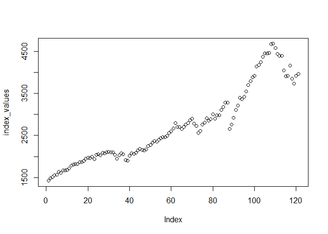<!-- -->

Creating a Time Series Object from the index values.

``` r
ts_index <- ts(index_values, start=c(2012, 12), end = c(2022, 12), frequency=12)
```

``` r
ts_index
```

    ##           Jan      Feb      Mar      Apr      May      Jun      Jul      Aug
    ## 2012                                                                        
    ## 2013 1480.395 1512.312 1550.829 1570.702 1639.843 1618.773 1668.675 1670.094
    ## 2014 1822.357 1817.035 1863.523 1864.263 1889.767 1947.088 1973.100 1961.532
    ## 2015 2028.178 2082.196 2079.990 2094.863 2111.943 2099.284 2094.144 2039.866
    ## 2016 1918.598 1904.418 2021.954 2075.535 2065.551 2083.891 2148.902 2177.482
    ## 2017 2275.116 2329.911 2366.822 2359.309 2395.346 2433.985 2454.102 2456.223
    ## 2018 2789.804 2705.155 2702.774 2653.625 2701.494 2754.353 2793.643 2857.820
    ## 2019 2607.390 2754.864 2803.984 2903.800 2854.706 2890.166 2996.114 2897.498
    ## 2020 3278.203 3277.314 2652.394 2761.975 2919.615 3104.661 3207.619 3391.710
    ## 2021 3793.748 3883.432 3910.508 4141.176 4167.850 4238.490 4363.713 4454.206
    ## 2022 4573.815 4435.981 4391.265 4391.296 4040.360 3898.947 3911.729 4158.563
    ##           Sep      Oct      Nov      Dec
    ## 2012                            1423.864
    ## 2013 1687.174 1720.027 1783.541 1807.775
    ## 2014 1993.226 1937.274 2044.572 2054.266
    ## 2015 1944.402 2024.813 2080.617 2054.080
    ## 2016 2157.691 2143.021 2164.986 2246.629
    ## 2017 2492.841 2556.997 2593.606 2664.340
    ## 2018 2901.501 2785.465 2723.230 2567.307
    ## 2019 2982.156 2977.675 3104.905 3176.750
    ## 2020 3365.517 3418.701 3548.992 3695.310
    ## 2021 4445.543 4460.707 4667.387 4674.773
    ## 2022 3850.520 3726.051 3917.489 3960.883

Plotting the Time Series Object.

``` r
plot(ts_index)
```

<!-- -->

``` r
autoplot(ts_index)
```

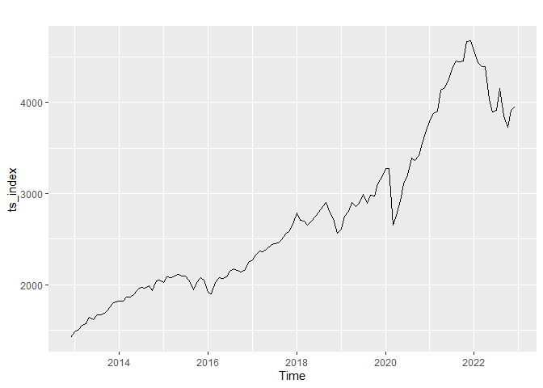<!-- -->

``` r
ts_info(ts_index)
```

    ##  The ts_index series is a ts object with 1 variable and 121 observations
    ##  Frequency: 12 
    ##  Start time: 2012 12 
    ##  End time: 2022 12

Subsetting the ts object with window function

``` r
ts_index.subset <- window(ts_index, start=c(2017, 5), end=c(2020, 6))
ts_index.subset
```

    ##           Jan      Feb      Mar      Apr      May      Jun      Jul      Aug
    ## 2017                                     2395.346 2433.985 2454.102 2456.223
    ## 2018 2789.804 2705.155 2702.774 2653.625 2701.494 2754.353 2793.643 2857.820
    ## 2019 2607.390 2754.864 2803.984 2903.800 2854.706 2890.166 2996.114 2897.498
    ## 2020 3278.203 3277.314 2652.394 2761.975 2919.615 3104.661                  
    ##           Sep      Oct      Nov      Dec
    ## 2017 2492.841 2556.997 2593.606 2664.340
    ## 2018 2901.501 2785.465 2723.230 2567.307
    ## 2019 2982.156 2977.675 3104.905 3176.750
    ## 2020

``` r
autoplot(ts_index.subset)
```

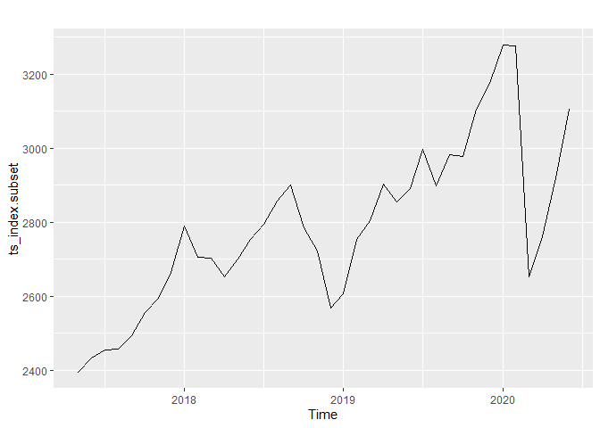<!-- -->

``` r
#moving average function
plot(ts_index, main="Raw Time Series")
```

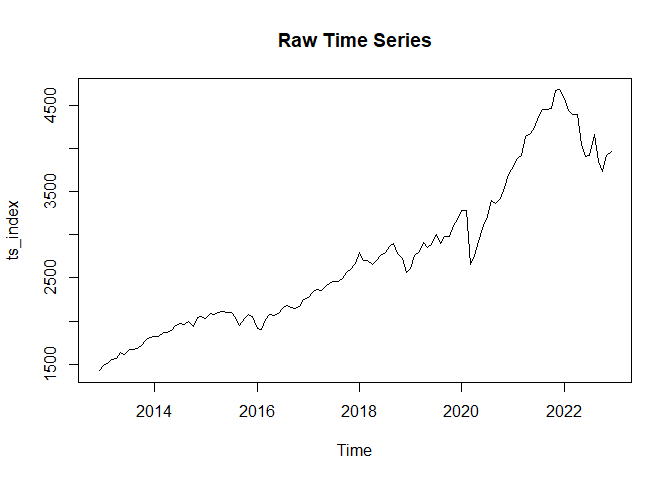<!-- -->

``` r
ma(ts_index,order=3)
```

    ##           Jan      Feb      Mar      Apr      May      Jun      Jul      Aug
    ## 2012                                                                        
    ## 2013 1472.190 1514.512 1544.614 1587.125 1609.773 1642.430 1652.514 1675.314
    ## 2014 1815.722 1834.305 1848.274 1872.518 1900.373 1936.652 1960.573 1975.953
    ## 2015 2054.880 2063.455 2085.683 2095.599 2102.030 2101.790 2077.764 2026.137
    ## 2016 1959.032 1948.323 2000.636 2054.347 2074.993 2099.448 2136.759 2161.358
    ## 2017 2283.885 2323.950 2352.014 2373.826 2396.214 2427.811 2448.104 2467.722
    ## 2018 2719.767 2732.578 2687.185 2685.964 2703.157 2749.830 2801.939 2850.988
    ## 2019 2643.187 2722.079 2820.883 2854.163 2882.891 2913.662 2927.926 2958.589
    ## 2020 3244.089 3069.304 2897.228 2777.995 2928.750 3077.298 3234.663 3321.615
    ## 2021 3790.830 3862.563 3978.372 4073.178 4182.505 4256.684 4352.136 4421.154
    ## 2022 4561.523 4467.020 4406.181 4274.307 4110.201 3950.345 3989.746 3973.604
    ##           Sep      Oct      Nov      Dec
    ## 2012                                  NA
    ## 2013 1692.431 1730.247 1770.448 1804.558
    ## 2014 1964.011 1991.691 2012.038 2042.339
    ## 2015 2003.027 2016.611 2053.170 2017.765
    ## 2016 2159.398 2155.233 2184.879 2228.910
    ## 2017 2502.020 2547.815 2604.981 2682.583
    ## 2018 2848.262 2803.398 2692.001 2632.642
    ## 2019 2952.443 3021.579 3086.443 3186.619
    ## 2020 3391.976 3444.404 3554.335 3679.350
    ## 2021 4453.486 4524.546 4600.956 4638.658
    ## 2022 3911.711 3831.353 3868.141       NA

``` r
plot(ma(ts_index,order=3))
```

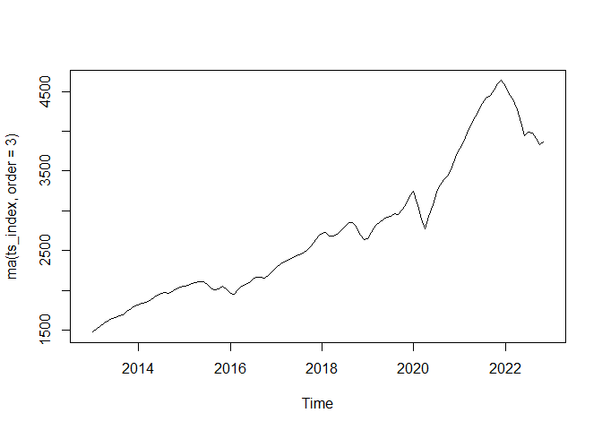<!-- -->

``` r
ma(ts_index,order=5)
```

    ##           Jan      Feb      Mar      Apr      May      Jun      Jul      Aug
    ## 2012                                                                        
    ## 2013       NA 1507.620 1550.816 1578.492 1609.764 1633.617 1656.912 1672.948
    ## 2014 1818.846 1834.991 1851.389 1876.335 1907.548 1927.150 1952.943 1962.444
    ## 2015 2057.841 2067.899 2079.434 2093.655 2096.045 2088.020 2057.928 2040.502
    ## 2016 1995.933 1994.917 1997.211 2030.270 2079.167 2110.272 2126.703 2142.197
    ## 2017 2276.693 2315.557 2345.301 2377.075 2401.913 2419.793 2446.500 2478.830
    ## 2018 2691.136 2703.140 2710.570 2703.480 2721.178 2752.187 2801.762 2818.556
    ## 2019 2691.355 2727.469 2784.949 2841.504 2889.754 2908.457 2924.128 2948.722
    ## 2020 3097.913 3029.327 2977.900 2943.192 2929.253 3077.116 3197.824 3297.642
    ## 2021 3766.398 3884.835 3979.343 4068.291 4164.347 4273.087 4333.960 4392.532
    ## 2022 4548.644 4493.426 4366.543 4231.570 4126.719 4080.179 3972.024 3909.162
    ##           Sep      Oct      Nov      Dec
    ## 2012                                  NA
    ## 2013 1705.902 1733.722 1764.175 1790.147
    ## 2014 1981.941 1998.174 2011.504 2029.297
    ## 2015 2036.768 2028.755 2004.502 1996.505
    ## 2016 2158.416 2177.962 2197.489 2231.932
    ## 2017 2510.754 2552.802 2619.518 2661.981
    ## 2018 2812.332 2767.065 2716.978 2687.651
    ## 2019 2991.670 3027.797 3103.938 3162.969
    ## 2020 3386.508 3484.046 3564.454 3668.037
    ## 2021 4478.311 4540.523 4564.445 4562.533
    ## 2022 3912.871 3922.701       NA       NA

``` r
plot(ma(ts_index,5))
```

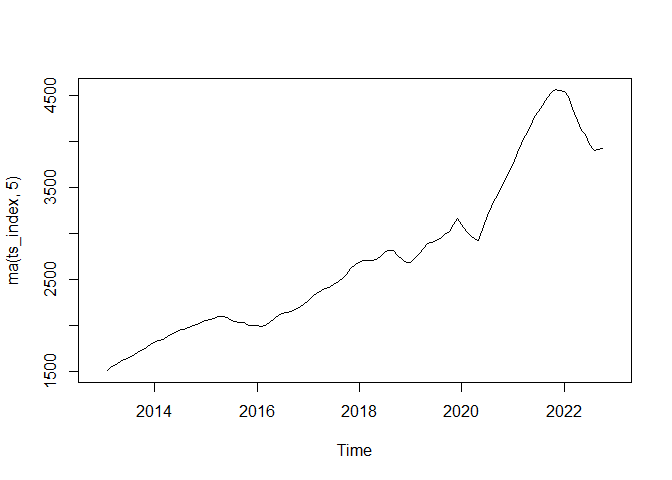<!-- -->

``` r
autoplot(ts_index)+
  autolayer(ma(ts_index,3))+
  autolayer(ma(ts_index,5))+
  autolayer(ma(ts_index,7))
```

    ## Warning: Removed 2 rows containing missing values (`geom_line()`).

    ## Warning: Removed 4 rows containing missing values (`geom_line()`).

    ## Warning: Removed 6 rows containing missing values (`geom_line()`).

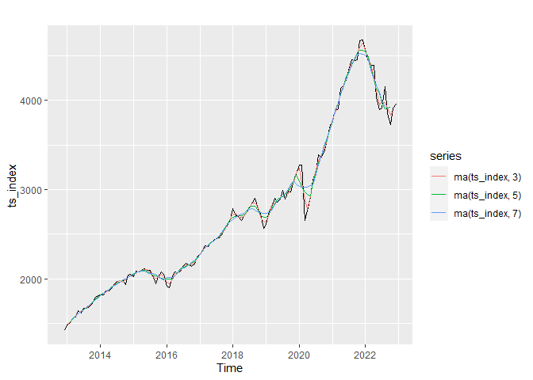<!-- -->

``` r
ggtsdisplay(ts_index)
```

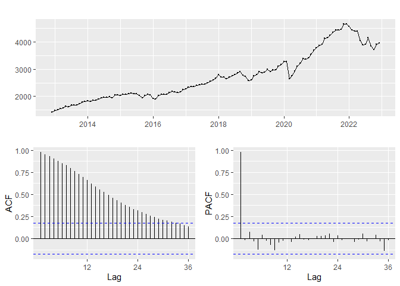<!-- -->
Seasonal Decomposition of the Time Series

``` r
plot(ts_index)
```

<!-- -->

``` r
monthplot(ts_index) 
```

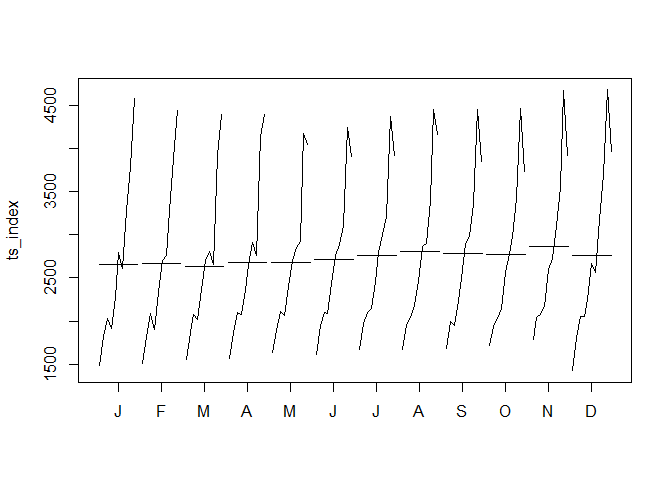<!-- -->

``` r
seasonplot(ts_index)
```

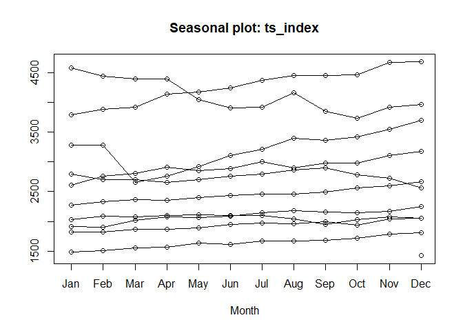<!-- -->

Seasonal Decomposition using Multiplicative approach

``` r
fit.decmult<-decompose(ts_index,type = "multiplicative")
fit.decmult
```

    ## $x
    ##           Jan      Feb      Mar      Apr      May      Jun      Jul      Aug
    ## 2012                                                                        
    ## 2013 1480.395 1512.312 1550.829 1570.702 1639.843 1618.773 1668.675 1670.094
    ## 2014 1822.357 1817.035 1863.523 1864.263 1889.767 1947.088 1973.100 1961.532
    ## 2015 2028.178 2082.196 2079.990 2094.863 2111.943 2099.284 2094.144 2039.866
    ## 2016 1918.598 1904.418 2021.954 2075.535 2065.551 2083.891 2148.902 2177.482
    ## 2017 2275.116 2329.911 2366.822 2359.309 2395.346 2433.985 2454.102 2456.223
    ## 2018 2789.804 2705.155 2702.774 2653.625 2701.494 2754.353 2793.643 2857.820
    ## 2019 2607.390 2754.864 2803.984 2903.800 2854.706 2890.166 2996.114 2897.498
    ## 2020 3278.203 3277.314 2652.394 2761.975 2919.615 3104.661 3207.619 3391.710
    ## 2021 3793.748 3883.432 3910.508 4141.176 4167.850 4238.490 4363.713 4454.206
    ## 2022 4573.815 4435.981 4391.265 4391.296 4040.360 3898.947 3911.729 4158.563
    ##           Sep      Oct      Nov      Dec
    ## 2012                            1423.864
    ## 2013 1687.174 1720.027 1783.541 1807.775
    ## 2014 1993.226 1937.274 2044.572 2054.266
    ## 2015 1944.402 2024.813 2080.617 2054.080
    ## 2016 2157.691 2143.021 2164.986 2246.629
    ## 2017 2492.841 2556.997 2593.606 2664.340
    ## 2018 2901.501 2785.465 2723.230 2567.307
    ## 2019 2982.156 2977.675 3104.905 3176.750
    ## 2020 3365.517 3418.701 3548.992 3695.310
    ## 2021 4445.543 4460.707 4667.387 4674.773
    ## 2022 3850.520 3726.051 3917.489 3960.883
    ## 
    ## $seasonal
    ##            Jan       Feb       Mar       Apr       May       Jun       Jul
    ## 2012                                                                      
    ## 2013 1.0068101 1.0043504 0.9860319 0.9944620 0.9880054 0.9942090 1.0105207
    ## 2014 1.0068101 1.0043504 0.9860319 0.9944620 0.9880054 0.9942090 1.0105207
    ## 2015 1.0068101 1.0043504 0.9860319 0.9944620 0.9880054 0.9942090 1.0105207
    ## 2016 1.0068101 1.0043504 0.9860319 0.9944620 0.9880054 0.9942090 1.0105207
    ## 2017 1.0068101 1.0043504 0.9860319 0.9944620 0.9880054 0.9942090 1.0105207
    ## 2018 1.0068101 1.0043504 0.9860319 0.9944620 0.9880054 0.9942090 1.0105207
    ## 2019 1.0068101 1.0043504 0.9860319 0.9944620 0.9880054 0.9942090 1.0105207
    ## 2020 1.0068101 1.0043504 0.9860319 0.9944620 0.9880054 0.9942090 1.0105207
    ## 2021 1.0068101 1.0043504 0.9860319 0.9944620 0.9880054 0.9942090 1.0105207
    ## 2022 1.0068101 1.0043504 0.9860319 0.9944620 0.9880054 0.9942090 1.0105207
    ##            Aug       Sep       Oct       Nov       Dec
    ## 2012                                         1.0104316
    ## 2013 1.0057936 0.9981109 0.9914059 1.0098683 1.0104316
    ## 2014 1.0057936 0.9981109 0.9914059 1.0098683 1.0104316
    ## 2015 1.0057936 0.9981109 0.9914059 1.0098683 1.0104316
    ## 2016 1.0057936 0.9981109 0.9914059 1.0098683 1.0104316
    ## 2017 1.0057936 0.9981109 0.9914059 1.0098683 1.0104316
    ## 2018 1.0057936 0.9981109 0.9914059 1.0098683 1.0104316
    ## 2019 1.0057936 0.9981109 0.9914059 1.0098683 1.0104316
    ## 2020 1.0057936 0.9981109 0.9914059 1.0098683 1.0104316
    ## 2021 1.0057936 0.9981109 0.9914059 1.0098683 1.0104316
    ## 2022 1.0057936 0.9981109 0.9914059 1.0098683 1.0104316
    ## 
    ## $trend
    ##           Jan      Feb      Mar      Apr      May      Jun      Jul      Aug
    ## 2012                                                                        
    ## 2013       NA       NA       NA       NA       NA 1626.515 1656.760 1683.705
    ## 2014 1807.794 1832.622 1857.517 1879.321 1899.250 1920.397 1939.243 1958.867
    ## 2015 2043.412 2051.720 2052.949 2054.562 2059.712 2061.206 2056.632 2044.659
    ## 2016 2027.937 2035.953 2050.574 2064.386 2072.827 2084.365 2107.243 2139.827
    ## 2017 2279.317 2303.648 2329.226 2360.440 2395.548 2430.812 2469.662 2506.742
    ## 2018 2641.257 2672.138 2705.899 2732.446 2747.366 2748.724 2737.080 2731.551
    ## 2019 2795.426 2805.515 2810.529 2821.899 2845.811 2887.107 2940.451 2990.170
    ## 2020 3019.584 3048.989 3085.555 3119.904 3156.784 3196.894 3239.982 3286.718
    ## 2021 3778.425 3870.866 3960.138 4048.556 4138.573 4225.983 4299.297 4354.823
    ## 2022 4381.000 4349.849 4312.738 4257.335 4195.478 4134.487       NA       NA
    ##           Sep      Oct      Nov      Dec
    ## 2012                                  NA
    ## 2013 1709.431 1734.692 1757.337 1781.430
    ## 2014 1978.935 1997.563 2016.428 2032.027
    ## 2015 2034.833 2031.610 2028.871 2026.297
    ## 2016 2171.925 2198.119 2223.684 2252.013
    ## 2017 2536.376 2562.637 2587.656 2613.761
    ## 2018 2737.839 2752.480 2769.288 2781.331
    ## 2019 3005.623 2993.397 2990.192 3001.834
    ## 2020 3364.394 3474.283 3583.759 3683.012
    ## 2021 4397.877 4428.330 4433.440 4413.980
    ## 2022       NA       NA       NA       NA
    ## 
    ## $random
    ##            Jan       Feb       Mar       Apr       May       Jun       Jul
    ## 2012                                                                      
    ## 2013        NA        NA        NA        NA        NA 1.0010366 0.9967060
    ## 2014 1.0012369 0.9871999 1.0174452 0.9975117 1.0070868 1.0198044 1.0068660
    ## 2015 0.9858313 1.0104580 1.0275244 1.0252932 1.0378069 1.0244059 1.0076382
    ## 2016 0.9396841 0.9313424 1.0000113 1.0109995 1.0085874 1.0055960 1.0091523
    ## 2017 0.9914055 1.0070196 1.0305355 1.0050873 1.0120547 1.0071378 0.9833542
    ## 2018 1.0490965 1.0079711 1.0129948 0.9765622 0.9952407 1.0078845 1.0100391
    ## 2019 0.9264254 0.9776925 1.0118041 1.0347540 1.0153039 1.0068904 1.0083217
    ## 2020 1.0783037 1.0702295 0.8717938 0.8902057 0.9360982 0.9768057 0.9797042
    ## 2021 0.9972640 0.9989006 1.0014561 1.0285736 1.0193002 1.0088013 1.0044157
    ## 2022 1.0369500 1.0153837 1.0326321 1.0372101 0.9747186 0.9485232        NA
    ##            Aug       Sep       Oct       Nov       Dec
    ## 2012                                                NA
    ## 2013 0.9862021 0.9888477 1.0001413 1.0049937 1.0043122
    ## 2014 0.9955923 1.0091280 0.9782259 1.0040489 1.0005074
    ## 2015 0.9919092 0.9573671 1.0052939 1.0154832 1.0032455
    ## 2016 1.0117357 0.9953265 0.9833854 0.9640891 0.9873101
    ## 2017 0.9742024 0.9846960 1.0064488 0.9925048 1.0088276
    ## 2018 1.0401998 1.0617833 1.0207560 0.9737587 0.9135205
    ## 2019 0.9634260 0.9940702 1.0033708 1.0282160 1.0473440
    ## 2020 1.0260001 1.0022269 0.9925320 0.9806218 0.9929808
    ## 2021 1.0169298 1.0127516 1.0160432 1.0424811 1.0481494
    ## 2022        NA        NA        NA        NA        NA
    ## 
    ## $figure
    ##  [1] 1.0104316 1.0068101 1.0043504 0.9860319 0.9944620 0.9880054 0.9942090
    ##  [8] 1.0105207 1.0057936 0.9981109 0.9914059 1.0098683
    ## 
    ## $type
    ## [1] "multiplicative"
    ## 
    ## attr(,"class")
    ## [1] "decomposed.ts"

``` r
plot(fit.decmult)
```

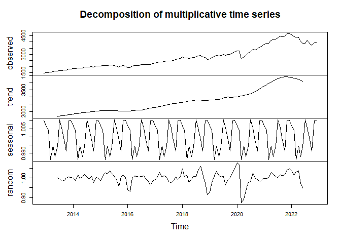<!-- -->

Seasonal Decomposition using Additive Approach

``` r
fit.decadd<-decompose(ts_index, type = "additive")
fit.decadd
```

    ## $x
    ##           Jan      Feb      Mar      Apr      May      Jun      Jul      Aug
    ## 2012                                                                        
    ## 2013 1480.395 1512.312 1550.829 1570.702 1639.843 1618.773 1668.675 1670.094
    ## 2014 1822.357 1817.035 1863.523 1864.263 1889.767 1947.088 1973.100 1961.532
    ## 2015 2028.178 2082.196 2079.990 2094.863 2111.943 2099.284 2094.144 2039.866
    ## 2016 1918.598 1904.418 2021.954 2075.535 2065.551 2083.891 2148.902 2177.482
    ## 2017 2275.116 2329.911 2366.822 2359.309 2395.346 2433.985 2454.102 2456.223
    ## 2018 2789.804 2705.155 2702.774 2653.625 2701.494 2754.353 2793.643 2857.820
    ## 2019 2607.390 2754.864 2803.984 2903.800 2854.706 2890.166 2996.114 2897.498
    ## 2020 3278.203 3277.314 2652.394 2761.975 2919.615 3104.661 3207.619 3391.710
    ## 2021 3793.748 3883.432 3910.508 4141.176 4167.850 4238.490 4363.713 4454.206
    ## 2022 4573.815 4435.981 4391.265 4391.296 4040.360 3898.947 3911.729 4158.563
    ##           Sep      Oct      Nov      Dec
    ## 2012                            1423.864
    ## 2013 1687.174 1720.027 1783.541 1807.775
    ## 2014 1993.226 1937.274 2044.572 2054.266
    ## 2015 1944.402 2024.813 2080.617 2054.080
    ## 2016 2157.691 2143.021 2164.986 2246.629
    ## 2017 2492.841 2556.997 2593.606 2664.340
    ## 2018 2901.501 2785.465 2723.230 2567.307
    ## 2019 2982.156 2977.675 3104.905 3176.750
    ## 2020 3365.517 3418.701 3548.992 3695.310
    ## 2021 4445.543 4460.707 4667.387 4674.773
    ## 2022 3850.520 3726.051 3917.489 3960.883
    ## 
    ## $seasonal
    ##             Jan        Feb        Mar        Apr        May        Jun
    ## 2012                                                                  
    ## 2013  30.113684  19.663618 -45.993800 -15.004359 -45.194454 -29.355804
    ## 2014  30.113684  19.663618 -45.993800 -15.004359 -45.194454 -29.355804
    ## 2015  30.113684  19.663618 -45.993800 -15.004359 -45.194454 -29.355804
    ## 2016  30.113684  19.663618 -45.993800 -15.004359 -45.194454 -29.355804
    ## 2017  30.113684  19.663618 -45.993800 -15.004359 -45.194454 -29.355804
    ## 2018  30.113684  19.663618 -45.993800 -15.004359 -45.194454 -29.355804
    ## 2019  30.113684  19.663618 -45.993800 -15.004359 -45.194454 -29.355804
    ## 2020  30.113684  19.663618 -45.993800 -15.004359 -45.194454 -29.355804
    ## 2021  30.113684  19.663618 -45.993800 -15.004359 -45.194454 -29.355804
    ## 2022  30.113684  19.663618 -45.993800 -15.004359 -45.194454 -29.355804
    ##             Jul        Aug        Sep        Oct        Nov        Dec
    ## 2012                                                         34.834629
    ## 2013  23.514256  18.592853  -1.024084 -21.162580  31.016042  34.834629
    ## 2014  23.514256  18.592853  -1.024084 -21.162580  31.016042  34.834629
    ## 2015  23.514256  18.592853  -1.024084 -21.162580  31.016042  34.834629
    ## 2016  23.514256  18.592853  -1.024084 -21.162580  31.016042  34.834629
    ## 2017  23.514256  18.592853  -1.024084 -21.162580  31.016042  34.834629
    ## 2018  23.514256  18.592853  -1.024084 -21.162580  31.016042  34.834629
    ## 2019  23.514256  18.592853  -1.024084 -21.162580  31.016042  34.834629
    ## 2020  23.514256  18.592853  -1.024084 -21.162580  31.016042  34.834629
    ## 2021  23.514256  18.592853  -1.024084 -21.162580  31.016042  34.834629
    ## 2022  23.514256  18.592853  -1.024084 -21.162580  31.016042  34.834629
    ## 
    ## $trend
    ##           Jan      Feb      Mar      Apr      May      Jun      Jul      Aug
    ## 2012                                                                        
    ## 2013       NA       NA       NA       NA       NA 1626.515 1656.760 1683.705
    ## 2014 1807.794 1832.622 1857.517 1879.321 1899.250 1920.397 1939.243 1958.867
    ## 2015 2043.412 2051.720 2052.949 2054.562 2059.712 2061.206 2056.632 2044.659
    ## 2016 2027.937 2035.953 2050.574 2064.386 2072.827 2084.365 2107.243 2139.827
    ## 2017 2279.317 2303.648 2329.226 2360.440 2395.548 2430.812 2469.662 2506.742
    ## 2018 2641.257 2672.138 2705.899 2732.446 2747.366 2748.724 2737.080 2731.551
    ## 2019 2795.426 2805.515 2810.529 2821.899 2845.811 2887.107 2940.451 2990.170
    ## 2020 3019.584 3048.989 3085.555 3119.904 3156.784 3196.894 3239.982 3286.718
    ## 2021 3778.425 3870.866 3960.138 4048.556 4138.573 4225.983 4299.297 4354.823
    ## 2022 4381.000 4349.849 4312.738 4257.335 4195.478 4134.487       NA       NA
    ##           Sep      Oct      Nov      Dec
    ## 2012                                  NA
    ## 2013 1709.431 1734.692 1757.337 1781.430
    ## 2014 1978.935 1997.563 2016.428 2032.027
    ## 2015 2034.833 2031.610 2028.871 2026.297
    ## 2016 2171.925 2198.119 2223.684 2252.013
    ## 2017 2536.376 2562.637 2587.656 2613.761
    ## 2018 2737.839 2752.480 2769.288 2781.331
    ## 2019 3005.623 2993.397 2990.192 3001.834
    ## 2020 3364.394 3474.283 3583.759 3683.012
    ## 2021 4397.877 4428.330 4433.440 4413.980
    ## 2022       NA       NA       NA       NA
    ## 
    ## $random
    ##                Jan           Feb           Mar           Apr           May
    ## 2012                                                                      
    ## 2013            NA            NA            NA            NA            NA
    ## 2014  -15.55122159  -35.25070297   51.99985520   -0.05377453   35.71184091
    ## 2015  -45.34747260   10.81246915   73.03494934   55.30480331   97.42625864
    ## 2016 -139.45313906 -151.19806590   17.37392018   26.15325930   37.91834167
    ## 2017  -34.31440264    6.59929897   83.58957665   13.87383621   44.99218633
    ## 2018  118.43303748   13.35379745   42.86905721  -63.81591560   -0.67789425
    ## 2019 -218.14960445  -70.31483032   39.44830278   96.90563885   54.08975055
    ## 2020  228.50487036  208.66140307 -387.16727299 -342.92456335 -191.97446281
    ## 2021  -14.79030653   -7.09781204   -3.63603106  107.62443842   74.47117826
    ## 2022  162.70170615   66.46790971  124.52110980  148.96574452 -109.92373218
    ##                Jun           Jul           Aug           Sep           Oct
    ## 2012                                                                      
    ## 2013   21.61303800  -11.59874980  -32.20435578  -21.23328454    6.49759239
    ## 2014   56.04690791   10.34285576  -15.92812308   15.31525846  -39.12586446
    ## 2015   67.43367974   13.99726257  -23.38553439  -89.40683863   14.36550356
    ## 2016   28.88182350   18.14458308   19.06240482  -13.21021820  -33.93515154
    ## 2017   32.52927170  -39.07371191  -69.11228788  -42.51057714   15.52305051
    ## 2018   34.98473204   33.04877096  107.67664498  164.68538345   54.14710459
    ## 2019   32.41464473   32.14826243 -111.26507452  -22.44281272    5.44052357
    ## 2020  -62.87755647  -55.87718613   86.39914883    2.14639693  -34.41855854
    ## 2021   41.86187023   40.90138017   80.79064415   48.69015952   53.53926705
    ## 2022 -206.18455903            NA            NA            NA            NA
    ##                Nov           Dec
    ## 2012                          NA
    ## 2013   -4.81178022   -8.48944273
    ## 2014   -2.87239142  -12.59556865
    ## 2015   20.72899388   -7.05217982
    ## 2016  -89.71439534  -40.21835899
    ## 2017  -25.06644277   15.74495920
    ## 2018  -77.07457001 -248.85803772
    ## 2019   83.69600311  140.08060692
    ## 2020  -65.78252205  -22.53623940
    ## 2021  202.93057194  225.95772833
    ## 2022            NA            NA
    ## 
    ## $figure
    ##  [1]  34.834629  30.113684  19.663618 -45.993800 -15.004359 -45.194454
    ##  [7] -29.355804  23.514256  18.592853  -1.024084 -21.162580  31.016042
    ## 
    ## $type
    ## [1] "additive"
    ## 
    ## attr(,"class")
    ## [1] "decomposed.ts"

``` r
plot(fit.decadd)
```

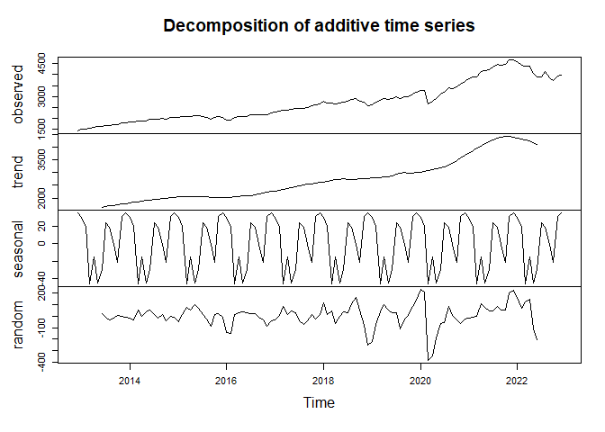<!-- -->

Seasonal Decomposition using STL

``` r
lts_index <- log(ts_index)
plot(lts_index, ylab="log(ts_index)")
```

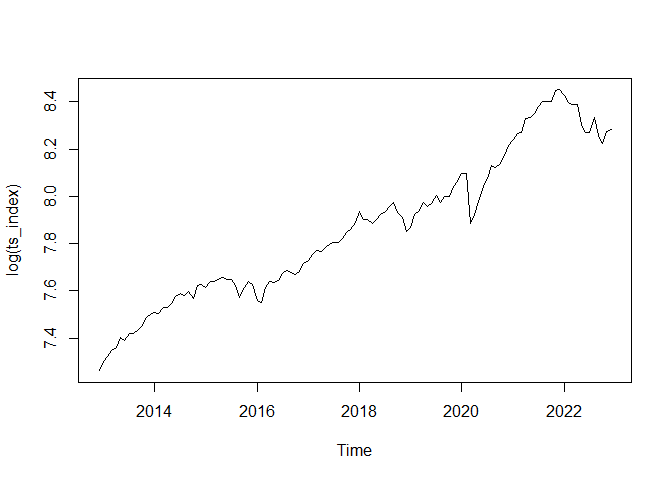<!-- -->

``` r
fit.stl <- stl(lts_index, s.window="period")           
plot(fit.stl)
```

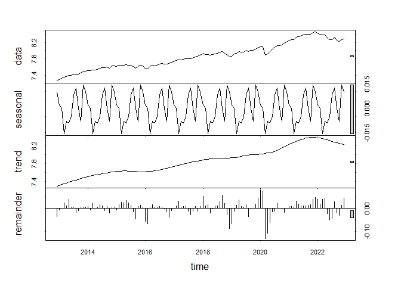<!-- -->

``` r
fit.stl$time.series                                 
```

    ##               seasonal    trend     remainder
    ## Dec 2012  0.0098398171 7.287143 -3.585322e-02
    ## Jan 2013  0.0017191505 7.304666 -6.320732e-03
    ## Feb 2013 -0.0001195311 7.322189 -6.746093e-04
    ## Mar 2013 -0.0155422949 7.339473  2.261447e-02
    ## Apr 2013 -0.0078996861 7.356757  1.042108e-02
    ## May 2013 -0.0092125887 7.374039  3.752880e-02
    ## Jun 2013 -0.0049705465 7.391322  3.071865e-03
    ## Jul 2013  0.0080202791 7.408498  3.267391e-03
    ## Aug 2013  0.0124348024 7.425673 -1.747328e-02
    ## Sep 2013 -0.0004527279 7.440828 -9.565668e-03
    ## Oct 2013 -0.0080819650 7.455983  2.193771e-03
    ## Nov 2013  0.0142652901 7.470299  1.791204e-03
    ## Dec 2013  0.0098398171 7.484616  5.396587e-03
    ## Jan 2014  0.0017191505 7.498753  7.413785e-03
    ## Feb 2014 -0.0001195311 7.512890 -7.809226e-03
    ## Mar 2014 -0.0155422949 7.525583  2.018317e-02
    ## Apr 2014 -0.0078996861 7.538277  2.441548e-04
    ## May 2014 -0.0092125887 7.549108  4.313153e-03
    ## Jun 2014 -0.0049705465 7.559940  1.912068e-02
    ## Jul 2014  0.0080202791 7.569789  9.552356e-03
    ## Aug 2014  0.0124348024 7.579637 -1.059101e-02
    ## Sep 2014 -0.0004527279 7.589014  8.948880e-03
    ## Oct 2014 -0.0080819650 7.598390 -2.127082e-02
    ## Nov 2014  0.0142652901 7.606767  1.911458e-03
    ## Dec 2014  0.0098398171 7.615144  2.690201e-03
    ## Jan 2015  0.0017191505 7.620809 -7.634531e-03
    ## Feb 2015 -0.0001195311 7.626473  1.482434e-02
    ## Mar 2015 -0.0155422949 7.628887  2.677348e-02
    ## Apr 2015 -0.0078996861 7.631301  2.384174e-02
    ## May 2015 -0.0092125887 7.631004  3.357270e-02
    ## Jun 2015 -0.0049705465 7.630706  2.361574e-02
    ## Jul 2015  0.0080202791 7.627003  1.187706e-02
    ## Aug 2015  0.0124348024 7.623299 -1.509436e-02
    ## Sep 2015 -0.0004527279 7.618939 -4.577606e-02
    ## Oct 2015 -0.0080819650 7.614578  6.736042e-03
    ## Nov 2015  0.0142652901 7.613119  1.303523e-02
    ## Dec 2015  0.0098398171 7.611660  6.083712e-03
    ## Jan 2016  0.0017191505 7.614586 -5.695539e-02
    ## Feb 2016 -0.0001195311 7.617513 -6.546125e-02
    ## Mar 2016 -0.0155422949 7.623439  3.923125e-03
    ## Apr 2016 -0.0078996861 7.629365  1.650907e-02
    ## May 2016 -0.0092125887 7.637237  5.127717e-03
    ## Jun 2016 -0.0049705465 7.645109  1.853484e-03
    ## Jul 2016  0.0080202791 7.656172  8.519950e-03
    ## Aug 2016  0.0124348024 7.667235  6.254928e-03
    ## Sep 2016 -0.0004527279 7.679815 -2.568219e-03
    ## Oct 2016 -0.0080819650 7.692395 -1.434122e-02
    ## Nov 2016  0.0142652901 7.704795 -3.889136e-02
    ## Dec 2016  0.0098398171 7.717195 -9.848915e-03
    ## Jan 2017  0.0017191505 7.729611 -1.543891e-03
    ## Feb 2017 -0.0001195311 7.742027  1.167783e-02
    ## Mar 2017 -0.0155422949 7.754953  2.989312e-02
    ## Apr 2017 -0.0078996861 7.767878  6.145494e-03
    ## May 2017 -0.0092125887 7.781589  8.906437e-03
    ## Jun 2017 -0.0049705465 7.795300  6.956134e-03
    ## Jul 2017  0.0080202791 7.808860 -1.136423e-02
    ## Aug 2017  0.0124348024 7.822421 -2.847568e-02
    ## Sep 2017 -0.0004527279 7.834649 -1.301845e-02
    ## Oct 2017 -0.0080819650 7.846878  7.792900e-03
    ## Nov 2017  0.0142652901 7.858213 -1.167370e-02
    ## Dec 2017  0.0098398171 7.869548  8.324457e-03
    ## Jan 2018  0.0017191505 7.880638  5.136923e-02
    ## Feb 2018 -0.0001195311 7.891729  1.130535e-02
    ## Mar 2018 -0.0155422949 7.901200  1.637660e-02
    ## Apr 2018 -0.0078996861 7.910670 -1.908865e-02
    ## May 2018 -0.0092125887 7.914304 -3.531409e-03
    ## Jun 2018 -0.0049705465 7.917938  7.970490e-03
    ## Jul 2018  0.0080202791 7.917426  9.655384e-03
    ## Aug 2018  0.0124348024 7.916915  2.846515e-02
    ## Sep 2018 -0.0004527279 7.918082  5.535396e-02
    ## Oct 2018 -0.0080819650 7.919250  2.100242e-02
    ## Nov 2018  0.0142652901 7.922863 -2.755442e-02
    ## Dec 2018  0.0098398171 7.926476 -8.570316e-02
    ## Jan 2019  0.0017191505 7.930471 -6.608483e-02
    ## Feb 2019 -0.0001195311 7.934465 -1.322214e-02
    ## Mar 2019 -0.0155422949 7.940727  1.361175e-02
    ## Apr 2019 -0.0078996861 7.946989  3.468625e-02
    ## May 2019 -0.0092125887 7.958414  7.522983e-03
    ## Jun 2019 -0.0049705465 7.969838  4.201280e-03
    ## Jul 2019  0.0080202791 7.982539  1.451182e-02
    ## Aug 2019  0.0124348024 7.995240 -3.607173e-02
    ## Sep 2019 -0.0004527279 8.000654  2.001885e-04
    ## Oct 2019 -0.0080819650 8.006069  9.112885e-04
    ## Nov 2019  0.0142652901 8.008071  1.840194e-02
    ## Dec 2019  0.0098398171 8.010073  4.370079e-02
    ## Jan 2020  0.0017191505 8.015163  7.816896e-02
    ## Feb 2020 -0.0001195311 8.020252  7.464718e-02
    ## Mar 2020 -0.0155422949 8.028933 -1.301725e-01
    ## Apr 2020 -0.0078996861 8.037613 -1.060122e-01
    ## May 2020 -0.0092125887 8.048921 -6.050147e-02
    ## Jun 2020 -0.0049705465 8.060229 -1.459860e-02
    ## Jul 2020  0.0080202791 8.077854 -1.259024e-02
    ## Aug 2020  0.0124348024 8.095479  2.117524e-02
    ## Sep 2020 -0.0004527279 8.121801 -1.193912e-05
    ## Oct 2020 -0.0080819650 8.148123 -3.025422e-03
    ## Nov 2020  0.0142652901 8.176977 -1.682370e-02
    ## Dec 2020  0.0098398171 8.205831 -8.515623e-04
    ## Jan 2021  0.0017191505 8.231732  7.658310e-03
    ## Feb 2021 -0.0001195311 8.257633  6.960853e-03
    ## Mar 2021 -0.0155422949 8.281208  5.757407e-03
    ## Apr 2021 -0.0078996861 8.304782  3.185305e-02
    ## May 2021 -0.0092125887 8.325666  1.870168e-02
    ## Jun 2021 -0.0049705465 8.346551  1.038179e-02
    ## Jul 2021  0.0080202791 8.362171  1.088760e-02
    ## Aug 2021  0.0124348024 8.377790  1.137905e-02
    ## Sep 2021 -0.0004527279 8.386411  1.369922e-02
    ## Oct 2021 -0.0080819650 8.395031  1.611311e-02
    ## Nov 2021  0.0142652901 8.394813  3.927673e-02
    ## Dec 2021  0.0098398171 8.394594  4.550230e-02
    ## Jan 2022  0.0017191505 8.387052  3.933212e-02
    ## Feb 2022 -0.0001195311 8.379510  1.811366e-02
    ## Mar 2022 -0.0155422949 8.365677  3.723789e-02
    ## Apr 2022 -0.0078996861 8.351844  4.343505e-02
    ## May 2022 -0.0092125887 8.337108 -2.380627e-02
    ## Jun 2022 -0.0049705465 8.322372 -4.893929e-02
    ## Jul 2022  0.0080202791 8.307262 -4.354788e-02
    ## Aug 2022  0.0124348024 8.292153  2.833666e-02
    ## Sep 2022 -0.0004527279 8.276796 -2.037976e-02
    ## Oct 2022 -0.0080819650 8.261439 -3.025259e-02
    ## Nov 2022  0.0142652901 8.246190  1.275116e-02
    ## Dec 2022  0.0098398171 8.230940  4.344202e-02

``` r
exp(fit.stl$time.series)
```

    ##           seasonal    trend remainder
    ## Dec 2012 1.0098884 1461.390 0.9647819
    ## Jan 2013 1.0017206 1487.223 0.9936992
    ## Feb 2013 0.9998805 1513.513 0.9993256
    ## Mar 2013 0.9845779 1539.900 1.0228721
    ## Apr 2013 0.9921314 1566.747 1.0104756
    ## May 2013 0.9908297 1594.060 1.0382419
    ## Jun 2013 0.9950418 1621.849 1.0030766
    ## Jul 2013 1.0080525 1649.946 1.0032727
    ## Aug 2013 1.0125124 1678.530 0.9826785
    ## Sep 2013 0.9995474 1704.161 0.9904799
    ## Oct 2013 0.9919506 1730.184 1.0021962
    ## Nov 2013 1.0143675 1755.132 1.0017928
    ## Dec 2013 1.0098884 1780.440 1.0054112
    ## Jan 2014 1.0017206 1805.789 1.0074413
    ## Feb 2014 0.9998805 1831.499 0.9922212
    ## Mar 2014 0.9845779 1854.895 1.0203882
    ## Apr 2014 0.9921314 1878.590 1.0002442
    ## May 2014 0.9908297 1899.049 1.0043225
    ## Jun 2014 0.9950418 1919.730 1.0193047
    ## Jul 2014 1.0080525 1938.730 1.0095981
    ## Aug 2014 1.0125124 1957.919 0.9894649
    ## Sep 2014 0.9995474 1976.363 1.0089890
    ## Oct 2014 0.9919506 1994.982 0.9789538
    ## Nov 2014 1.0143675 2011.764 1.0019133
    ## Dec 2014 1.0098884 2028.687 1.0026938
    ## Jan 2015 1.0017206 2040.212 0.9923945
    ## Feb 2015 0.9998805 2051.802 1.0149348
    ## Mar 2015 0.9845779 2056.760 1.0271351
    ## Apr 2015 0.9921314 2061.731 1.0241282
    ## May 2015 0.9908297 2061.118 1.0341426
    ## Jun 2015 0.9950418 2060.505 1.0238968
    ## Jul 2015 1.0080525 2052.888 1.0119479
    ## Aug 2015 1.0125124 2045.299 0.9850190
    ## Sep 2015 0.9995474 2036.400 0.9552559
    ## Oct 2015 0.9919506 2027.540 1.0067588
    ## Nov 2015 1.0143675 2024.583 1.0131206
    ## Dec 2015 1.0098884 2021.630 1.0061023
    ## Jan 2016 1.0017206 2027.556 0.9446362
    ## Feb 2016 0.9998805 2033.498 0.9366353
    ## Mar 2016 0.9845779 2045.585 1.0039308
    ## Apr 2016 0.9921314 2057.743 1.0166461
    ## May 2016 0.9908297 2074.006 1.0051409
    ## Jun 2016 0.9950418 2090.397 1.0018552
    ## Jul 2016 1.0080525 2113.651 1.0085563
    ## Aug 2016 1.0125124 2137.164 1.0062745
    ## Sep 2016 0.9995474 2164.219 0.9974351
    ## Oct 2016 0.9919506 2191.617 0.9857611
    ## Nov 2016 1.0143675 2218.963 0.9618552
    ## Dec 2016 1.0098884 2246.649 0.9901994
    ## Jan 2017 1.0017206 2274.717 0.9984573
    ## Feb 2017 0.9998805 2303.136 1.0117463
    ## Mar 2017 0.9845779 2333.099 1.0303444
    ## Apr 2017 0.9921314 2363.452 1.0061644
    ## May 2017 0.9908297 2396.079 1.0089462
    ## Jun 2017 0.9950418 2429.157 1.0069804
    ## Jul 2017 1.0080525 2462.323 0.9887001
    ## Aug 2017 1.0125124 2495.941 0.9719259
    ## Sep 2017 0.9995474 2526.650 0.9870659
    ## Oct 2017 0.9919506 2557.737 1.0078233
    ## Nov 2017 1.0143675 2586.893 0.9883942
    ## Dec 2017 1.0098884 2616.382 1.0083592
    ## Jan 2018 1.0017206 2645.560 1.0527115
    ## Feb 2018 0.9998805 2675.065 1.0113695
    ## Mar 2018 0.9845779 2700.520 1.0165114
    ## Apr 2018 0.9921314 2726.217 0.9810924
    ## May 2018 0.9908297 2736.142 0.9964748
    ## Jun 2018 0.9950418 2746.102 1.0080023
    ## Jul 2018 1.0080525 2744.698 1.0097021
    ## Aug 2018 1.0125124 2743.294 1.0288742
    ## Sep 2018 0.9995474 2746.498 1.0569147
    ## Oct 2018 0.9919506 2749.707 1.0212245
    ## Nov 2018 1.0143675 2759.660 0.9728217
    ## Dec 2018 1.0098884 2769.650 0.9178667
    ## Jan 2019 1.0017206 2780.735 0.9360515
    ## Feb 2019 0.9998805 2791.865 0.9868649
    ## Mar 2019 0.9845779 2809.402 1.0137048
    ## Apr 2019 0.9921314 2827.050 1.0352948
    ## May 2019 0.9908297 2859.533 1.0075514
    ## Jun 2019 0.9950418 2892.390 1.0042101
    ## Jul 2019 1.0080525 2929.360 1.0146176
    ## Aug 2019 1.0125124 2966.802 0.9645711
    ## Sep 2019 0.9995474 2982.909 1.0002002
    ## Oct 2019 0.9919506 2999.104 1.0009117
    ## Nov 2019 1.0143675 3005.115 1.0185723
    ## Dec 2019 1.0098884 3011.137 1.0446697
    ## Jan 2020 1.0017206 3026.501 1.0813053
    ## Feb 2020 0.9998805 3041.943 1.0775039
    ## Mar 2020 0.9845779 3068.465 0.8779440
    ## Apr 2020 0.9921314 3095.217 0.8994137
    ## May 2020 0.9908297 3130.416 0.9412924
    ## Jun 2020 0.9950418 3166.015 0.9855074
    ## Jul 2020 1.0080525 3222.311 0.9874887
    ## Aug 2020 1.0125124 3279.609 1.0214010
    ## Sep 2020 0.9995474 3367.081 0.9999881
    ## Oct 2020 0.9919506 3456.886 0.9969792
    ## Nov 2020 1.0143675 3558.084 0.9833170
    ## Dec 2020 1.0098884 3662.244 0.9991488
    ## Jan 2021 1.0017206 3758.339 1.0076877
    ## Feb 2021 0.9998805 3856.955 1.0069851
    ## Mar 2021 0.9845779 3948.960 1.0057740
    ## Apr 2021 0.9921314 4043.160 1.0323658
    ## May 2021 0.9908297 4128.487 1.0188777
    ## Jun 2021 0.9950418 4215.616 1.0104359
    ## Jul 2021 1.0080525 4281.979 1.0109471
    ## Aug 2021 1.0125124 4349.388 1.0114440
    ## Sep 2021 0.9995474 4387.044 1.0137935
    ## Oct 2021 0.9919506 4425.026 1.0162436
    ## Nov 2021 1.0143675 4424.058 1.0400583
    ## Dec 2021 1.0098884 4423.089 1.0465534
    ## Jan 2022 1.0017206 4389.856 1.0401159
    ## Feb 2022 0.9998805 4356.873 1.0182787
    ## Mar 2022 0.9845779 4297.020 1.0379399
    ## Apr 2022 0.9921314 4237.990 1.0443922
    ## May 2022 0.9908297 4175.995 0.9764749
    ## Jun 2022 0.9950418 4114.907 0.9522389
    ## Jul 2022 1.0080525 4053.202 0.9573867
    ## Aug 2022 1.0125124 3992.422 1.0287420
    ## Sep 2022 0.9995474 3931.578 0.9798265
    ## Oct 2022 0.9919506 3871.661 0.9702004
    ## Nov 2022 1.0143675 3813.069 1.0128328
    ## Dec 2022 1.0098884 3755.364 1.0443994

``` r
ggAcf(ts_index)
```

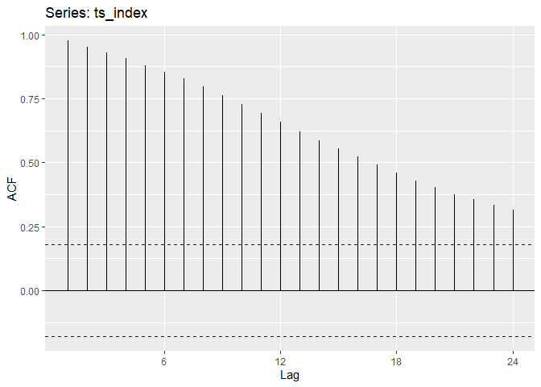<!-- -->

Some simple time series models

``` r
#Mean Model
fcast.mean<-meanf(ts_index,h=3)
checkresiduals(fcast.mean)
```

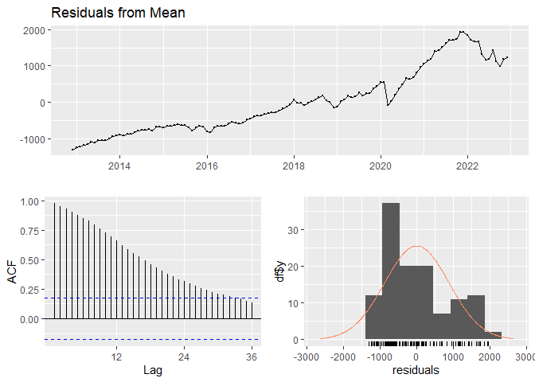<!-- -->

    ## 
    ##  Ljung-Box test
    ## 
    ## data:  Residuals from Mean
    ## Q* = 1454.1, df = 23, p-value < 2.2e-16
    ## 
    ## Model df: 1.   Total lags used: 24

``` r
summary(fcast.mean)
```

    ## 
    ## Forecast method: Mean
    ## 
    ## Model Information:
    ## $mu
    ## [1] 2731.324
    ## 
    ## $mu.se
    ## [1] 79.9193
    ## 
    ## $sd
    ## [1] 879.1123
    ## 
    ## $bootstrap
    ## [1] FALSE
    ## 
    ## $call
    ## meanf(y = ts_index, h = 3)
    ## 
    ## attr(,"class")
    ## [1] "meanf"
    ## 
    ## Error measures:
    ##              ME     RMSE      MAE       MPE     MAPE     MASE      ACF1
    ## Training set  0 875.4721 721.0641 -10.09665 28.20974 1.962756 0.9751198
    ## 
    ## Forecasts:
    ##          Point Forecast    Lo 80    Hi 80    Lo 95    Hi 95
    ## Jan 2023       2731.324 1593.788 3868.861 983.5656 4479.083
    ## Feb 2023       2731.324 1593.788 3868.861 983.5656 4479.083
    ## Mar 2023       2731.324 1593.788 3868.861 983.5656 4479.083

``` r
plot(fcast.mean)
```

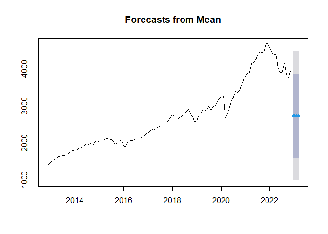<!-- -->

``` r
#Naive Model
fcast.naive<-naive(ts_index,h=4)
checkresiduals(fcast.naive)
```

<!-- -->

    ## 
    ##  Ljung-Box test
    ## 
    ## data:  Residuals from Naive method
    ## Q* = 26.011, df = 24, p-value = 0.3526
    ## 
    ## Model df: 0.   Total lags used: 24

``` r
summary(fcast.naive)
```

    ## 
    ## Forecast method: Naive method
    ## 
    ## Model Information:
    ## Call: naive(y = ts_index, h = 4) 
    ## 
    ## Residual sd: 107.7631 
    ## 
    ## Error measures:
    ##                    ME     RMSE      MAE      MPE     MAPE      MASE       ACF1
    ## Training set 21.14182 107.7631 71.30014 0.788849 2.518846 0.1940809 0.08886933
    ## 
    ## Forecasts:
    ##          Point Forecast    Lo 80    Hi 80    Lo 95    Hi 95
    ## Jan 2023       3960.883 3822.779 4098.987 3749.671 4172.095
    ## Feb 2023       3960.883 3765.575 4156.192 3662.184 4259.582
    ## Mar 2023       3960.883 3721.680 4200.086 3595.053 4326.713
    ## Apr 2023       3960.883 3684.675 4237.091 3538.459 4383.307

``` r
plot(fcast.naive)
```

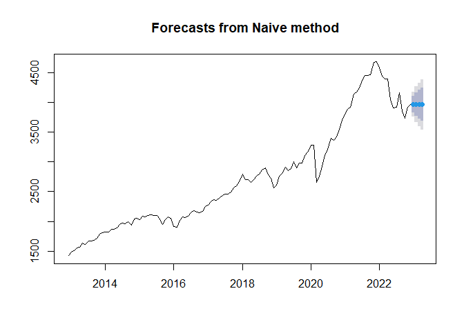<!-- -->

``` r
#seasonal naive model
fcast.seasonalnaive<-snaive(ts_index,h=2)
checkresiduals(fcast.seasonalnaive)
```

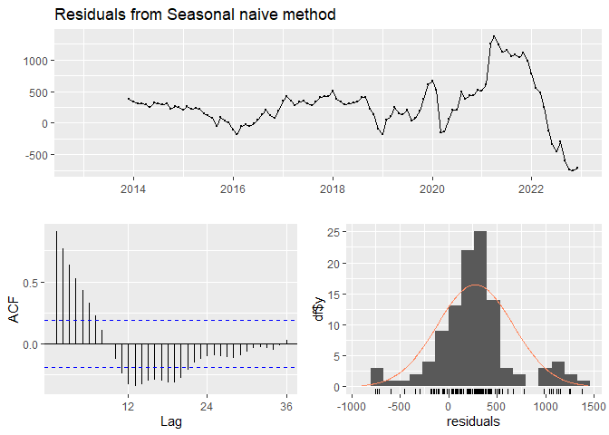<!-- -->

    ## 
    ##  Ljung-Box test
    ## 
    ## data:  Residuals from Seasonal naive method
    ## Q* = 412.79, df = 24, p-value < 2.2e-16
    ## 
    ## Model df: 0.   Total lags used: 24

``` r
summary(fcast.seasonalnaive)
```

    ## 
    ## Forecast method: Seasonal naive method
    ## 
    ## Model Information:
    ## Call: snaive(y = ts_index, h = 2) 
    ## 
    ## Residual sd: 475.8319 
    ## 
    ## Error measures:
    ##                    ME     RMSE      MAE      MPE     MAPE MASE      ACF1
    ## Training set 274.5933 475.8319 367.3732 9.209649 11.94069    1 0.9027636
    ## 
    ## Forecasts:
    ##          Point Forecast    Lo 80    Hi 80    Lo 95    Hi 95
    ## Jan 2023       4573.815 3964.012 5183.619 3641.202 5506.429
    ## Feb 2023       4435.981 3826.177 5045.784 3503.367 5368.594

``` r
plot(fcast.seasonalnaive)
```

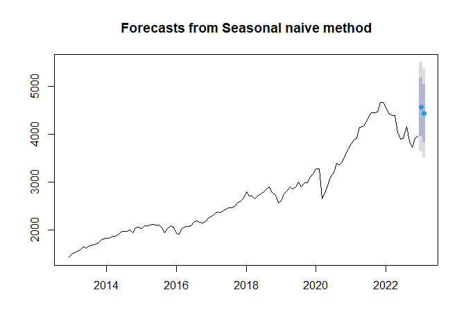<!-- -->

``` r
#Drift model
fcast.drift <-rwf(ts_index,h=2, drift = TRUE)
checkresiduals(fcast.drift)
```

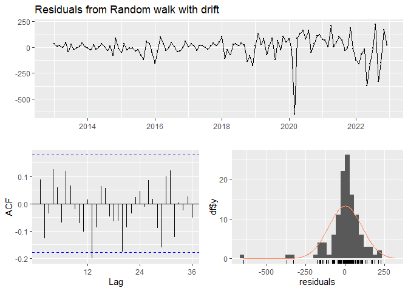<!-- -->

    ## 
    ##  Ljung-Box test
    ## 
    ## data:  Residuals from Random walk with drift
    ## Q* = 26.011, df = 23, p-value = 0.3004
    ## 
    ## Model df: 1.   Total lags used: 24

``` r
summary(fcast.drift)
```

    ## 
    ## Forecast method: Random walk with drift
    ## 
    ## Model Information:
    ## Call: rwf(y = ts_index, h = 2, drift = TRUE) 
    ## 
    ## Drift: 21.1418  (se 9.6866)
    ## Residual sd: 106.1119 
    ## 
    ## Error measures:
    ##                        ME     RMSE      MAE         MPE     MAPE      MASE
    ## Training set 3.031689e-14 105.6689 65.62654 -0.05808249 2.290117 0.1786372
    ##                    ACF1
    ## Training set 0.08886933
    ## 
    ## Forecasts:
    ##          Point Forecast    Lo 80    Hi 80    Lo 95    Hi 95
    ## Jan 2023       3982.025 3845.472 4118.578 3773.185 4190.865
    ## Feb 2023       4003.167 3809.255 4197.079 3706.604 4299.729

``` r
plot(fcast.drift)
```

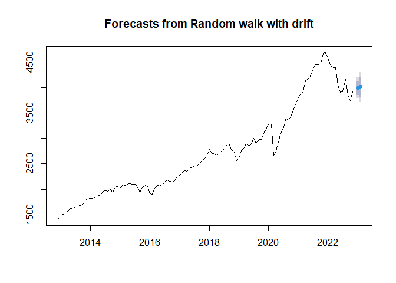<!-- -->

Simple Exponential Model

``` r
ts_exp <- ses(ts_index, h = 3)
checkresiduals(ts_exp)
```

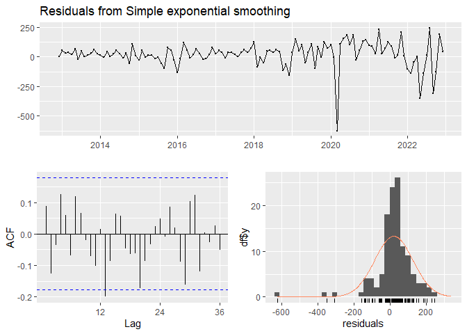<!-- -->

    ## 
    ##  Ljung-Box test
    ## 
    ## data:  Residuals from Simple exponential smoothing
    ## Q* = 26.112, df = 22, p-value = 0.2469
    ## 
    ## Model df: 2.   Total lags used: 24

``` r
ts_exp
```

    ##          Point Forecast    Lo 80    Hi 80    Lo 95    Hi 95
    ## Jan 2023       3960.879 3822.194 4099.563 3748.779 4172.979
    ## Feb 2023       3960.879 3764.759 4156.999 3660.939 4260.818
    ## Mar 2023       3960.879 3720.686 4201.072 3593.535 4328.222

``` r
ts_exp$model
```

    ## Simple exponential smoothing 
    ## 
    ## Call:
    ##  ses(y = ts_index, h = 3) 
    ## 
    ##   Smoothing parameters:
    ##     alpha = 0.9999 
    ## 
    ##   Initial states:
    ##     l = 1423.7308 
    ## 
    ##   sigma:  108.2163
    ## 
    ##      AIC     AICc      BIC 
    ## 1717.834 1718.039 1726.221

``` r
round(accuracy(ts_exp), 3)
```

    ##                 ME    RMSE    MAE   MPE  MAPE  MASE  ACF1
    ## Training set 20.97 107.318 70.714 0.782 2.498 0.192 0.088

``` r
autoplot(ts_exp)
```

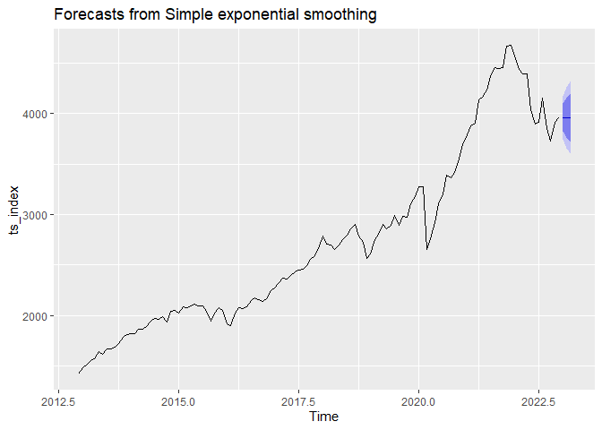<!-- -->

``` r
autoplot(ts_exp)+
  autolayer(fitted(ts_exp),series = "Fitted")
```

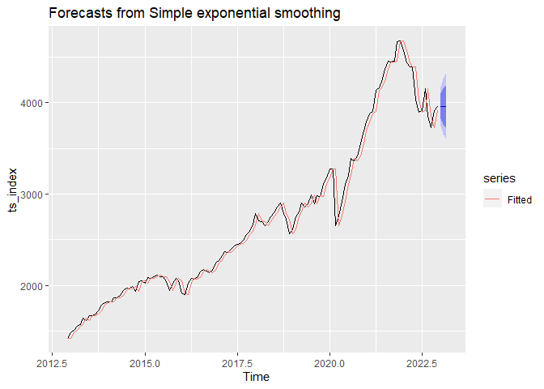<!-- -->

Holt’s Linear Model

``` r
ts_holt <- holt(ts_index, h = 3)
checkresiduals(ts_holt)
```

<!-- -->

    ## 
    ##  Ljung-Box test
    ## 
    ## data:  Residuals from Holt's method
    ## Q* = 25.704, df = 20, p-value = 0.1758
    ## 
    ## Model df: 4.   Total lags used: 24

``` r
ts_holt
```

    ##          Point Forecast    Lo 80    Hi 80    Lo 95    Hi 95
    ## Jan 2023       3985.196 3847.630 4122.762 3774.807 4195.584
    ## Feb 2023       4009.511 3814.942 4204.080 3711.943 4307.078
    ## Mar 2023       4033.825 3795.493 4272.158 3669.328 4398.323

``` r
ts_holt$model
```

    ## Holt's method 
    ## 
    ## Call:
    ##  holt(y = ts_index, h = 3) 
    ## 
    ##   Smoothing parameters:
    ##     alpha = 0.9999 
    ##     beta  = 3e-04 
    ## 
    ##   Initial states:
    ##     l = 1480.1038 
    ##     b = 24.4672 
    ## 
    ##   sigma:  107.3431
    ## 
    ##      AIC     AICc      BIC 
    ## 1717.822 1718.344 1731.801

``` r
round(accuracy(ts_holt), 3)
```

    ##                 ME    RMSE    MAE    MPE  MAPE  MASE  ACF1
    ## Training set -3.89 105.554 65.389 -0.234 2.306 0.178 0.087

``` r
autoplot(ts_holt)
```

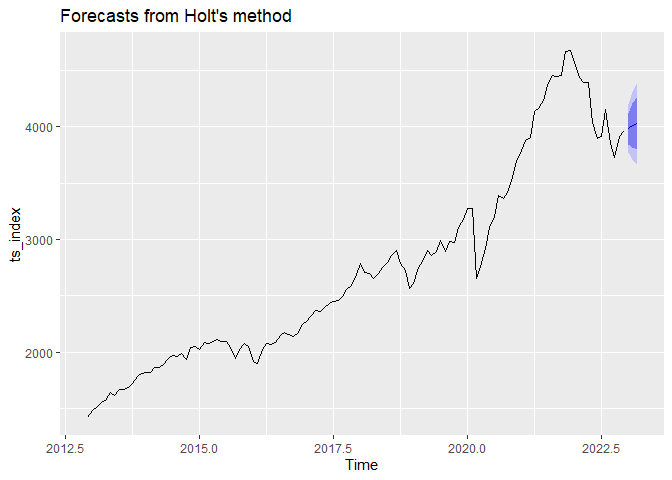<!-- -->

``` r
autoplot(ts_holt)+
  autolayer(fitted(ts_holt),series = "Fitted")
```

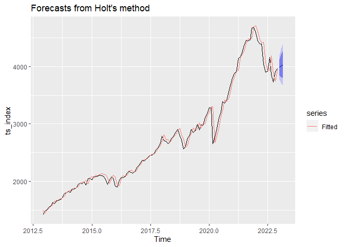<!-- --> ETS

``` r
ts_ets <- ets(ts_index, model = "AAN")
checkresiduals(ts_ets)
```

<!-- -->

    ## 
    ##  Ljung-Box test
    ## 
    ## data:  Residuals from ETS(A,A,N)
    ## Q* = 25.704, df = 20, p-value = 0.1758
    ## 
    ## Model df: 4.   Total lags used: 24

``` r
ts_ets
```

    ## ETS(A,A,N) 
    ## 
    ## Call:
    ##  ets(y = ts_index, model = "AAN") 
    ## 
    ##   Smoothing parameters:
    ##     alpha = 0.9999 
    ##     beta  = 3e-04 
    ## 
    ##   Initial states:
    ##     l = 1480.1261 
    ##     b = 24.4631 
    ## 
    ##   sigma:  107.3431
    ## 
    ##      AIC     AICc      BIC 
    ## 1717.822 1718.344 1731.801

``` r
ts_ets$model
```

    ## NULL

``` r
autoplot(ts_ets)
```

<!-- -->

``` r
round(accuracy(ts_ets), 3)
```

    ##                  ME    RMSE    MAE    MPE  MAPE  MASE  ACF1
    ## Training set -3.886 105.554 65.389 -0.233 2.306 0.178 0.087

``` r
ts_ets <- ets(ts_index, model = "ZZZ")
checkresiduals(ts_ets)
```

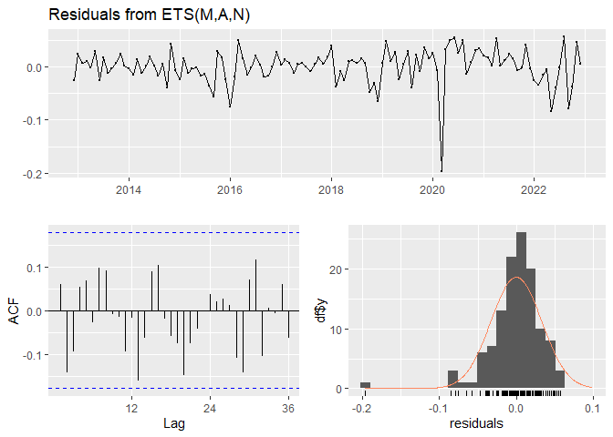<!-- -->

    ## 
    ##  Ljung-Box test
    ## 
    ## data:  Residuals from ETS(M,A,N)
    ## Q* = 21.553, df = 20, p-value = 0.3653
    ## 
    ## Model df: 4.   Total lags used: 24

``` r
ts_ets
```

    ## ETS(M,A,N) 
    ## 
    ## Call:
    ##  ets(y = ts_index, model = "ZZZ") 
    ## 
    ##   Smoothing parameters:
    ##     alpha = 0.9999 
    ##     beta  = 3e-04 
    ## 
    ##   Initial states:
    ##     l = 1438.8606 
    ##     b = 22.7433 
    ## 
    ##   sigma:  0.0333
    ## 
    ##      AIC     AICc      BIC 
    ## 1665.839 1666.361 1679.818

``` r
ts_ets$model
```

    ## NULL

``` r
round(accuracy(ts_ets), 3)
```

    ##                  ME    RMSE    MAE    MPE  MAPE  MASE  ACF1
    ## Training set -1.877 105.313 65.218 -0.142 2.287 0.178 0.088

``` r
autoplot(ts_ets)
```

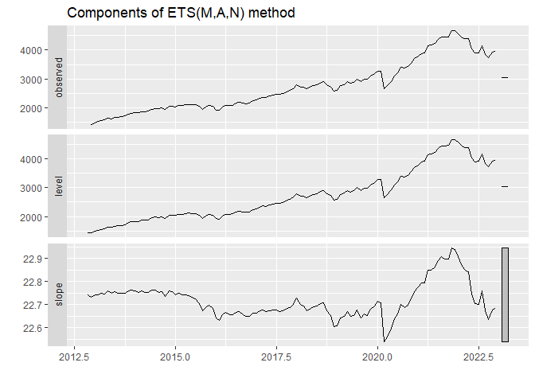<!-- -->

Holt’s Winter

``` r
ts_hw <- hw(ts_index, 3)
checkresiduals(ts_hw)
```

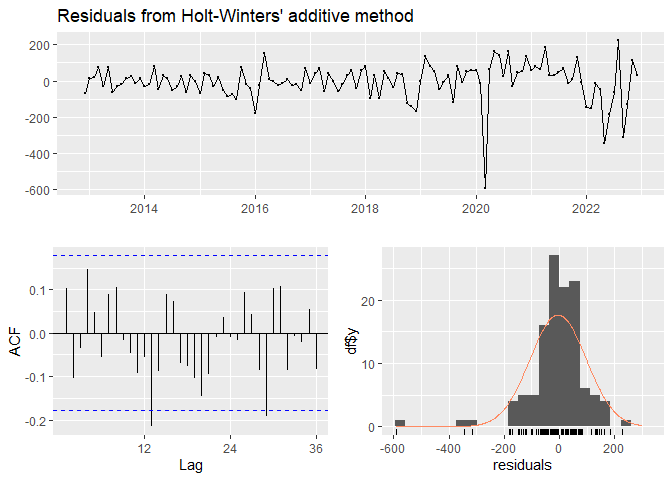<!-- -->

    ## 
    ##  Ljung-Box test
    ## 
    ## data:  Residuals from Holt-Winters' additive method
    ## Q* = 27.845, df = 8, p-value = 0.0005047
    ## 
    ## Model df: 16.   Total lags used: 24

``` r
ts_hw
```

    ##          Point Forecast    Lo 80    Hi 80    Lo 95    Hi 95
    ## Jan 2023       4003.685 3864.359 4143.010 3790.604 4216.765
    ## Feb 2023       4015.130 3818.102 4212.157 3713.801 4316.458
    ## Mar 2023       3981.235 3739.919 4222.551 3612.174 4350.296

``` r
ts_hw$model
```

    ## Holt-Winters' additive method 
    ## 
    ## Call:
    ##  hw(y = ts_index, h = 3) 
    ## 
    ##   Smoothing parameters:
    ##     alpha = 0.9998 
    ##     beta  = 1e-04 
    ##     gamma = 2e-04 
    ## 
    ##   Initial states:
    ##     l = 1447.7419 
    ##     b = 25.2859 
    ##     s = 30.576 -20.4434 -1.2396 18.5111 23.4773 -29.0239
    ##            -45.2179 -14.8512 -37.2671 21.8336 35.644 18.0011
    ## 
    ##   sigma:  108.7164
    ## 
    ##      AIC     AICc      BIC 
    ## 1731.805 1737.747 1779.333

``` r
round(accuracy(ts_hw), 3)
```

    ##                  ME    RMSE    MAE    MPE  MAPE  MASE  ACF1
    ## Training set -4.633 101.274 67.294 -0.248 2.462 0.183 0.103

``` r
autoplot(ts_hw)
```

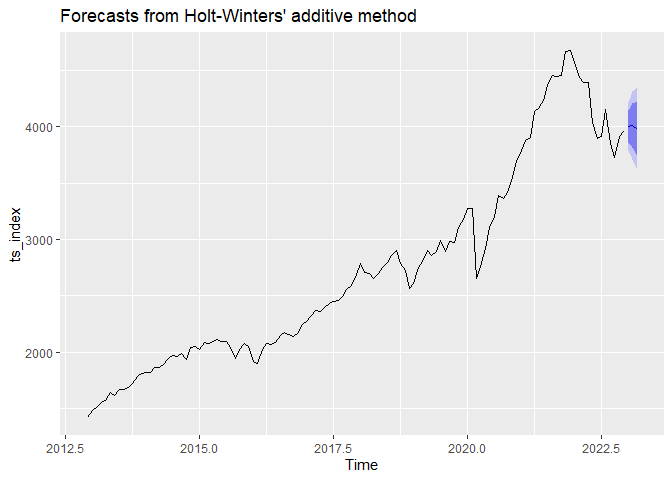<!-- -->

ARIMA

``` r
plot(ts_index)
```

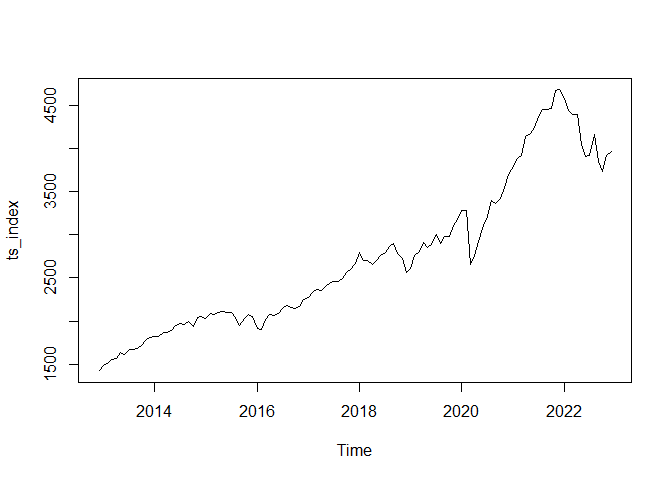<!-- --> \#
Check the order of differencing required

``` r
ndiffs(ts_index)
```

    ## [1] 1

# Plot the differenced Time Series

``` r
dts_index <- diff(ts_index)
plot(dts_index)
```

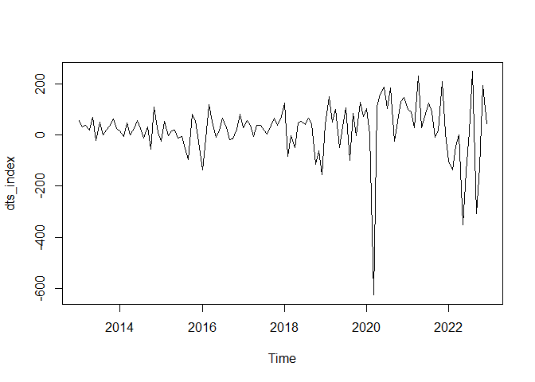<!-- --> \#
Assess the stationarity of the time series

``` r
adf.test(dts_index)
```

    ## Warning in adf.test(dts_index): p-value smaller than printed p-value

    ## 
    ##  Augmented Dickey-Fuller Test
    ## 
    ## data:  dts_index
    ## Dickey-Fuller = -4.1988, Lag order = 4, p-value = 0.01
    ## alternative hypothesis: stationary

``` r
acf(dts_index)
```

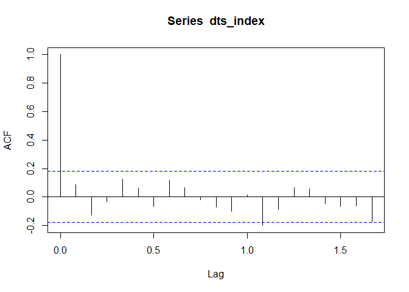<!-- -->

``` r
pacf(dts_index)
```

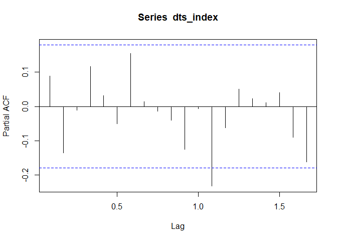<!-- -->

``` r
#Fitting an ARIMA model
fit <- arima(ts_index, order=c(0,1,1))
checkresiduals(fit)
```

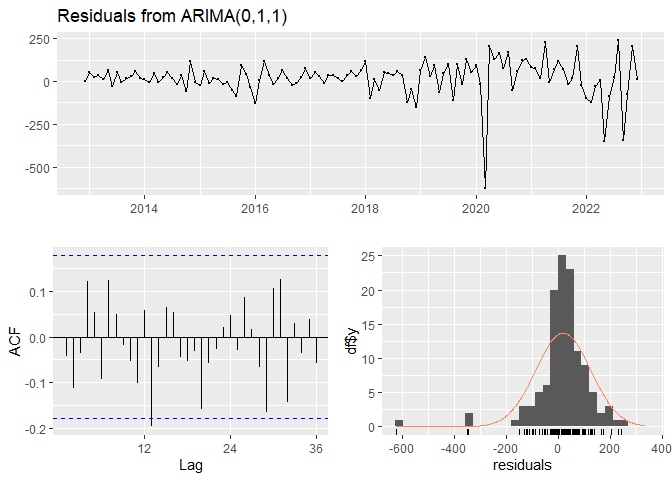<!-- -->

    ## 
    ##  Ljung-Box test
    ## 
    ## data:  Residuals from ARIMA(0,1,1)
    ## Q* = 22.587, df = 23, p-value = 0.4851
    ## 
    ## Model df: 1.   Total lags used: 24

``` r
fit
```

    ## 
    ## Call:
    ## arima(x = ts_index, order = c(0, 1, 1))
    ## 
    ## Coefficients:
    ##          ma1
    ##       0.1488
    ## s.e.  0.0972
    ## 
    ## sigma^2 estimated as 11397:  log likelihood = -730.75,  aic = 1465.5

# Auto Arima

``` r
auto_arima <- auto.arima(ts_index)
checkresiduals(auto_arima)
```

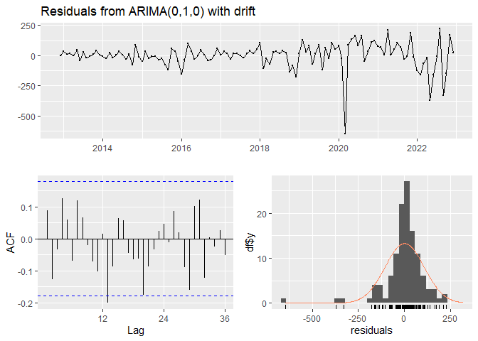<!-- -->

    ## 
    ##  Ljung-Box test
    ## 
    ## data:  Residuals from ARIMA(0,1,0) with drift
    ## Q* = 26.204, df = 24, p-value = 0.3429
    ## 
    ## Model df: 0.   Total lags used: 24

``` r
auto_arima
```

    ## Series: ts_index 
    ## ARIMA(0,1,0) with drift 
    ## 
    ## Coefficients:
    ##         drift
    ##       21.1418
    ## s.e.   9.6462
    ## 
    ## sigma^2 = 11260:  log likelihood = -729.51
    ## AIC=1463.02   AICc=1463.12   BIC=1468.59

``` r
round(accuracy(auto_arima), 3)
```

    ##                 ME    RMSE    MAE    MPE  MAPE  MASE  ACF1
    ## Training set 0.012 105.231 65.096 -0.057 2.272 0.177 0.089
