S&P500 Time Series Analysis
================

## Installing Important Packages

``` r
install.packages("dplyr")
install.packages("ggplot2")
install.packages("ggfortify")
install.packages("zoo")
install.packages("TSstudio")
install.packages("forecast")
install.packages("tseries")
```

## Importing the packages

``` r
library(dplyr)
library(ggplot2)
library(ggfortify)
library(TSstudio)
library(forecast)
library(tseries)
```

## Importing S&P500 Index Dataset

``` r
index <- read.csv("./data/sp500_index.csv")
head(index, 20)
```

    ##          Date  S.P500
    ## 1  2012-12-20 1443.69
    ## 2  2012-12-21 1430.15
    ## 3  2012-12-24 1426.66
    ## 4  2012-12-26 1419.83
    ## 5  2012-12-27 1418.10
    ## 6  2012-12-28 1402.43
    ## 7  2012-12-31 1426.19
    ## 8  2013-01-02 1462.42
    ## 9  2013-01-03 1459.37
    ## 10 2013-01-04 1466.47
    ## 11 2013-01-07 1461.89
    ## 12 2013-01-08 1457.15
    ## 13 2013-01-09 1461.02
    ## 14 2013-01-10 1472.12
    ## 15 2013-01-11 1472.05
    ## 16 2013-01-14 1470.68
    ## 17 2013-01-15 1472.34
    ## 18 2013-01-16 1472.63
    ## 19 2013-01-17 1480.94
    ## 20 2013-01-18 1485.98

## Checking the datatypes of all columns

``` r
print(sapply(index, class))
```

    ##        Date      S.P500 
    ## "character"   "numeric"

## Transforming the “Date” column from charater to Date

``` r
transformed_index <- transform(index, Date = as.Date(Date))
```

## Checking the Datatypes after transformation

``` r
print(sapply(transformed_index, class))
```

    ##      Date    S.P500 
    ##    "Date" "numeric"

## Formatting the “Date” column to Year-month format inorder to group the index values

``` r
transformed_index$Yr_Month <- format(as.Date(transformed_index$Date), "%Y-%m")
```

``` r
print(sapply(transformed_index, class))
```

    ##        Date      S.P500    Yr_Month 
    ##      "Date"   "numeric" "character"

``` r
head(transformed_index, 20)
```

    ##          Date  S.P500 Yr_Month
    ## 1  2012-12-20 1443.69  2012-12
    ## 2  2012-12-21 1430.15  2012-12
    ## 3  2012-12-24 1426.66  2012-12
    ## 4  2012-12-26 1419.83  2012-12
    ## 5  2012-12-27 1418.10  2012-12
    ## 6  2012-12-28 1402.43  2012-12
    ## 7  2012-12-31 1426.19  2012-12
    ## 8  2013-01-02 1462.42  2013-01
    ## 9  2013-01-03 1459.37  2013-01
    ## 10 2013-01-04 1466.47  2013-01
    ## 11 2013-01-07 1461.89  2013-01
    ## 12 2013-01-08 1457.15  2013-01
    ## 13 2013-01-09 1461.02  2013-01
    ## 14 2013-01-10 1472.12  2013-01
    ## 15 2013-01-11 1472.05  2013-01
    ## 16 2013-01-14 1470.68  2013-01
    ## 17 2013-01-15 1472.34  2013-01
    ## 18 2013-01-16 1472.63  2013-01
    ## 19 2013-01-17 1480.94  2013-01
    ## 20 2013-01-18 1485.98  2013-01

## Averaging the index values for each month and creating a new DataFrame.

``` r
avg_index <- transformed_index %>% group_by(Yr_Month) %>% summarise(average_value = mean(S.P500))
```

``` r
head(avg_index, 20)
```

    ## # A tibble: 20 × 2
    ##    Yr_Month average_value
    ##    <chr>            <dbl>
    ##  1 2012-12          1424.
    ##  2 2013-01          1480.
    ##  3 2013-02          1512.
    ##  4 2013-03          1551.
    ##  5 2013-04          1571.
    ##  6 2013-05          1640.
    ##  7 2013-06          1619.
    ##  8 2013-07          1669.
    ##  9 2013-08          1670.
    ## 10 2013-09          1687.
    ## 11 2013-10          1720.
    ## 12 2013-11          1784.
    ## 13 2013-12          1808.
    ## 14 2014-01          1822.
    ## 15 2014-02          1817.
    ## 16 2014-03          1864.
    ## 17 2014-04          1864.
    ## 18 2014-05          1890.
    ## 19 2014-06          1947.
    ## 20 2014-07          1973.

## Extracting the index values into a new list

``` r
index_values <- avg_index[[2]]
```

## Plotting the index values

``` r
plot(index_values)
```

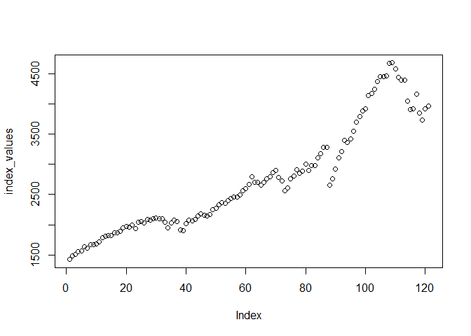<!-- -->

## Creating a Time Series Object from the index values.

``` r
ts_index <- ts(index_values, start=c(2012, 12), end = c(2022, 12), frequency=12)
```

``` r
ts_index
```

    ##           Jan      Feb      Mar      Apr      May      Jun      Jul      Aug
    ## 2012                                                                        
    ## 2013 1480.395 1512.312 1550.829 1570.702 1639.843 1618.773 1668.675 1670.094
    ## 2014 1822.357 1817.035 1863.523 1864.263 1889.767 1947.088 1973.100 1961.532
    ## 2015 2028.178 2082.196 2079.990 2094.863 2111.943 2099.284 2094.144 2039.866
    ## 2016 1918.598 1904.418 2021.954 2075.535 2065.551 2083.891 2148.902 2177.482
    ## 2017 2275.116 2329.911 2366.822 2359.309 2395.346 2433.985 2454.102 2456.223
    ## 2018 2789.804 2705.155 2702.774 2653.625 2701.494 2754.353 2793.643 2857.820
    ## 2019 2607.390 2754.864 2803.984 2903.800 2854.706 2890.166 2996.114 2897.498
    ## 2020 3278.203 3277.314 2652.394 2761.975 2919.615 3104.661 3207.619 3391.710
    ## 2021 3793.748 3883.432 3910.508 4141.176 4167.850 4238.490 4363.713 4454.206
    ## 2022 4573.815 4435.981 4391.265 4391.296 4040.360 3898.947 3911.729 4158.563
    ##           Sep      Oct      Nov      Dec
    ## 2012                            1423.864
    ## 2013 1687.174 1720.027 1783.541 1807.775
    ## 2014 1993.226 1937.274 2044.572 2054.266
    ## 2015 1944.402 2024.813 2080.617 2054.080
    ## 2016 2157.691 2143.021 2164.986 2246.629
    ## 2017 2492.841 2556.997 2593.606 2664.340
    ## 2018 2901.501 2785.465 2723.230 2567.307
    ## 2019 2982.156 2977.675 3104.905 3176.750
    ## 2020 3365.517 3418.701 3548.992 3695.310
    ## 2021 4445.543 4460.707 4667.387 4674.773
    ## 2022 3850.520 3726.051 3917.489 3960.883

## Plotting the Time Series Object.

``` r
plot(ts_index)
```

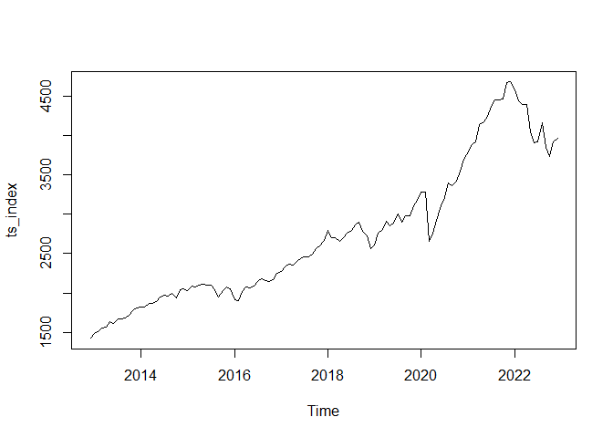<!-- -->

``` r
autoplot(ts_index)
```

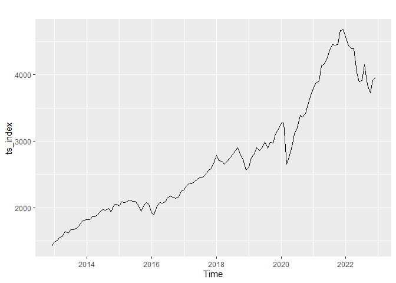<!-- -->

``` r
ts_info(ts_index)
```

    ##  The ts_index series is a ts object with 1 variable and 121 observations
    ##  Frequency: 12 
    ##  Start time: 2012 12 
    ##  End time: 2022 12

## Subsetting the ts object with window function

``` r
ts_index.subset <- window(ts_index, start=c(2017, 5), end=c(2020, 6))
ts_index.subset
```

    ##           Jan      Feb      Mar      Apr      May      Jun      Jul      Aug
    ## 2017                                     2395.346 2433.985 2454.102 2456.223
    ## 2018 2789.804 2705.155 2702.774 2653.625 2701.494 2754.353 2793.643 2857.820
    ## 2019 2607.390 2754.864 2803.984 2903.800 2854.706 2890.166 2996.114 2897.498
    ## 2020 3278.203 3277.314 2652.394 2761.975 2919.615 3104.661                  
    ##           Sep      Oct      Nov      Dec
    ## 2017 2492.841 2556.997 2593.606 2664.340
    ## 2018 2901.501 2785.465 2723.230 2567.307
    ## 2019 2982.156 2977.675 3104.905 3176.750
    ## 2020

``` r
autoplot(ts_index.subset)
```

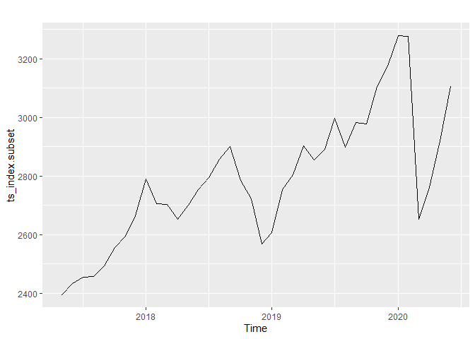<!-- -->

## Moving Average Function

``` r
plot(ts_index, main="Raw Time Series")
```

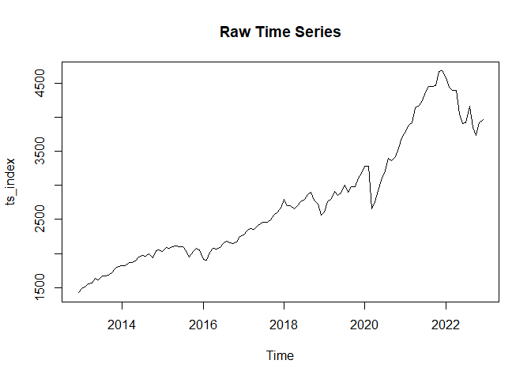<!-- -->

``` r
ma(ts_index,order=3)
```

    ##           Jan      Feb      Mar      Apr      May      Jun      Jul      Aug
    ## 2012                                                                        
    ## 2013 1472.190 1514.512 1544.614 1587.125 1609.773 1642.430 1652.514 1675.314
    ## 2014 1815.722 1834.305 1848.274 1872.518 1900.373 1936.652 1960.573 1975.953
    ## 2015 2054.880 2063.455 2085.683 2095.599 2102.030 2101.790 2077.764 2026.137
    ## 2016 1959.032 1948.323 2000.636 2054.347 2074.993 2099.448 2136.759 2161.358
    ## 2017 2283.885 2323.950 2352.014 2373.826 2396.214 2427.811 2448.104 2467.722
    ## 2018 2719.767 2732.578 2687.185 2685.964 2703.157 2749.830 2801.939 2850.988
    ## 2019 2643.187 2722.079 2820.883 2854.163 2882.891 2913.662 2927.926 2958.589
    ## 2020 3244.089 3069.304 2897.228 2777.995 2928.750 3077.298 3234.663 3321.615
    ## 2021 3790.830 3862.563 3978.372 4073.178 4182.505 4256.684 4352.136 4421.154
    ## 2022 4561.523 4467.020 4406.181 4274.307 4110.201 3950.345 3989.746 3973.604
    ##           Sep      Oct      Nov      Dec
    ## 2012                                  NA
    ## 2013 1692.431 1730.247 1770.448 1804.558
    ## 2014 1964.011 1991.691 2012.038 2042.339
    ## 2015 2003.027 2016.611 2053.170 2017.765
    ## 2016 2159.398 2155.233 2184.879 2228.910
    ## 2017 2502.020 2547.815 2604.981 2682.583
    ## 2018 2848.262 2803.398 2692.001 2632.642
    ## 2019 2952.443 3021.579 3086.443 3186.619
    ## 2020 3391.976 3444.404 3554.335 3679.350
    ## 2021 4453.486 4524.546 4600.956 4638.658
    ## 2022 3911.711 3831.353 3868.141       NA

``` r
plot(ma(ts_index,order=3))
```

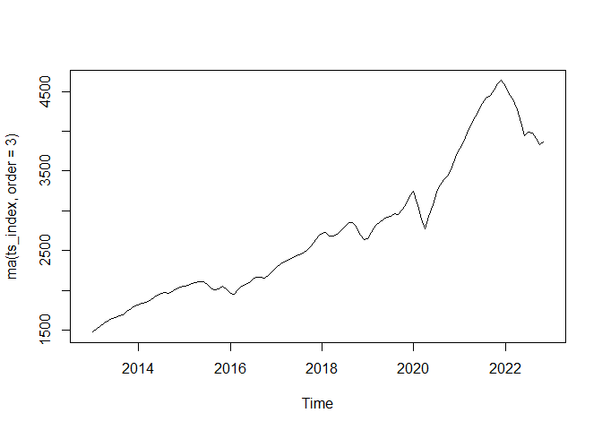<!-- -->

``` r
ma(ts_index,order=5)
```

    ##           Jan      Feb      Mar      Apr      May      Jun      Jul      Aug
    ## 2012                                                                        
    ## 2013       NA 1507.620 1550.816 1578.492 1609.764 1633.617 1656.912 1672.948
    ## 2014 1818.846 1834.991 1851.389 1876.335 1907.548 1927.150 1952.943 1962.444
    ## 2015 2057.841 2067.899 2079.434 2093.655 2096.045 2088.020 2057.928 2040.502
    ## 2016 1995.933 1994.917 1997.211 2030.270 2079.167 2110.272 2126.703 2142.197
    ## 2017 2276.693 2315.557 2345.301 2377.075 2401.913 2419.793 2446.500 2478.830
    ## 2018 2691.136 2703.140 2710.570 2703.480 2721.178 2752.187 2801.762 2818.556
    ## 2019 2691.355 2727.469 2784.949 2841.504 2889.754 2908.457 2924.128 2948.722
    ## 2020 3097.913 3029.327 2977.900 2943.192 2929.253 3077.116 3197.824 3297.642
    ## 2021 3766.398 3884.835 3979.343 4068.291 4164.347 4273.087 4333.960 4392.532
    ## 2022 4548.644 4493.426 4366.543 4231.570 4126.719 4080.179 3972.024 3909.162
    ##           Sep      Oct      Nov      Dec
    ## 2012                                  NA
    ## 2013 1705.902 1733.722 1764.175 1790.147
    ## 2014 1981.941 1998.174 2011.504 2029.297
    ## 2015 2036.768 2028.755 2004.502 1996.505
    ## 2016 2158.416 2177.962 2197.489 2231.932
    ## 2017 2510.754 2552.802 2619.518 2661.981
    ## 2018 2812.332 2767.065 2716.978 2687.651
    ## 2019 2991.670 3027.797 3103.938 3162.969
    ## 2020 3386.508 3484.046 3564.454 3668.037
    ## 2021 4478.311 4540.523 4564.445 4562.533
    ## 2022 3912.871 3922.701       NA       NA

``` r
plot(ma(ts_index,5))
```

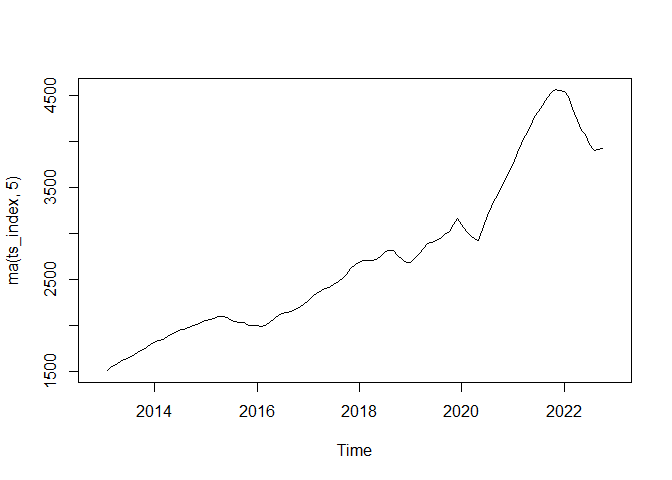<!-- -->

``` r
autoplot(ts_index)+
  autolayer(ma(ts_index,3))+
  autolayer(ma(ts_index,5))+
  autolayer(ma(ts_index,7))
```

    ## Warning: Removed 2 rows containing missing values (`geom_line()`).

    ## Warning: Removed 4 rows containing missing values (`geom_line()`).

    ## Warning: Removed 6 rows containing missing values (`geom_line()`).

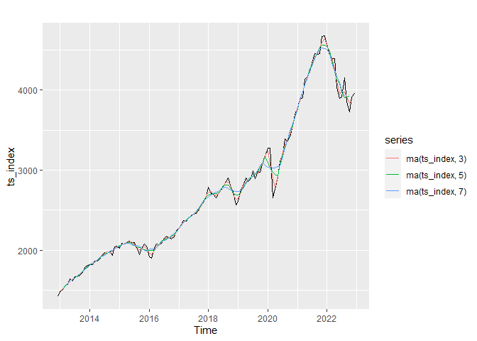<!-- -->

``` r
ggtsdisplay(ts_index)
```

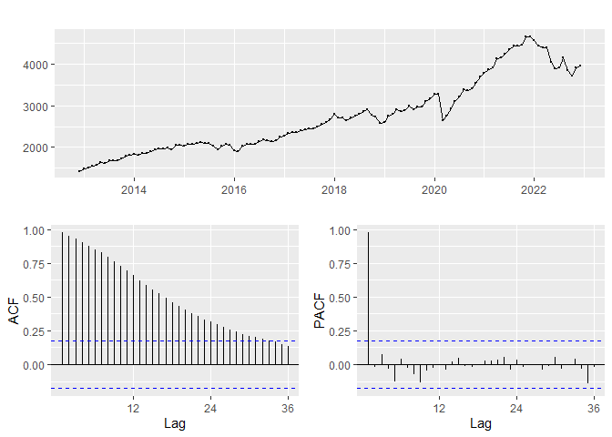<!-- -->

# Seasonal Decomposition of the Time Series

``` r
plot(ts_index)
```

<!-- -->

``` r
monthplot(ts_index) 
```

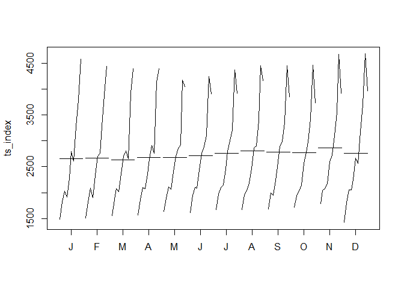<!-- -->

``` r
seasonplot(ts_index)
```

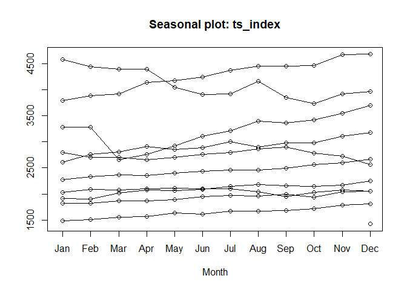<!-- -->

## Seasonal Decomposition using Multiplicative approach

``` r
fit.decmult<-decompose(ts_index,type = "multiplicative")
fit.decmult
```

    ## $x
    ##           Jan      Feb      Mar      Apr      May      Jun      Jul      Aug
    ## 2012                                                                        
    ## 2013 1480.395 1512.312 1550.829 1570.702 1639.843 1618.773 1668.675 1670.094
    ## 2014 1822.357 1817.035 1863.523 1864.263 1889.767 1947.088 1973.100 1961.532
    ## 2015 2028.178 2082.196 2079.990 2094.863 2111.943 2099.284 2094.144 2039.866
    ## 2016 1918.598 1904.418 2021.954 2075.535 2065.551 2083.891 2148.902 2177.482
    ## 2017 2275.116 2329.911 2366.822 2359.309 2395.346 2433.985 2454.102 2456.223
    ## 2018 2789.804 2705.155 2702.774 2653.625 2701.494 2754.353 2793.643 2857.820
    ## 2019 2607.390 2754.864 2803.984 2903.800 2854.706 2890.166 2996.114 2897.498
    ## 2020 3278.203 3277.314 2652.394 2761.975 2919.615 3104.661 3207.619 3391.710
    ## 2021 3793.748 3883.432 3910.508 4141.176 4167.850 4238.490 4363.713 4454.206
    ## 2022 4573.815 4435.981 4391.265 4391.296 4040.360 3898.947 3911.729 4158.563
    ##           Sep      Oct      Nov      Dec
    ## 2012                            1423.864
    ## 2013 1687.174 1720.027 1783.541 1807.775
    ## 2014 1993.226 1937.274 2044.572 2054.266
    ## 2015 1944.402 2024.813 2080.617 2054.080
    ## 2016 2157.691 2143.021 2164.986 2246.629
    ## 2017 2492.841 2556.997 2593.606 2664.340
    ## 2018 2901.501 2785.465 2723.230 2567.307
    ## 2019 2982.156 2977.675 3104.905 3176.750
    ## 2020 3365.517 3418.701 3548.992 3695.310
    ## 2021 4445.543 4460.707 4667.387 4674.773
    ## 2022 3850.520 3726.051 3917.489 3960.883
    ## 
    ## $seasonal
    ##            Jan       Feb       Mar       Apr       May       Jun       Jul
    ## 2012                                                                      
    ## 2013 1.0068101 1.0043504 0.9860319 0.9944620 0.9880054 0.9942090 1.0105207
    ## 2014 1.0068101 1.0043504 0.9860319 0.9944620 0.9880054 0.9942090 1.0105207
    ## 2015 1.0068101 1.0043504 0.9860319 0.9944620 0.9880054 0.9942090 1.0105207
    ## 2016 1.0068101 1.0043504 0.9860319 0.9944620 0.9880054 0.9942090 1.0105207
    ## 2017 1.0068101 1.0043504 0.9860319 0.9944620 0.9880054 0.9942090 1.0105207
    ## 2018 1.0068101 1.0043504 0.9860319 0.9944620 0.9880054 0.9942090 1.0105207
    ## 2019 1.0068101 1.0043504 0.9860319 0.9944620 0.9880054 0.9942090 1.0105207
    ## 2020 1.0068101 1.0043504 0.9860319 0.9944620 0.9880054 0.9942090 1.0105207
    ## 2021 1.0068101 1.0043504 0.9860319 0.9944620 0.9880054 0.9942090 1.0105207
    ## 2022 1.0068101 1.0043504 0.9860319 0.9944620 0.9880054 0.9942090 1.0105207
    ##            Aug       Sep       Oct       Nov       Dec
    ## 2012                                         1.0104316
    ## 2013 1.0057936 0.9981109 0.9914059 1.0098683 1.0104316
    ## 2014 1.0057936 0.9981109 0.9914059 1.0098683 1.0104316
    ## 2015 1.0057936 0.9981109 0.9914059 1.0098683 1.0104316
    ## 2016 1.0057936 0.9981109 0.9914059 1.0098683 1.0104316
    ## 2017 1.0057936 0.9981109 0.9914059 1.0098683 1.0104316
    ## 2018 1.0057936 0.9981109 0.9914059 1.0098683 1.0104316
    ## 2019 1.0057936 0.9981109 0.9914059 1.0098683 1.0104316
    ## 2020 1.0057936 0.9981109 0.9914059 1.0098683 1.0104316
    ## 2021 1.0057936 0.9981109 0.9914059 1.0098683 1.0104316
    ## 2022 1.0057936 0.9981109 0.9914059 1.0098683 1.0104316
    ## 
    ## $trend
    ##           Jan      Feb      Mar      Apr      May      Jun      Jul      Aug
    ## 2012                                                                        
    ## 2013       NA       NA       NA       NA       NA 1626.515 1656.760 1683.705
    ## 2014 1807.794 1832.622 1857.517 1879.321 1899.250 1920.397 1939.243 1958.867
    ## 2015 2043.412 2051.720 2052.949 2054.562 2059.712 2061.206 2056.632 2044.659
    ## 2016 2027.937 2035.953 2050.574 2064.386 2072.827 2084.365 2107.243 2139.827
    ## 2017 2279.317 2303.648 2329.226 2360.440 2395.548 2430.812 2469.662 2506.742
    ## 2018 2641.257 2672.138 2705.899 2732.446 2747.366 2748.724 2737.080 2731.551
    ## 2019 2795.426 2805.515 2810.529 2821.899 2845.811 2887.107 2940.451 2990.170
    ## 2020 3019.584 3048.989 3085.555 3119.904 3156.784 3196.894 3239.982 3286.718
    ## 2021 3778.425 3870.866 3960.138 4048.556 4138.573 4225.983 4299.297 4354.823
    ## 2022 4381.000 4349.849 4312.738 4257.335 4195.478 4134.487       NA       NA
    ##           Sep      Oct      Nov      Dec
    ## 2012                                  NA
    ## 2013 1709.431 1734.692 1757.337 1781.430
    ## 2014 1978.935 1997.563 2016.428 2032.027
    ## 2015 2034.833 2031.610 2028.871 2026.297
    ## 2016 2171.925 2198.119 2223.684 2252.013
    ## 2017 2536.376 2562.637 2587.656 2613.761
    ## 2018 2737.839 2752.480 2769.288 2781.331
    ## 2019 3005.623 2993.397 2990.192 3001.834
    ## 2020 3364.394 3474.283 3583.759 3683.012
    ## 2021 4397.877 4428.330 4433.440 4413.980
    ## 2022       NA       NA       NA       NA
    ## 
    ## $random
    ##            Jan       Feb       Mar       Apr       May       Jun       Jul
    ## 2012                                                                      
    ## 2013        NA        NA        NA        NA        NA 1.0010366 0.9967060
    ## 2014 1.0012369 0.9871999 1.0174452 0.9975117 1.0070868 1.0198044 1.0068660
    ## 2015 0.9858313 1.0104580 1.0275244 1.0252932 1.0378069 1.0244059 1.0076382
    ## 2016 0.9396841 0.9313424 1.0000113 1.0109995 1.0085874 1.0055960 1.0091523
    ## 2017 0.9914055 1.0070196 1.0305355 1.0050873 1.0120547 1.0071378 0.9833542
    ## 2018 1.0490965 1.0079711 1.0129948 0.9765622 0.9952407 1.0078845 1.0100391
    ## 2019 0.9264254 0.9776925 1.0118041 1.0347540 1.0153039 1.0068904 1.0083217
    ## 2020 1.0783037 1.0702295 0.8717938 0.8902057 0.9360982 0.9768057 0.9797042
    ## 2021 0.9972640 0.9989006 1.0014561 1.0285736 1.0193002 1.0088013 1.0044157
    ## 2022 1.0369500 1.0153837 1.0326321 1.0372101 0.9747186 0.9485232        NA
    ##            Aug       Sep       Oct       Nov       Dec
    ## 2012                                                NA
    ## 2013 0.9862021 0.9888477 1.0001413 1.0049937 1.0043122
    ## 2014 0.9955923 1.0091280 0.9782259 1.0040489 1.0005074
    ## 2015 0.9919092 0.9573671 1.0052939 1.0154832 1.0032455
    ## 2016 1.0117357 0.9953265 0.9833854 0.9640891 0.9873101
    ## 2017 0.9742024 0.9846960 1.0064488 0.9925048 1.0088276
    ## 2018 1.0401998 1.0617833 1.0207560 0.9737587 0.9135205
    ## 2019 0.9634260 0.9940702 1.0033708 1.0282160 1.0473440
    ## 2020 1.0260001 1.0022269 0.9925320 0.9806218 0.9929808
    ## 2021 1.0169298 1.0127516 1.0160432 1.0424811 1.0481494
    ## 2022        NA        NA        NA        NA        NA
    ## 
    ## $figure
    ##  [1] 1.0104316 1.0068101 1.0043504 0.9860319 0.9944620 0.9880054 0.9942090
    ##  [8] 1.0105207 1.0057936 0.9981109 0.9914059 1.0098683
    ## 
    ## $type
    ## [1] "multiplicative"
    ## 
    ## attr(,"class")
    ## [1] "decomposed.ts"

``` r
plot(fit.decmult)
```

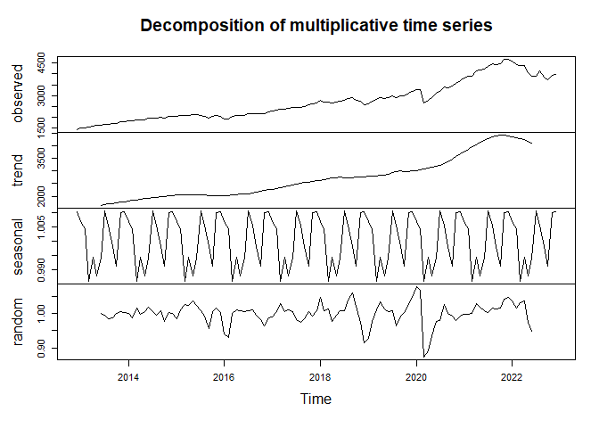<!-- -->

## Seasonal Decomposition using Additive Approach

``` r
fit.decadd<-decompose(ts_index, type = "additive")
fit.decadd
```

    ## $x
    ##           Jan      Feb      Mar      Apr      May      Jun      Jul      Aug
    ## 2012                                                                        
    ## 2013 1480.395 1512.312 1550.829 1570.702 1639.843 1618.773 1668.675 1670.094
    ## 2014 1822.357 1817.035 1863.523 1864.263 1889.767 1947.088 1973.100 1961.532
    ## 2015 2028.178 2082.196 2079.990 2094.863 2111.943 2099.284 2094.144 2039.866
    ## 2016 1918.598 1904.418 2021.954 2075.535 2065.551 2083.891 2148.902 2177.482
    ## 2017 2275.116 2329.911 2366.822 2359.309 2395.346 2433.985 2454.102 2456.223
    ## 2018 2789.804 2705.155 2702.774 2653.625 2701.494 2754.353 2793.643 2857.820
    ## 2019 2607.390 2754.864 2803.984 2903.800 2854.706 2890.166 2996.114 2897.498
    ## 2020 3278.203 3277.314 2652.394 2761.975 2919.615 3104.661 3207.619 3391.710
    ## 2021 3793.748 3883.432 3910.508 4141.176 4167.850 4238.490 4363.713 4454.206
    ## 2022 4573.815 4435.981 4391.265 4391.296 4040.360 3898.947 3911.729 4158.563
    ##           Sep      Oct      Nov      Dec
    ## 2012                            1423.864
    ## 2013 1687.174 1720.027 1783.541 1807.775
    ## 2014 1993.226 1937.274 2044.572 2054.266
    ## 2015 1944.402 2024.813 2080.617 2054.080
    ## 2016 2157.691 2143.021 2164.986 2246.629
    ## 2017 2492.841 2556.997 2593.606 2664.340
    ## 2018 2901.501 2785.465 2723.230 2567.307
    ## 2019 2982.156 2977.675 3104.905 3176.750
    ## 2020 3365.517 3418.701 3548.992 3695.310
    ## 2021 4445.543 4460.707 4667.387 4674.773
    ## 2022 3850.520 3726.051 3917.489 3960.883
    ## 
    ## $seasonal
    ##             Jan        Feb        Mar        Apr        May        Jun
    ## 2012                                                                  
    ## 2013  30.113684  19.663618 -45.993800 -15.004359 -45.194454 -29.355804
    ## 2014  30.113684  19.663618 -45.993800 -15.004359 -45.194454 -29.355804
    ## 2015  30.113684  19.663618 -45.993800 -15.004359 -45.194454 -29.355804
    ## 2016  30.113684  19.663618 -45.993800 -15.004359 -45.194454 -29.355804
    ## 2017  30.113684  19.663618 -45.993800 -15.004359 -45.194454 -29.355804
    ## 2018  30.113684  19.663618 -45.993800 -15.004359 -45.194454 -29.355804
    ## 2019  30.113684  19.663618 -45.993800 -15.004359 -45.194454 -29.355804
    ## 2020  30.113684  19.663618 -45.993800 -15.004359 -45.194454 -29.355804
    ## 2021  30.113684  19.663618 -45.993800 -15.004359 -45.194454 -29.355804
    ## 2022  30.113684  19.663618 -45.993800 -15.004359 -45.194454 -29.355804
    ##             Jul        Aug        Sep        Oct        Nov        Dec
    ## 2012                                                         34.834629
    ## 2013  23.514256  18.592853  -1.024084 -21.162580  31.016042  34.834629
    ## 2014  23.514256  18.592853  -1.024084 -21.162580  31.016042  34.834629
    ## 2015  23.514256  18.592853  -1.024084 -21.162580  31.016042  34.834629
    ## 2016  23.514256  18.592853  -1.024084 -21.162580  31.016042  34.834629
    ## 2017  23.514256  18.592853  -1.024084 -21.162580  31.016042  34.834629
    ## 2018  23.514256  18.592853  -1.024084 -21.162580  31.016042  34.834629
    ## 2019  23.514256  18.592853  -1.024084 -21.162580  31.016042  34.834629
    ## 2020  23.514256  18.592853  -1.024084 -21.162580  31.016042  34.834629
    ## 2021  23.514256  18.592853  -1.024084 -21.162580  31.016042  34.834629
    ## 2022  23.514256  18.592853  -1.024084 -21.162580  31.016042  34.834629
    ## 
    ## $trend
    ##           Jan      Feb      Mar      Apr      May      Jun      Jul      Aug
    ## 2012                                                                        
    ## 2013       NA       NA       NA       NA       NA 1626.515 1656.760 1683.705
    ## 2014 1807.794 1832.622 1857.517 1879.321 1899.250 1920.397 1939.243 1958.867
    ## 2015 2043.412 2051.720 2052.949 2054.562 2059.712 2061.206 2056.632 2044.659
    ## 2016 2027.937 2035.953 2050.574 2064.386 2072.827 2084.365 2107.243 2139.827
    ## 2017 2279.317 2303.648 2329.226 2360.440 2395.548 2430.812 2469.662 2506.742
    ## 2018 2641.257 2672.138 2705.899 2732.446 2747.366 2748.724 2737.080 2731.551
    ## 2019 2795.426 2805.515 2810.529 2821.899 2845.811 2887.107 2940.451 2990.170
    ## 2020 3019.584 3048.989 3085.555 3119.904 3156.784 3196.894 3239.982 3286.718
    ## 2021 3778.425 3870.866 3960.138 4048.556 4138.573 4225.983 4299.297 4354.823
    ## 2022 4381.000 4349.849 4312.738 4257.335 4195.478 4134.487       NA       NA
    ##           Sep      Oct      Nov      Dec
    ## 2012                                  NA
    ## 2013 1709.431 1734.692 1757.337 1781.430
    ## 2014 1978.935 1997.563 2016.428 2032.027
    ## 2015 2034.833 2031.610 2028.871 2026.297
    ## 2016 2171.925 2198.119 2223.684 2252.013
    ## 2017 2536.376 2562.637 2587.656 2613.761
    ## 2018 2737.839 2752.480 2769.288 2781.331
    ## 2019 3005.623 2993.397 2990.192 3001.834
    ## 2020 3364.394 3474.283 3583.759 3683.012
    ## 2021 4397.877 4428.330 4433.440 4413.980
    ## 2022       NA       NA       NA       NA
    ## 
    ## $random
    ##                Jan           Feb           Mar           Apr           May
    ## 2012                                                                      
    ## 2013            NA            NA            NA            NA            NA
    ## 2014  -15.55122159  -35.25070297   51.99985520   -0.05377453   35.71184091
    ## 2015  -45.34747260   10.81246915   73.03494934   55.30480331   97.42625864
    ## 2016 -139.45313906 -151.19806590   17.37392018   26.15325930   37.91834167
    ## 2017  -34.31440264    6.59929897   83.58957665   13.87383621   44.99218633
    ## 2018  118.43303748   13.35379745   42.86905721  -63.81591560   -0.67789425
    ## 2019 -218.14960445  -70.31483032   39.44830278   96.90563885   54.08975055
    ## 2020  228.50487036  208.66140307 -387.16727299 -342.92456335 -191.97446281
    ## 2021  -14.79030653   -7.09781204   -3.63603106  107.62443842   74.47117826
    ## 2022  162.70170615   66.46790971  124.52110980  148.96574452 -109.92373218
    ##                Jun           Jul           Aug           Sep           Oct
    ## 2012                                                                      
    ## 2013   21.61303800  -11.59874980  -32.20435578  -21.23328454    6.49759239
    ## 2014   56.04690791   10.34285576  -15.92812308   15.31525846  -39.12586446
    ## 2015   67.43367974   13.99726257  -23.38553439  -89.40683863   14.36550356
    ## 2016   28.88182350   18.14458308   19.06240482  -13.21021820  -33.93515154
    ## 2017   32.52927170  -39.07371191  -69.11228788  -42.51057714   15.52305051
    ## 2018   34.98473204   33.04877096  107.67664498  164.68538345   54.14710459
    ## 2019   32.41464473   32.14826243 -111.26507452  -22.44281272    5.44052357
    ## 2020  -62.87755647  -55.87718613   86.39914883    2.14639693  -34.41855854
    ## 2021   41.86187023   40.90138017   80.79064415   48.69015952   53.53926705
    ## 2022 -206.18455903            NA            NA            NA            NA
    ##                Nov           Dec
    ## 2012                          NA
    ## 2013   -4.81178022   -8.48944273
    ## 2014   -2.87239142  -12.59556865
    ## 2015   20.72899388   -7.05217982
    ## 2016  -89.71439534  -40.21835899
    ## 2017  -25.06644277   15.74495920
    ## 2018  -77.07457001 -248.85803772
    ## 2019   83.69600311  140.08060692
    ## 2020  -65.78252205  -22.53623940
    ## 2021  202.93057194  225.95772833
    ## 2022            NA            NA
    ## 
    ## $figure
    ##  [1]  34.834629  30.113684  19.663618 -45.993800 -15.004359 -45.194454
    ##  [7] -29.355804  23.514256  18.592853  -1.024084 -21.162580  31.016042
    ## 
    ## $type
    ## [1] "additive"
    ## 
    ## attr(,"class")
    ## [1] "decomposed.ts"

``` r
plot(fit.decadd)
```

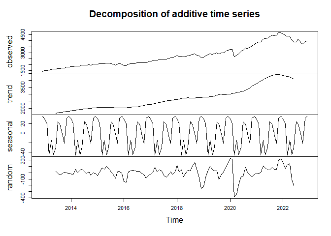<!-- -->

## Seasonal Decomposition using STL

``` r
lts_index <- log(ts_index)
plot(lts_index, ylab="log(ts_index)")
```

<!-- -->

``` r
fit.stl <- stl(lts_index, s.window="period")           
plot(fit.stl)
```

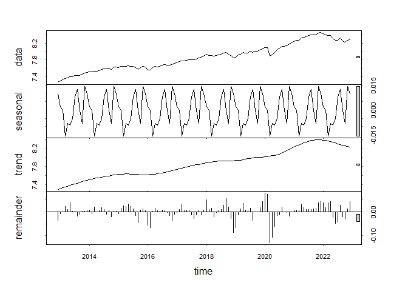<!-- -->

``` r
fit.stl$time.series                                 
```

    ##               seasonal    trend     remainder
    ## Dec 2012  0.0098398171 7.287143 -3.585322e-02
    ## Jan 2013  0.0017191505 7.304666 -6.320732e-03
    ## Feb 2013 -0.0001195311 7.322189 -6.746093e-04
    ## Mar 2013 -0.0155422949 7.339473  2.261447e-02
    ## Apr 2013 -0.0078996861 7.356757  1.042108e-02
    ## May 2013 -0.0092125887 7.374039  3.752880e-02
    ## Jun 2013 -0.0049705465 7.391322  3.071865e-03
    ## Jul 2013  0.0080202791 7.408498  3.267391e-03
    ## Aug 2013  0.0124348024 7.425673 -1.747328e-02
    ## Sep 2013 -0.0004527279 7.440828 -9.565668e-03
    ## Oct 2013 -0.0080819650 7.455983  2.193771e-03
    ## Nov 2013  0.0142652901 7.470299  1.791204e-03
    ## Dec 2013  0.0098398171 7.484616  5.396587e-03
    ## Jan 2014  0.0017191505 7.498753  7.413785e-03
    ## Feb 2014 -0.0001195311 7.512890 -7.809226e-03
    ## Mar 2014 -0.0155422949 7.525583  2.018317e-02
    ## Apr 2014 -0.0078996861 7.538277  2.441548e-04
    ## May 2014 -0.0092125887 7.549108  4.313153e-03
    ## Jun 2014 -0.0049705465 7.559940  1.912068e-02
    ## Jul 2014  0.0080202791 7.569789  9.552356e-03
    ## Aug 2014  0.0124348024 7.579637 -1.059101e-02
    ## Sep 2014 -0.0004527279 7.589014  8.948880e-03
    ## Oct 2014 -0.0080819650 7.598390 -2.127082e-02
    ## Nov 2014  0.0142652901 7.606767  1.911458e-03
    ## Dec 2014  0.0098398171 7.615144  2.690201e-03
    ## Jan 2015  0.0017191505 7.620809 -7.634531e-03
    ## Feb 2015 -0.0001195311 7.626473  1.482434e-02
    ## Mar 2015 -0.0155422949 7.628887  2.677348e-02
    ## Apr 2015 -0.0078996861 7.631301  2.384174e-02
    ## May 2015 -0.0092125887 7.631004  3.357270e-02
    ## Jun 2015 -0.0049705465 7.630706  2.361574e-02
    ## Jul 2015  0.0080202791 7.627003  1.187706e-02
    ## Aug 2015  0.0124348024 7.623299 -1.509436e-02
    ## Sep 2015 -0.0004527279 7.618939 -4.577606e-02
    ## Oct 2015 -0.0080819650 7.614578  6.736042e-03
    ## Nov 2015  0.0142652901 7.613119  1.303523e-02
    ## Dec 2015  0.0098398171 7.611660  6.083712e-03
    ## Jan 2016  0.0017191505 7.614586 -5.695539e-02
    ## Feb 2016 -0.0001195311 7.617513 -6.546125e-02
    ## Mar 2016 -0.0155422949 7.623439  3.923125e-03
    ## Apr 2016 -0.0078996861 7.629365  1.650907e-02
    ## May 2016 -0.0092125887 7.637237  5.127717e-03
    ## Jun 2016 -0.0049705465 7.645109  1.853484e-03
    ## Jul 2016  0.0080202791 7.656172  8.519950e-03
    ## Aug 2016  0.0124348024 7.667235  6.254928e-03
    ## Sep 2016 -0.0004527279 7.679815 -2.568219e-03
    ## Oct 2016 -0.0080819650 7.692395 -1.434122e-02
    ## Nov 2016  0.0142652901 7.704795 -3.889136e-02
    ## Dec 2016  0.0098398171 7.717195 -9.848915e-03
    ## Jan 2017  0.0017191505 7.729611 -1.543891e-03
    ## Feb 2017 -0.0001195311 7.742027  1.167783e-02
    ## Mar 2017 -0.0155422949 7.754953  2.989312e-02
    ## Apr 2017 -0.0078996861 7.767878  6.145494e-03
    ## May 2017 -0.0092125887 7.781589  8.906437e-03
    ## Jun 2017 -0.0049705465 7.795300  6.956134e-03
    ## Jul 2017  0.0080202791 7.808860 -1.136423e-02
    ## Aug 2017  0.0124348024 7.822421 -2.847568e-02
    ## Sep 2017 -0.0004527279 7.834649 -1.301845e-02
    ## Oct 2017 -0.0080819650 7.846878  7.792900e-03
    ## Nov 2017  0.0142652901 7.858213 -1.167370e-02
    ## Dec 2017  0.0098398171 7.869548  8.324457e-03
    ## Jan 2018  0.0017191505 7.880638  5.136923e-02
    ## Feb 2018 -0.0001195311 7.891729  1.130535e-02
    ## Mar 2018 -0.0155422949 7.901200  1.637660e-02
    ## Apr 2018 -0.0078996861 7.910670 -1.908865e-02
    ## May 2018 -0.0092125887 7.914304 -3.531409e-03
    ## Jun 2018 -0.0049705465 7.917938  7.970490e-03
    ## Jul 2018  0.0080202791 7.917426  9.655384e-03
    ## Aug 2018  0.0124348024 7.916915  2.846515e-02
    ## Sep 2018 -0.0004527279 7.918082  5.535396e-02
    ## Oct 2018 -0.0080819650 7.919250  2.100242e-02
    ## Nov 2018  0.0142652901 7.922863 -2.755442e-02
    ## Dec 2018  0.0098398171 7.926476 -8.570316e-02
    ## Jan 2019  0.0017191505 7.930471 -6.608483e-02
    ## Feb 2019 -0.0001195311 7.934465 -1.322214e-02
    ## Mar 2019 -0.0155422949 7.940727  1.361175e-02
    ## Apr 2019 -0.0078996861 7.946989  3.468625e-02
    ## May 2019 -0.0092125887 7.958414  7.522983e-03
    ## Jun 2019 -0.0049705465 7.969838  4.201280e-03
    ## Jul 2019  0.0080202791 7.982539  1.451182e-02
    ## Aug 2019  0.0124348024 7.995240 -3.607173e-02
    ## Sep 2019 -0.0004527279 8.000654  2.001885e-04
    ## Oct 2019 -0.0080819650 8.006069  9.112885e-04
    ## Nov 2019  0.0142652901 8.008071  1.840194e-02
    ## Dec 2019  0.0098398171 8.010073  4.370079e-02
    ## Jan 2020  0.0017191505 8.015163  7.816896e-02
    ## Feb 2020 -0.0001195311 8.020252  7.464718e-02
    ## Mar 2020 -0.0155422949 8.028933 -1.301725e-01
    ## Apr 2020 -0.0078996861 8.037613 -1.060122e-01
    ## May 2020 -0.0092125887 8.048921 -6.050147e-02
    ## Jun 2020 -0.0049705465 8.060229 -1.459860e-02
    ## Jul 2020  0.0080202791 8.077854 -1.259024e-02
    ## Aug 2020  0.0124348024 8.095479  2.117524e-02
    ## Sep 2020 -0.0004527279 8.121801 -1.193912e-05
    ## Oct 2020 -0.0080819650 8.148123 -3.025422e-03
    ## Nov 2020  0.0142652901 8.176977 -1.682370e-02
    ## Dec 2020  0.0098398171 8.205831 -8.515623e-04
    ## Jan 2021  0.0017191505 8.231732  7.658310e-03
    ## Feb 2021 -0.0001195311 8.257633  6.960853e-03
    ## Mar 2021 -0.0155422949 8.281208  5.757407e-03
    ## Apr 2021 -0.0078996861 8.304782  3.185305e-02
    ## May 2021 -0.0092125887 8.325666  1.870168e-02
    ## Jun 2021 -0.0049705465 8.346551  1.038179e-02
    ## Jul 2021  0.0080202791 8.362171  1.088760e-02
    ## Aug 2021  0.0124348024 8.377790  1.137905e-02
    ## Sep 2021 -0.0004527279 8.386411  1.369922e-02
    ## Oct 2021 -0.0080819650 8.395031  1.611311e-02
    ## Nov 2021  0.0142652901 8.394813  3.927673e-02
    ## Dec 2021  0.0098398171 8.394594  4.550230e-02
    ## Jan 2022  0.0017191505 8.387052  3.933212e-02
    ## Feb 2022 -0.0001195311 8.379510  1.811366e-02
    ## Mar 2022 -0.0155422949 8.365677  3.723789e-02
    ## Apr 2022 -0.0078996861 8.351844  4.343505e-02
    ## May 2022 -0.0092125887 8.337108 -2.380627e-02
    ## Jun 2022 -0.0049705465 8.322372 -4.893929e-02
    ## Jul 2022  0.0080202791 8.307262 -4.354788e-02
    ## Aug 2022  0.0124348024 8.292153  2.833666e-02
    ## Sep 2022 -0.0004527279 8.276796 -2.037976e-02
    ## Oct 2022 -0.0080819650 8.261439 -3.025259e-02
    ## Nov 2022  0.0142652901 8.246190  1.275116e-02
    ## Dec 2022  0.0098398171 8.230940  4.344202e-02

``` r
exp(fit.stl$time.series)
```

    ##           seasonal    trend remainder
    ## Dec 2012 1.0098884 1461.390 0.9647819
    ## Jan 2013 1.0017206 1487.223 0.9936992
    ## Feb 2013 0.9998805 1513.513 0.9993256
    ## Mar 2013 0.9845779 1539.900 1.0228721
    ## Apr 2013 0.9921314 1566.747 1.0104756
    ## May 2013 0.9908297 1594.060 1.0382419
    ## Jun 2013 0.9950418 1621.849 1.0030766
    ## Jul 2013 1.0080525 1649.946 1.0032727
    ## Aug 2013 1.0125124 1678.530 0.9826785
    ## Sep 2013 0.9995474 1704.161 0.9904799
    ## Oct 2013 0.9919506 1730.184 1.0021962
    ## Nov 2013 1.0143675 1755.132 1.0017928
    ## Dec 2013 1.0098884 1780.440 1.0054112
    ## Jan 2014 1.0017206 1805.789 1.0074413
    ## Feb 2014 0.9998805 1831.499 0.9922212
    ## Mar 2014 0.9845779 1854.895 1.0203882
    ## Apr 2014 0.9921314 1878.590 1.0002442
    ## May 2014 0.9908297 1899.049 1.0043225
    ## Jun 2014 0.9950418 1919.730 1.0193047
    ## Jul 2014 1.0080525 1938.730 1.0095981
    ## Aug 2014 1.0125124 1957.919 0.9894649
    ## Sep 2014 0.9995474 1976.363 1.0089890
    ## Oct 2014 0.9919506 1994.982 0.9789538
    ## Nov 2014 1.0143675 2011.764 1.0019133
    ## Dec 2014 1.0098884 2028.687 1.0026938
    ## Jan 2015 1.0017206 2040.212 0.9923945
    ## Feb 2015 0.9998805 2051.802 1.0149348
    ## Mar 2015 0.9845779 2056.760 1.0271351
    ## Apr 2015 0.9921314 2061.731 1.0241282
    ## May 2015 0.9908297 2061.118 1.0341426
    ## Jun 2015 0.9950418 2060.505 1.0238968
    ## Jul 2015 1.0080525 2052.888 1.0119479
    ## Aug 2015 1.0125124 2045.299 0.9850190
    ## Sep 2015 0.9995474 2036.400 0.9552559
    ## Oct 2015 0.9919506 2027.540 1.0067588
    ## Nov 2015 1.0143675 2024.583 1.0131206
    ## Dec 2015 1.0098884 2021.630 1.0061023
    ## Jan 2016 1.0017206 2027.556 0.9446362
    ## Feb 2016 0.9998805 2033.498 0.9366353
    ## Mar 2016 0.9845779 2045.585 1.0039308
    ## Apr 2016 0.9921314 2057.743 1.0166461
    ## May 2016 0.9908297 2074.006 1.0051409
    ## Jun 2016 0.9950418 2090.397 1.0018552
    ## Jul 2016 1.0080525 2113.651 1.0085563
    ## Aug 2016 1.0125124 2137.164 1.0062745
    ## Sep 2016 0.9995474 2164.219 0.9974351
    ## Oct 2016 0.9919506 2191.617 0.9857611
    ## Nov 2016 1.0143675 2218.963 0.9618552
    ## Dec 2016 1.0098884 2246.649 0.9901994
    ## Jan 2017 1.0017206 2274.717 0.9984573
    ## Feb 2017 0.9998805 2303.136 1.0117463
    ## Mar 2017 0.9845779 2333.099 1.0303444
    ## Apr 2017 0.9921314 2363.452 1.0061644
    ## May 2017 0.9908297 2396.079 1.0089462
    ## Jun 2017 0.9950418 2429.157 1.0069804
    ## Jul 2017 1.0080525 2462.323 0.9887001
    ## Aug 2017 1.0125124 2495.941 0.9719259
    ## Sep 2017 0.9995474 2526.650 0.9870659
    ## Oct 2017 0.9919506 2557.737 1.0078233
    ## Nov 2017 1.0143675 2586.893 0.9883942
    ## Dec 2017 1.0098884 2616.382 1.0083592
    ## Jan 2018 1.0017206 2645.560 1.0527115
    ## Feb 2018 0.9998805 2675.065 1.0113695
    ## Mar 2018 0.9845779 2700.520 1.0165114
    ## Apr 2018 0.9921314 2726.217 0.9810924
    ## May 2018 0.9908297 2736.142 0.9964748
    ## Jun 2018 0.9950418 2746.102 1.0080023
    ## Jul 2018 1.0080525 2744.698 1.0097021
    ## Aug 2018 1.0125124 2743.294 1.0288742
    ## Sep 2018 0.9995474 2746.498 1.0569147
    ## Oct 2018 0.9919506 2749.707 1.0212245
    ## Nov 2018 1.0143675 2759.660 0.9728217
    ## Dec 2018 1.0098884 2769.650 0.9178667
    ## Jan 2019 1.0017206 2780.735 0.9360515
    ## Feb 2019 0.9998805 2791.865 0.9868649
    ## Mar 2019 0.9845779 2809.402 1.0137048
    ## Apr 2019 0.9921314 2827.050 1.0352948
    ## May 2019 0.9908297 2859.533 1.0075514
    ## Jun 2019 0.9950418 2892.390 1.0042101
    ## Jul 2019 1.0080525 2929.360 1.0146176
    ## Aug 2019 1.0125124 2966.802 0.9645711
    ## Sep 2019 0.9995474 2982.909 1.0002002
    ## Oct 2019 0.9919506 2999.104 1.0009117
    ## Nov 2019 1.0143675 3005.115 1.0185723
    ## Dec 2019 1.0098884 3011.137 1.0446697
    ## Jan 2020 1.0017206 3026.501 1.0813053
    ## Feb 2020 0.9998805 3041.943 1.0775039
    ## Mar 2020 0.9845779 3068.465 0.8779440
    ## Apr 2020 0.9921314 3095.217 0.8994137
    ## May 2020 0.9908297 3130.416 0.9412924
    ## Jun 2020 0.9950418 3166.015 0.9855074
    ## Jul 2020 1.0080525 3222.311 0.9874887
    ## Aug 2020 1.0125124 3279.609 1.0214010
    ## Sep 2020 0.9995474 3367.081 0.9999881
    ## Oct 2020 0.9919506 3456.886 0.9969792
    ## Nov 2020 1.0143675 3558.084 0.9833170
    ## Dec 2020 1.0098884 3662.244 0.9991488
    ## Jan 2021 1.0017206 3758.339 1.0076877
    ## Feb 2021 0.9998805 3856.955 1.0069851
    ## Mar 2021 0.9845779 3948.960 1.0057740
    ## Apr 2021 0.9921314 4043.160 1.0323658
    ## May 2021 0.9908297 4128.487 1.0188777
    ## Jun 2021 0.9950418 4215.616 1.0104359
    ## Jul 2021 1.0080525 4281.979 1.0109471
    ## Aug 2021 1.0125124 4349.388 1.0114440
    ## Sep 2021 0.9995474 4387.044 1.0137935
    ## Oct 2021 0.9919506 4425.026 1.0162436
    ## Nov 2021 1.0143675 4424.058 1.0400583
    ## Dec 2021 1.0098884 4423.089 1.0465534
    ## Jan 2022 1.0017206 4389.856 1.0401159
    ## Feb 2022 0.9998805 4356.873 1.0182787
    ## Mar 2022 0.9845779 4297.020 1.0379399
    ## Apr 2022 0.9921314 4237.990 1.0443922
    ## May 2022 0.9908297 4175.995 0.9764749
    ## Jun 2022 0.9950418 4114.907 0.9522389
    ## Jul 2022 1.0080525 4053.202 0.9573867
    ## Aug 2022 1.0125124 3992.422 1.0287420
    ## Sep 2022 0.9995474 3931.578 0.9798265
    ## Oct 2022 0.9919506 3871.661 0.9702004
    ## Nov 2022 1.0143675 3813.069 1.0128328
    ## Dec 2022 1.0098884 3755.364 1.0443994

``` r
ggAcf(ts_index)
```

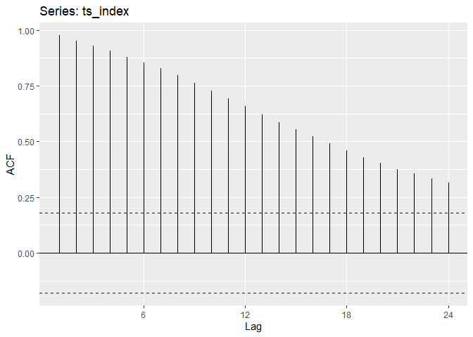<!-- -->

# Some simple time series models

## Mean Model

``` r
fcast.mean<-meanf(ts_index,h=3)
checkresiduals(fcast.mean)
```

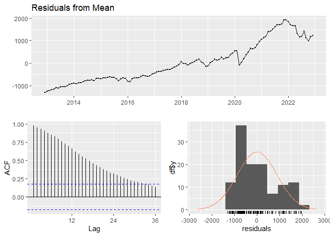<!-- -->

    ## 
    ##  Ljung-Box test
    ## 
    ## data:  Residuals from Mean
    ## Q* = 1454.1, df = 23, p-value < 2.2e-16
    ## 
    ## Model df: 1.   Total lags used: 24

``` r
summary(fcast.mean)
```

    ## 
    ## Forecast method: Mean
    ## 
    ## Model Information:
    ## $mu
    ## [1] 2731.324
    ## 
    ## $mu.se
    ## [1] 79.9193
    ## 
    ## $sd
    ## [1] 879.1123
    ## 
    ## $bootstrap
    ## [1] FALSE
    ## 
    ## $call
    ## meanf(y = ts_index, h = 3)
    ## 
    ## attr(,"class")
    ## [1] "meanf"
    ## 
    ## Error measures:
    ##              ME     RMSE      MAE       MPE     MAPE     MASE      ACF1
    ## Training set  0 875.4721 721.0641 -10.09665 28.20974 1.962756 0.9751198
    ## 
    ## Forecasts:
    ##          Point Forecast    Lo 80    Hi 80    Lo 95    Hi 95
    ## Jan 2023       2731.324 1593.788 3868.861 983.5656 4479.083
    ## Feb 2023       2731.324 1593.788 3868.861 983.5656 4479.083
    ## Mar 2023       2731.324 1593.788 3868.861 983.5656 4479.083

``` r
plot(fcast.mean)
```

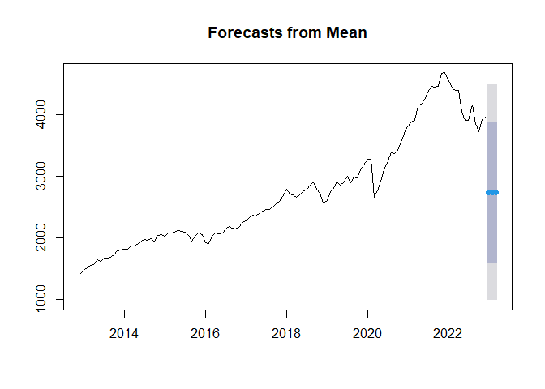<!-- -->

## Naive Model

``` r
fcast.naive<-naive(ts_index,h=4)
checkresiduals(fcast.naive)
```

<!-- -->

    ## 
    ##  Ljung-Box test
    ## 
    ## data:  Residuals from Naive method
    ## Q* = 26.011, df = 24, p-value = 0.3526
    ## 
    ## Model df: 0.   Total lags used: 24

``` r
summary(fcast.naive)
```

    ## 
    ## Forecast method: Naive method
    ## 
    ## Model Information:
    ## Call: naive(y = ts_index, h = 4) 
    ## 
    ## Residual sd: 107.7631 
    ## 
    ## Error measures:
    ##                    ME     RMSE      MAE      MPE     MAPE      MASE       ACF1
    ## Training set 21.14182 107.7631 71.30014 0.788849 2.518846 0.1940809 0.08886933
    ## 
    ## Forecasts:
    ##          Point Forecast    Lo 80    Hi 80    Lo 95    Hi 95
    ## Jan 2023       3960.883 3822.779 4098.987 3749.671 4172.095
    ## Feb 2023       3960.883 3765.575 4156.192 3662.184 4259.582
    ## Mar 2023       3960.883 3721.680 4200.086 3595.053 4326.713
    ## Apr 2023       3960.883 3684.675 4237.091 3538.459 4383.307

``` r
plot(fcast.naive)
```

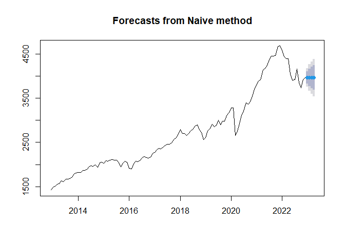<!-- -->

## Seasonal Naive Model

``` r
fcast.seasonalnaive<-snaive(ts_index,h=2)
checkresiduals(fcast.seasonalnaive)
```

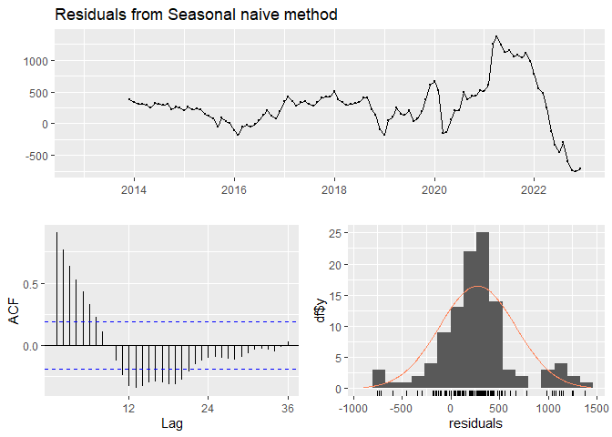<!-- -->

    ## 
    ##  Ljung-Box test
    ## 
    ## data:  Residuals from Seasonal naive method
    ## Q* = 412.79, df = 24, p-value < 2.2e-16
    ## 
    ## Model df: 0.   Total lags used: 24

``` r
summary(fcast.seasonalnaive)
```

    ## 
    ## Forecast method: Seasonal naive method
    ## 
    ## Model Information:
    ## Call: snaive(y = ts_index, h = 2) 
    ## 
    ## Residual sd: 475.8319 
    ## 
    ## Error measures:
    ##                    ME     RMSE      MAE      MPE     MAPE MASE      ACF1
    ## Training set 274.5933 475.8319 367.3732 9.209649 11.94069    1 0.9027636
    ## 
    ## Forecasts:
    ##          Point Forecast    Lo 80    Hi 80    Lo 95    Hi 95
    ## Jan 2023       4573.815 3964.012 5183.619 3641.202 5506.429
    ## Feb 2023       4435.981 3826.177 5045.784 3503.367 5368.594

``` r
plot(fcast.seasonalnaive)
```

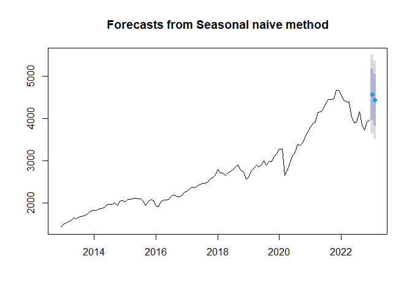<!-- -->

## Drift model

``` r
fcast.drift <-rwf(ts_index,h=2, drift = TRUE)
checkresiduals(fcast.drift)
```

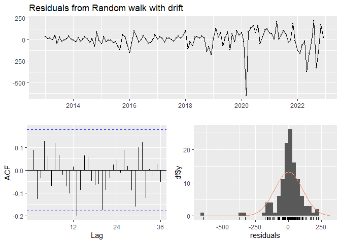<!-- -->

    ## 
    ##  Ljung-Box test
    ## 
    ## data:  Residuals from Random walk with drift
    ## Q* = 26.011, df = 23, p-value = 0.3004
    ## 
    ## Model df: 1.   Total lags used: 24

``` r
summary(fcast.drift)
```

    ## 
    ## Forecast method: Random walk with drift
    ## 
    ## Model Information:
    ## Call: rwf(y = ts_index, h = 2, drift = TRUE) 
    ## 
    ## Drift: 21.1418  (se 9.6866)
    ## Residual sd: 106.1119 
    ## 
    ## Error measures:
    ##                        ME     RMSE      MAE         MPE     MAPE      MASE
    ## Training set 3.031689e-14 105.6689 65.62654 -0.05808249 2.290117 0.1786372
    ##                    ACF1
    ## Training set 0.08886933
    ## 
    ## Forecasts:
    ##          Point Forecast    Lo 80    Hi 80    Lo 95    Hi 95
    ## Jan 2023       3982.025 3845.472 4118.578 3773.185 4190.865
    ## Feb 2023       4003.167 3809.255 4197.079 3706.604 4299.729

``` r
plot(fcast.drift)
```

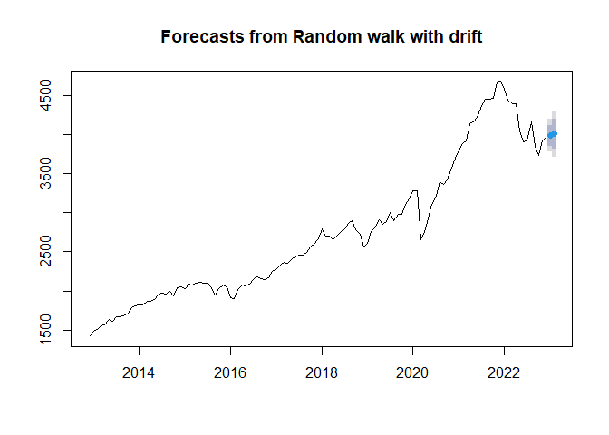<!-- -->

## Simple Exponential Model

``` r
ts_exp <- ses(ts_index, h = 3)
checkresiduals(ts_exp)
```

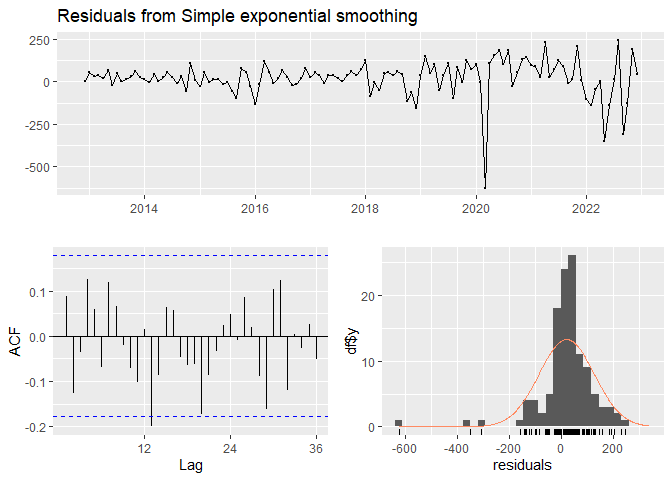<!-- -->

    ## 
    ##  Ljung-Box test
    ## 
    ## data:  Residuals from Simple exponential smoothing
    ## Q* = 26.112, df = 22, p-value = 0.2469
    ## 
    ## Model df: 2.   Total lags used: 24

``` r
ts_exp
```

    ##          Point Forecast    Lo 80    Hi 80    Lo 95    Hi 95
    ## Jan 2023       3960.879 3822.194 4099.563 3748.779 4172.979
    ## Feb 2023       3960.879 3764.759 4156.999 3660.939 4260.818
    ## Mar 2023       3960.879 3720.686 4201.072 3593.535 4328.222

``` r
ts_exp$model
```

    ## Simple exponential smoothing 
    ## 
    ## Call:
    ##  ses(y = ts_index, h = 3) 
    ## 
    ##   Smoothing parameters:
    ##     alpha = 0.9999 
    ## 
    ##   Initial states:
    ##     l = 1423.7308 
    ## 
    ##   sigma:  108.2163
    ## 
    ##      AIC     AICc      BIC 
    ## 1717.834 1718.039 1726.221

``` r
round(accuracy(ts_exp), 3)
```

    ##                 ME    RMSE    MAE   MPE  MAPE  MASE  ACF1
    ## Training set 20.97 107.318 70.714 0.782 2.498 0.192 0.088

``` r
autoplot(ts_exp)
```

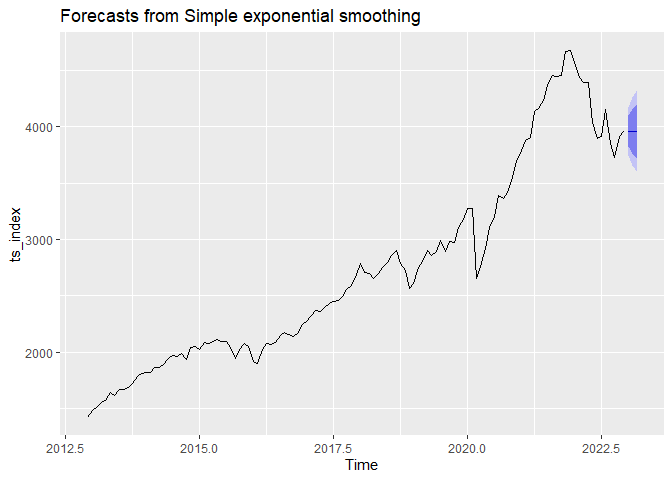<!-- -->

``` r
autoplot(ts_exp)+
  autolayer(fitted(ts_exp),series = "Fitted")
```

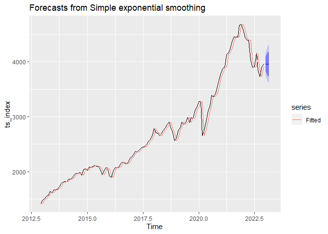<!-- -->

## Holt’s Linear Model

``` r
ts_holt <- holt(ts_index, h = 3)
checkresiduals(ts_holt)
```

<!-- -->

    ## 
    ##  Ljung-Box test
    ## 
    ## data:  Residuals from Holt's method
    ## Q* = 25.704, df = 20, p-value = 0.1758
    ## 
    ## Model df: 4.   Total lags used: 24

``` r
ts_holt
```

    ##          Point Forecast    Lo 80    Hi 80    Lo 95    Hi 95
    ## Jan 2023       3985.196 3847.630 4122.762 3774.807 4195.584
    ## Feb 2023       4009.511 3814.942 4204.080 3711.943 4307.078
    ## Mar 2023       4033.825 3795.493 4272.158 3669.328 4398.323

``` r
ts_holt$model
```

    ## Holt's method 
    ## 
    ## Call:
    ##  holt(y = ts_index, h = 3) 
    ## 
    ##   Smoothing parameters:
    ##     alpha = 0.9999 
    ##     beta  = 3e-04 
    ## 
    ##   Initial states:
    ##     l = 1480.1038 
    ##     b = 24.4672 
    ## 
    ##   sigma:  107.3431
    ## 
    ##      AIC     AICc      BIC 
    ## 1717.822 1718.344 1731.801

``` r
round(accuracy(ts_holt), 3)
```

    ##                 ME    RMSE    MAE    MPE  MAPE  MASE  ACF1
    ## Training set -3.89 105.554 65.389 -0.234 2.306 0.178 0.087

``` r
autoplot(ts_holt)
```

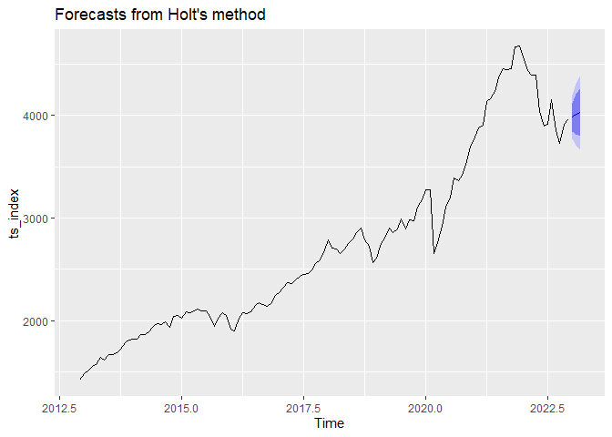<!-- -->

``` r
autoplot(ts_holt)+
  autolayer(fitted(ts_holt),series = "Fitted")
```

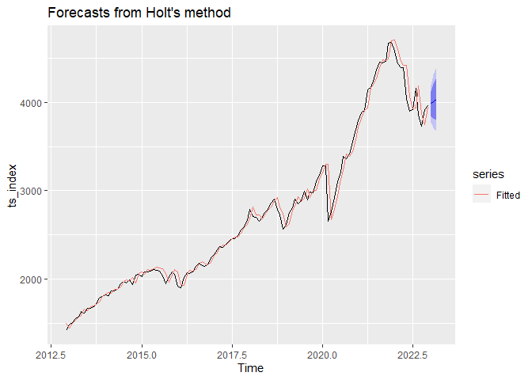<!-- -->

## ETS

``` r
ts_ets <- ets(ts_index, model = "AAN")
checkresiduals(ts_ets)
```

<!-- -->

    ## 
    ##  Ljung-Box test
    ## 
    ## data:  Residuals from ETS(A,A,N)
    ## Q* = 25.704, df = 20, p-value = 0.1758
    ## 
    ## Model df: 4.   Total lags used: 24

``` r
ts_ets
```

    ## ETS(A,A,N) 
    ## 
    ## Call:
    ##  ets(y = ts_index, model = "AAN") 
    ## 
    ##   Smoothing parameters:
    ##     alpha = 0.9999 
    ##     beta  = 3e-04 
    ## 
    ##   Initial states:
    ##     l = 1480.1261 
    ##     b = 24.4631 
    ## 
    ##   sigma:  107.3431
    ## 
    ##      AIC     AICc      BIC 
    ## 1717.822 1718.344 1731.801

``` r
ts_ets$model
```

    ## NULL

``` r
autoplot(ts_ets)
```

<!-- -->

``` r
round(accuracy(ts_ets), 3)
```

    ##                  ME    RMSE    MAE    MPE  MAPE  MASE  ACF1
    ## Training set -3.886 105.554 65.389 -0.233 2.306 0.178 0.087

``` r
ts_ets <- ets(ts_index, model = "ZZZ")
checkresiduals(ts_ets)
```

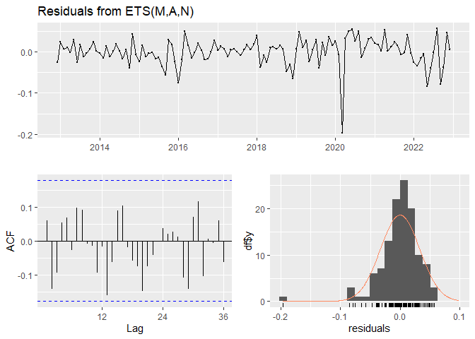<!-- -->

    ## 
    ##  Ljung-Box test
    ## 
    ## data:  Residuals from ETS(M,A,N)
    ## Q* = 21.553, df = 20, p-value = 0.3653
    ## 
    ## Model df: 4.   Total lags used: 24

``` r
ts_ets
```

    ## ETS(M,A,N) 
    ## 
    ## Call:
    ##  ets(y = ts_index, model = "ZZZ") 
    ## 
    ##   Smoothing parameters:
    ##     alpha = 0.9999 
    ##     beta  = 3e-04 
    ## 
    ##   Initial states:
    ##     l = 1438.8606 
    ##     b = 22.7433 
    ## 
    ##   sigma:  0.0333
    ## 
    ##      AIC     AICc      BIC 
    ## 1665.839 1666.361 1679.818

``` r
ts_ets$model
```

    ## NULL

``` r
round(accuracy(ts_ets), 3)
```

    ##                  ME    RMSE    MAE    MPE  MAPE  MASE  ACF1
    ## Training set -1.877 105.313 65.218 -0.142 2.287 0.178 0.088

``` r
autoplot(ts_ets)
```

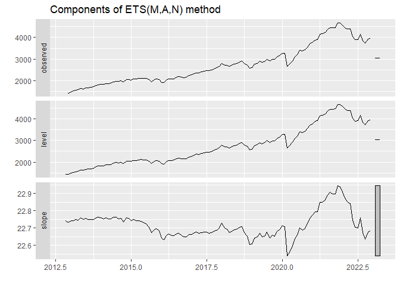<!-- -->

## Holt’s Winter

``` r
ts_hw <- hw(ts_index, 3)
checkresiduals(ts_hw)
```

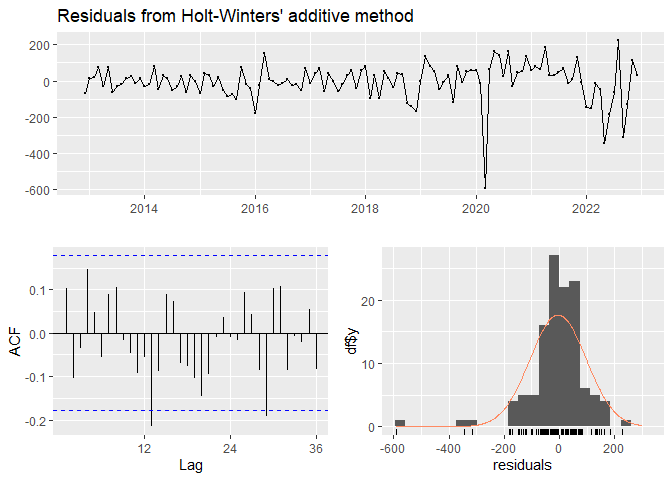<!-- -->

    ## 
    ##  Ljung-Box test
    ## 
    ## data:  Residuals from Holt-Winters' additive method
    ## Q* = 27.845, df = 8, p-value = 0.0005047
    ## 
    ## Model df: 16.   Total lags used: 24

``` r
ts_hw
```

    ##          Point Forecast    Lo 80    Hi 80    Lo 95    Hi 95
    ## Jan 2023       4003.685 3864.359 4143.010 3790.604 4216.765
    ## Feb 2023       4015.130 3818.102 4212.157 3713.801 4316.458
    ## Mar 2023       3981.235 3739.919 4222.551 3612.174 4350.296

``` r
ts_hw$model
```

    ## Holt-Winters' additive method 
    ## 
    ## Call:
    ##  hw(y = ts_index, h = 3) 
    ## 
    ##   Smoothing parameters:
    ##     alpha = 0.9998 
    ##     beta  = 1e-04 
    ##     gamma = 2e-04 
    ## 
    ##   Initial states:
    ##     l = 1447.7419 
    ##     b = 25.2859 
    ##     s = 30.576 -20.4434 -1.2396 18.5111 23.4773 -29.0239
    ##            -45.2179 -14.8512 -37.2671 21.8336 35.644 18.0011
    ## 
    ##   sigma:  108.7164
    ## 
    ##      AIC     AICc      BIC 
    ## 1731.805 1737.747 1779.333

``` r
round(accuracy(ts_hw), 3)
```

    ##                  ME    RMSE    MAE    MPE  MAPE  MASE  ACF1
    ## Training set -4.633 101.274 67.294 -0.248 2.462 0.183 0.103

``` r
autoplot(ts_hw)
```

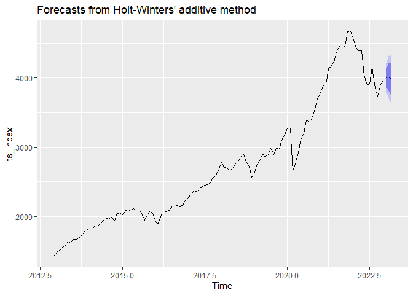<!-- -->

## ARIMA

``` r
plot(ts_index)
```

<!-- -->

### Check the order of differencing required

``` r
ndiffs(ts_index)
```

    ## [1] 1

### Plot the differenced Time Series

``` r
dts_index <- diff(ts_index)
plot(dts_index)
```

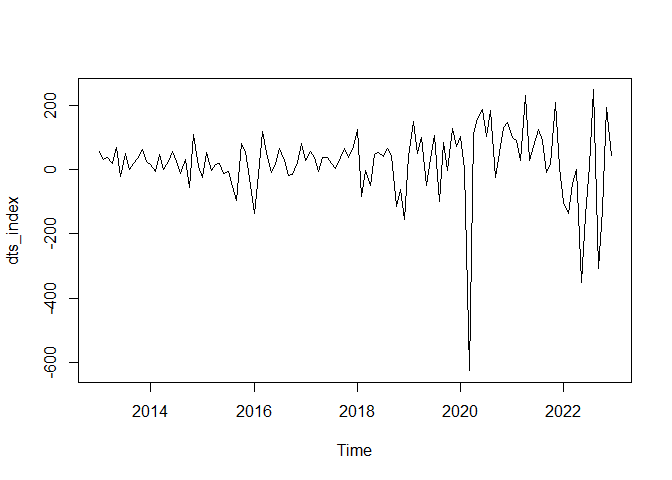<!-- -->

### Assess the stationarity of the time series

``` r
adf.test(dts_index)
```

    ## Warning in adf.test(dts_index): p-value smaller than printed p-value

    ## 
    ##  Augmented Dickey-Fuller Test
    ## 
    ## data:  dts_index
    ## Dickey-Fuller = -4.1988, Lag order = 4, p-value = 0.01
    ## alternative hypothesis: stationary

### Checking the ACF and PACF Plots

``` r
acf(dts_index)
```

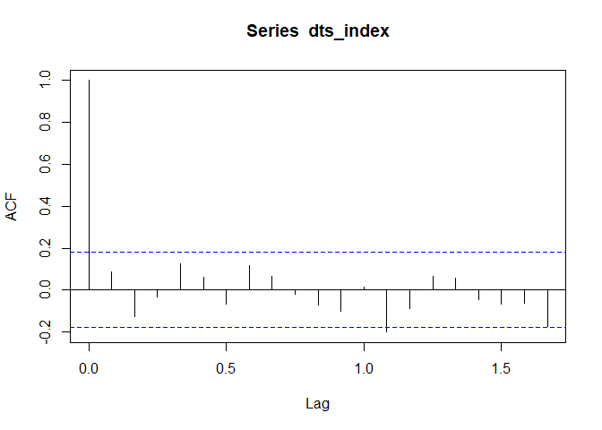<!-- -->

``` r
pacf(dts_index)
```

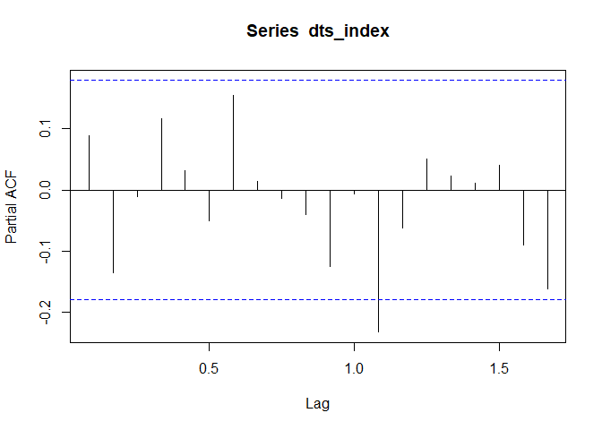<!-- -->

### Fitting the ARIMA Model

``` r
#Fitting an ARIMA model
fit <- arima(ts_index, order=c(0,1,1))
checkresiduals(fit)
```

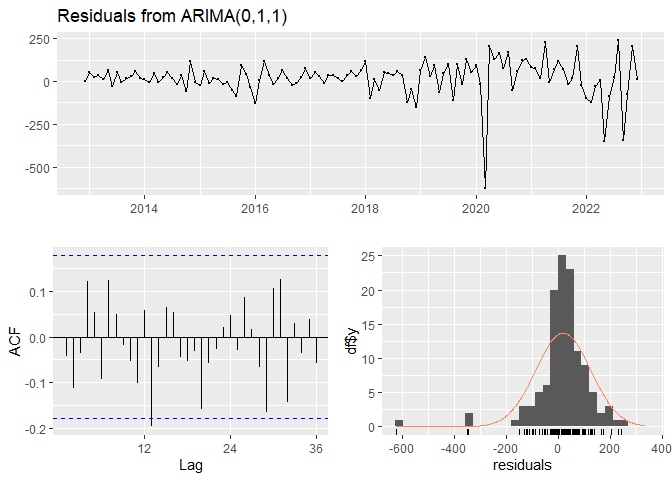<!-- -->

    ## 
    ##  Ljung-Box test
    ## 
    ## data:  Residuals from ARIMA(0,1,1)
    ## Q* = 22.587, df = 23, p-value = 0.4851
    ## 
    ## Model df: 1.   Total lags used: 24

``` r
fit
```

    ## 
    ## Call:
    ## arima(x = ts_index, order = c(0, 1, 1))
    ## 
    ## Coefficients:
    ##          ma1
    ##       0.1488
    ## s.e.  0.0972
    ## 
    ## sigma^2 estimated as 11397:  log likelihood = -730.75,  aic = 1465.5

## Auto Arima

``` r
auto_arima <- auto.arima(ts_index)
checkresiduals(auto_arima)
```

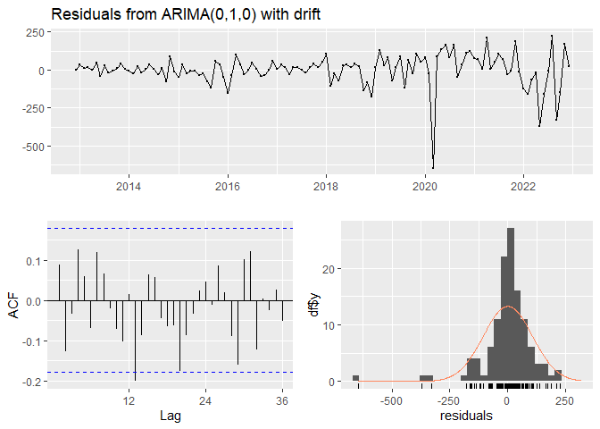<!-- -->

    ## 
    ##  Ljung-Box test
    ## 
    ## data:  Residuals from ARIMA(0,1,0) with drift
    ## Q* = 26.204, df = 24, p-value = 0.3429
    ## 
    ## Model df: 0.   Total lags used: 24

``` r
auto_arima
```

    ## Series: ts_index 
    ## ARIMA(0,1,0) with drift 
    ## 
    ## Coefficients:
    ##         drift
    ##       21.1418
    ## s.e.   9.6462
    ## 
    ## sigma^2 = 11260:  log likelihood = -729.51
    ## AIC=1463.02   AICc=1463.12   BIC=1468.59

``` r
round(accuracy(auto_arima), 3)
```

    ##                 ME    RMSE    MAE    MPE  MAPE  MASE  ACF1
    ## Training set 0.012 105.231 65.096 -0.057 2.272 0.177 0.089

## Forecasting 6 consecutive values using Auto ARIMA

``` r
forecasts <- forecast(auto_arima, 6)
forecasts
```

    ##          Point Forecast    Lo 80    Hi 80    Lo 95    Hi 95
    ## Jan 2023       3982.025 3846.037 4118.013 3774.049 4190.001
    ## Feb 2023       4003.167 3810.851 4195.483 3709.045 4297.289
    ## Mar 2023       4024.309 3788.770 4259.847 3664.084 4384.533
    ## Apr 2023       4045.450 3773.474 4317.426 3629.499 4461.402
    ## May 2023       4066.592 3762.514 4370.671 3601.544 4531.640
    ## Jun 2023       4087.734 3754.633 4420.835 3578.300 4597.168

## Final Forecasting Plot for 6 months in the future

``` r
autoplot(forecasts)
```

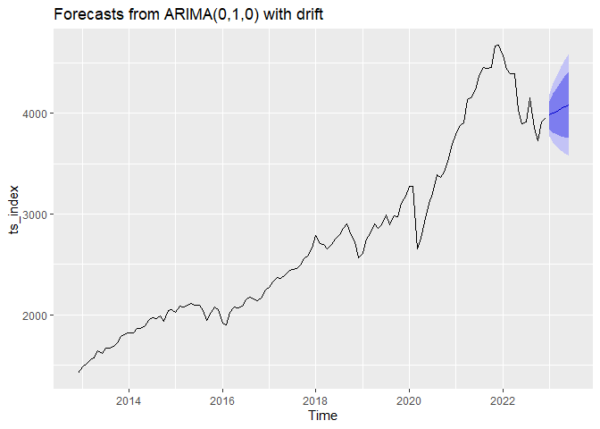<!-- -->
